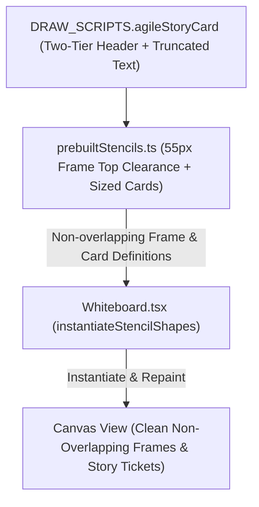

# Requirements

### Overview & Goals
The goal is to eliminate all text overlap and layout crowding issues across the agile board templates in the floxBoard prebuilt shape library (`Sprint Retrospective Columns`, `Mad / Sad / Glad Retro`, `Sailboat Retrospective`, and `Kanban Stages Board`). Specifically, the custom `User Story Ticket` renderer (`DRAW_SCRIPTS.agileStoryCard`) will be restructured with a clean two-tier header (separating badges from the story title) and width-constrained text rendering, and starter sticky notes/tickets will be positioned with increased top clearances to prevent collision with Frame header badges.

### Scope
- **In Scope**:
  - `User Story Ticket` Script (`DRAW_SCRIPTS.agileStoryCard`): Redesign the Canvas draw routine to place the code badge, status pill, and estimation points badge on the top row, move the story title to its own dedicated second row, and add safe text truncation (`drawTruncatedText`) for persona, goal, and value lines to prevent horizontal boundary overflow.
  - `Sprint Retrospective Columns` (`agile-retro-columns`): Adjust sticky note vertical positions (e.g., top = 55px and 165px) to provide ample clearance below the frame header title badge.
  - `Mad / Sad / Glad Retro` (`agile-mad-sad-glad`): Adjust sticky note vertical positions (e.g., top = 55px and 165px) to prevent frame header overlap.
  - `Sailboat Retrospective` (`agile-sailboat-retro`): Adjust sticky note vertical positions (e.g., top = 55px and 150px in top quadrants; top = 375px and 470px in bottom quadrants).
  - `Kanban Stages Board` (`agile-kanban-board`): Update starter story tickets (240x160px) positioned at top = 55px and 235px with full metadata and zero header or boundary collision.
  - Update unit tests in `src/main/webui/src/lib/prebuiltStencils.test.ts` to assert the non-overlapping layout positions, dimensions, and custom shape properties.
- **Out of Scope**:
  - Unrelated stencil collections (UML, Cloud Architecture, BPMN, UI Wireframing).
  - Core DGM frame rendering mechanics.

### User Stories
- **As an Agile Facilitator & Team Member**, I want retrospective and Kanban templates to have generous spacing under column header badges and between cards, so that titles and sticky note contents never overlap or look crowded.
- **As a Kanban Board User**, I want User Story Tickets to cleanly display their code, status, estimation points, title, and acceptance criteria without text colliding or overflowing the card edges.

### Functional Requirements
- **FR-1**: `DRAW_SCRIPTS.agileStoryCard` must render code and status pills on row 1 (left), points estimation circle badge on row 1 (right), story title on row 2 (full width), and body lines (persona, goal, value) with guaranteed horizontal truncation within card boundaries.
- **FR-2**: All starter sticky notes in `Sprint Retrospective Columns` and `Mad / Sad / Glad Retro` must start at top = 55px (with 55px clearance from frame top) and top = 165px for the second note.
- **FR-3**: All starter sticky notes in `Sailboat Retrospective` must start with at least 55px clearance relative to their parent quadrant frames.
- **FR-4**: `Kanban Stages Board` starter story tickets must be sized at 240x160px, starting at top = 55px and top = 235px with 20px horizontal margins inside the 280px column frames.
- **FR-5**: All text lines across all 4 stencils must remain strictly within their shape bounds without vertical or horizontal collision.

# Technical Design

### Current Implementation
- `DRAW_SCRIPTS.agileStoryCard` draws `code + ': ' + title` at `(14, 20)` which collides with the Points Circle Badge centered at `(w - 24, 24)` when `w = 240`.
- Long persona, goal, and value strings (e.g., `"So that I access my boards quickly"`) in `DRAW_SCRIPTS.agileStoryCard` extend past `x = 240` without truncation, overflowing the card container.
- Starter sticky notes and story tickets started at `top: 45`, which left narrow clearance against the Frame header title badge drawn at the top of the frame.

### Key Decisions
- **Decision 1: Two-Tier Header in `agileStoryCard`**:
  - **Row 1 (y = 10 to 28)**: Code Badge (`[US-101]`) and Status Tag Pill (`[IN PROGRESS]`) aligned on the left, with the Estimation Points Circle Badge (`(5)`) on the right (`w - 20, 19`).
  - **Row 2 (y = 36)**: Story Title (e.g., `User Authentication`) rendered below badges across the full card width (`w - 24`) with ellipsis truncation if title exceeds available space.
- **Decision 2: Safe Text Truncation for Body Lines**:
  - Add an inline Canvas helper in `agileStoryCard` that measures text width and appends an ellipsis (`...`) if text exceeds `w - 24`.
  - Persona at `y = 66`, Goal at `y = 88`, Value at `y = 110` with 11px font and 22px line height.
- **Decision 3: Increase Frame Header Clearance to 55px**:
  - Set top offset of first child cards to `top: 55` (or `top: 375` in lower sailboat quadrants) ensuring comfortable breathing room below frame badges.
- **Decision 4: Proportional Card Dimensions (240x160px)**:
  - Story ticket height is set to 160px to accommodate the two-tier header, divider, and 3 body items with generous margins.

### Architecture & Component Interaction

### Files to Modify / Create
- `src/main/webui/src/lib/prebuiltStencils.ts`: Update `DRAW_SCRIPTS.agileStoryCard` with two-tier header and truncated text helper; adjust child shape `top` offsets and dimensions across all 4 agile stencils.
- `src/main/webui/src/lib/prebuiltStencils.test.ts`: Update assertions for 55px top offsets, 240x160px ticket sizes, and spatial containment.

# Testing

### Validation Approach
Automated testing via Vitest will verify stencil dimensions, frame lane dimensions, shape positioning within frame boundaries, and custom user story ticket shape properties.

### Key Scenarios
- **Frame Clearance Check**: Verify that starter sticky notes and story tickets start at `top >= 55` within their column frames to guarantee no overlap with frame headers.
- **Two-Tier Header & Truncation Script**: Verify that `DRAW_SCRIPTS.agileStoryCard` contains the revised two-tier header logic and safe text truncation helper.
- **Ticket Dimensions & Containment**: Assert that all 5 custom story tickets in Kanban board are sized at 240x160px and strictly contained inside their respective 280x600px column frames.
- **Overall Stencil Integrity**: Verify that `npm run test` executes all tests cleanly with zero regressions.

### Test Additions
- Update `src/main/webui/src/lib/prebuiltStencils.test.ts` to assert the 55px top clearance, 240x160px ticket dimensions, and spatial containment.
- Run `npm test` across `src/main/webui` to verify 100% pass rate.

# Delivery Steps

### ✓ Step 1: Redesign User Story Ticket draw script and eliminate card boundary text overflow
The custom `User Story Ticket` renderer (`DRAW_SCRIPTS.agileStoryCard`) cleanly displays all metadata without badge or border collisions.

- Update `DRAW_SCRIPTS.agileStoryCard` in `src/main/webui/src/lib/prebuiltStencils.ts` to implement a two-tier header: code badge and status pill on the top-left, estimation points circle badge on the top-right (`w - 20, 19`), and full-width story title on the second row (y = 36).
- Implement an inline Canvas text measurement and truncation helper (`drawTruncatedText`) inside `DRAW_SCRIPTS.agileStoryCard` to guarantee persona (`👤`), goal (`🎯`), and value (`💡`) text never overflow the card boundary (`w - 24`).
- Update the standalone `agile-story-card` stencil definition to use the revised layout.

### ✓ Step 2: Adjust frame clearance and card positioning across Retro and Kanban templates
All four agile board templates feature generous vertical clearances under Frame header badges and non-overlapping child card layouts.

- Update `agile-retro-columns` and `agile-mad-sad-glad` in `src/main/webui/src/lib/prebuiltStencils.ts` to position starter sticky notes at top = 55px and 165px (55px clearance from frame top).
- Update `agile-sailboat-retro` in `src/main/webui/src/lib/prebuiltStencils.ts` to position starter sticky notes with 55px top clearance relative to quadrant frames.
- Update `agile-kanban-board` in `src/main/webui/src/lib/prebuiltStencils.ts` to position starter `User Story Ticket` custom shapes (240x160px) at top = 55px and 235px with 20px horizontal margins.
- Update unit tests in `src/main/webui/src/lib/prebuiltStencils.test.ts` to assert the 55px top clearances, 240x160px story ticket dimensions, and spatial containment.
- Execute the test suite (`npm run test`) to ensure all tests pass with zero regressions.

### ✓ Step 3: Prevent Frame body text rendering and optimize sticky note multi-line typography
Frame containers display only their header badges without clashing body text, and sticky note text wraps cleanly with pinned font sizes.

- Update `updateShapeTextProportions` in `src/main/webui/src/lib/shapeUtils.ts` to bypass centered doc assignment on `Frame` containers that do not have explicit text content.
- Update `Whiteboard.tsx` and `exportUtils.ts` to ensure frame shapes do not render body text over child items.
- Format starter sticky notes across retrospective stencils in `src/main/webui/src/lib/prebuiltStencils.ts` with clean multi-line text (`\n`) and pinned `customData.fontSize: 12`.
- Add Canvas boundary clipping (`ctx.clip()`) and status pill width bounding in `DRAW_SCRIPTS.agileStoryCard`.
- Verify with unit tests in `prebuiltStencils.test.ts` and `shape-proportions.test.ts` and run test suite.