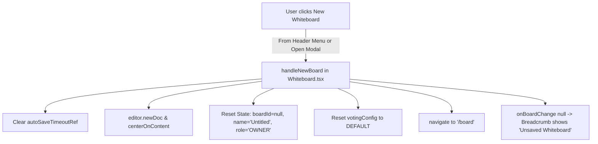

# Requirements

### Overview & Goals
The objective of this enhancement is to maximize user utility, efficiency, and flow by providing clear, prominent entry points for creating a new whiteboard canvas. Currently, users viewing an existing whiteboard or browsing their whiteboard cloud library have no direct UI action to start a new blank diagram, leading to friction and unnecessary workarounds (such as manually clearing shapes or manipulating URLs). 

By introducing dedicated "New Whiteboard" buttons in both the header action menu and the board management modal, we eliminate workflow bottlenecks and optimize user productivity across the entire visual collaboration lifecycle.

### Scope
- **In Scope:**
  - Adding a "New Whiteboard" action item in the `WhiteboardHeader` action menu dropdown.
  - Adding a "+ New Whiteboard" action button in the `OpenBoardModal` dialog.
  - Implementing robust canvas and document state reset logic in `Whiteboard.tsx` (`handleNewBoard`) that cleans up collaborative state, auto-save timers, board metadata, voting configurations, and viewport positioning.
  - Seamless route synchronization (`/board`) without triggering accidental redirects back to the latest saved board.
  - Unit and integration tests covering the new UI elements and state transition workflows.
- **Out of Scope:**
  - Modifying backend whiteboard REST endpoints or database schemas.
  - Changing authentication, authorization, or organization licensing rules.

### User Stories
- **As a visual creator or team member**, I want a single-click button to create a new whiteboard directly from the canvas header menu so that I can immediately start drafting new diagrams without interrupting my thought process.
- **As a user searching for diagrams in the Cloud Library**, I want an option to create a new whiteboard directly from the modal dialog so that if I do not find an existing board, I can create one without extra navigation steps.

### Functional Requirements
1. **Action Menu Entry (`WhiteboardHeader.tsx`)**:
   - The dropdown action menu (triggered by the `MoreVertical` button) must include a "New Whiteboard" button with a recognizable icon (`Plus` / `FilePlus`) positioned at the top of the menu options.
   - Clicking "New Whiteboard" closes the dropdown menu and executes the `onNewBoard` callback.
2. **Modal Entry (`OpenBoardModal.tsx`)**:
   - The `OpenBoardModal` header must contain a "+ New Whiteboard" button styled consistently with the application's design system.
   - Clicking this button closes the modal and executes the `onNewBoard` callback.
3. **Canvas & State Reset Workflow (`Whiteboard.tsx`)**:
   - Cancel any pending auto-save timeout to avoid overwriting previously loaded boards.
   - Clear `currentBoardId` (set to `null`), reset `currentBoardName` to `"Untitled"`, set `currentRole` to `'OWNER'`, and reset board metadata.
   - Reset voting configuration to `DEFAULT_VOTING_CONFIG`.
   - Call `editor.newDoc()` and `centerOnContent(editor)` to yield a pristine canvas.
   - Navigate to `/board` and notify parent navigation via `onBoardChange(null)`.
   - Prevent the initial-load redirect hook from automatically re-opening the latest saved board.

### Non-Functional Requirements
- **Performance & Responsiveness:** Instantaneous UI response with zero layout shift or network delay when starting a blank canvas.
- **Reliability & Data Safety:** Strict cancellation of auto-save timers to avoid data corruption or accidental overwrites on previously viewed boards.
- **Usability & Consistency:** Visual styling aligned with Tailwind CSS design tokens and Lucide icon conventions used across floxBoard.

# Technical Design

### Current Implementation
- `src/main/webui/src/components/WhiteboardHeader.tsx`: Houses the action menu button (`MoreVertical`) containing options for "Open from Cloud", "Generate with AI", "Save to Cloud", "Share Board", "Version History", "Whiteboard Settings", and "Export / Import". It lacks a "New Whiteboard" action.
- `src/main/webui/src/components/OpenBoardModal.tsx`: Displays tabs for "My Boards" and "Shared with Me" with pagination, but has no quick action to initiate a new board.
- `src/main/webui/src/components/Whiteboard.tsx`: Manages editor lifecycle (`DGMEditor`), Yjs collaborative binding, URL parameters (`/board/:id`), auto-save debounce timers, and document serialization. On load with no board ID, an effect automatically redirects to the user's latest saved board (`/board/${latest.id}`).
- `src/main/webui/src/App.tsx`: Renders the top title bar showing `floxBoard / {activeBoardName || 'Unsaved Whiteboard'}` and the `UserContextMenu`.

### Key Decisions
1. **Dual Entry Points for High Usability:**
   - Place "New Whiteboard" at the top of the `WhiteboardHeader` action dropdown menu for standard access.
   - Place a "+ New Whiteboard" button inside `OpenBoardModal` header so users can immediately create a board while managing their board library.
2. **Comprehensive State Reset in `Whiteboard.tsx`:**
   - Define a central `handleNewBoard` handler that resets editor doc (`newDoc()`), resets voting configurations, clears pending auto-save timers, resets board identifiers to `null`, resets role to `'OWNER'`, updates route to `/board`, and marks `isInitialLoadRef.current = false` to prevent unwanted auto-redirects.
3. **Clean Route Navigation:**
   - Use `navigate('/board')` to ensure browser history and breadcrumbs reflect the unsaved state without page reloads.

### Data Models / Contracts
```typescript
// Updated WhiteboardHeaderProps
export interface WhiteboardHeaderProps {
  boardName: string;
  boardId: string | null;
  role: api.BoardRole;
  canEdit: boolean;
  collabStatus: string;
  peers: Array<{ clientId: number; user: { name: string; color: string } }>;
  currentUser: { id?: string; name?: string; email?: string } | null;
  selectedShapeCount: number;
  votingConfig?: WhiteboardVotingConfig;
  userVotesUsed?: number;
  onNewBoard?: () => void;           // Added callback
  onOpenListModal: () => void;
  onOpenSaveModal: () => void;
  // ... other existing props
}

// Updated OpenBoardModalProps
export interface OpenBoardModalProps {
  isOpen: boolean;
  onClose: () => void;
  onSelectBoard: (board: api.WhiteboardSummary) => void;
  onNewBoard?: () => void;           // Added callback
}
```

### Components
- **`WhiteboardHeader` (`src/main/webui/src/components/WhiteboardHeader.tsx`)**: Adds a "New Whiteboard" menu item with `Plus` icon above "Open from Cloud".
- **`OpenBoardModal` (`src/main/webui/src/components/OpenBoardModal.tsx`)**: Adds a "+ New Whiteboard" button in the modal top bar.
- **`Whiteboard` (`src/main/webui/src/components/Whiteboard.tsx`)**: Implements `handleNewBoard` callback and wires it to `WhiteboardHeader` and `OpenBoardModal`.

### File Structure
- `src/main/webui/src/components/WhiteboardHeader.tsx` (Modified)
- `src/main/webui/src/components/OpenBoardModal.tsx` (Modified)
- `src/main/webui/src/components/Whiteboard.tsx` (Modified)
- `src/main/webui/src/components/WhiteboardHeader.test.tsx` (Modified)
- `src/main/webui/src/components/OpenBoardModal.test.tsx` (Added)
- `src/main/webui/src/components/Whiteboard.test.tsx` (Modified)

### Architecture Diagram


### Risks & Mitigations
- **Risk:** Auto-save race condition overwriting a previously viewed board with empty contents.
  - *Mitigation:* Immediately clear `autoSaveTimeoutRef.current` and update `currentBoardIdRef.current = null` before calling `editor.newDoc()`.
- **Risk:** Unwanted redirect back to the latest board upon reaching `/board`.
  - *Mitigation:* Ensure `isInitialLoadRef.current` is set to `false` in `handleNewBoard` so the initial-load effect does not trigger an auto-redirect.

# Testing

### Validation Approach
Automated validation using Vitest and React Testing Library to verify UI rendering, event dispatching, state isolation, and canvas document reset behavior.

### Key Scenarios
1. **Header Action Menu Trigger:**
   - Open action menu in `WhiteboardHeader`.
   - Verify "New Whiteboard" button is visible and properly styled.
   - Click "New Whiteboard" and assert `onNewBoard` is called once and the menu closes.
2. **Open Whiteboard Modal Trigger:**
   - Render `OpenBoardModal` with `isOpen={true}`.
   - Verify "+ New Whiteboard" button is displayed in the modal header.
   - Click the button and assert `onNewBoard` and `onClose` are invoked.
3. **Canvas Reset & Navigation Flow:**
   - Start on a saved board with existing shapes and board metadata (`/board/board-123`).
   - Trigger `handleNewBoard`.
   - Assert `editor.newDoc()` is called, board ID becomes `null`, board name becomes `"Untitled"`, and router location updates to `/board`.
4. **Auto-Save Protection:**
   - Modify board and verify that triggering "New Whiteboard" cancels any pending auto-save request and does not corrupt or erase the previous board on the server.

### Test Changes
- `src/main/webui/src/components/WhiteboardHeader.test.tsx`: Add test asserting "New Whiteboard" option presence and callback triggering.
- `src/main/webui/src/components/OpenBoardModal.test.tsx`: Create unit test suite verifying "+ New Whiteboard" button behavior.
- `src/main/webui/src/components/Whiteboard.test.tsx`: Add integration test verifying state reset and routing on new board creation.

# Delivery Steps

### ✓ Step 1: Add "New Whiteboard" buttons to WhiteboardHeader and OpenBoardModal components
The action menu in WhiteboardHeader and the OpenBoardModal dialog provide accessible buttons and triggers for creating a new whiteboard.

- Update `WhiteboardHeaderProps` in `src/main/webui/src/components/WhiteboardHeader.tsx` to accept an `onNewBoard?: () => void` prop.
- Add a "New Whiteboard" button with a `Plus` or `FilePlus` icon at the top of the action dropdown menu in `WhiteboardHeader.tsx`.
- Update `OpenBoardModalProps` in `src/main/webui/src/components/OpenBoardModal.tsx` to accept an `onNewBoard?: () => void` prop.
- Add a "+ New Whiteboard" action button in the `OpenBoardModal.tsx` header alongside the title for immediate access during board selection.

### ✓ Step 2: Implement canvas reset and navigation workflow in Whiteboard component
Triggering the new whiteboard action clears existing canvas state, cancels any pending auto-saves, resets board identifiers, and transitions the route cleanly to a fresh document.

- Implement `handleNewBoard` in `src/main/webui/src/components/Whiteboard.tsx` that clears any active `autoSaveTimeoutRef`, resets `currentBoardId` to `null`, sets `currentBoardName` to `"Untitled"`, resets role to `'OWNER'`, resets voting configuration to defaults, and invokes `editor.newDoc()` and `centerOnContent()`.
- Pass `handleNewBoard` to `<WhiteboardHeader onNewBoard={handleNewBoard} />` and `<OpenBoardModal onNewBoard={handleNewBoard} />`.
- Ensure navigating from `/board/:id` to `/board` via `handleNewBoard` navigates using React Router (`navigate('/board')`) and suppresses the automatic redirect to the most recent whiteboard by setting `isInitialLoadRef.current = false`.
- Ensure `onBoardChange?.(null)` is called so the top navigation title in `App.tsx` reflects "Unsaved Whiteboard".

### ✓ Step 3: Add unit and integration tests for new whiteboard creation workflows
All new whiteboard creation paths and state resets are validated with comprehensive unit and integration tests.

- Update `src/main/webui/src/components/WhiteboardHeader.test.tsx` to verify that the "New Whiteboard" action renders in the dropdown menu and triggers `onNewBoard`.
- Create `src/main/webui/src/components/OpenBoardModal.test.tsx` to verify that the "+ New Whiteboard" button renders and invokes `onNewBoard`.
- Update `src/main/webui/src/components/Whiteboard.test.tsx` to verify that clicking "New Whiteboard" resets editor document state, clears board ID, and transitions to `/board`.