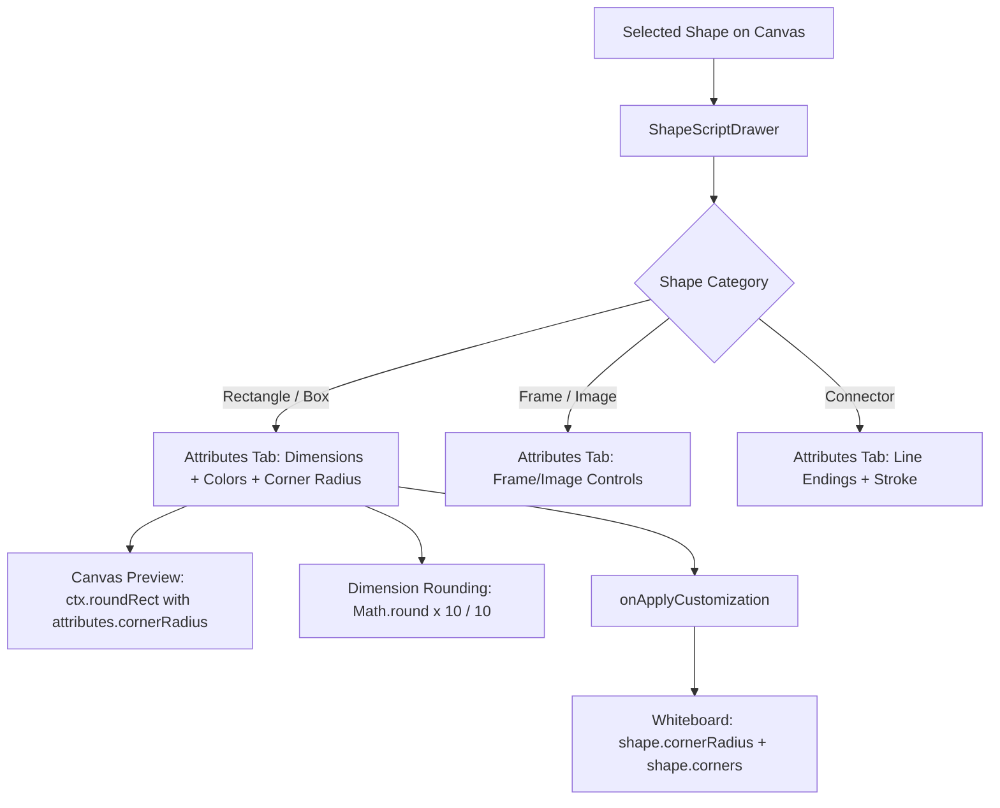

# Requirements

### Overview & Goals
Enhance the **Shape Customizer & Script Editor** drawer in floxBoard to:
1. Provide a **Corner Radius** control for rectangle shapes (`Box` / `Rectangle`), allowing users to configure rounded corners between 0px and 48px with real-time canvas preview and synchronization.
2. Round shape dimensions (width and height) to the next decimal point (1 decimal place precision) so that canvas resize and transform floating-point imprecisions (e.g., `320.0100000000002` or `280.01`) are cleanly formatted and displayed as clean decimal/integer values.

---

### Scope
- **In Scope:**
  - Adding corner radius slider and value display to the Attributes tab in `ShapeScriptDrawer.tsx` when a rectangle shape is selected.
  - Updating the live canvas preview in `ShapeScriptDrawer.tsx` to render rectangles with the configured corner radius.
  - Ensuring the applied customization updates `shape.cornerRadius`, `shape.corners = [r, r, r, r]`, and `customData`.
  - Normalizing and rounding dimension values (`width`, `height`, `liveWidth`, `liveHeight`, aspect ratio lock calculations, scale presets) to 1 decimal place.
  - Adding test coverage in `ShapeScriptDrawer.test.tsx` and `Whiteboard.test.tsx`.
- **Out of Scope:**
  - Modifying connector or freehand line geometry algorithms.
  - Changing server-side Panache entity models (existing `DgmModel` and `customData` structures already support `cornerRadius` and `corners`).

---

### User Stories
- **As a diagram author**, I want to adjust the corner radius of rectangles from the Shape Customizer so that I can create rounded cards, badges, and UI blocks.
- **As a user resizing shapes**, I want the width and height inputs in the Shape Customizer to display clean, rounded dimensions rather than long floating-point decimals.

---

### Functional Requirements
- **FR-1: Rectangle Detection:** The Shape Customizer must identify rectangle shapes (`shape.type === 'Rectangle' || shape.type === 'Box' || shape._type === 'Rectangle' || shape._type === 'Box'` or standard geometric non-ellipse/non-connector shapes).
- **FR-2: Rectangle Corner Radius Control:**
  - Range: `0px` to `48px` (default 0px if not previously configured).
  - UI: Slider control with `data-testid="attr-corner-radius-slider"` and adjacent value badge displaying `${attributes.cornerRadius}px`.
  - Live Canvas Preview: The preview canvas immediately reflects changes to corner radius via `ctx.roundRect(0, 0, w, h, radius)`.
- **FR-3: Dimension Rounding:**
  - All width and height measurements extracted from `shape.width`, `shape.height`, `shape.rect`, or live transform events must be rounded to at most 1 decimal place (`Math.round(val * 10) / 10`).
  - When aspect ratio is locked and one dimension is altered, the calculated counterpart dimension must be rounded to 1 decimal place.

# Technical Design

### Current Implementation
- `ShapeScriptDrawer.tsx`:
  - Contains separate attribute panels for Connectors (`isConnector`), Frames (`isFrame`), Images (`isImage`), and Standard Shapes (`!isConnector && !isFrame && !isImage`).
  - Frames and Images currently include a `Corner Radius` slider, but Standard Shapes (including Rectangles) only display Dimensions, Colors, Typography, and Opacity.
  - Standard shape preview canvas currently uses a fixed `ctx.roundRect(0, 0, shapeWidth, shapeHeight, 6)`.
  - Dimension values (`initW`, `initH`, `liveWidth`, `liveHeight`) read raw float differences `Math.abs(shape.rect[1][0] - shape.rect[0][0])`, producing unrounded numbers like `320.0100000000002`.
- `Whiteboard.tsx`:
  - `handleSaveShapeCustomization` already supports `attrs.cornerRadius` by assigning `shape.cornerRadius = attrs.cornerRadius`, setting `shape.corners = [r, r, r, r]`, and recording `customDataUpdates.cornerRadius` / `customDataUpdates.corners`.

---

### Key Decisions
1. **Dimension Rounding Formula:**
   - Use `const roundDim = (val: number): number => Math.round(val * 10) / 10;` (or `Number(val.toFixed(1))`) across initialization, live resize sync, aspect ratio scaling, and input changes.
   - *Rationale:* Ensures floating-point precision issues from canvas matrices are eliminated while maintaining sub-pixel accuracy when intentional.
2. **Rectangle Corner Radius Placement:**
   - Integrate the Corner Radius slider into the standard shapes attribute section when `isRectangle` is true (or inside a Geometry & Styling card).
   - *Rationale:* Matches the existing UX patterns of Frame and Image corner radius controls in floxBoard.

---

### Proposed Changes

#### 1. `src/main/webui/src/components/ShapeScriptDrawer.tsx`
- Add `isRectangle` detection helper:
  ```typescript
  const isRectangle = useMemo(() => {
    if (isConnector || isFrame || isImage) return false;
    const type = shape?.type || shape?._type || shape?.name || shape?.constructor?.name;
    if (type === 'Box' || type === 'Rectangle' || type === 'Square') return true;
    if (type === 'Ellipse' || type === 'Oval' || type === 'Circle' || type === 'Text') return false;
    return true;
  }, [shape, isConnector, isFrame, isImage]);
  ```
- Implement `roundDimension` helper function:
  ```typescript
  export const roundDimension = (val: number): number => {
    if (typeof val !== 'number' || isNaN(val)) return 0;
    return Math.round(val * 10) / 10;
  };
  ```
- Update `initW` and `initH` in initialization effect to use `roundDimension`.
- Update `liveWidth` and `liveHeight` computation to use `roundDimension`.
- Update `handleAttributeChange` for `'width'` / `'height'` when `aspectRatioLocked` is enabled to round calculated counterpart.
- Add Corner Radius UI card/control under VARIANT D for rectangle shapes:
  ```tsx
  {isRectangle && (
    <div className="space-y-1.5 pt-1">
      <div className="flex items-center justify-between">
        <label className="text-[11px] text-slate-600 dark:text-slate-400">Corner Radius</label>
        <span className="text-[11px] font-semibold text-slate-700 dark:text-slate-300">{attributes.cornerRadius}px</span>
      </div>
      <input
        type="range"
        min={0}
        max={48}
        data-testid="attr-corner-radius-slider"
        value={attributes.cornerRadius}
        onChange={(e) => handleAttributeChange('cornerRadius', Number(e.target.value))}
        className="w-full mt-1.5 accent-blue-600 cursor-pointer"
      />
    </div>
  )}
  ```
- Update preview canvas standard shape rendering branch:
  ```typescript
  if (shape?.type === 'Ellipse' || shape?.type === 'Circle' || shape?.type === 'Oval') {
    ctx.ellipse(shapeWidth / 2, shapeHeight / 2, shapeWidth / 2, shapeHeight / 2, 0, 0, Math.PI * 2);
  } else {
    const rad = isRectangle ? (attributes.cornerRadius || 0) : 6;
    ctx.roundRect(0, 0, shapeWidth, shapeHeight, rad);
  }
  ```

---

### Architecture Diagram


# Testing

### Validation Approach
Verify the implementation through automated unit and integration tests covering rectangle shape recognition, corner radius UI interactions, preview rendering, and dimension rounding.

---

### Key Scenarios
1. **Rectangle Corner Radius Rendering & Interaction:**
   - Open Shape Customizer for a standard `Rectangle` / `Box` shape.
   - Verify `attr-corner-radius-slider` is rendered and displays initial value (e.g. `0px`).
   - Change slider value to `16px`.
   - Verify canvas preview calls `ctx.roundRect` with radius `16`.
   - Click "Apply Customization" and verify `onApplyCustomization` is called with `{ attributes: { cornerRadius: 16, ... } }`.
2. **Dimension Precision & Rounding:**
   - Initialize drawer with a shape having dimensions `320.0100000000002` x `280.01`.
   - Verify input fields show `320` and `280` (or `320.0` / `280.0`).
   - Simulate live canvas resize event updating shape width to `150.364`.
   - Verify width input updates to `150.4`.
   - Scale shape with aspect ratio locked and verify resulting dimensions are rounded to 1 decimal place.

---

### Test Changes
- **`ShapeScriptDrawer.test.tsx`**:
  - Add test case: renders corner radius slider for Rectangle shape and updates preview canvas.
  - Add test case: rounds dimensions with long floating-point precision to 1 decimal place on load and live update.
- **`Whiteboard.test.tsx`**:
  - Add test case: applying customization with rectangle corner radius updates `shape.cornerRadius` and `shape.corners`.

# Delivery Steps

### ✓ Step 1: Implement dimension precision and rounding in Shape Customizer
Implement dimension precision formatting and rounding in `ShapeScriptDrawer.tsx`.

- Introduce a dimension rounding utility (e.g. `Math.round(val * 10) / 10`) to eliminate floating-point precision artifacts (such as `320.0100000000002` or `280.01`).
- Apply rounding to `initW` and `initH` calculations when initializing shape attributes on drawer open.
- Apply rounding to `liveWidth` and `liveHeight` in the dynamic canvas resize synchronization hook.
- Apply rounding to proportional dimension calculations when aspect ratio is locked (`handleAttributeChange`) and in preset scaling (`handleScalePreset`).
- Ensure numeric inputs for width and height display clean rounded values with appropriate `step="0.1"` or integer increments.

### ✓ Step 2: Add rectangle corner radius control and canvas preview rendering
Add corner radius customization and live preview support for rectangle shapes in `ShapeScriptDrawer.tsx`.

- Define rectangle detection logic (`isRectangle`) to identify standard rectangle / box shapes (`type === 'Box' || type === 'Rectangle'` or non-ellipse/non-connector standard shapes).
- Initialize `attributes.cornerRadius` from `shape.cornerRadius`, `shape.corners`, or `shape.customData?.cornerRadius` (defaulting to 0 for standard rectangles).
- Add a Corner Radius slider/input control (`attr-corner-radius-slider`) under the Standard Shapes / Rectangle attributes section (0–48px range with live value label).
- Update canvas preview rendering for standard rectangles to respect `attributes.cornerRadius` using `ctx.roundRect(0, 0, shapeWidth, shapeHeight, rad)` instead of a hardcoded radius.
- Ensure the corner radius value is passed in the customization payload and applied to `shape.cornerRadius` and `shape.corners` array (`[r, r, r, r]`).

### ✓ Step 3: Add unit and integration tests for corner radius and dimension rounding
Add comprehensive unit tests and regression checks for corner radius and dimension rounding.

- Add unit test cases in `ShapeScriptDrawer.test.tsx` verifying that selecting a rectangle shape renders the corner radius slider and updates the preview canvas with the chosen radius.
- Add test cases verifying that dimension values with floating-point imprecision (e.g., `320.0100000000002`, `280.01`) are rounded to one decimal place upon initialization, live resize sync, and aspect ratio recalculation.
- Add test cases in `Whiteboard.test.tsx` confirming that applying rectangle corner radius updates `shape.cornerRadius`, `shape.corners`, and syncs with customData.
- Execute the test suite via `vitest` to ensure all tests pass cleanly without regressions.