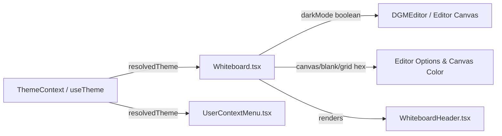

# Requirements

### Overview & Goals
Refine floxBoard's whiteboard interface to complete dark mode support by:
1. Adapting the remaining elements in `WhiteboardHeader.tsx` (the Shape Libraries button, board title/role container, collaborator pill tray, and dropdown menu action items) to match the dark Slate theme.
2. Removing the redundant theme selector toggle from the whiteboard header action menu, keeping theme preference management unified in `UserContextMenu.tsx`.
3. Updating the whiteboard board canvas in `Whiteboard.tsx` and `@dgmjs/react` `DGMEditor` so that the canvas dynamically transitions to dark backgrounds, grids, and dark rendering mode when the dark theme is active.

### Scope
- **In Scope:**
  - **WhiteboardHeader Refinement:**
    - Remove the theme switcher button and separator from the `WhiteboardHeader.tsx` action menu.
    - Add dark mode utility classes (`dark:bg-slate-900/95`, `dark:border-slate-800`, `dark:text-slate-300`, `dark:hover:bg-slate-800`, `dark:text-slate-100`) to the Shape Libraries button (`Shapes`), board title container, collaborator pill tray, and all action menu options (`Open from Cloud`, `Save to Cloud`, `Share Board`, `Export`, etc.).
    - Remove unused theme icons (`Sun`, `Moon`) and `useTheme` hook call from `WhiteboardHeader.tsx`.
  - **Whiteboard Board & Canvas Dark Mode:**
    - Introduce `DARK_THEME_CANVAS_COLORS` in `Whiteboard.tsx` defining slate, clean white, light slate, and warm dark palette configurations.
    - Connect `Whiteboard.tsx` to `useTheme()` from `themeContext`.
    - Pass `darkMode={resolvedTheme === 'dark'}` to `<DGMEditor />`.
    - Configure `editor.setDarkMode(resolvedTheme === 'dark')` and apply the matching canvas, blank, and grid colors on mount, on theme toggle, and on canvas configuration updates.
  - **Automated Testing:**
    - Update `WhiteboardHeader.test.tsx` to remove the obsolete header theme toggle test and verify dark mode classes across header buttons and menu items.
    - Update `Whiteboard.test.tsx` to verify dark canvas initialization and dynamic theme switching.
    - Run the complete test suite (`npm test`) to ensure 100% test pass rate.
- **Out of Scope:**
  - Changes to user context menu theme switcher (already implemented).
  - Modifications to backend data models or whiteboard file serialization.

### User Stories
- **As a whiteboard user in dark mode**, I want the canvas board background and grid to render with dark styling so that I can draw and brainstorm without eye strain.
- **As a user**, I want all elements in the whiteboard top bar (title container, shape buttons, menu items) to have consistent dark styling.
- **As a user**, I want a single, clear location for managing my theme preferences in the user profile menu without redundant toggles.

### Functional Requirements
- **FR-1 (Header Theme Selector Removal):** Remove the "Dark Mode / Light Mode" toggle from the `WhiteboardHeader` action dropdown menu.
- **FR-2 (Header Dark Styling):**
  - Shape Libraries button: `dark:bg-slate-900/95 dark:border-slate-800 dark:text-slate-300 dark:hover:text-slate-100 dark:hover:bg-slate-800`
  - Board title and role container: `dark:bg-slate-900/95 dark:border-slate-800` and text `dark:text-slate-100`
  - Collaborator pill tray: `dark:bg-slate-900/95 dark:border-slate-800`
  - Action menu buttons: `dark:text-slate-300 dark:hover:bg-slate-800 dark:hover:text-slate-100`
- **FR-3 (Whiteboard Canvas Dark Mode):**
  - Define dark mode canvas colors (`DARK_THEME_CANVAS_COLORS`):
    - `slate`: `{ canvas: '#020617', blank: '#020617', grid: '#1e293b' }`
    - `white`: `{ canvas: '#0f172a', blank: '#0f172a', grid: '#1e293b' }`
    - `lightSlate`: `{ canvas: '#1e293b', blank: '#1e293b', grid: '#334155' }`
    - `warm`: `{ canvas: '#1c1917', blank: '#1c1917', grid: '#292524' }`
  - Automatically update `editor.options.canvasColor`, `blankColor`, `gridColor`, and `editor.setDarkMode()` when `resolvedTheme` changes.

# Technical Design

### Current Implementation
- `WhiteboardHeader.tsx` previously had a duplicate theme toggle button inside its action menu.
- Several elements in `WhiteboardHeader.tsx` (the Shape Libraries quick action button, title container, collaborator tray, and several menu buttons) were still missing `dark:` classes.
- In `Whiteboard.tsx`, `THEME_CANVAS_COLORS` only contains light colors (`#fafbfd`, `#ffffff`, `#f1f5f9`, `#fefce8`), and `DGMEditor` / `handleMount` / `handleUpdateCanvasConfig` hardcode `darkMode={false}` and `editor.setDarkMode(false)`.

### Key Decisions
- **Decision 1: Centralize Theme Switching in User Profile Menu:**
  - Remove theme toggle from `WhiteboardHeader.tsx` to avoid UI clutter and duplicate functionality.
- **Decision 2: Reactive DGM Editor Dark Palette in Whiteboard.tsx:**
  - Consume `useTheme()` in `Whiteboard.tsx` and introduce `DARK_THEME_CANVAS_COLORS`.
  - Listen for `resolvedTheme` in an effect hook:
    - Update `editorRef.current.setDarkMode(resolvedTheme === 'dark')`
    - Assign theme colors according to `resolvedTheme === 'dark' ? DARK_THEME_CANVAS_COLORS[...] : THEME_CANVAS_COLORS[...]`
    - Trigger `editorRef.current.repaint()` to immediately refresh the canvas background.
- **Decision 3: Complete Slate Dark Palette on Header Containers:**
  - Apply `dark:bg-slate-900/95 dark:border-slate-800` and typography classes consistently across `WhiteboardHeader.tsx`.

### Architecture Diagram

### Components Affected
- `src/main/webui/src/components/WhiteboardHeader.tsx` (modified)
- `src/main/webui/src/components/Whiteboard.tsx` (modified)
- `src/main/webui/src/components/WhiteboardHeader.test.tsx` (modified)
- `src/main/webui/src/components/Whiteboard.test.tsx` (modified)

### File Structure
- `src/main/webui/src/components/WhiteboardHeader.tsx`
- `src/main/webui/src/components/Whiteboard.tsx`
- `src/main/webui/src/components/WhiteboardHeader.test.tsx`
- `src/main/webui/src/components/Whiteboard.test.tsx`

# Testing

### Validation Approach
Verify all header element styles and canvas dark mode behavior using automated Vitest unit and integration tests.

### Key Scenarios
1. **WhiteboardHeader Elements & Menu:**
   - Verify Shape Libraries button, title container, collaborator tray, and dropdown menu options render dark classes.
   - Verify the redundant theme toggle is no longer present in `WhiteboardHeader`.
2. **Whiteboard Canvas Dark Mode:**
   - Verify `DGMEditor` and editor instance initialize with `darkMode=true` when dark theme is active.
   - Verify changing `resolvedTheme` dynamically switches editor canvas colors (`canvasColor`, `blankColor`, `gridColor`) and invokes `editor.setDarkMode()` and `editor.repaint()`.
   - Verify canvas config theme changes in WhiteboardConfigModal select appropriate dark color tokens in dark mode.

### Test Changes
- Update `src/main/webui/src/components/WhiteboardHeader.test.tsx`:
  - Remove obsolete theme toggle test from `WhiteboardHeader.test.tsx`.
  - Add assertions for Shape Libraries button and container dark classes.
- Update `src/main/webui/src/components/Whiteboard.test.tsx`:
  - Add test asserting dark mode canvas configuration and theme synchronization.
- Run complete test suite (`npm test`).

# Delivery Steps

### ✓ Step 1: Update WhiteboardHeader Styling and Remove Theme Selector
Adapt remaining header elements to dark mode and remove the duplicate theme toggle from the header action menu.

- Remove the theme switcher button and separator from `WhiteboardHeader.tsx` action menu and clean up unused imports (`Sun`, `Moon`, `useTheme`).
- Add dark styling (`dark:bg-slate-900/95`, `dark:border-slate-800`, `dark:text-slate-300`, `dark:hover:text-slate-100`, `dark:hover:bg-slate-800`) to the Shape Libraries button (`Shapes`).
- Add dark styling to the title / board management container (`dark:bg-slate-900/95 dark:border-slate-800 dark:text-slate-100`).
- Add dark styling to the collaborator pill tray container (`dark:bg-slate-900/95 dark:border-slate-800`).
- Ensure all dropdown action menu buttons have `dark:text-slate-300 dark:hover:bg-slate-800 dark:hover:text-slate-100`.
- Update `WhiteboardHeader.test.tsx` removing the theme toggle test and adding tests for header dark styling.

### ✓ Step 2: Implement Whiteboard Canvas Dark Mode in Whiteboard.tsx
Enable dynamic dark mode support for the DGMEditor canvas and background colors.

- Import `useTheme` in `Whiteboard.tsx` to access `resolvedTheme`.
- Define `DARK_THEME_CANVAS_COLORS` for `slate`, `white`, `lightSlate`, and `warm` canvas themes.
- Update `DGMEditor` component call to pass `darkMode={resolvedTheme === 'dark'}`.
- Update `handleMount` and `handleUpdateCanvasConfig` to apply `DARK_THEME_CANVAS_COLORS` and call `editor.setDarkMode(resolvedTheme === 'dark')` when dark mode is active.
- Add a `useEffect` hook in `Whiteboard.tsx` responding to `resolvedTheme` and `canvasConfig.theme` to update `editor.setDarkMode()`, `canvasColor`, `blankColor`, `gridColor`, and trigger `editor.repaint()`.
- Add test coverage in `Whiteboard.test.tsx` verifying canvas dark mode color assignment and theme responsiveness.

### ✓ Step 3: Run and Validate Full Vitest Test Suite
Execute the entire automated test suite to ensure all tests pass with zero regressions.

- Run `npm test` across all test files.
- Verify that `WhiteboardHeader.test.tsx`, `Whiteboard.test.tsx`, `UserContextMenu.test.tsx`, and `themeContext.test.tsx` pass cleanly.