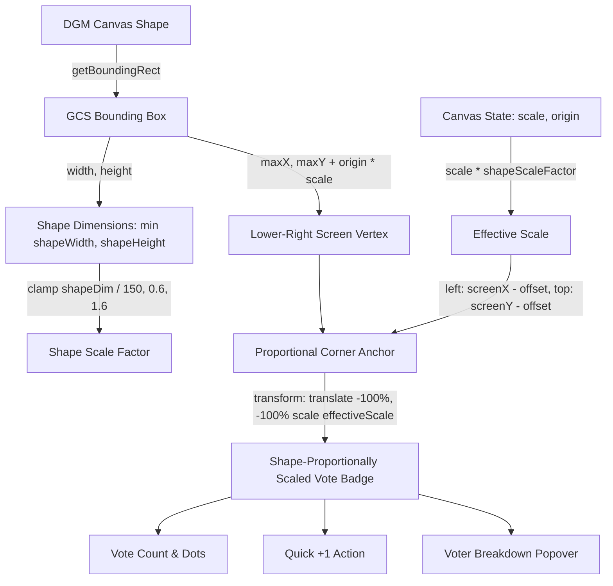

# Requirements

### Overview & Goals
When a user casts a vote on a canvas shape, the vote badge must appear directly attached to the shape and visually scaled in proportion to the referenced shape's dimensions and canvas zoom, rather than using a static fixed-pixel size.
1. **Shape-Proportional Sizing**: Dynamically scale the vote badge pill and "+1" action button based on the geometric dimensions (width/height in Global Coordinate Space) of the referenced shape, preventing badges from overwhelming small sticky notes or appearing diminutive/detached on large cards and frames.
2. **Accurate Lower-Right Corner Anchoring with Zoom Adaptation**: Combine canvas zoom (`canvas.scale`) and the shape-based scale factor (`shapeScaleFactor`) to anchor the badge container at the shape's lower-right corner with `transform: 'translate(-100%, -100%) scale(...)'` and `transformOrigin: 'bottom right'`.
3. **Clear Shape Affordance & Visual Balance**: Maintain consistent visual weight and spatial proximity across shapes of varying sizes (from small sticky notes to large frames) at any canvas zoom level.
4. **Seamless Overlay Alignment**: Keep voter breakdown popovers and category dropdowns aligned cleanly to the right edge of the badge without clipping.

### Scope
- **In Scope**:
  - `src/main/webui/src/components/ShapeVoteBadge.tsx`: Compute shape dimensions from GCS bounds (`getBoundingRect()`), derive shape scale factor normalized to baseline size (e.g. 150px) with clamping `[0.6, 1.6]`, apply combined `scale(canvas.scale * shapeScaleFactor)` with `transformOrigin: 'bottom right'`, and scale corner inset offset accordingly.
  - `src/main/webui/src/components/ShapeVoteBadge.test.tsx`: Add test scenarios verifying shape-proportional scaling for small (75px), medium (150px), and large (400px) shapes under standard, zoomed-in, and zoomed-out canvas states.
  - `features/whiteboard-collaboration.md`: Document shape-proportional sizing and inside-corner lower-right badge anchoring.
- **Out of Scope**:
  - CRDT synchronization logic and backend WebSocket messaging.
  - Context menu layout and modal configurations.

### User Stories
- **As a workshop collaborator**, I want vote indicators on sticky notes and diagram shapes to scale in proportion to the shape's size and zoom level so that votes are cleanly attached and visually balanced regardless of whether the shape is large or small.
- **As a facilitator**, I want the quick "+1" vote button and category breakdown popover to stay snugly positioned against the shape's bottom-right corner without obscuring central text or overlapping adjacent cards across zoom levels.

### Functional Requirements
- **Shape-Proportional Sizing & Corner Attachment**:
  - Obtain the shape's GCS bounding box via `shape.getBoundingRect()` (with fallback to `left`/`top`/`width`/`height`).
  - Calculate shape dimensions: `shapeWidth = Math.abs(maxX - minX)`, `shapeHeight = Math.abs(maxY - minY)`.
  - Derive shape scale factor: `shapeDim = Math.min(shapeWidth, shapeHeight)`, `shapeScaleFactor = Math.min(Math.max(shapeDim / 150, 0.6), 1.6)`.
  - Calculate effective badge scale: `effectiveScale = canvas.scale * shapeScaleFactor`.
  - Calculate screen coordinates for the lower-right vertex:
    - `screenMaxX = (maxX + canvas.origin[0]) * canvas.scale`
    - `screenMaxY = (maxY + canvas.origin[1]) * canvas.scale`
  - Position the badge container at:
    - `left: ${screenMaxX - 6 * effectiveScale}px`
    - `top: ${screenMaxY - 6 * effectiveScale}px`
    - `transform: translate(-100%, -100%) scale(${effectiveScale})`
    - `transformOrigin: 'bottom right'`
- **Interactive State & Popovers**:
  - The voter breakdown popover (`vote-breakdown-popover`) opens right-aligned on hover.
  - The category picker dropdown opens cleanly without shifting the badge base.
  - Quick "+1" action button appears on hover when editable and unlocked.

### Non-Functional Requirements
- **Responsive Canvas Rendering**: Recalculate screen coordinates and scale factors during pan, zoom, and canvas repaint events with zero perceptible latency.
- **Visual Clarity & Legibility**: Ensure vote counts, icons, and category dots maintain crisp contrast and readability across shape sizes.

# Technical Design

### Current Implementation
- `ShapeVoteBadge.tsx` calculates screen coordinates `(screenMaxX, screenMaxY)` from the shape's GCS bounds and canvas zoom/origin.
- The badge container currently applies a fixed screen-pixel size with static padding and font sizes (`translate(-100%, -100%)` at `screenMaxX - 6px`).
- When canvas zoom changes or shapes have significantly different dimensions, the static badge size causes visual disproportion (looking oversized on small notes or detached/tiny on large shapes).

### Key Decisions
- **Shape-Proportional Scale Calculation**:
  - *Decision*: Compute the minimum GCS dimension `shapeDim = Math.min(shapeWidth, shapeHeight)`, normalize against a 150px baseline (`shapeDim / 150`), and clamp within `[0.6, 1.6]`.
  - *Rationale*: Clamping prevents badges on tiny shapes from becoming illegibly small, while preventing badges on massive frames from becoming overwhelmingly large, maintaining a clean visual balance.
- **Combined Zoom and Shape Scale Transform with Bottom-Right Origin**:
  - *Decision*: Set `effectiveScale = canvas.scale * shapeScaleFactor`, `transform: translate(-100%, -100%) scale(${effectiveScale})`, and `transformOrigin: 'bottom right'`.
  - *Rationale*: Anchoring `transformOrigin` to `bottom right` guarantees that the badge's bottom-right corner stays pinned to the shape's lower-right vertex as it scales, eliminating spatial drift during zoom and resize operations.
- **Proportional Corner Inset Offset**:
  - *Decision*: Offset the anchor point by `6 * effectiveScale` pixels (`screenMaxX - 6 * effectiveScale`, `screenMaxY - 6 * effectiveScale`).
  - *Rationale*: Scales the inner margin proportionally so the badge sits neatly inside the corner border at any zoom level.

### Proposed Changes
1. **`src/main/webui/src/components/ShapeVoteBadge.tsx`**:
   - In `ShapeVoteItem`, compute shape dimensions and scale factors:
     ```tsx
     const rect = typeof shape.getBoundingRect === 'function'
       ? shape.getBoundingRect()
       : [[shape.left ?? 0, shape.top ?? 0], [(shape.left ?? 0) + (shape.width ?? 0), (shape.top ?? 0) + (shape.height ?? 0)]];
     const minX = Math.min(rect[0][0], rect[1][0]);
     const maxX = Math.max(rect[0][0], rect[1][0]);
     const minY = Math.min(rect[0][1], rect[1][1]);
     const maxY = Math.max(rect[0][1], rect[1][1]);
     const shapeWidth = Math.max(1, maxX - minX);
     const shapeHeight = Math.max(1, maxY - minY);
     const shapeDim = Math.min(shapeWidth, shapeHeight);
     const shapeScaleFactor = Math.min(Math.max(shapeDim / 150, 0.6), 1.6);
     
     const originX = Array.isArray(canvas.origin) ? canvas.origin[0] : 0;
     const originY = Array.isArray(canvas.origin) ? canvas.origin[1] : 0;
     const scale = typeof canvas.scale === 'number' ? canvas.scale : 1;
     const effectiveScale = scale * shapeScaleFactor;
     const screenX = (maxX + originX) * scale;
     const screenY = (maxY + originY) * scale;
     const offset = 6 * effectiveScale;
     ```
   - Apply container styling:
     ```tsx
     style={{
       position: 'absolute',
       left: `${screenX - offset}px`,
       top: `${screenY - offset}px`,
       transform: `translate(-100%, -100%) scale(${effectiveScale})`,
       transformOrigin: 'bottom right',
     }}
     ```

2. **`features/whiteboard-collaboration.md`**:
   - Update documentation to reflect shape-proportional sizing and bottom-right transform origin for vote badges.

### Architecture Diagram


### Components
- **`ShapeVoteBadge` & `ShapeVoteItem`**: Main overlay components rendering shape-proportionally sized inside-corner vote badges across all canvas shapes.
- **`Whiteboard`**: Houses `ShapeVoteBadge` as an overlay layer over `DGMEditor`.

### File Structure
- `src/main/webui/src/components/ShapeVoteBadge.tsx` (Target component)
- `src/main/webui/src/components/ShapeVoteBadge.test.tsx` (Unit tests)
- `features/whiteboard-collaboration.md` (Feature documentation)

# Testing

### Validation Approach
Automated testing via Vitest and Testing Library to verify that:
1. Shape vote badges are sized in proportion to the shape's dimensions (small notes, medium notes, large frames).
2. Badge scale scales smoothly with canvas zoom (`canvas.scale`).
3. Position coordinates and `transformOrigin: 'bottom right'` maintain snug corner attachment without spatial drift.
4. Voter breakdown popovers and category pickers display and function correctly.

### Key Scenarios
- **Standard Baseline Shape (150x150, Zoom 1.0)**:
  - `shapeScaleFactor = 1.0`, `effectiveScale = 1.0`.
  - Position: `left: ${maxX * 1.0 - 6}px`, `top: ${maxY * 1.0 - 6}px`, `transform: 'translate(-100%, -100%) scale(1)'`.
- **Small Shape (75x75, Zoom 1.0)**:
  - `shapeScaleFactor = 0.6` (clamped min), `effectiveScale = 0.6`.
  - `offset = 6 * 0.6 = 3.6px`.
  - Transform: `translate(-100%, -100%) scale(0.6)`.
- **Large Shape (450x300, Zoom 1.5, Origin [100, 50])**:
  - `shapeScaleFactor = 1.6` (clamped max), `effectiveScale = 1.5 * 1.6 = 2.4`.
  - `screenMaxX = (450 + 100) * 1.5 = 825px`, `screenMaxY = (300 + 50) * 1.5 = 525px`.
  - `offset = 6 * 2.4 = 14.4px`.
  - Position: `left: '810.6px'`, `top: '510.6px'`, `transform: 'translate(-100%, -100%) scale(2.4)'`.
- **Interaction Verification**:
  - Hovering reveals the voter breakdown popover with voter list and timestamps.
  - Clicking "+1" presents the category picker and casts votes properly.

### Test Changes
- `src/main/webui/src/components/ShapeVoteBadge.test.tsx`:
  - Assert exact positioning styles, `scale(...)` factors, and `transformOrigin: 'bottom right'` across shape sizes and zoom levels.

# Delivery Steps

### ✓ Step 1: Implement Shape-Proportional Scaling and Zoom Transformation for Shape Vote Badges
Derive shape scale factors from Global Coordinate Space dimensions and apply combined CSS transform scaling anchored to the lower-right corner.

- In `src/main/webui/src/components/ShapeVoteBadge.tsx`, calculate `shapeWidth` and `shapeHeight` from the GCS bounding box (`getBoundingRect()`).
- Compute `shapeScaleFactor = Math.min(Math.max(Math.min(shapeWidth, shapeHeight) / 150, 0.6), 1.6)` and `effectiveScale = canvas.scale * shapeScaleFactor`.
- Apply `transform: translate(-100%, -100%) scale(${effectiveScale})` with `transformOrigin: 'bottom right'` and proportional offset `screen - (6 * effectiveScale)` on the badge container.
- Ensure the quick "+1" button, hover breakdown popovers, and category dropdowns operate cleanly with the scaled container.

### ✓ Step 2: Validate Shape-Based Scaling and Zoom Adaptation with Unit Tests and Documentation
Automated unit tests and feature specifications confirm accurate proportional sizing, zoom adaptation, popover interactions, and regression-free operation.

- Update `src/main/webui/src/components/ShapeVoteBadge.test.tsx` to assert exact `left`, `top`, `transform: translate(-100%, -100%) scale(...)`, and `transformOrigin: 'bottom right'` styles across small, medium, and large shape dimensions and zoom configurations.
- Verify test coverage for hover popover display, "+1" vote category selection, and quota/locked session states.
- Update `features/whiteboard-collaboration.md` to document shape-proportional sizing and corner anchoring.
- Run frontend unit tests (`npm test`) and build verification (`npm run build`) to ensure 100% test pass rate and clean compilation.