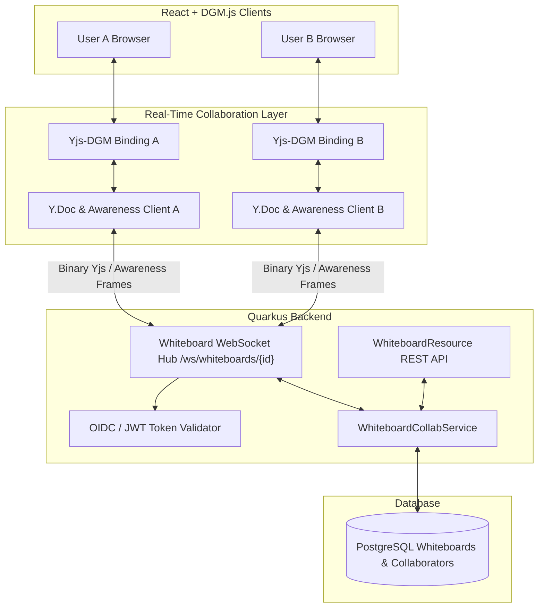

# Requirements

### Overview & Goals

The objective of this initiative is to enable real-time multi-user collaboration on floXboard. Multiple authenticated
users will be able to join the same board simultaneously, view live canvas updates, track each other's cursor positions
and selections, and collaborate seamlessly without overwriting changes.

### Solution Evaluation: DGM.js Way vs. Custom WebSockets vs. Yjs CRDT

 Evaluation Criteria        | DGM.js Mutation Streaming (DGM Way)                                                        | Custom Shape Event Broadcast                                                             | Yjs CRDT + WebSocket Provider (Selected)                                                                 |
 :---------------------------|:-------------------------------------------------------------------------------------------|:-----------------------------------------------------------------------------------------|:---------------------------------------------------------------------------------------------------------|
 **Conflict Resolution**    | Manual resolution required for concurrent edits on the same shape (LWW / Last-Write-Wins). | Complex server-side state merging; risk of split-brain or dropped updates during bursts. | **Automatic & mathematically guaranteed** convergence using Conflict-Free Replicated Data Types (CRDTs). |
 **Network Efficiency**     | Low bandwidth (transmits serialized DGM `Mutation` objects).                               | Variable (high if snapshots, moderate if custom diff events).                            | **Highly optimized binary delta encoding** (`y-protocols`) sending only minimal state updates.           |
 **Offline / Reconnection** | Complex replay log needed to reconcile offline state upon reconnecting.                    | Requires full document reload and snapshot reset.                                        | **Built-in state vector synchronization** ensures automatic catching up after transient disconnects.     |
 **Awareness & Presence**   | Custom presence layer must be created from scratch.                                        | Custom presence protocol must be designed and maintained.                                | **Standardized Yjs Awareness Protocol** out-of-the-box for cursors, selections, and user profiles.       |
 **Architecture Fit**       | Direct dependency on internal DGM.js AST mutation structures.                              | Loose coupling with DGM, but high maintenance for server diff engine.                    | **Decoupled CRDT layer** bound to DGM `Store` objects, preserving clean separation of concerns.          |

**Conclusion**: Integrating **Yjs CRDT with a Quarkus WebSocket backend** provides the ideal combination of bulletproof
conflict-free synchronization, built-in presence awareness, and seamless integration with DGM.js's underlying store
model.

### Scope

- **In Scope**:
    - Real-time bidirectional canvas synchronization across multiple active sessions.
    - Live collaborator presence: remote cursor pointers, user tags, and shape selection outlines.
    - "Focus All on Selection" feature: broadcast viewport/selection focus to smoothly bring all connected collaborators to a specific shape selection.
    - Collaborator permissions & role hierarchy: board owners and admins can invite users, assign `ADMIN`, `EDITOR`, or `VIEWER` roles, update roles, and remove access of users.
    - Real-time access revocation: instant disconnection and canvas locking when a user's access is removed by an admin or owner.
    - Board Access Request workflow: unauthorized users opening a board URL can request access (`ADMIN`, `EDITOR`, or `VIEWER`), and board owners/admins can review, approve, or reject pending requests.
    - Quarkus WebSocket hub for broadcasting CRDT updates, presence, focus commands, and handling real-time collaborator eviction.
    - Conflict-free resolution for simultaneous property/shape edits.
    - Read-only enforcement for viewer participants.
    - UI indicators for active participants, connection status, role badges, and pending access requests.
- **Out of Scope**:
    - Audio/video call integration (WebRTC audio channels).
    - Shape locking with explicit check-out mechanisms.
    - Public anonymous link sharing without Keycloak authentication.

### User Stories

- **As a board owner or admin**, I want to manage board collaborators (invite users, assign `ADMIN`, `EDITOR`, or `VIEWER` roles, update roles, and remove access of users) so that team members have appropriate permissions and former contributors can be removed.
- **As a board owner or admin**, I want to view and manage pending access requests from users who open my board link so that I can quickly grant permissions with appropriate roles.
- **As an active collaborator whose access is revoked**, I want my active editing session to be cleanly disconnected with an informative notification so that I understand why access was lost without silent failures.
- **As an unauthorized user**, I want to submit an access request when opening a board I don't have permission for so that an owner or admin can grant me access.
- **As a collaborator**, I want to see edits from other participants appear on my canvas in real-time so that our work
  stays synchronized without manual page refreshes.
- **As an editor, admin, or presenter**, I want to focus all collaborating users onto my current shape selection so that everyone looks at the same part of the diagram during discussions.
- **As an editor or admin**, I want to see the live cursor positions and active selections of my teammates so that we do not
  collide on the same shapes.
- **As a viewer**, I want to watch whiteboard sessions in real-time while having edit operations disabled to avoid
  accidental modifications.

### Functional Requirements

- **FR-1**: Authenticated users can open a board URL (`/board/:id`) and establish a WebSocket session to the
  collaboration room.
- **FR-2**: Canvas modifications (shape create, delete, transform, drag, color change, text update) must be propagated
  to all connected clients within <100ms.
- **FR-3**: Remote cursor movements must be throttled (e.g., 30-50ms) and rendered on top of the canvas with the
  collaborator's name and distinct assigned color.
- **FR-4**: Remote shape selections must display colored bounding indicators around active shapes.
- **FR-5**: Board owners and admins can invite collaborators, assign roles (`ADMIN`, `EDITOR`, `VIEWER`), change existing roles, and remove access of users at any time. When a user's access is removed, their active WebSocket connection is immediately terminated and canvas access is revoked.
- **FR-6**: Role hierarchy & guardrails:
  - `OWNER`: Full control, cannot be removed by anyone, can delete board, manage all roles including admins.
  - `ADMIN`: Can edit canvas, invite collaborators, change roles (up to `ADMIN`), remove users (`EDITOR`, `VIEWER`, or other `ADMIN`s), and resolve access requests. Cannot remove or demote the `OWNER`.
  - `EDITOR`: Can edit canvas shapes, use focus tool, view active collaborators. Cannot invite, remove users, or modify roles.
  - `VIEWER`: Read-only canvas access, live presence observation. Cannot edit shapes, invite, or remove users.
- **FR-7**: When an authenticated user opens `/board/:id` without access permissions, the UI displays an "Access Required" screen allowing the user to submit an access request (specifying desired role and an optional note).
- **FR-8**: Board owners and admins receive notification of pending access requests and can approve (assigning `ADMIN`, `EDITOR`, or `VIEWER` role) or reject requests via the Share modal.
- **FR-9**: Editors, admins, and board owners can trigger a "Focus All on Selection" command; all connected peer clients receive the event and smoothly animate/scroll their canvas viewport (`editor.scrollCenterTo`) to center on the selected shape(s) with an on-screen presenter notification.
- **FR-10**: The system must persist document state periodically and on disconnection so no collaborative work is lost.

### Non-Functional Requirements

- **Performance**: Latency for relaying Yjs delta packets across connected clients under 50ms (excluding network round
  trip).
- **Scalability**: Support at least 20 concurrent active collaborators per board without UI degradation.
- **Security**: WebSocket connections must validate Keycloak JWT access tokens during the handshake and enforce board
  authorization policies.

# Technical Design

### Current Implementation

- **Backend**: Quarkus 3.x with Kotlin, Hibernate Panache ORM (`Whiteboard.kt`), PostgreSQL (`jsonb` storage for
  whiteboard JSON content), and Keycloak OIDC authentication (`WhiteboardResource.kt`, `WhiteboardService.kt`).
  Currently, whiteboards are strictly private to their single `ownerId`.
- **Frontend**: Vite + React 19 + TypeScript. The canvas is rendered using `@dgmjs/react` and `@dgmjs/core`
  (`Whiteboard.tsx`). Board saving is currently done via debounced HTTP REST calls (`saveWhiteboard` saving full JSON
  snapshots to PostgreSQL).

### Key Decisions

1. **Synchronization Engine**: Use **Yjs CRDT** (`yjs`, `y-protocols`) bound to the DGM `Store`.
    - *Rationale*: CRDT ensures mathematical convergence of concurrent edits, provides built-in awareness protocol for
      cursors, and eliminates split-brain or manual lock conflicts.
2. **Transport Layer**: Native **Quarkus WebSockets** (`quarkus-websockets-next`) serving as a high-performance room
   relay.
    - *Rationale*: Low overhead, seamless integration with Quarkus reactive engine and Keycloak JWT authentication.
3. **Data Storage & Snapshot Strategy**: Keep PostgreSQL `jsonb` snapshots for persistence, updated asynchronously on
   debounced room changes and when all users disconnect.
    - *Rationale*: Avoids complex document rebuilding on cold load while keeping Postgres as the source of truth for
      board metadata and backup.
4. **Access Control Hierarchy & Role Management**: Relational `WhiteboardCollaborator` table with `ADMIN`, `EDITOR`, and `VIEWER` roles alongside board ownership (`OWNER`).
    - *Rationale*: Introduces an `ADMIN` tier so team leads and moderators can manage members, adjust roles, approve access requests, and remove user access without requiring board ownership transfer.
5. **Real-Time Access Revocation Enforcement**: WebSocket session eviction mechanism (`evictUser`) paired with token re-validation.
    - *Rationale*: When an owner or admin removes a user's access, the backend immediately closes any open WebSocket sessions for that user (with close code 4403 `Access Revoked`), prompting the client to terminate local sync and display the Access Required screen.
6. **Collaborative Viewport Synchronization (Focus on Selection)**: Broadcast transient focus commands via Yjs Awareness / WebSocket message envelope carrying target shape IDs and center coordinates.
    - *Rationale*: Reuses the low-latency WebSocket connection without mutating the persistent board document, allowing real-time presenter navigation without interfering with persistent shape state.

### Architecture Diagram



### Proposed Changes

#### 1. Backend (`src/main/kotlin/de/einfloh/floxboard/...`)

- **WebSocket Hub (`WhiteboardCollabSocket.kt`)**:
    - Endpoint: `/ws/whiteboards/{id}`
    - Validates query parameter / header JWT bearer token on `@OnOpen`.
    - Verifies user authorization (owner, admin, or valid collaborator).
    - Maintains in-memory board session rooms (`ConcurrentHashMap<UUID, Set<Session>>`) with session-to-user mappings.
    - Relays incoming Yjs binary sync protocol frames (`sync-step-1`, `sync-step-2`, `update`) and awareness frames to
      other room sessions.
    - Supports dynamic eviction (`evictUser(whiteboardId, userId)`): forcefully closes WebSocket connections when a user's access is removed by an admin/owner.
    - Periodically debounces Yjs document state to `WhiteboardService.saveForUser` or background worker.
- **Collaborator Entities & Service**:
    - `WhiteboardCollaborator` entity: `id`, `whiteboardId`, `userId`, `userEmail`, `role` (`ADMIN`, `EDITOR`, `VIEWER`), `createdAt`.
    - `WhiteboardAccessRequest` entity: `id`, `whiteboardId`, `userId`, `userEmail`, `username`, `requestedRole` (`ADMIN`, `EDITOR`, `VIEWER`), `status` (`PENDING`, `APPROVED`, `REJECTED`), `message`, `createdAt`, `updatedAt`.
    - Updated `WhiteboardService`:
      - Permission checks: `canAdmin(whiteboardId, userId)` (true if owner or admin), `canEdit(whiteboardId, userId)` (true if owner, admin, or editor), `canView(whiteboardId, userId)`.
      - Collaborator management: `addCollaborator`, `updateCollaboratorRole`, `removeCollaborator` (validates requester is owner/admin and target is not owner), `listCollaborators`.
      - Access request management: `createAccessRequest`, `listPendingAccessRequests`, `resolveAccessRequest` (approve/reject).
- **REST Endpoints (`WhiteboardResource.kt`)**:
    - `GET /api/v1/whiteboards/{id}/collaborators` (all authorized members)
    - `POST /api/v1/whiteboards/{id}/collaborators` (body: `{ email: string, role: string }`) (owner/admin)
    - `PATCH /api/v1/whiteboards/{id}/collaborators/{userId}` (body: `{ role: string }`) (owner/admin)
    - `DELETE /api/v1/whiteboards/{id}/collaborators/{userId}` (owner/admin, or user self-removing)
    - `POST /api/v1/whiteboards/{id}/access-requests` (body: `{ requestedRole: string, message?: string }`)
    - `GET /api/v1/whiteboards/{id}/access-requests` (owner/admin only)
    - `POST /api/v1/whiteboards/{id}/access-requests/{requestId}/approve` (body: `{ role: string }`) (owner/admin)
    - `POST /api/v1/whiteboards/{id}/access-requests/{requestId}/reject` (owner/admin)

#### 2. Frontend (`src/main/webui/src/...`)

- **Yjs-DGM Binding (`src/main/webui/src/lib/yjs-dgm-binding.ts`)**:
    - Maintains a `Y.Map<ShapeJSON>` representing all shapes in the DGM document.
    - Listens to `editor.transform.onTransaction` and `editor.transform.onAction`. Extracted mutations are converted
      into Yjs Map set/delete operations inside a single `yDoc.transact(() => ..., 'local')`.
    - Subscribes to `yMap.observe(event => ...)`: When remote events arrive (origin !== 'local'), applies updates into
      DGM store using `editor.transact(...)` and triggers `editor.repaint()`.
- **Collaboration Hook (`src/main/webui/src/lib/useWhiteboardCollab.ts`)**:
    - Manages WebSocket connection to `/ws/whiteboards/${boardId}?token=${accessToken}`.
    - Initializes `Y.Doc` and `awareness` protocol instance.
    - Synchronizes presence metadata: cursor X/Y coordinates in canvas space, username, user color, and selected shape
      IDs.
- **Presence & Focus Overlay (`src/main/webui/src/components/CollabOverlay.tsx`)**:
    - Renders SVG / HTML markers for remote users' pointers with name tags.
    - Renders tinted highlight rectangles around shapes currently selected by peers.
    - Handles incoming focus commands: calculates shape center or target point in GCS, smoothly pans/scrolls viewport via `editor.scrollCenterTo([centerX, centerY])`, and briefly highlights target shapes.
- **Focus All on Selection Action**:
    - Adds a "Focus All on Selection" button in the selection context toolbar / collaborator bar (active when 1+ shapes are selected).
    - Computes bounding center of selected shapes via `shape.getCenter()` or `shapeUtils.getAllBoundingRect`, and broadcasts `{ type: 'FOCUS_SELECTION', shapeIds: [...], center: [x, y], initiatorName }` through the collaboration layer.
- **Collaborator UI & Sharing Modal (`src/main/webui/src/components/ShareBoardModal.tsx`)**:
    - Accessible via "Share" button on top toolbar (role badge displayed on toolbar).
    - Modal allowing board owners and admins to invite users, assign/change roles (`Admin`, `Editor`, `Viewer`), remove user access with a "Remove Access" confirmation button, and manage pending access requests with "Approve as Admin / Editor / Viewer" and "Decline" buttons.
    - Role-based UI guards: Owners and Admins see management controls; Editors and Viewers see collaborator list in read-only mode.
    - Active participants avatar pill tray in top bar.
- **Access Revocation & Disconnect Handling (`src/main/webui/src/lib/useWhiteboardCollab.ts`)**:
    - Listens for WebSocket close events with access revocation codes or server eviction notices.
    - Immediately tears down Yjs sync, cleans up local editor handlers, and displays an "Access Revoked" modal / navigates to `RequestAccessView`.
- **Access Request Screen (`src/main/webui/src/components/RequestAccessView.tsx`)**:
    - Rendered when navigating to `/board/:id` if the user is unauthorized (HTTP 403 / 404 access denial).
    - Allows user to submit an access request with requested role (`ADMIN` / `EDITOR` / `VIEWER`) and optional note.
    - Displays request status badge (`Pending Approval`, `Approved`, `Rejected`) and auto-checks or notifies when access is granted.

### Data Models / Contracts

#### Collaborator Entity Schema

```kotlin
enum class CollaboratorRole {
    OWNER, ADMIN, EDITOR, VIEWER
}

@Entity
@Table(
    name = "whiteboard_collaborators",
    uniqueConstraints = [UniqueConstraint(columnNames = ["whiteboard_id", "user_id"])]
)
class WhiteboardCollaborator : PanacheEntityBase {
    @Id
    @GeneratedValue(strategy = GenerationType.UUID)
    var id: UUID? = null

    @Column(name = "whiteboard_id", nullable = false)
    lateinit var whiteboardId: UUID

    @Column(name = "user_id", nullable = false)
    lateinit var userId: UUID

    @Column(name = "user_email", nullable = false)
    lateinit var userEmail: String

    @Enumerated(EnumType.STRING)
    @Column(nullable = false)
    var role: CollaboratorRole = CollaboratorRole.EDITOR

    @CreationTimestamp
    var createdAt: Instant? = null
}
```

#### Access Request Entity Schema

```kotlin
enum class AccessRequestStatus {
    PENDING, APPROVED, REJECTED
}

@Entity
@Table(
    name = "whiteboard_access_requests",
    uniqueConstraints = [UniqueConstraint(columnNames = ["whiteboard_id", "user_id"])]
)
class WhiteboardAccessRequest : PanacheEntityBase {
    @Id
    @GeneratedValue(strategy = GenerationType.UUID)
    var id: UUID? = null

    @Column(name = "whiteboard_id", nullable = false)
    lateinit var whiteboardId: UUID

    @Column(name = "user_id", nullable = false)
    lateinit var userId: UUID

    @Column(name = "user_email", nullable = false)
    lateinit var userEmail: String

    @Column(name = "username", nullable = false)
    lateinit var username: String

    @Enumerated(EnumType.STRING)
    @Column(name = "requested_role", nullable = false)
    var requestedRole: CollaboratorRole = CollaboratorRole.EDITOR

    @Enumerated(EnumType.STRING)
    @Column(nullable = false)
    var status: AccessRequestStatus = AccessRequestStatus.PENDING

    @Column(name = "message")
    var message: String? = null

    @CreationTimestamp
    var createdAt: Instant? = null

    @UpdateTimestamp
    var updatedAt: Instant? = null
}
```

#### WebSocket Frame Protocols

- **Sync Protocol (Binary frames)**: Standard `y-protocols/sync` binary message passing (`MESSAGE_SYNC_STEP_1 = 0`,
  `MESSAGE_SYNC_STEP_2 = 1`, `MESSAGE_SYNC_UPDATE = 2`).
- **Awareness & Presence Protocol (Binary/JSON frames)**: `y-protocols/awareness` carrying encoded user state
  `{ user: { name, color }, cursor: { x, y }, selection: string[], focusEvent?: { id, center: [x,y], shapeIds: string[], by: string } }`.

### Risks & Mitigations

- **Circular Event Loops (Echoing)**: Local transaction triggering Yjs update, which triggers DGM transaction again.
    - *Mitigation*: Mark Yjs transactions with local origin tag `origin: 'local'` and ignore remote observers when
      applying local mutations.
- **Canvas Zoom/Pan Cursor Drift**: Remote cursor coordinates displaying incorrectly when users have different screen
  sizes or zoom levels.
    - *Mitigation*: Store cursor positions in world canvas space coordinates (`editor.canvas.toDocPoint(point)`) and
      convert to viewport coordinates for rendering.
- **WebSocket Disconnections**: Brief network dropouts disrupting active editing.
    - *Mitigation*: Automatic exponential backoff reconnection in client provider; Yjs state vector exchange recovers
      missed delta updates instantly upon reconnect.

# Testing

### Validation Approach

Verification of the collaborative whiteboard will be conducted through automated backend integration tests, frontend
contract unit tests, and simulated multi-client concurrency tests.

### Key Scenarios

1. **Simultaneous Real-Time Shape Creation & Editing**:
    - Client A adds a rectangle; verify rectangle immediately appears on Client B's screen with identical attributes.
    - Client A modifies stroke color while Client B moves the shape; verify both properties merge cleanly without data
      loss.
2. **Remote Live Cursor & Awareness Propagation**:
    - Move pointer in Client A's canvas; verify Client B displays Client A's pointer, name tag, and color within <50ms.
    - Select multiple shapes in Client A; verify selection highlight outlines appear on Client B.
3. **Role Hierarchy, Admin Permissions, Access Requests & Access Revocation**:
    - Unauthorized user opens `/board/{id}`; verify "Request Access" view is shown with role selection and request submission.
    - Owner or Admin opens Share modal; verify pending request appears; admin clicks "Approve as Admin / Editor / Viewer"; verify user is added to collaborators with the correct role.
    - Admin updates collaborator role (e.g. from `VIEWER` to `EDITOR`); verify UI controls immediately unlock on the client.
    - Owner or Admin clicks "Remove Access" for Collaborator B; verify Collaborator B is deleted from collaborators list and their active WebSocket connection is closed immediately (eviction).
    - Collaborator B's client immediately halts syncing, displays an "Access Revoked" notification, and renders `RequestAccessView`.
    - Admin attempts to remove or demote the `OWNER`; verify operation is rejected with 403 Forbidden.
    - Non-admin collaborator (Editor/Viewer) attempts to invite, modify roles, or remove users; verify requests are rejected with 403 Forbidden.
4. **Focus All on Selection Broadcast**:
    - User A selects one or more shapes and clicks "Focus All on Selection".
    - Verify User B and User C's canvas viewports automatically pan/scroll to the target shape coordinates (`editor.scrollCenterTo`).
    - Verify a temporary toast notification ("User A focused everyone on selection") and subtle shape outline highlight appear on recipient screens.
5. **Reconnection & State Catch-up**:
    - Disconnect Client B, make multiple modifications on Client A, then reconnect Client B; verify Client B catches up
      to the latest state via Yjs state vectors.

### Edge Cases

- **Simultaneous Deletion & Modification**: User A deletes a shape while User B edits its color. The CRDT will
  consistently drop the deleted shape without throwing errors.
- **Rapid Drag Events**: High frequency drag transactions must be batched or throttled to avoid saturating WebSocket
  throughput.
- **Empty / Corrupt Snapshots**: Graceful fallback when loading legacy boards without Yjs metadata by initializing the
  CRDT map from existing JSON content.

### Test Changes

- **Backend Tests**:
    - `WhiteboardCollabSocketTest.kt`: Test WebSocket connection handshake, JWT token auth, message broadcasting, and
      room isolation.
    - `WhiteboardCollaboratorServiceTest.kt`: Test collaborator ACL rules, invite validation, and role updates.
- **Frontend Tests**:
    - `yjs-dgm-binding.test.ts`: Test two-way synchronization between DGM `Store` transactions and `Y.Map` entries.
    - `useWhiteboardCollab.test.ts`: Test connection states, awareness state publishing, and reconnection handling.

# Delivery Steps

### ✓ Step 1: Backend Real-Time WebSocket Hub, Admin & Collaborator ACL, and Access Requests
Quarkus backend supports WebSocket-based real-time room communication, granular admin & collaborator access control, user access removal with real-time eviction, and board access request management.

- Add `io.quarkus:quarkus-websockets-next` to `build.gradle.kts` and update `application.yaml` security configurations for WebSocket endpoints.
- Create `WhiteboardCollaborator` and `WhiteboardAccessRequest` entities and database mappings with permissions (`ADMIN`, `EDITOR`, `VIEWER`), statuses (`PENDING`, `APPROVED`, `REJECTED`), and unique constraints.
- Update `WhiteboardService` and `WhiteboardRepository` to enforce collaborator permissions across GET, UPDATE, and DELETE operations, including `canAdmin` checks, role updates, and user access removal logic (`removeCollaborator`).
- Add REST endpoints in `WhiteboardResource` for collaborator management (`/api/v1/whiteboards/{id}/collaborators`, role PATCH, DELETE) and access requests (`/api/v1/whiteboards/{id}/access-requests`, approve/reject actions).
- Implement `@WebSocket(path = "/ws/whiteboards/{id}")` room hub in `WhiteboardCollabSocket.kt` to handle authenticated connection handshakes, binary/text Yjs sync message relaying, room presence broadcasting, periodic snapshots, and user session eviction (`evictUser`).

### ✓ Step 2: Frontend Yjs-DGM State Synchronization
DGM.js canvas changes are bidirectionally synchronized between multiple users via Yjs CRDT over WebSockets without edit loss, with handling for session eviction.

- Install `yjs`, `y-websocket`, and `y-protocols` dependencies in `src/main/webui/package.json`.
- Implement `YjsDgmBinding` utility (`src/main/webui/src/lib/yjs-dgm-binding.ts`) that synchronizes the DGM `Store` / `Doc` shape tree with a Yjs `Y.Map<ShapeData>`.
- Hook into `editor.transform.onTransaction` to propagate local shape mutations into Yjs CRDT operations without circular update loops.
- Listen for remote Yjs changes to update local DGM store objects using transactional updates (`editor.transact(...)`) and trigger canvas repaints.
- Create `useWhiteboardCollab` React hook to manage WebSocket connection lifecycle, JWT authentication headers, connection status indicators, and access revocation/eviction events.

### ✓ Step 3: Live Presence, Remote Cursors, and Focus All on Selection
Users see real-time remote mouse pointers, user name labels, selection outlines, and can focus all collaborators onto a specific selection.

- Implement Yjs Awareness protocol provider inside the collaboration service to track user metadata (`userId`, `username`, `color`, `cursorPosition`, `selectedShapeIds`).
- Attach pointer move and selection change listeners to `Editor` (`onPointerMove`, `editor.selection.onChange`) to broadcast local awareness updates with throttling.
- Create `CollabCursorsOverlay.tsx` component that renders remote user pointers, name badges, and color-coded selection bounding boxes above the DGM canvas.
- Implement "Focus All on Selection" feature: broadcast focus payload with selected shape coordinates and execute smooth canvas panning (`editor.scrollCenterTo`) and visual focus cues on peer clients.
- Add an active collaborators avatar bar in the header of `src/main/webui/src/App.tsx` and `src/main/webui/src/components/Whiteboard.tsx` showing currently connected users.

### ✓ Step 4: Collaborator Management, Admin Role, Access Revocation UI, and Request Workflow
Board owners and admins can manage collaborator roles (`Admin`, `Editor`, `Viewer`), remove user access with instant disconnection, and review access requests via a dedicated sharing dialog.

- Add API client functions in `src/main/webui/src/lib/api.ts` for managing board collaborators (`getCollaborators`, `addCollaborator`, `updateCollaboratorRole`, `removeCollaborator`) and access requests (`requestAccess`, `getAccessRequests`, `approveAccessRequest`, `rejectAccessRequest`).
- Create `RequestAccessView.tsx` component displayed when a user without access opens `/board/:id`, providing role selection (`ADMIN`, `EDITOR`, `VIEWER`) and access request submission with live status tracking.
- Create `ShareBoardModal.tsx` in `src/main/webui/src/components` with collaborator search/email input, role selector (`Admin`, `Editor`, `Viewer`), current member list with "Remove Access" action, and a "Pending Requests" approval badge and actions tab.
- Add a "Share" button and role badge to the whiteboard top navigation bar in `Whiteboard.tsx`.
- Update the "Open from Cloud" board list modal to display both "My Boards" and "Shared with Me" tabs.
- Handle read-only permissions by locking canvas interactions (`editor.options.readonly`) when a user joins with `VIEWER` role, and handle instant access removal by switching to the revoked/request view.
