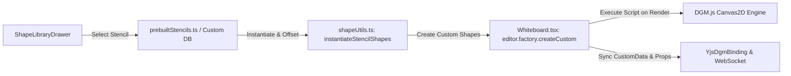

# Requirements

### Overview & Goals
The objective of this enhancement is to elevate FloxBoard's **Shape Library & Custom Stencils** by extensively leveraging the **scripting capabilities of DGM.js (`@dgmjs/core`)**.

Currently, the shape library primarily composes static basic primitives (`Rectangle`, `Ellipse`) with basic text labels. By integrating DGM.js's native `Custom` shape and script execution model (`editor.factory.createCustom(rect, script)`), FloxBoard will support rich, parametric, domain-specific visual stencils — such as multi-compartment UML class diagrams, cloud infrastructure badges, BPMN gateways, interactive UI wireframe components (toggles, sliders, progress bars), and agile sprint meters.

### Scope
- **In Scope:**
  - **DGM Custom Shape Engine Integration:** Updating `Whiteboard.tsx` canvas instantiation to create native `Custom` shapes with embedded Canvas2D drawing scripts.
  - **Scripted Prebuilt Stencils:** Upgrading `prebuiltStencils.ts` collections (Agile & Sprint, Cloud Architecture, Software Design & UML, UI Wireframing, Flowcharts & BPMN) to utilize scripted drawing routines.
  - **Shape Serialization & Cloning:** Extending `shapeUtils.ts` (`serializeShapesToStencil`, `instantiateStencilShapes`) to preserve scripts, dynamic properties, and custom data during save, copy/paste, and drop operations.
  - **Preview & Management UI:** Ensuring `ShapeLibraryDrawer.tsx` and `SaveStencilModal.tsx` properly preview and persist custom scripted shapes.
  - **Test Suite:** Comprehensive unit and integration test coverage for scripted shape serialization and canvas insertion.
- **Out of Scope:**
  - Backend database schema migrations (custom shape scripts and properties are serialized within existing JSONB `shapesJson` payloads).
  - Multi-page document architecture (`Doc.pages`).

### User Stories
- **As a Software Architect**, I want UML class diagram stencils to render distinct header, attribute, and method compartments using dynamic scripts so that system designs look clean and standardized.
- **As a Cloud Engineer**, I want Cloud Architecture stencils (databases, queues, server racks) to feature vector-scripted iconography and status indicators for high visual fidelity.
- **As a Product Designer / Scrum Master**, I want UI wireframe stencils (toggles, inputs, progress bars) and agile cards to render crisp, scalable components that adapt cleanly when resized.
- **As a Collaborator**, I want to save canvas custom shapes into my team's stencil library and drag-and-drop them with full script functionality preserved.

### Functional Requirements
1. **Custom Scripted Shape Instantiation:**
   - When inserting a stencil with `type: 'Custom'` or an embedded `script`, the canvas engine must invoke `editor.factory.createCustom(rect, script)` and apply stroke, fill, font, and custom properties.
2. **Dynamic Canvas2D Script Execution:**
   - Drawing scripts receive the canvas rendering context `ctx`, shape bounding box `(width, height)`, and visual properties, executing within the standard DGM render loop.
3. **Domain-Specific Scripted Stencils:**
   - Provide pre-built scripted stencils across all 5 standard categories (`AGILE_SPRINT`, `CLOUD_ARCHITECTURE`, `SOFTWARE_DESIGN_UML`, `UI_WIREFRAMING`, `FLOWCHART_BPMN`).
4. **Serialization & Collaborative Sync:**
   - Shape scripts, properties, and relative coordinate structures must be preserved across stencil saving (`serializeShapesToStencil`), drag-and-drop instantiation (`instantiateStencilShapes`), and Yjs collaborative synchronization.
5. **Drawer Thumbnail Previews:**
   - `ShapeLibraryDrawer` must accurately render preview thumbnails for scripted shapes.

### Non-Functional Requirements
- **Performance:** Script execution during canvas redraws must run in under 1ms per shape to maintain 60fps canvas panning and zooming.
- **Reliability:** Malformed or throwing scripts must degrade gracefully with fallback error boundaries without breaking the whiteboard session.

# Technical Design

### Current Implementation
- `prebuiltStencils.ts` defines stencils composed solely of basic primitives (`Rectangle`, `Ellipse`, `Text`, `Frame`).
- `Whiteboard.tsx` (`handleInsertStencil`) only branches on `ellipse`, `frame`, `connector`, `line`, `text`, and `rectangle`, lacking support for `Custom` / `Script` shape types.
- `shapeUtils.ts` normalizes coordinates and remaps IDs but requires explicit handling to ensure shape `script` functions/strings and `properties` are preserved during stencil serialization and instantiation.

### Key Decisions
1. **Native DGM.js `Custom` Shape Factory:**
   - *Decision:* Use `editor.factory.createCustom(rect, shapeDef.script)` for stencil shapes where `type === 'Custom'` or `shapeDef.script` is defined.
   - *Rationale:* Leverages the built-in DGM.js Canvas2D custom shape engine without requiring external rendering dependencies or custom WebGL shaders.
2. **Parametric Script Interface:**
   - *Decision:* Standardize shape scripts as Canvas2D rendering functions/code that accept `(ctx, shape, helper)` or evaluate within the DGM shape context, reading `shape.width`, `shape.height`, `shape.fillColor`, `shape.strokeColor`, and `shape.properties`.
   - *Rationale:* Ensures custom shapes can scale, change colors, and adjust properties interactively on the whiteboard.
3. **Full Backward Compatibility:**
   - *Decision:* Retain existing primitive shape creation pathways (`Rectangle`, `Ellipse`, etc.) while adding `Custom` shape handling as a first-class branch.
   - *Rationale:* Guarantees existing custom libraries and older stencils continue functioning without regression.

### Proposed Changes

#### 1. Shape Serialization & Utilities (`src/main/webui/src/lib/shapeUtils.ts`)
- Enhance `serializeShapesToStencil`:
  - Extract and preserve `script`, `properties`, and `customData` from shapes.
- Enhance `instantiateStencilShapes`:
  - Preserve `script` code, `properties`, and initial parameters when generating new shape instances with target offsets `(targetX, targetY)`.

#### 2. Canvas Shape Insertion (`src/main/webui/src/components/Whiteboard.tsx`)
- Update `handleInsertStencil`:
  ```typescript
  if (shapeType.includes('custom') || shapeDef.script) {
    shape = typeof editor.factory.createCustom === 'function'
      ? editor.factory.createCustom(rect, shapeDef.script)
      : editor.factory.createRectangle(rect);
    if (shapeDef.script) shape.script = shapeDef.script;
    if (shapeDef.properties) shape.properties = { ...shapeDef.properties };
  }
  ```
- Ensure properties like `fillColor`, `strokeColor`, `strokeWidth`, `text`, and `customData` are bound to the custom shape.

#### 3. Prebuilt Scripted Stencils (`src/main/webui/src/lib/prebuiltStencils.ts`)
- Enrich prebuilt collections with scripted shapes:
  - **Agile & Sprint:** Scripted story card with status pill, estimation badge, and retro mood meter.
  - **Cloud Architecture:** Scripted Database cylinder with 3D gradient top, Cloud boundary with curved lobes, and Server node with drive bays.
  - **Software Design & UML:** Scripted UML Class box with distinct header, attributes section, and methods section.
  - **UI Wireframing:** Scripted Toggle switch (on/off), Search bar with magnifying glass, and Progress indicator bar.
  - **Flowchart & BPMN:** Scripted Decision diamond with branching indicators and Event circle with inner boundary.

#### 4. Shape Library Drawer Previews (`src/main/webui/src/components/ShapeLibraryDrawer.tsx`)
- Enhance the thumbnail preview renderer in `ShapeLibraryDrawer.tsx` to handle `Custom` shapes by rendering their SVG/canvas representation or using the embedded script.

### Data Models / Contracts
```typescript
export interface ScriptedShapeDefinition {
  type: 'Custom' | 'Rectangle' | 'Ellipse' | 'Frame' | 'Connector' | 'Text';
  left: number;
  top: number;
  width: number;
  height: number;
  script?: string | ((ctx: CanvasRenderingContext2D, shape: any) => void);
  properties?: Record<string, any>;
  fillColor?: string;
  strokeColor?: string;
  strokeWidth?: number;
  text?: string;
  fontColor?: string;
  fontSize?: number;
  customData?: Record<string, any>;
}
```

### Architecture Diagram


### Risks & Mitigations
- **Script Error Containment:** Wrap custom script execution inside try-catch blocks to prevent broken scripts from halting canvas rendering.
- **Collaborative Serialization:** Ensure stringified script payloads serialize cleanly into JSON without losing prototype bindings.

# Testing

### Validation Approach
Verification will be conducted using automated Vitest unit tests covering shape utilities, canvas insertion logic, and drawer UI components.

### Key Scenarios
1. **Scripted Stencil Instantiation:**
   - Verify that invoking `handleInsertStencil` with a scripted `Custom` shape properly instantiates a DGM `Custom` object with `script` and `properties` attached.
2. **Relative Coordinate Transformation:**
   - Verify that `instantiateStencilShapes` correctly offsets `(left, top)` coordinates for scripted shapes while preserving `script` functions/strings.
3. **Custom Stencil Serialization:**
   - Verify that `serializeShapesToStencil` extracts `script` and custom properties from canvas shapes into the JSON stencil payload.
4. **Prebuilt Stencil Collections:**
   - Validate that all 5 prebuilt stencil collections in `prebuiltStencils.ts` contain valid shape definitions with correct bounding boxes and categories.
5. **Drawer Search & Filtering:**
   - Verify that `ShapeLibraryDrawer` renders scripted stencils, supports category filtering, and handles drag-and-drop insertion triggers.

### Edge Cases
- Custom shapes without explicit scripts fallback safely to standard rectangle rendering.
- Shapes with zero or negative dimensions are normalized to minimum bounds.
- Collaborative synchronization across Yjs peers maintains script integrity across JSON serialization rounds.

### Test Changes
- Update `src/main/webui/src/lib/shapeUtils.test.ts` to add test suites for scripted shape serialization and instantiation.
- Update `src/main/webui/src/components/ShapeLibraryDrawer.test.tsx` to verify custom scripted stencil previews and insertion events.
- Update `src/main/webui/src/components/Whiteboard.test.tsx` to test custom shape creation via `editor.factory.createCustom`.

# Delivery Steps

### ✓ Step 1: Extend Shape Utilities & Serialization for DGM Scripted Shapes
Extend shape serialization and instantiation utilities to fully support DGM.js `Custom` shapes with embedded JavaScript/Canvas2D drawing scripts and dynamic shape properties.

- Update `serializeShapesToStencil` in `src/main/webui/src/lib/shapeUtils.ts` to capture and preserve `script`, `properties`, and custom draw configurations from canvas shapes.
- Update `instantiateStencilShapes` in `src/main/webui/src/lib/shapeUtils.ts` to clone and normalize scripted shapes, properly adjusting relative bounding coordinates while retaining execution scripts.
- Ensure `serializeDocWithCustomData` and `restoreDocCustomData` safely maintain shape script definitions and custom parameters across Yjs collaborative updates.
- Add unit test coverage in `src/main/webui/src/lib/shapeUtils.test.ts` validating serialization and cloning of scripted custom shapes.

### ✓ Step 2: Integrate Custom Scripted Shape Instantiation into Canvas Engine
Update the whiteboard canvas insertion engine to instantiate native DGM.js `Custom` shapes with drawing scripts when inserting or dropping stencils.

- Extend `handleInsertStencil` in `src/main/webui/src/components/Whiteboard.tsx` to check for `shapeType.includes('custom')` or `shapeDef.script` and invoke `editor.factory.createCustom(rect, shapeDef.script)`.
- Bind shape properties (`properties`, `customData`, `strokeColor`, `fillColor`, `strokeWidth`, `fontFamily`) onto created custom shapes.
- Update the drag-and-drop handler in `Whiteboard.tsx` to ensure seamless GCS (Global Canvas Space) coordinate placement for scripted stencils.
- Ensure newly inserted scripted shapes are properly registered with the editor store, selected, repainted, and synced to remote peers via `YjsDgmBinding`.

### ✓ Step 3: Upgrade Pre-Built Stencil Library with Rich DGM Scripted Implementations
Upgrade the pre-built stencil collections across technical and team domains to utilize DGM.js custom drawing scripts for rich visual fidelity and dynamic geometry.

- Update `src/main/webui/src/lib/prebuiltStencils.ts` to implement scripted shapes for:
  - **Agile & Sprint Teams:** Story cards with status tags, planning poker badges, and sprint health meters.
  - **Cloud Architecture:** Cloud boundary blocks, database nodes with 3D cylinder rims, and server racks.
  - **Software Design & UML:** Multi-compartment UML class boxes (name, attributes, methods) and interface headers.
  - **UI Wireframing:** Interactive toggles, progress bars, input fields, and mobile frame notch layouts.
  - **Flowcharts & BPMN:** Decision diamonds with conditional branches and event triggers.
- Ensure all scripted stencils maintain fallback dimensions, relative rect calculations, and responsive aspect ratios.

### ✓ Step 4: Enhance Shape Library Drawer Previews & Verification Tests
Ensure the Shape Library Drawer and Save Stencil Modal cleanly preview and manage scripted shapes, and validate the complete workflow with test suites.

- Update `ShapeLibraryDrawer.tsx` stencil card preview rendering to support executing or visually simulating custom scripted stencils within thumbnail viewports.
- Verify `SaveStencilModal.tsx` correctly handles selections containing custom scripted shapes.
- Add test suites in `ShapeLibraryDrawer.test.tsx` and `Whiteboard.test.tsx` verifying insertion, searching, previewing, and rendering of scripted custom stencils.