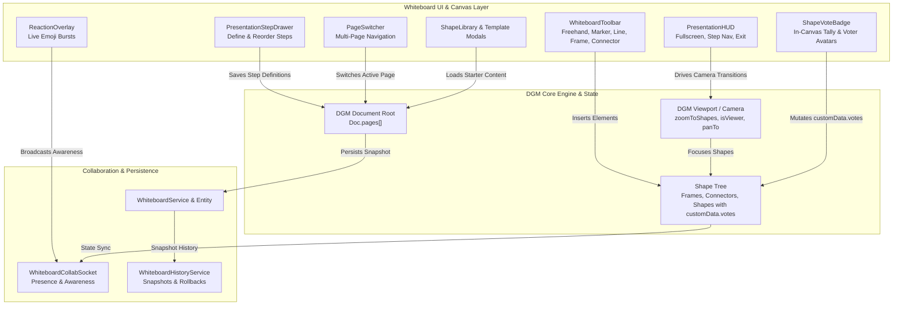

# Requirements

### Overview & Goals
The goal of this task is to extend and modernize the documentation in the `/features` directory to incorporate upcoming features documented in `features.md` and reference patterns from [dgm.sh](https://dgm.sh/) / `@dgmjs`, utilizing native DGM.js capabilities wherever possible. All features that are not yet implemented in the application codebase must be explicitly marked as `PLANNED` with status callouts and `[PLANNED]` section tags.

This involves:
1. Updating the whiteboard shape roster and drawing capabilities (adding Freehand, Marker, Eraser, Connector, Line, and Frames; removing Triangle and Diamond) while marking upcoming drawing tools as `[PLANNED]`.
2. Documenting **Votes on Shapes [PLANNED]** for collaborative prioritization, dot-voting, and feedback on canvas items.
3. Documenting enhanced **Presentation Mode with Step-by-Step Navigation [PLANNED]**, allowing users to define presentation steps on a single board by selecting shapes, and stepping through them with animated viewport transitions using DGM.js camera/viewport APIs.
4. Documenting advanced whiteboard capabilities as **[PLANNED]**: Shape Libraries, Templates, Multi-Page Document Support (Pages), History & Version Snapshots, and Live Reactions.
5. Updating the master feature matrix in `features/README.md` and related documentation to maintain architectural consistency and accurate implementation status indicators.

---

### Scope

#### In Scope
- **Explicit `PLANNED` Status Tagging**:
  - Add `[PLANNED]` status badges, callouts (`> ⚠️ Status: Planned / Roadmap`), and section markers across all feature documentation for capabilities not yet implemented in the codebase.
- **Shape & Drawing Tool Enhancements**:
  - Add specifications for Freehand drawing, Marker (highlighter brush), Eraser (stroke & shape removal), Connector (shape-anchored auto-routed lines), Line tool, and Frames (bounding artboards), noting planned tools.
  - Explicitly document removal / deprecation of Triangle and Diamond (Rhombus) shapes from default toolbars.
- **Votes on Shapes (Shape Voting) [PLANNED]**:
  - Interactive voting on shapes (e.g. sticky notes, cards, frames, groups) for dot-voting and decision making.
  - Shape vote badges displaying total vote counts and collaborator voter indicators.
  - Real-time vote synchronization across collaborators via Yjs CRDT and DGM shape custom data attributes.
  - Voting controls (casting/retracting votes, configurable max votes per participant, vote tally reset).
- **Presentation Mode & Step-by-Step Storytelling [PLANNED]**:
  - Full-screen distraction-free presenter view (`isViewer = true`, edit controls hidden, non-navigation menus hidden).
  - **Single-Board Step Definition**: Ability to select one or more shapes/frames and register them as an ordered presentation step.
  - **Step Management**: Reorder steps, rename steps, add/remove shapes from steps, and preview step thumbnails.
  - **Step-by-Step Transition**: Stepping through slides (Next/Previous, keyboard arrows) using DGM.js native viewport centering (`editor.zoomToShapes`, `calculateShapesBoundingBox`, `panTo`) with smooth camera animation.
- **New Advanced Functional Features [PLANNED]**:
  - **Shape Libraries [PLANNED]**: Reusable stencil kits, custom user/org palettes, and component libraries.
  - **Templates [PLANNED]**: Diagram starter blueprints (Flowcharts, Architecture, Mind Maps) and custom board templating.
  - **History [PLANNED]**: Granular change logs, undo/redo timeline, and point-in-time snapshot rollbacks.
  - **Pages [PLANNED]**: Multi-page canvas architecture within a single board document (`Doc.pages`), page reordering, and tabbed navigation.
  - **Reactions [PLANNED]**: Ephemeral live emoji bursts (`🔥`, `👍`, `❤️`, `🎉`) rendered on collaborative viewports via Yjs awareness.
- **Documentation Architecture**:
  - Update `features/whiteboard-collaboration.md` with planned capabilities clearly designated with `[PLANNED]`.
  - Update `features/whiteboard-advanced-features.md` with `[PLANNED]` title, roadmap status callout banner, and per-feature planned indicators.
  - Update `features/README.md` (Feature Matrix & Documentation Index with accurate `Implemented` / `Planned` / `Partially Implemented` statuses).
  - Cross-reference alignment in `features/export-and-ai-services.md` and `features/licensing-and-entitlements.md`.

#### Out of Scope
- Direct application source code implementation (this plan specifies the documentation update for `/features`).
- Modifications to existing backend database migrations.

---

### User Stories
- **As a User / Designer**, I want to use freehand sketching, markers, smart connectors, lines, and frames so that I can create expressive and organized diagrams without clutter from unnecessary shapes.
- **As a Facilitator / Collaborator**, I want to vote on shapes and sticky notes during workshops and brainstorming sessions so that the team can prioritize ideas quickly and view real-time tally badges.
- **As a Presenter**, I want to select specific shapes and define an ordered sequence of presentation steps on a single board, and then enter Presentation Mode to guide my audience step-by-step with smooth camera transitions without clutter or editing distractions.
- **As a Collaborator**, I want to send live emoji reactions during interactive sessions to provide instant non-disruptive feedback.
- **As a Power User**, I want multi-page support, pre-built templates, shape libraries, and revision history to structure large-scale documentation and restore past versions.

---

### Functional Requirements

#### 1. Whiteboard Canvas, Voting & Presentation (`features/whiteboard-collaboration.md`)
- **Canvas Tools & Shapes**:
  - **Implemented**: Rectangles, Ellipses/Circles, Sticky Notes, Text Annotations.
  - **Planned (`[PLANNED]`)**: Freehand (`FreehandShape`), Marker (`MarkerShape`), Eraser (`EraserTool`), Connector (`ConnectorShape`), Line (`LineShape`), Frames (`FrameShape`).
  - **Shape Palette Pruning**: Removal of Triangle and Diamond tools from the default quick-insert toolbar.
- **Votes on Shapes (Shape Voting) [PLANNED]**:
  - Voting toggle action available via shape context menu and on-hover quick vote button.
  - Dynamic shape vote counter badge rendered adjacent to the shape's top-right corner.
  - User-level vote tracking (shows user avatars on hover, permits vote retraction/re-voting).
  - State persistence stored directly inside DGM shape attributes (`shape.customData.votes`) and synchronized in real-time over Yjs.
- **Presentation Mode & Step-by-Step Flow [PLANNED]**:
  - **Presentation Setup Panel / Drawer**:
    - Select one or multiple shapes/frames on canvas and click "Add as Presentation Step".
    - Manage ordered sequence of steps (Step 1, Step 2, ...), drag-and-drop reordering, step renaming, and step deletion.
    - Presentation steps stored within the DGM document/page metadata (`page.customData.presentationSteps`).
  - **Presentation Viewer Experience**:
    - Distraction-free full-screen mode with `isViewer = true` (read-only canvas lock, canvas editor toolbars and non-navigation menus hidden).
    - Floating presenter HUD with Previous (`←`), Next (`→`), Step Counter (`Step X of Y`), Step Overview Menu, and Exit Presentation (`Esc`).
    - Automated camera transition: selecting a step invokes DGM.js camera navigation (`editor.zoomToShapes(step.shapeIds)` / `editor.setViewport`) to smoothly center and fit the step's bounded shapes.
- **Live Collaborative Reactions [PLANNED]**:
  - Ephemeral floating emoji particles (`🔥`, `👍`, `❤️`, `🎉`) broadcast via WebSocket / Yjs presence awareness.

#### 2. Advanced Whiteboard Capabilities [PLANNED] (`features/whiteboard-advanced-features.md`)
- **Status Callout**: Document marked with `[PLANNED]` title and roadmap status warning banner.
- **Shape Libraries [PLANNED]**:
  - Library panel UI with searchable stencil categories (Cloud Architecture, UML, UI Wireframes, Flowcharts).
  - Custom library creation and organization sharing.
- **Templates [PLANNED]**:
  - Predefined template gallery modal on board creation.
  - "Save as Template" option for existing boards.
- **Multi-Page Architecture (Pages) [PLANNED]**:
  - Canvas page switcher UI allowing users to switch, add, duplicate, reorder, and delete pages.
  - Document serialization supporting multiple page trees under a single DGM document (`Doc.pages`).
- **History & Version Snapshots [PLANNED]**:
  - Point-in-time snapshot timeline with restore capability.
  - Activity log showing collaborator edits and timestamped snapshots.

#### 3. Documentation Index & Catalog (`features/README.md`)
- Update table of features to index `08. Advanced Whiteboard Capabilities [PLANNED]` (`features/whiteboard-advanced-features.md`).
- Update the feature summary for `01. Whiteboard & Collaboration` to reflect the modernized toolset with clear distinction between implemented and planned features.

# Technical Design

### Current Implementation Context
- The `/features` folder follows a consistent markdown structure:
  - Title, Overview, Key Capabilities (numbered sections with bullet points), and Technical Architecture (Backend Components & Frontend Components).
  - `features/README.md` maintains a central feature matrix with status flags (`Implemented`, `Planned`).
  - Existing whiteboard documentation (`features/whiteboard-collaboration.md`) currently lists basic canvas tools (Rectangles, Ellipses, Sticky Notes, Arrows) and CRDT synchronization.
  - `features/export-and-ai-services.md` currently lists planned features including version history and PDF export.

---

### Key Decisions
1. **Separation of Core Canvas vs. Advanced Whiteboard Modules**:
   - Keep core canvas drawing tools, shape modifications (add/remove shapes), shape voting, live reactions, and presentation mode inside `features/whiteboard-collaboration.md`.
   - Create a dedicated `features/whiteboard-advanced-features.md` to document major enterprise/power-user subsystems: Shape Libraries, Templates, Pages (Multi-page canvas), and History Management. This avoids bloating `whiteboard-collaboration.md` and aligns with the modular design of the `/features` catalog.
2. **Leveraging Native DGM.js Functions for Presentation & Camera Control**:
   - For presentation steps on a single board, presentation steps store shape references (`step.shapeIds: string[]`).
   - Transitioning between steps uses DGM.js built-in camera/viewport functions (`editor.zoomToShapes`, `calculateShapesBoundingBox`, `editor.setViewport`, `editor.isViewer = true`) rather than custom CSS transformations, ensuring smooth and coordinate-accurate zoom and pan animations.
3. **Shape Voting via DGM Shape Metadata & Yjs CRDT**:
   - Store voting state directly in DGM shape custom data attributes (`shape.customData.votes = { [userId]: timestamp }`). This reuses the existing DGM document format and Yjs collaborative CRDT binding without requiring separate database tables or bespoke synchronization protocols.
4. **Standardized DGM Integration Architecture**:
   - Align the documented technical architecture with the `@dgmjs/core` and `@dgmjs/react` ecosystem (e.g. `Doc.pages`, `FrameShape`, `ConnectorShape`, `FreehandShape`).
5. **Multi-Page Document Schema**:
   - Document the multi-page schema where a board's DGM document contains an array of `Page` objects, each with independent shape trees, presentation step lists, and viewport positions.

---

### Architecture & Interaction Diagram



---

### Detailed File Changes

#### 1. `features/whiteboard-collaboration.md`
- **Updated Section**: *Interactive Infinite Canvas & Drawing Tools*
  - Identify existing implemented shapes (Rectangle, Ellipse, Sticky Notes, Text).
  - Clearly tag newly added drawing tools with `[PLANNED]` (Freehand, Marker, Eraser, Smart Connectors, Line, Frames).
  - Explicit note on removal of Triangle and Diamond shapes.
- **New Section**: *Votes on Shapes (Shape Voting) [PLANNED]*
  - Voting toggle action available via shape context menu and hover trigger.
  - In-canvas vote badge displaying live count and voter avatars.
  - Synchronized via DGM shape metadata (`shape.customData.votes`) over Yjs CRDT.
  - Facilitator voting session controls (max votes per user, reset votes).
- **New Section**: *Presentation Mode & Step-by-Step Navigation [PLANNED]*
  - **Single-Board Step Definition**: Select canvas shapes/frames and assign them to ordered presentation steps.
  - **Step Management**: Reordering, renaming, and deleting steps in the presentation builder panel.
  - **Presenter Experience**: Distraction-free full-screen mode (`isViewer = true`), floating presenter HUD, and smooth transitions between steps using DGM.js camera functions (`editor.zoomToShapes`).
- **New Section**: *Live Collaborative Reactions [PLANNED]*
  - Ephemeral emoji particles via Yjs awareness.
- **Updated Section**: *Technical Architecture*
  - Frontend components: `ShapeVoteBadge.tsx` [Planned], `PresentationStepDrawer.tsx` [Planned], `PresentationHUD.tsx` [Planned], `ReactionPicker.tsx` [Planned], `WhiteboardToolbar.tsx`, `ShapeContextMenu.tsx`.

#### 2. `features/whiteboard-advanced-features.md`
- **Title & Status Callout**: `# Advanced Whiteboard Capabilities [PLANNED]` with `> ⚠️ **Status: Planned / Roadmap**` notice.
- **Key Capabilities**:
  - `1. Shape Libraries & Custom Stencils [PLANNED]`: Built-in stencils, custom organization libraries, asset search.
  - `2. Diagram Templates & Board Blueprints [PLANNED]`: Blueprint catalog (Architecture, Mindmaps, Flowcharts), user-created templates.
  - `3. Multi-Page Canvas Architecture (Pages) [PLANNED]`: Page list drawer, page CRUD, page reordering, per-page thumbnail rendering.
  - `4. Revision History & Point-in-Time Snapshots [PLANNED]`: Version timeline, named checkpoints, diff view, snapshot restore.
- **Technical Architecture**:
  - Backend: `WhiteboardTemplateResource.kt` [Planned], `WhiteboardHistoryResource.kt` [Planned], `WhiteboardPageModel.kt` [Planned].
  - Frontend: `ShapeLibraryDrawer.tsx` [Planned], `TemplateGalleryModal.tsx` [Planned], `PageTabBar.tsx` [Planned], `HistoryDrawer.tsx` [Planned].

#### 3. `features/README.md`
- Add/update entry `08. Advanced Whiteboard Capabilities` linking to `features/whiteboard-advanced-features.md` with status **`Planned`**.
- Update module `01. Whiteboard & Collaboration` description to highlight the drawing toolset, shape voting, step-based presentation mode, and live reactions, indicating planned additions.

#### 4. `features/export-and-ai-services.md`
- Update PDF Export specification to mention multi-page document export (exporting all pages vs. current page).
- Cross-reference version history with `features/whiteboard-advanced-features.md`.

---

### File Structure Overview
```
features/
├── README.md                           [MODIFIED - Updated Feature Matrix & Index]
├── whiteboard-collaboration.md         [MODIFIED - Shapes, Voting, Step Presentation, Reactions]
├── whiteboard-advanced-features.md     [NEW - Libraries, Templates, Pages, History]
├── export-and-ai-services.md           [MODIFIED - Multi-page export cross-reference]
├── licensing-and-entitlements.md       [Referenced]
├── organization-management.md          [Referenced]
├── user-and-access-management.md       [Referenced]
├── billing-and-payments.md             [Referenced]
└── notifications.md                    [Referenced]
```

# Testing

### Validation Approach
Verification of the documentation enhancements will be conducted via:
1. **Completeness & Traceability Check**:
   - Ensure every item listed in `features.md` and user instructions (6 added shapes, 2 removed shapes, shape voting, step-based presentation mode using DGM.js functions, shape libraries, templates, pages, history, reactions) is thoroughly detailed with clear functional descriptions, user flows, and architectural components.
2. **Cross-Document Consistency**:
   - Verify that all relative links between `features/README.md`, `features/whiteboard-collaboration.md`, `features/whiteboard-advanced-features.md`, and `features/export-and-ai-services.md` are valid and properly formatted.
3. **Markdown Syntax & Structure Compliance**:
   - Ensure consistent headers, table formatting, and styling aligned with existing documents in `/features`.

---

### Key Scenarios to Validate
- **Shapes Validation**:
  - Added: Freehand, Marker, Eraser, Connector, Line, Frames.
  - Removed: Triangle, Diamond (Rhombus).
- **Functions Validation**:
  - **Shape Voting**: Documented voting toggle, in-canvas count badges, voter indicators, and DGM shape custom data persistence.
  - **Presentation Mode & Steps**: Documented shape selection for step creation, step reordering, presenter HUD, read-only lock, and DGM.js viewport camera transitions (`zoomToShapes`).
  - **Shape Libraries**: Documented custom and organizational sharing capabilities.
  - **Templates**: Documented starter blueprints and user template generation.
  - **History**: Documented timeline snapshots and restore workflow.
  - **Pages**: Documented multi-page document model and navigation UI.
  - **Reactions**: Documented WebSocket/Yjs presence broadcast and animated bursts.
- **Feature Matrix Verification**:
  - `features/README.md` correctly lists all active and planned capabilities.

# Delivery Steps

### ✓ Step 1: Update Whiteboard Core, Canvas Tools, Shape Voting & Step Presentation in features/whiteboard-collaboration.md
Update `features/whiteboard-collaboration.md` to reflect the updated canvas shape roster, drawing tools, shape voting, step-based presentation mode, and live reactions, marking all non-implemented features with `[PLANNED]`.

- Update the **Interactive Infinite Canvas & Drawing Tools** section to distinguish between implemented shapes (Rectangles, Ellipses, Sticky Notes, Text) and planned drawing tools (`[PLANNED]`): Freehand drawing, Marker (semi-transparent highlighter), Eraser, Smart Connectors, Line tool, and Frames.
- Document the deprecation and removal of Triangle and Diamond (Rhombus) shapes from standard toolbars.
- Add specification for **Votes on Shapes (Shape Voting) [PLANNED]**: context action/quick toggle, dynamic badge overlay with vote counts and voter avatars, and real-time CRDT synchronization via DGM shape metadata (`shape.customData.votes`).
- Add specification for **Presentation Mode & Step-by-Step Storytelling [PLANNED]**: single-board presentation step definition by selecting shapes/frames, presentation step drawer for reordering and naming steps, and full-screen presenter HUD with smooth camera transitions powered by DGM.js (`editor.zoomToShapes`).
- Add specification for **Live Collaborative Reactions [PLANNED]** (ephemeral emoji bursts and presence animations synchronized over WebSockets / Yjs awareness).
- Update frontend and backend component listings to reflect new canvas tools, voting badges, presentation drawers, and HUD components with appropriate implementation status notes.

### ✓ Step 2: Mark and Format Advanced Whiteboard Features as Planned in features/whiteboard-advanced-features.md
Update `features/whiteboard-advanced-features.md` to format the document as a planned roadmap module with `[PLANNED]` badges and status callouts matching the style of `features/export-and-ai-services.md`.

- Add `[PLANNED]` to the title and include a roadmap status warning banner (`> ⚠️ Status: Planned / Roadmap`) indicating features are not yet implemented in the runtime.
- Update section headers with `[PLANNED]` tags: **1. Shape Libraries & Custom Stencils [PLANNED]**, **2. Diagram Templates & Board Blueprints [PLANNED]**, **3. Multi-Page Canvas Architecture (Pages) [PLANNED]**, and **4. Revision History & Point-in-Time Snapshots [PLANNED]**.
- Ensure backend and frontend technical component listings and data schemas clearly describe planned architecture models (`Doc.pages`, `PresentationStep`, `WhiteboardSnapshotPayload`).

### ✓ Step 3: Update Feature Catalog Index and Cross-References across features/README.md
Update `features/README.md` and synchronize `features/export-and-ai-services.md` and `features/licensing-and-entitlements.md` to maintain accurate `PLANNED` status indicators and cross-references.

- Update `features/README.md` feature matrix and documentation index table to reference `08. Advanced Whiteboard Capabilities [PLANNED]` (`features/whiteboard-advanced-features.md`) with status **`Planned`**.
- Update `features/README.md` description for `01. Whiteboard & Collaboration` to accurately capture implemented vs. planned capabilities.
- Update `features/export-and-ai-services.md` to reference multi-page PDF exports and align version history specifications with the planned advanced features doc.
- Verify consistent cross-document links, status indicators (`Implemented` / `Planned`), and architectural consistency across the entire `/features` folder.
