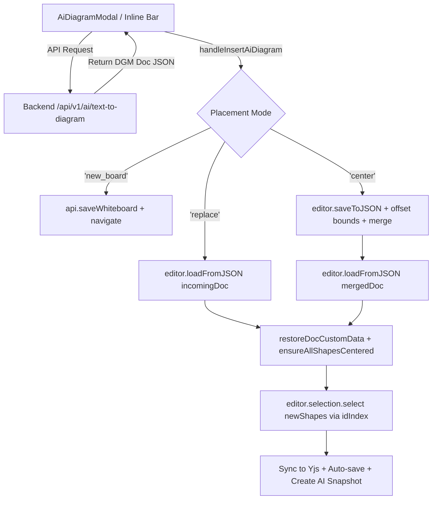

# Requirements

### Overview & Goals
When generating a diagram using the AI Text-to-Diagram feature (e.g. "Microservices architecture with API Gateway, Auth Service, Order Service, PostgreSQL database, and Kafka event bus"), the frontend throws a runtime error `TypeError: obj.traverse is not a function` upon receiving the backend response.

The goal is to fix the diagram insertion logic in `Whiteboard.tsx` so that AI-synthesized diagram JSON payloads are properly deserialized and rendered on the canvas across all placement modes (`center`, `replace`, and `new_board`) without throwing errors.

### Scope
- **In Scope:**
  - Fix `handleInsertAiDiagram` in `src/main/webui/src/components/Whiteboard.tsx` to properly deserialize incoming DGM JSON documents using DGM document loading mechanisms (`editor.loadFromJSON`) rather than passing raw JSON objects into `editor.actions.insert`.
  - Maintain coordinate offset centering for `'center'` mode so newly generated diagrams appear centered on the user's viewport without overwriting existing canvas elements.
  - Properly select newly inserted shapes, sync to collaborative Yjs session, trigger auto-save, and record AI snapshot checkpoints.
  - Add unit tests in `src/main/webui/src/components/Whiteboard.test.tsx` verifying AI diagram insertion with the backend response payload.
- **Out of Scope:**
  - Modifying backend AI generation services or prompt templates.
  - Modifying `@dgmjs/core` library internals.

### User Stories
- **As a whiteboard user**, I want to generate cloud architecture and process diagrams with natural language prompts so that they instantly appear on my canvas properly styled and selectable.
- **As a collaborative editor**, I want AI-generated diagrams to sync with other active peers and persist reliably to cloud storage without crashing the canvas application.

### Functional Requirements
- When an AI diagram response is received from `/api/v1/ai/text-to-diagram`:
  - **`replace` mode**: The canvas content is completely replaced with the synthesized diagram doc, text proportions and centering are applied, the view centers on content, and shapes are selected.
  - **`center` mode**: The incoming shapes and connectors are shifted so their bounding center aligns with the editor center, merged into the current board document, loaded via `editor.loadFromJSON`, custom data restored, and new shapes selected.
  - **`new_board` mode**: The incoming doc is saved as a new whiteboard and the user is redirected to the new board URL.
- No `TypeError: obj.traverse is not a function` error is thrown during or after generation.
- Real-time collaboration peers receive the updated diagram via Yjs sync.

# Technical Design

### Current Implementation & Root Cause Analysis
In `src/main/webui/src/components/Whiteboard.tsx` (lines 953–1047), `handleInsertAiDiagram` receives `incomingDoc` (a complete DGM JSON document object containing `type: "Doc"`, `children: [{ type: "Page", children: [...] }]`).

```ts
const rawElements: any[] = incomingDoc?.children?.[0]?.children || [];
// ...
for (const elem of rawElements) {
  // ...
  editor.actions.insert(elem);
  newShapes.push(elem);
}
```

In `@dgmjs/core`, `editor.actions.insert(shape)` expects an instantiated DGM Shape instance (e.g. from `editor.factory` or deserialized shape classes), which implements base methods like `.traverse()`, `.getBoundingRect()`, and `.update()`.
Because `elem` is a plain JavaScript dictionary parsed from JSON, it lacks the `.traverse` method on its prototype. When DGM operations (or transaction listeners / selection managers) attempt to call `shape.traverse(...)`, JavaScript raises `TypeError: obj.traverse is not a function`.

### Key Decisions
- **Use `editor.loadFromJSON` for document re-hydration**:
  - *Decision*: For both `replace` and `center` modes, use `editor.loadFromJSON(docJson)` to allow DGM's internal deserializer to instantiate proper Shape class instances.
  - *Rationale*: DGM's `loadFromJSON` handles the instantiation of all shape types (`Frame`, `Rectangle`, `Connector`, etc.), initializes internal indices, sets up geometry and text metrics, and avoids prototype mismatches.
- **Document JSON Merging for `center` Mode**:
  - *Decision*: Obtain the current canvas state via `editor.saveToJSON()`, compute the bounding center of incoming elements, offset their coordinates (`left`, `top`, `path`), append them to `currentDoc.children[0].children`, and call `editor.loadFromJSON(mergedDoc)`.
  - *Rationale*: Preserves existing canvas elements while placing the newly generated diagram at the current viewport focus.
- **Post-load Shape Selection**:
  - *Decision*: Look up the newly created shape instances in `editor.store.idIndex` using the incoming shape IDs and pass them to `editor.selection.select(newShapes)`.
  - *Rationale*: Gives immediate visual feedback with bounding selection handles on the generated diagram.

### Proposed Changes

#### 1. `src/main/webui/src/components/Whiteboard.tsx`
Refactor `handleInsertAiDiagram`:
- For `mode === 'replace'`:
  - Call `editor.loadFromJSON(incomingDoc)`.
  - Call `restoreDocCustomData(editor, incomingDoc)`.
  - Call `ensureAllShapesCentered(editor)`.
  - Call `centerOnContent(editor)`.
- For `mode === 'center'`:
  - Retrieve current doc: `const currentDoc = editor.saveToJSON() || { type: 'Doc', children: [{ type: 'Page', children: [] }] }`.
  - Calculate bounding box of `rawElements` with `left`/`top` bounds.
  - Calculate `dx = center[0] - graphCenterX` and `dy = center[1] - graphCenterY`.
  - Offset each element: `elem.left += dx`, `elem.top += dy`, and offset points in `elem.path`.
  - Merge existing page children with offset elements:
    ```ts
    const existingChildren = currentDoc.children?.[0]?.children || [];
    currentDoc.children[0].children = [...existingChildren, ...rawElements];
    editor.loadFromJSON(currentDoc);
    restoreDocCustomData(editor, currentDoc);
    ensureAllShapesCentered(editor);
    ```
- For selection and sync:
  - Retrieve new shape objects: `const store = editor.store as any; const newShapes = rawElements.map(e => store?.idIndex?.[e.id]).filter(Boolean);`
  - Select: `if (newShapes.length > 0) editor.selection.select(newShapes);`
  - Repaint, sync to Yjs binding, trigger auto-save, and save AI snapshot checkpoint.

### Architecture Diagram



### Components & Files Affected
- `src/main/webui/src/components/Whiteboard.tsx`: Fix `handleInsertAiDiagram` implementation.
- `src/main/webui/src/components/Whiteboard.test.tsx`: Add test coverage for AI diagram insertion across all modes.

# Testing

### Validation Approach
Verify that the AI diagram insertion handles the microservices architecture response payload without runtime errors and updates the canvas state correctly.

### Key Scenarios
1. **Cloud Architecture Insertion in Center Mode (`center`)**:
   - Canvas has 1 existing rectangle.
   - Insert microservices diagram with 7 shapes (1 Frame, 6 Rectangles) and 5 Connectors.
   - Confirm shapes and connectors are merged into canvas without errors.
   - Confirm new shapes are centered around `editor.getCenter()`.
   - Confirm `editor.selection.select` is called with the newly created shape instances.
2. **Replacement Mode (`replace`)**:
   - Canvas has existing shapes.
   - Insert AI diagram in `replace` mode.
   - Confirm canvas is reloaded with incoming doc, text proportions centered, and viewport centered on content.
3. **New Board Mode (`new_board`)**:
   - Insert AI diagram in `new_board` mode.
   - Confirm `api.saveWhiteboard` is called with incoming content and user is navigated to new board route.

### Vitest Test Suite
- Run all unit tests: `npm test -- --run` in `src/main/webui`.
- Ensure all 27 test suites and 240+ tests pass cleanly.

# Delivery Steps

### ✓ Step 1: Refactor AI diagram insertion logic in Whiteboard component
The DGM editor correctly parses and renders AI-generated diagram payloads without throwing `obj.traverse is not a function`.

- Update `handleInsertAiDiagram` in `src/main/webui/src/components/Whiteboard.tsx` to handle document deserialization via `editor.loadFromJSON` rather than passing raw JSON elements to `editor.actions.insert`.
- In `'replace'` mode, load the complete `incomingDoc` directly with `editor.loadFromJSON(incomingDoc)`, restore custom data with `restoreDocCustomData`, apply centered text styling with `ensureAllShapesCentered`, and center the viewport via `centerOnContent`.
- In `'center'` mode, calculate the coordinate delta (`dx`, `dy`) to position the new diagram at the viewport center, shift the incoming shape coordinates and connector paths, merge the shape definitions into the current document's JSON representation obtained from `editor.saveToJSON()`, and load the combined document using `editor.loadFromJSON(mergedDoc)`.
- Re-hydrate custom data and select newly added shape instances looked up from `editor.store.idIndex`.
- Trigger Yjs synchronization (`syncEditorToYjs`), auto-save, and automated snapshot creation.

### ✓ Step 2: Add unit tests for AI diagram insertion and verify test suite
Automated unit tests verify diagram insertion across all placement modes with microservices architecture payload and ensure full regression safety.

- Add unit tests in `src/main/webui/src/components/Whiteboard.test.tsx` testing `handleInsertAiDiagram` with the microservices diagram response payload from the issue description.
- Test `'center'` mode: verify shape coordinates are centered, shapes are merged with existing board content, `loadFromJSON` is called with merged document, and new shapes are selected.
- Test `'replace'` mode: verify canvas is replaced by incoming diagram and centered.
- Test `'new_board'` mode: verify `api.saveWhiteboard` is called and navigation is triggered.
- Run the entire Vitest suite via `npm test` to confirm all 27 test files pass without regressions.