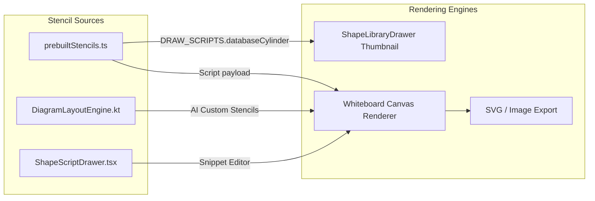

# Requirements

### Overview & Goals
The database shapes (such as the 3D cylinder database nodes used in cloud architecture stencils and AI-generated diagrams) currently render incorrectly with visual artifacts, including diagonal lines cutting through the cylinder body, inverted rim curves, and malformed path fills.

The goal is to correct the 2D HTML5 canvas path generation geometry across both the frontend shape library and backend layout engine so that database cylinders render cleanly as proper 3D database disks with distinct top rims, tiered plies, and correctly aligned text labels.

### Scope
- **In Scope**:
  - Fixing the HTML5 Canvas path geometry in `DRAW_SCRIPTS.databaseCylinder` in `prebuiltStencils.ts`.
  - Fixing the `cloud-database` snippet template in `ShapeScriptDrawer.tsx`.
  - Fixing `StencilDrawScripts.DATABASE_CYLINDER` in `DiagramLayoutEngine.kt`.
  - Enhancing `StencilThumbnail` in `ShapeLibraryDrawer.tsx` to render cylinder geometry for unscripted cylinder stencil items.
  - Adding automated tests to verify correct execution and path logic of the database cylinder scripts.
- **Out of Scope**:
  - Altering database schema or backend persistence models for stencils.
  - Modifying non-database shape stencil types (e.g., UML classes, BPMN gateways).

### User Stories
- As a whiteboard user browsing the Shape Library, I want the Database cylinder stencils in the Cloud Architecture collection to look clean and realistic with proper 3D perspective so that my architecture diagrams look professional.
- As a whiteboard user using AI diagram generation or custom shape scripts, I want database nodes to render with correctly proportioned cylinder rims and tier lines without stray chords or clipping.

### Functional Requirements
- **FR-1**: Database cylinder paths must define a closed perimeter consisting of:
  1. Left edge from `(0, ry)` down to `(0, h - ry)`.
  2. Bottom arc from `(0, h - ry)` through bottom apex `(w/2, h)` to `(w, h - ry)`.
  3. Right edge from `(w, h - ry)` up to `(w, ry)`.
  4. Top upper arc from `(w, ry)` through top apex `(w/2, 0)` back to `(0, ry)`.
- **FR-2**: Top rim must render a full ellipse `(w/2, ry)` filled with a lighter accent color and stroked.
- **FR-3**: Intermediate tier rings must render only the front-visible lower arc (`0` to `Math.PI` clockwise).
- **FR-4**: Database title and subtitle must be centered vertically and horizontally within the cylinder body.

# Technical Design

### Current Implementation & Root Cause Analysis
In `prebuiltStencils.ts` and `DiagramLayoutEngine.kt`, the database cylinder drawing script contains the following sequence:
```javascript
ctx.beginPath();
ctx.moveTo(0, ry);
ctx.lineTo(0, h - ry);
ctx.ellipse(w / 2, h - ry, w / 2, ry, 0, 0, Math.PI, false);
ctx.lineTo(w, ry);
ctx.ellipse(w / 2, ry, w / 2, ry, 0, 0, Math.PI, false);
ctx.closePath();
```
In standard HTML5 Canvas:
- `ctx.ellipse(cx, cy, rx, ry, 0, 0, Math.PI, false)` starts at angle `0` (the right edge `x = w`) and sweeps clockwise to angle `Math.PI` (the left edge `x = 0`).
- Because the pen was at `(0, h - ry)` before the call, Canvas draws an unintended straight line from `(0, h - ry)` to `(w, h - ry)` across the cylinder.
- `lineTo(w, ry)` then draws a diagonal line from `(0, h - ry)` across to `(w, ry)`.
- The second ellipse sweeps `0` to `Math.PI` clockwise, which draws the *bottom* half of the top ellipse dipping downwards into the cylinder instead of the top rim.

### Key Decisions
1. **Anticlockwise Sweep for Body Outer Path**:
   - Use `ctx.ellipse(w / 2, h - ry, w / 2, ry, 0, Math.PI, 0, true)` for the bottom base arc to smoothly continue from left `(0, h - ry)` down and around to right `(w, h - ry)`.
   - Use `ctx.ellipse(w / 2, ry, w / 2, ry, 0, 0, Math.PI, true)` for the top cap arc to smoothly continue from right `(w, ry)` up and around to left `(0, ry)`.
2. **Distinct Top Rim and Tier Layering**:
   - Draw the full top rim ellipse `(0 to 2*Math.PI)` after the body path is filled and stroked so the 3D lid is clearly visible and shaded.
   - Draw the intermediate tier rings using `(0 to Math.PI, false)` to display the front-facing lower arcs.
3. **Synchronization Across Frontend & Backend**:
   - Keep the draw script code identical across `prebuiltStencils.ts`, `ShapeScriptDrawer.tsx`, and `DiagramLayoutEngine.kt`.

### Proposed Changes
- **`src/main/webui/src/lib/prebuiltStencils.ts`**:
  Replace `DRAW_SCRIPTS.databaseCylinder` with corrected canvas drawing code.
- **`src/main/webui/src/components/ShapeScriptDrawer.tsx`**:
  Update `cloud-database` snippet code to use the correct cylinder drawing logic.
- **`src/main/kotlin/de/einfloh/floxboard/ai/domain/DiagramLayoutEngine.kt`**:
  Update `StencilDrawScripts.DATABASE_CYLINDER` to match the corrected frontend draw function.
- **`src/main/webui/src/components/ShapeLibraryDrawer.tsx`**:
  Update `StencilThumbnail` to draw cylinder shapes when `shapeType.includes('cylinder')` or `shapeType.includes('database')` in unscripted preview fallback.

### Architecture Diagram


### File Structure
- Modified:
  - `src/main/webui/src/lib/prebuiltStencils.ts`
  - `src/main/webui/src/components/ShapeScriptDrawer.tsx`
  - `src/main/webui/src/components/ShapeLibraryDrawer.tsx`
  - `src/main/kotlin/de/einfloh/floxboard/ai/domain/DiagramLayoutEngine.kt`
  - `src/main/webui/src/lib/shapeUtils.test.ts` (or new test file)

# Testing

### Validation Approach
Verification will be done via unit tests and automated canvas script execution checks.

### Key Scenarios
1. **Cylinder Script Execution**:
   - Ensure `databaseCylinder` executes against a mock 2D Canvas context without throwing exceptions.
   - Verify all path calls (`moveTo`, `lineTo`, `ellipse`, `closePath`, `fill`, `stroke`) are invoked with valid numerical parameters and correct angle sweeps.
2. **Multi-tier and Label Rendering**:
   - Verify title and subtitle properties from `shape.properties` are formatted and rendered via `fillText`.
3. **AI Diagram Stencil Synthesis**:
   - Run `DiagramLayoutEngineTest` to verify that nodes with `shapeType = "Cylinder"` generate custom shapes with the updated draw script.

### Test Changes
- Add unit test cases in `src/main/webui/src/lib/shapeUtils.test.ts` (or `prebuiltStencils.test.ts`) executing `DRAW_SCRIPTS.databaseCylinder` and verifying mock context calls.
- Run `npm --prefix src/main/webui test` and `./gradlew test` to ensure 100% test pass rate across the full stack.

# Delivery Steps

### ✓ Step 1: Fix Canvas Path Geometry in Prebuilt Stencils and Script Drawer
The 2D canvas drawing routine for database cylinders in the prebuilt stencil library and script drawer produces clean, accurate 3D cylinders without visual artifacts or cross-cutting lines.

- Update `DRAW_SCRIPTS.databaseCylinder` in `src/main/webui/src/lib/prebuiltStencils.ts` to use correct `ctx.ellipse` start/end angles and sweep directions (`anticlockwise = true` for the bottom base sweep and top cap sweep).
- Ensure the cylinder body path correctly traverses top-left `(0, ry)` -> bottom-left `(0, h - ry)` -> bottom arc to bottom-right `(w, h - ry)` -> top-right `(w, ry)` -> top upper arc back to top-left `(0, ry)` before closing.
- Verify intermediate tier divider rings sweep the front-facing lower arc (`startAngle = 0` to `endAngle = Math.PI`, clockwise) across the cylinder body.
- Update the `cloud-database` code template in `src/main/webui/src/components/ShapeScriptDrawer.tsx` to match the corrected path geometry and proper top-rim fill and stroke sequence.

### ✓ Step 2: Synchronize AI Diagram Layout Engine Cylinder Script
The backend AI diagram layout engine generates matching, valid 2D canvas drawing scripts for database and cylinder diagram nodes.

- Update `StencilDrawScripts.DATABASE_CYLINDER` in `src/main/kotlin/de/einfloh\floxboard/ai/domain/DiagramLayoutEngine.kt` to mirror the corrected 2D canvas drawing implementation from the frontend stencils.
- Verify text baseline and vertical alignment for database title and subtitle properties in the AI layout engine script.
- Ensure all AI-generated diagrams referencing `Cylinder` or `database` shape types render consistent 3D database containers.

### ✓ Step 3: Enhance Thumbnail Fallbacks and Add Verification Tests
The shape library thumbnail drawer and unit test suite reliably render and validate database shapes.

- Enhance `StencilThumbnail` in `src/main/webui/src/components/ShapeLibraryDrawer.tsx` to render 3D cylinders for unscripted shapes of type `cylinder` or `database` rather than falling back to plain rectangles.
- Add unit tests in `src/main/webui/src/lib/shapeUtils.test.ts` (or dedicated stencil tests) asserting that `DRAW_SCRIPTS.databaseCylinder` executes without runtime errors and generates valid canvas path operations.
- Run both frontend test suites (`npm --prefix src/main/webui test`) and backend Gradle test suites (`./gradlew test`) to ensure zero regressions.