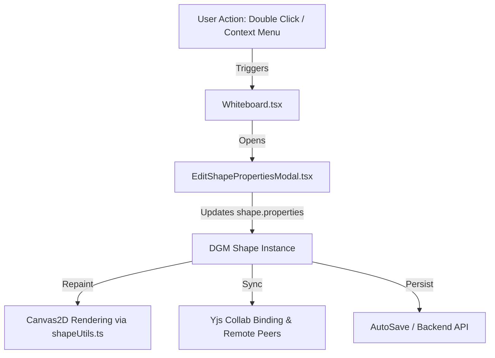

# Requirements

### Overview & Goals
When inserting scripted custom shapes (such as UML Class Diagrams, Database Cylinders, Agile User Story Cards, BPMN gates, or Cloud Architecture blocks) from the Shape Library onto the whiteboard canvas:
1. **Selection & Movement Issue:** Users cannot click, select, drag, or resize the inserted shapes because their visual rendering is displaced from their underlying DGM hitbox.
2. **Content Editing Issue:** Users cannot change or update the parametric content / properties (e.g., class names, attributes, methods, story titles, points, database names, labels) displayed on scripted shapes.

The goal of this plan is to correct the coordinate transformation in the Canvas2D scripted shape rendering pipeline and provide an intuitive property editing interface accessible via context menu and double-click.

### Scope
- **In Scope:**
  - Fixing canvas context translation in `setupScriptedShapeRendering` in `src/main/webui/src/lib/shapeUtils.ts`.
  - Creating `EditShapePropertiesModal.tsx` for viewing and modifying parametric shape properties (`shape.properties`).
  - Adding "Edit Content" / "Configure Properties" to `ShapeContextMenu.tsx`.
  - Enabling double-click trigger on scripted/parametric shapes in `Whiteboard.tsx` to launch the property editor modal.
  - Ensuring changes are properly persisted, synchronized with Yjs collaboration, and covered with automated tests.
- **Out of Scope:**
  - Redesigning unrelated DGM core shape types (freehand, text, basic rectangle/ellipse without scripts).
  - Modifying backend shape library REST endpoints (backend persistence schema already supports `script` and `properties`).

### User Stories
- **As a whiteboard user**, I want to click and drag scripted stencil shapes immediately after inserting them so that I can position and layout my diagrams freely.
- **As a whiteboard user**, I want to double-click or right-click a scripted stencil (e.g., UML Class, User Story Card, Database Cylinder) to edit its text and properties so that the stencil reflects my actual domain model.
- **As a collaborator**, I want property updates made by other users on scripted shapes to synchronize in real time on my screen.

### Functional Requirements
- **FR-1:** Scripted shape rendering must draw precisely at local origin `(0, 0)` within the DGM shape bounding box, ensuring DGM hit detection and transform bounding boxes overlap with the rendered visual.
- **FR-2:** Right-clicking on any scripted or parametric shape must show an "Edit Content" option in `ShapeContextMenu`.
- **FR-3:** Double-clicking on a scripted shape on the canvas must open `EditShapePropertiesModal`.
- **FR-4:** `EditShapePropertiesModal` must parse `shape.properties` into appropriate editable inputs (text fields for strings/numbers, textarea/tag lists for array properties like UML attributes/methods, key-value editor for custom properties).
- **FR-5:** Saving property changes must update `shape.properties`, trigger `editor.repaint()`, broadcast changes via Yjs collaboration, and trigger auto-save.

# Technical Design

### Current Implementation
- `src/main/webui/src/lib/shapeUtils.ts`:
  - `setupScriptedShapeRendering` overrides `Shape.prototype.draw`.
  - Inside `Shape.prototype.draw`, `this.localTransform(canvas)` already applies the transformation matrix placing origin `(0, 0)` at `(shape.left, shape.top)`.
  - However, line 78 calls `ctx.translate(left, top)` inside the local coordinate frame, displacing all canvas drawing operations by an additional `(left, top)`.
  - Consequently, the shape appears visually at `(2 * left, 2 * top)`, while DGM selection/pointer hit testing occurs at `(left, top)`.
- `src/main/webui/src/components/ShapeContextMenu.tsx`:
  - Contains actions for Z-order, color presets, text styling, rotation, locking, grouping, line endpoints, stencil saving, and voting.
  - Lacks an action to edit shape properties or parametric content.
- `src/main/webui/src/components/Whiteboard.tsx`:
  - Double-click on canvas defaults to DGM's inline TipTap text editor, which only updates `shape.text` and does nothing for scripted shapes that rely on `shape.properties`.

### Key Decisions
1. **Coordinate Alignment:**
   - Eliminate `ctx.translate(left, top)` from `Shape.prototype.draw` in `shapeUtils.ts`.
   - Drawing scripts in `prebuiltStencils.ts` already draw relative to `(0, 0)` with dimensions `(shape.width, shape.height)`. Using local origin `(0, 0)` ensures 100% alignment between DGM bounding boxes and Canvas2D rendering.
2. **Dedicated Property Modal vs Inline Overlay:**
   - Scripted shapes often contain complex structured properties (e.g., UML class with attributes array and methods array; User Story with persona, goal, and story points; Cloud bucket with region and access tier).
   - A dedicated `EditShapePropertiesModal` modal provides clean, robust editing for multi-field objects, arrays, and custom key-value pairs without cluttering the canvas overlay.
3. **Trigger Mechanism:**
   - Support both double-click on canvas (when a scripted shape is active/selected) and an explicit context menu action ("Edit Content / Properties").

### Components & File Structure
- **Modified Files:**
  - `src/main/webui/src/lib/shapeUtils.ts`: Fix `Shape.prototype.draw` coordinate translation.
  - `src/main/webui/src/components/ShapeContextMenu.tsx`: Add "Edit Content / Properties" menu item.
  - `src/main/webui/src/components/Whiteboard.tsx`: Integrate `EditShapePropertiesModal`, add double-click detection for scripted shapes, wire save handler to repaint & Yjs sync.
  - `src/main/webui/src/lib/shapeUtils.test.ts`: Add tests for local transform alignment.
  - `src/main/webui/src/components/Whiteboard.test.tsx`: Add integration tests for selecting, moving, and editing scripted shapes.
- **New Files:**
  - `src/main/webui/src/components/EditShapePropertiesModal.tsx`: Modal component for editing shape properties.
  - `src/main/webui/src/components/EditShapePropertiesModal.test.tsx`: Unit tests for modal editing and validation.

### Architecture Diagram

# Testing

### Validation Approach
Verify fixes using automated Vitest unit and integration test suites:

### Key Scenarios
1. **Hit Testing & Movement:**
   - Verify that instantiating a scripted shape at coordinate `(x, y)` renders at local `(0, 0)` within the transformed canvas context.
   - Verify that selecting the shape at `(x, y)` selects the shape and dragging updates `left` and `top` coordinates correctly without displacement.
2. **Property Editing via Modal:**
   - Render `EditShapePropertiesModal` with a scripted shape (e.g. UML Class Box containing `className`, `attributes`, `methods`).
   - Modify fields in the modal and click "Apply Changes".
   - Verify that `shape.properties` are updated with the new values and `editor.repaint()` is called.
3. **Context Menu & Double-Click Triggers:**
   - Verify that right-clicking a scripted shape shows the "Edit Content / Properties" option in `ShapeContextMenu`.
   - Verify that clicking the menu item or double-clicking the scripted shape opens the property editing dialog.
4. **Persistence & Collab Sync:**
   - Verify that edited properties survive `serializeDocWithCustomData` and `restoreDocCustomData`.
   - Verify that remote Yjs clients receive updated `shape.properties`.

### Test Files
- `src/main/webui/src/lib/shapeUtils.test.ts`: Test `executeShapeScript` and `Shape.prototype.draw` coordinate behavior.
- `src/main/webui/src/components/EditShapePropertiesModal.test.tsx`: Test form fields, array conversion, custom properties, and save callback.
- `src/main/webui/src/components/ShapeContextMenu.test.tsx`: Test presence and invocation of property editing action.
- `src/main/webui/src/components/Whiteboard.test.tsx`: Integration test for drop, selection, move, and property editing.

# Delivery Steps

### ✓ Step 1: Fix coordinate transformation and hit testing in scripted shape rendering
Fix the coordinate origin and hit-testing alignment for scripted shapes rendered via HTML5 Canvas2D scripts.

- Update `setupScriptedShapeRendering` in `src/main/webui/src/lib/shapeUtils.ts` to remove the redundant `ctx.translate(left, top)` call inside `Shape.prototype.draw`.
- Ensure the canvas context origin `(0, 0)` is strictly aligned with the local coordinate frame established by DGM's `this.localTransform(canvas)`.
- Verify bounding box bounds (`width`, `height`) and fallback drawing boundaries for scripted stencils.
- Add and update unit tests in `src/main/webui/src/lib/shapeUtils.test.ts` to verify that scripted shape drawing does not double-translate coordinates and that hit test coordinates match rendered shapes.

### ✓ Step 2: Implement EditShapePropertiesModal component
Create a dedicated dialog modal allowing users to inspect and update parametric properties on scripted shapes.

- Create `src/main/webui/src/components/EditShapePropertiesModal.tsx` supporting dynamic editing of `shape.properties` (strings, arrays/multiline text, numbers, booleans, and key-value pairs).
- Implement field validation, auto-detection of common property schema fields (e.g. UML class name/attributes/methods, User Story persona/goal/points, Database title/subtitle, BPMN events/tasks, UI components), and ability to add custom property keys.
- On save, apply updated properties to the DGM shape instance, trigger canvas repaint via `editor.repaint()`, synchronize changes to Yjs collaborative document via `binding.syncEditorToYjs()`, and trigger board auto-save.
- Add unit tests in `src/main/webui/src/components/EditShapePropertiesModal.test.tsx` verifying property rendering, editing, and submission.

### ✓ Step 3: Wire double-click and context menu triggers into Whiteboard canvas
Integrate the shape property editor into the canvas interactions, context menu, and toolbar.

- Add an "Edit Content / Properties" action item with an appropriate icon (e.g., `Sliders` or `FileEdit`) to `src/main/webui/src/components/ShapeContextMenu.tsx` when a shape with `script` or `properties` is selected.
- Wire double-click canvas events in `src/main/webui/src/components/Whiteboard.tsx` to automatically open `EditShapePropertiesModal` when a scripted or parametric shape is active.
- Ensure selection state, undo/redo history, and collaborative synchronization properly reflect property updates across active peers.
- Add integration tests in `src/main/webui/src/components/Whiteboard.test.tsx` and `src/main/webui/src/components/ShapeContextMenu.test.tsx` covering selection, dragging, and content editing of library scripted shapes.