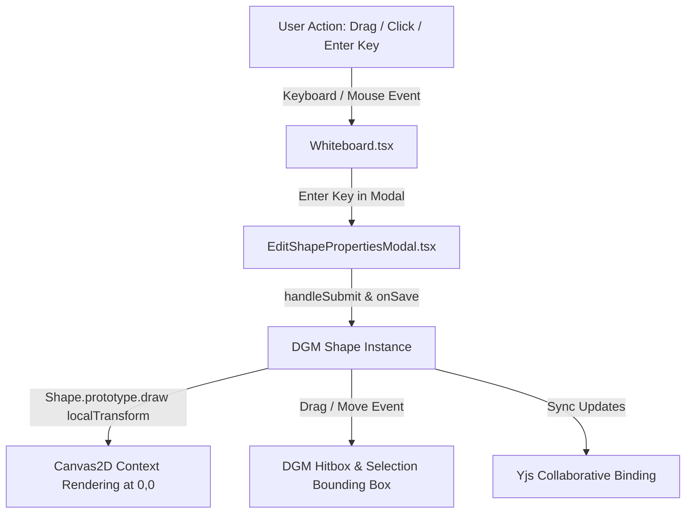

# Requirements

### Overview & Goals
When inserting scripted custom shapes (such as UML Class Diagrams, Database Cylinders, Agile User Story Cards, BPMN gates, or Cloud Architecture blocks) from the Shape Library onto the whiteboard canvas:
1. **Enter Key Modal Confirmation:** When editing shape properties in `EditShapePropertiesModal`, pressing the `Enter` key should immediately submit the form, apply the updated properties to the shape, repaint the canvas, and close the modal.
2. **Shape Selection & Movement:** Scripted shapes cannot currently be clicked, dragged, or moved on the canvas because Canvas2D rendering in `Shape.prototype.draw` applied a redundant `ctx.translate(left, top)` on top of DGM's `this.localTransform(canvas)`, displacing the rendered shape from its DGM hitbox.

The goal of this plan is to ensure seamless property editing with keyboard shortcuts (`Enter` to submit, `Escape` to cancel) and restore direct shape movement and selection by aligning the local Canvas2D drawing context with DGM's local coordinate frame.

### Scope
- **In Scope:**
  - Updating `src/main/webui/src/components/EditShapePropertiesModal.tsx` to handle `Enter` key presses across inputs (and `Ctrl+Enter` / `Meta+Enter` in multiline textareas) to submit the modal, update `shape.properties`, and close the dialog.
  - Updating `src/main/webui/src/lib/shapeUtils.ts` in `Shape.prototype.draw` to remove redundant context translations, ensuring Canvas2D scripts drawing at `(0, 0)` align with the DGM hitbox and selection frame.
  - Ensuring shape dimensions (`width`, `height`, `rect`) and drag/movement handlers in `Whiteboard.tsx` properly move and update scripted shapes.
  - Updating unit and integration tests in `EditShapePropertiesModal.test.tsx`, `shapeUtils.test.ts`, and `Whiteboard.test.tsx`.
- **Out of Scope:**
  - Modifying backend shape library REST endpoints or database schemas.
  - Altering core DGM primitive shapes (such as basic rectangles or freehand paths without scripts).

### User Stories
- **As a whiteboard user**, I want to press `Enter` while editing properties in `EditShapePropertiesModal` so that I can quickly confirm my changes and close the modal without having to reach for the mouse.
- **As a whiteboard user**, I want to click and drag scripted stencil shapes on the canvas so that I can freely reposition and organize diagrams.
- **As a collaborator**, I want property updates and shape movements made on scripted shapes to synchronize in real time with all active participants.

### Functional Requirements
- **FR-1:** Pressing the `Enter` key in any property input inside `EditShapePropertiesModal` must trigger `handleSubmit`, save `shape.properties`, invoke `onSave(result)`, and close the dialog.
- **FR-2:** Pressing `Ctrl+Enter` or `Meta+Enter` inside multiline array textareas in `EditShapePropertiesModal` must also submit and save the modal.
- **FR-3:** `Shape.prototype.draw` must rely on DGM's `this.localTransform(canvas)` to place the origin at the shape's local `(0, 0)`, eliminating double translation so the visual shape directly overlaps its DGM hitbox `[left, top]` to `[left + w, top + h]`.
- **FR-4:** Scripted shapes must be fully selectable, draggable, movable, and resizable on the whiteboard canvas via DGM pointer interactions.
- **FR-5:** Saving property changes via `Enter` or the "Apply Changes" button must trigger `editor.repaint()`, collaborative Yjs synchronization, and auto-save.

# Technical Design

### Current Implementation
- `src/main/webui/src/components/EditShapePropertiesModal.tsx`:
  - The modal rendered a `
` container with input fields and an "Apply Changes" `<button type="button" onClick={handleSubmit}>`.
  - Pressing `Enter` in input fields does not trigger `handleSubmit` because there is no `<form>` element wrapping the controls or `onKeyDown` listener.
- `src/main/webui/src/lib/shapeUtils.ts`:
  - `Shape.prototype.draw` called `this.localTransform(canvas)` and subsequently called `ctx.translate(left, top)`.
  - Since `this.localTransform(canvas)` already transforms the canvas context to the shape's position, the additional `ctx.translate(left, top)` translated the context by an extra `(left, top)`.
  - Consequently, the shape appeared visually at `(2 * left, 2 * top)` while the DGM hitbox remained at `(left, top)`, preventing users from clicking, dragging, or moving the shape at its visible position.

### Key Decisions
1. **Enter Key Form Submission in Modal:**
   - Wrap the modal body and controls in a `<form onSubmit={handleSubmit} onKeyDown={handleKeyDown}>`.
   - On `Enter` in single-line inputs (`text`, `number`, `checkbox`, custom property inputs), prevent default reload and call `handleSubmit`.
   - On `Ctrl+Enter` or `Meta+Enter` in multiline textareas, trigger `handleSubmit`.
   - On `Escape`, invoke `onClose()`.
2. **Local Coordinate Alignment in Canvas2D Drawing:**
   - Remove `ctx.translate(left, top)` from `Shape.prototype.draw` in `shapeUtils.ts`.
   - Drawing scripts in `prebuiltStencils.ts` draw starting at local `(0, 0)` with dimensions `(shape.width, shape.height)`. Relying solely on `this.localTransform(canvas)` ensures 100% alignment between the visual rendering and DGM hit testing / dragging.
3. **Shape Property & Bounds Synchronization:**
   - Ensure `width` and `height` getters/properties and `rect` bounds on DGM shape instances remain consistent during insertion, dragging, and resizing.

### Components & File Structure
- **Modified Files:**
  - `src/main/webui/src/components/EditShapePropertiesModal.tsx`: Add form submission and keyboard handlers for `Enter` and `Escape`.
  - `src/main/webui/src/lib/shapeUtils.ts`: Remove redundant `ctx.translate` in `Shape.prototype.draw`.
  - `src/main/webui/src/components/EditShapePropertiesModal.test.tsx`: Test `Enter` key submission and property updates.
  - `src/main/webui/src/lib/shapeUtils.test.ts`: Verify `Shape.prototype.draw` executes at local origin without double translation.
  - `src/main/webui/src/components/Whiteboard.test.tsx`: Verify shape selection, dragging/moving, and property saving.

### Architecture Diagram

# Testing

### Validation Approach
Verify fixes using automated Vitest unit and integration test suites:

### Key Scenarios
1. **Enter Key Modal Confirmation:**
   - Open `EditShapePropertiesModal` with a scripted shape.
   - Modify a text/number field and press `Enter`.
   - Verify `handleSubmit` is called, `onSave` receives updated properties, and `onClose` is triggered.
   - In a multiline textarea, verify `Enter` creates a newline while `Ctrl+Enter` / `Meta+Enter` submits the form.
2. **Shape Selection & Dragging / Movement:**
   - Instantiate a scripted shape at coordinate `(x, y)` with dimensions `(w, h)`.
   - Verify that `Shape.prototype.draw` renders at local `(0, 0)` without double translation.
   - Verify that clicking and dragging the shape at `(x, y)` moves the shape's bounds `[left, top]` and re-renders at the new position.
3. **Persistence & Collaborative Sync:**
   - Verify that updated properties and new shape coordinates are synchronized to Yjs and persisted in auto-save.

### Test Files
- `src/main/webui/src/components/EditShapePropertiesModal.test.tsx`: Test `Enter` key submission and property updating.
- `src/main/webui/src/lib/shapeUtils.test.ts`: Test `executeShapeScript` and `Shape.prototype.draw` coordinate alignment.
- `src/main/webui/src/components/Whiteboard.test.tsx`: Integration test for selecting, dragging/moving, and editing scripted shapes.

# Delivery Steps

### ✓ Step 1: Implement Enter key submission in EditShapePropertiesModal
Enable modal confirmation and shape property updates when pressing the `Enter` key.

- Wrap modal form elements in a `<form onSubmit={handleSubmit} onKeyDown={handleKeyDown}>` inside `src/main/webui/src/components/EditShapePropertiesModal.tsx`.
- Handle `Enter` key press on single-line inputs and custom property controls to validate and submit changes, invoke `onSave(result)`, and close the dialog.
- Support `Ctrl+Enter` / `Meta+Enter` in multiline array textareas and `Escape` to close without saving.
- Add unit tests in `src/main/webui/src/components/EditShapePropertiesModal.test.tsx` verifying keyboard submission.

### ✓ Step 2: Fix Canvas2D coordinate alignment to enable shape movement and selection
Remove redundant coordinate translation in `Shape.prototype.draw` so scripted shapes can be selected, dragged, and moved.

- Remove `ctx.translate(left, top)` from `Shape.prototype.draw` in `src/main/webui/src/lib/shapeUtils.ts` so Canvas2D drawing scripts render at local `(0, 0)` within DGM's transformed frame.
- Ensure bounding dimensions and `rect` properly correspond to the shape's position on the canvas.
- Update unit tests in `src/main/webui/src/lib/shapeUtils.test.ts` to assert that drawing scripts execute without double translation.
- Update integration tests in `src/main/webui/src/components/Whiteboard.test.tsx` to verify selecting, moving/dragging, and updating scripted shapes.