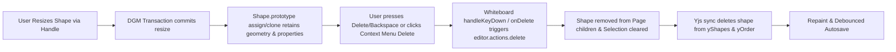

# Requirements

### ✓ Step 1: Fix Shape.prototype.assign and prototype hooks in shapeUtils.ts
### ✓ Step 2: Implement Delete/Backspace handling in Whiteboard.tsx and Delete action in ShapeContextMenu.tsx
### ✓ Step 3: Add tests and verify shape deletion after resize across the test suite

### Overview & Goals
When a shape on the whiteboard canvas is resized by dragging its manipulator handles, users are currently unable to delete that shape (either using the Delete/Backspace keyboard keys or context actions) until the page is reloaded. The goal is to ensure shapes remain immediately deletable following resize transactions without requiring a board refresh.

### Scope
- **In Scope:**
  - Fix `Shape.prototype.assign` and `Shape.prototype.clone` in `shapeUtils.ts` to properly delegate to existing implementations or `Object.assign` without obstructing standard shape mutation and transaction lifecycle.
  - Implement explicit `Delete` and `Backspace` key handling in `Whiteboard.tsx` (`handleKeyDown`) to guarantee deletion of selected shapes even when canvas focus shifts during handle dragging.
  - Add a dedicated "Delete" action (`Trash2` icon) in `ShapeContextMenu.tsx` allowing users to delete shapes directly via right-click context menu.
  - Ensure deletion transactions properly remove shapes from the active DGM page, clear selection, synchronize deletions to Yjs (`yShapes.delete`), and trigger debounced autosave.
  - Add unit and integration tests verifying shape deletion after resize operations via keyboard and context menu.
- **Out of Scope:**
  - Modifying `@dgmjs/core` library code directly.
  - Changing backend snapshot or database entity structures.

### User Stories
- As a whiteboard user, I want to resize any standard or scripted shape and immediately press `Delete` or `Backspace` to remove it from the canvas without having to refresh the page.
- As a whiteboard user, I want to right-click on any selected shape after resizing it and choose "Delete" from the context menu to remove it.
- As a whiteboard collaborator, I want deletions of resized shapes to immediately synchronize to all connected peers and persist across reloads.

### Functional Requirements
- **Post-Resize Deletability:** Resizing any shape (standard rectangle, ellipse, line, frame, or custom scripted shape) must not break subsequent deletion actions.
- **Keyboard Shortcut Deletion:** Pressing `Delete` or `Backspace` when one or more shapes are selected must delete them from the canvas, unless the user is typing in a text field, textarea, or contentEditable element.
- **Context Menu Deletion:** Right-clicking any shape on the canvas must display a "Delete" action in `ShapeContextMenu` that removes the target or selected shapes.
- **State Synchronization:** Deleting a shape after resizing must update `page.children`, remove the shape ID from `yShapes` and `yOrder` in Yjs, repaint the canvas, and save the updated board state.

# Technical Design

### Current Implementation
1. In `shapeUtils.ts`, `setupScriptedShapeRendering()` hooked `Shape.prototype.assign` and `Shape.prototype.clone`. In `Shape.prototype.assign`, if `originalAssign` was undefined on `Shape.prototype`, it fell back to returning `this` without assigning properties from `other`. This prevented DGM transactions or command reversions from copying geometry properties properly.
2. In `Whiteboard.tsx`, `handleKeyDown` only handled `Escape` and `Cmd/Ctrl+K`. It did not intercept `Delete` or `Backspace`. Deletion was left entirely to DGM's internal canvas keydown listener, while `handleWindowKeyUp` only recorded an autosave intent without calling `editor.actions.delete()`.
3. If canvas focus was lost or unlinked during manipulator handle drag, DGM's internal key listener did not fire, causing `Delete` / `Backspace` keypresses to be ignored until page reload.
4. `ShapeContextMenu.tsx` had no "Delete" option, leaving users with no alternative way to remove shapes if keyboard events were not captured.

### Key Decisions
- **Robust Prototype Hooking in `shapeUtils.ts`:** Update `Shape.prototype.assign` so that if `originalAssign` is not a function, it delegates to `Object.assign(this, other)`. Ensure `Shape.prototype.clone`, `toJSON`, and `fromJSON` cleanly preserve all shape properties and custom data without interfering with DGM core operations.
- **Explicit KeyDown Interception in `Whiteboard.tsx`:** In `handleKeyDown`, check if `e.key === 'Delete' || e.key === 'Backspace'`. When active target is not an input/textarea/contentEditable, query `editor.selection.getShapes()`. If shapes are selected, prevent default, call `editor.actions.delete(selected)` (with transaction fallback `tx.delete(shape)`), deselect, repaint, sync to Yjs, and autosave.
- **Context Menu Delete Action:** Add `onDelete` prop to `ShapeContextMenu.tsx` with a red trash icon and label. Wire `onDelete` in `Whiteboard.tsx` to delete the context menu shapes or active selection.

### Architecture Diagram

### Components and File Changes
- `src/main/webui/src/lib/shapeUtils.ts`:
  - Fix `Shape.prototype.assign` to fallback to `Object.assign(this, other)` when `originalAssign` is undefined.
  - Guard prototype lifecycle hooks to maintain shape structure and manipulation state.
- `src/main/webui/src/components/Whiteboard.tsx`:
  - Add `Delete` and `Backspace` handling in `handleKeyDown` to invoke `editor.actions.delete()` on selected shapes.
  - Implement `handleDeleteSelectedShapes` helper supporting both keyboard and context menu invocations.
  - Pass `onDelete` callback to `ShapeContextMenu`.
- `src/main/webui/src/components/ShapeContextMenu.tsx`:
  - Add `onDelete?: () => void` to `ShapeContextMenuProps`.
  - Render a Delete action button (`Trash2` icon) in the context menu actions list.
- `src/main/webui/src/lib/shapeUtils.test.ts` & `src/main/webui/src/components/Whiteboard.test.tsx` & `src/main/webui/src/components/ShapeContextMenu.test.tsx`:
  - Add unit and integration tests verifying shape deletion after resize operations.

# Testing

### Validation Approach
Automated testing with Vitest verifying:
1. `shapeUtils.test.ts`: `Shape.prototype.assign` correctly copies properties from source objects when `originalAssign` is undefined.
2. `ShapeContextMenu.test.tsx`: Delete action renders in context menu and invokes `onDelete`.
3. `Whiteboard.test.tsx`: Shapes can be deleted via Delete/Backspace keyboard keys and context menu immediately following resize operations.

### Key Scenarios
- **Post-Resize Keyboard Deletion:** Insert a shape, simulate resize (width/height change and transaction), press Delete key, verify shape is deleted from editor page and Yjs map.
- **Post-Resize Context Menu Deletion:** Insert a shape, simulate resize, open context menu, click Delete, verify shape is removed.
- **Input Field Protection:** Verify that pressing Delete/Backspace inside text input or textarea does not delete shapes from canvas.
- **Collaborative Sync on Deletion:** Verify that deleting a resized shape updates Yjs state map (`yShapes.delete`) and triggers autosave.

### Test Changes
- `src/main/webui/src/lib/shapeUtils.test.ts`: Verify `Shape.prototype.assign` copies properties with standard `Object.assign` semantics.
- `src/main/webui/src/components/ShapeContextMenu.test.tsx`: Add test verifying Delete button interaction.
- `src/main/webui/src/components/Whiteboard.test.tsx`: Add test verifying shape deletion after resize operations via keyboard and context menu.