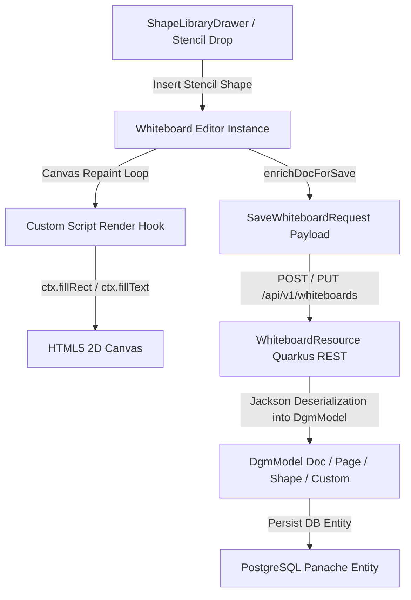

# Requirements

### Overview & Goals
When saving a whiteboard containing scripted shapes (e.g. from the Shape Library or custom stencils), the backend rejects the request with `400 Bad Request` because Jackson cannot deserialize `properties` (which is a JSON Map/Object on custom stencils) into a `List`. In addition, scripted shapes currently display as blank/empty boxes on the canvas because DGM’s rendering pipeline does not execute the custom Canvas2D drawing scripts.

The goal is to:
1. Fix backend DGM data models to accept arbitrary `properties` payloads (Maps or Lists), `script` strings, and `Custom` shape types.
2. Enable custom Canvas2D script rendering in the frontend DGM canvas pipeline so scripted stencils (UML class boxes, database cylinders, UI switches, BPMN nodes, etc.) render their visual content accurately.

---

### Scope
#### In Scope
- **Backend Model Fix (`DgmModel.kt`):** Update `Shape.properties` to `Any?`, add `Shape.script: String?`, and add `@JsonSubTypes` support for `Custom`.
- **Frontend Canvas Rendering (`Whiteboard.tsx`, `shapeUtils.ts`):** Hook custom script execution into DGM's shape drawing lifecycle so `(ctx, shape)` scripts render into `canvas.context`.
- **Persistence & Synchronization:** Verify that `saveToJSON`, `loadFromJSON`, autosave, and Yjs collaboration correctly retain `script` and `properties`.
- **Automated Tests:** Add backend Jackson serialization tests and frontend rendering/persistence tests.

#### Out of Scope
- Redesigning existing prebuilt stencils or adding new stencil libraries.
- Changing whiteboard access permissions or template workflows.

---

### User Stories
- **As a whiteboard author**, I want to drop scripted shapes (like UML class diagrams or cloud infrastructure nodes) onto the board so that they display rich visual components with headers, compartments, and icons.
- **As a whiteboard author**, I want to save a whiteboard containing scripted stencils without receiving a `400 Bad Request` error.
- **As a collaborator**, I want scripted shapes to remain visible and interactive across page reloads and collaborative sessions.

---

### Functional Requirements
1. **Backend Request Validation & Persistence:**
   - The backend `/api/v1/whiteboards/{id}` endpoint must accept `SaveWhiteboardRequest` with shape nodes having object-shaped `properties` (e.g., `{"className": "UserAccount", "methods": [...]}`).
   - `Doc` JSON deserialization must support `type: "Custom"` and single-string `script` properties without dropping attributes.
2. **Frontend Canvas2D Script Execution:**
   - When a shape with a `script` property is rendered on the DGM canvas, its drawing script must execute against the 2D rendering context.
   - Drawing scripts must receive the standard arguments `(ctx, shape)` with access to `shape.width`, `shape.height`, `shape.fillColor`, `shape.strokeColor`, and `shape.properties`.
   - If script execution throws an error, the shape must gracefully fall back to default rectangle rendering without crashing the editor.
3. **State Retention:**
   - Stencil insertion, document serialization (`enrichDocForSave`), and deserialization (`restoreDocCustomData`) must preserve `script` and `properties` attributes.

# Technical Design

### Current Implementation
- In `DgmModel.kt`:
  - `Shape.properties` is declared as `var properties: MutableList<Any>? = null`.
  - When the frontend serializes a scripted shape with `properties: { className: "UserAccount" }`, Jackson fails to bind the JSON object to a `MutableList`, producing `400 - Bad Request` (`attributeName: "content.children[0].children[0].properties", value: null`).
  - `Shape` only defines `var scripts: MutableList<Any>? = null`, missing the singular `var script: String? = null` used by stencil definitions.
  - `Obj` polymorphic hierarchy does not include `Custom` in `@JsonSubTypes`.
- In `Whiteboard.tsx` and `shapeUtils.ts`:
  - `instantiateStencilShapes` and `handleInsertStencil` attach `script` and `properties` to in-memory shape objects.
  - `@dgmjs/core`'s internal `renderDefault` does not know how to interpret JavaScript Canvas2D draw scripts (`function draw(ctx, shape)`).
  - As a result, shapes render as empty default rectangles.

---

### Key Decisions
1. **Model Flexibility in `DgmModel.kt`:**
   - Declare `Shape.properties` as `Any?` to support both structured key-value maps (`Map<String, Any>`) used by custom stencils and potential list-based property arrays from standard DGM documents.
   - Add `var script: String? = null` to `Shape` to allow direct serialization of draw script functions/strings.
   - Add `open class Custom : Box()` to support explicit `type: "Custom"` shape instances.
2. **Canvas2D Script Execution in DGM Lifecycle:**
   - Hook into DGM's shape draw pipeline (`Shape.prototype.draw` / custom drawing wrapper) during editor initialization.
   - When `this.script` is present, evaluate and execute the script against `canvas.context` inside the shape's local transformed coordinate system (`this.localTransform(canvas)`), providing the 2D context and shape metadata.
   - Wrap script execution in `try-catch` to prevent unhandled script exceptions from disrupting canvas repainting.

---

### Architecture & Component Interaction

---

### File Structure & Changes
- `src/main/kotlin/de/einfloh/floxboard/whiteboard/domain/dgm/DgmModel.kt`:
  - Update `Shape.properties: Any? = null`.
  - Add `Shape.script: String? = null`.
  - Add `Custom` class and `@JsonSubTypes` registration.
- `src/test/kotlin/de/einfloh/floxboard/whiteboard/domain/dgm/DgmModelTest.kt`:
  - Add tests verifying serialization and deserialization of documents with scripted shapes and object properties.
- `src/main/webui/src/lib/shapeUtils.ts`:
  - Enhance script draw hook and coordinate preservation for custom stencils.
- `src/main/webui/src/components/Whiteboard.tsx`:
  - Ensure custom shape creation, drawing script evaluation during repainting, and document enrich/restore lifecycle.
- `src/main/webui/src/components/Whiteboard.test.tsx`:
  - Add tests for scripted shape rendering and persistence.

# Testing

### Validation Approach
Verification will be performed via automated backend and frontend test suites and end-to-end serialization checks.

---

### Key Scenarios
1. **Backend Serialization & Deserialization:**
   - Serialize and deserialize a DGM `Doc` containing a `Custom` shape with `script: "function draw(ctx, shape) { ... }"` and `properties: { "className": "OrderService", "methods": ["+ execute()"] }`.
   - Verify that Jackson correctly populates `Shape.properties` as a `Map` without throwing a 400 Bad Request error.
2. **Frontend Canvas2D Script Execution:**
   - Insert a scripted stencil (e.g., UML Class box, database cylinder, mood meter) onto the whiteboard.
   - Verify that the shape's draw script executes against the 2D canvas context and renders compartments, labels, and borders.
3. **Save and Restore Lifecycle:**
   - Save a whiteboard with scripted shapes to JSON / backend API.
   - Reload the whiteboard and verify that `script` and `properties` are restored onto in-memory DGM objects and repainted.
4. **Resilience on Invalid Scripts:**
   - Provide a shape with a malformed script; verify that error handling catches the exception and falls back to default rectangular bounds without breaking canvas interactions.

---

### Test Changes
- `DgmModelTest.kt`: Add tests verifying deserialization of JSON payloads matching the issue description.
- `Whiteboard.test.tsx` / `shapeUtils.test.ts`: Add test cases validating custom script execution during canvas draw events.

# Delivery Steps

### ✓ Step 1: Fix Backend DGM Serialization for Scripted Shapes and Properties
Resolve Jackson deserialization failure when saving whiteboards containing scripted shapes and custom stencil definitions.

- Update `src/main/kotlin/de/einfloh/floxboard/whiteboard/domain/dgm/DgmModel.kt`:
  - Change `Shape.properties` from `MutableList<Any>?` to `Any?` to allow both JSON objects (`Map<String, Any>`) and list representations.
  - Add `var script: String? = null` to `Shape` to preserve single-function drawing scripts.
  - Register `Custom` in `@JsonSubTypes` and define `open class Custom : Box()`.
  - Add optional `rect: MutableList<MutableList<Double>>? = null` to `Shape` if coordinates are serialized as 2D bounding boxes.
- Add backend unit tests in `DgmModelTest.kt` verifying serialization and deserialization of documents containing scripted and custom shapes with arbitrary property maps and draw scripts.
- Run `./gradlew test` to ensure backend tests pass without regression.

### ✓ Step 2: Implement Custom Script Rendering and Persistence in Whiteboard Frontend
Enable custom Canvas2D rendering for scripted shapes in the whiteboard editor so stencils display rich visual components.

- Update `src/main/webui/src/lib/shapeUtils.ts` and `src/main/webui/src/components/Whiteboard.tsx`:
  - Extend the DGM drawing lifecycle (`Shape.prototype.draw` / custom render hook) to check for shape-level `script` functions or script strings.
  - Execute drawing scripts with the 2D canvas context (`canvas.context`) in the shape's local coordinate space, passing `(ctx, shape)` with access to `shape.properties` and bounding box dimensions.
  - Ensure fallback styling (standard fill and border) is rendered if script execution encounters an error.
  - Ensure `enrichDocForSave` and `restoreDocCustomData` reliably retain and restore `script` and `properties` during document loads, autosaves, and collaborative syncs.
- Update frontend unit and component tests in `Whiteboard.test.tsx` and `shapeUtils.test.ts` to verify scripted shapes render correctly on canvas and persist through save/load cycles.
- Run `npm test` in `src/main/webui` to ensure all frontend tests pass cleanly.