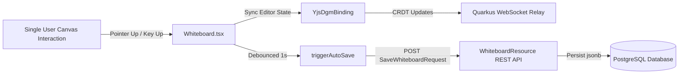

# Requirements

### Overview & Goals
When a user is alone on a whiteboard (single-user scenario), canvas operations such as using the eraser tool, drawing with freehand or marker (highlighter), drawing interactive lines/connectors, moving/repositioning shapes, or deleting shapes (via keyboard or eraser) do not persist to the backend database. Only newly added shapes created via toolbar buttons trigger backend saves. In multi-user sessions, peer updates masked this issue by triggering peer-side auto-saves upon receiving remote messages, whereas single users had no peer save triggers.

The objective is to ensure that all direct user canvas interactions—drawing strokes/lines, erasing elements, moving/transforming shapes, and deleting shapes—reliably synchronize to the Yjs collaboration layer and trigger debounced auto-saving to the backend REST API (`/api/v1/whiteboards`) for both single-user and multi-user sessions.

### Scope
- **In Scope:**
  - Hooking canvas pointer completion events (`pointerup`) to synchronize DGM editor state to Yjs and schedule debounced backend auto-save.
  - Hooking keyboard deletion events (`Delete`, `Backspace`) and eraser actions to synchronize deletions and trigger backend auto-save.
  - Adjusting the auto-save shape count validation guard in `Whiteboard.tsx` so legitimate user deletions (even erasing all shapes down to 0) persist properly to the backend without being suppressed.
  - Ensuring shape position updates (moving/dragging) synchronize to Yjs and auto-save in single-user sessions.
  - Unit and integration tests covering freehand, marker, eraser, move, and delete synchronization in standalone single-user workflows.

- **Out of Scope:**
  - Backend database schema or REST endpoint changes (the existing `/api/v1/whiteboards` and `/ws/whiteboards/{id}` already support full document payloads and binary CRDT relay).
  - Shape Voting, Presentation Mode, and Live Reactions (which remain separate planned roadmap features).

### User Stories
- **As a solo user working on a whiteboard**, when I draw freehand sketches or marker highlights, I want them to be auto-saved so my changes are not lost when I reload or navigate away.
- **As a solo user**, when I move or reposition shapes on the canvas, I want the updated layout to be saved to the backend automatically.
- **As a solo user**, when I erase strokes/shapes using the eraser or press `Delete`/`Backspace`, I want the deleted items to be removed from the backend database immediately.
- **As any user (solo or collaborating)**, I want consistent, reliable persistence for all canvas manipulation tools regardless of the number of active room participants.

### Functional Requirements
- **FR-1 (Single-User Freehand & Marker Persistence):** Releasing the pointer after drawing with Freehand or Marker (Highlighter) must sync the new stroke shapes to Yjs and trigger debounced auto-save to the backend even when no other users are in the room.
- **FR-2 (Single-User Eraser Persistence):** Erasing shapes or strokes with the Eraser tool must remove the affected shapes from Yjs and trigger debounced auto-save to the backend.
- **FR-3 (Single-User Shape Movement Persistence):** Dragging and repositioning shapes on the canvas must sync updated coordinates/bounds to Yjs and trigger debounced auto-save upon pointer release (`pointerup`).
- **FR-4 (Single-User Keyboard Deletion Persistence):** Deleting selected shapes via `Delete` or `Backspace` keys must remove the shapes from Yjs and trigger debounced auto-save.
- **FR-5 (Zero-Shape Deletion Guard Handling):** When a user erases or deletes all shapes from the canvas, the auto-save guard must recognize this as a deliberate user action and save the empty canvas state to the backend rather than suppressing the save.

### Non-Functional Requirements
- **Efficiency & Responsiveness:** Auto-save should remain debounced (1000ms) and hook to pointer completion (`pointerup`) to avoid flooding the backend with intermediate coordinate frames during active dragging or drawing.
- **Data Integrity:** Prevent race conditions where uninitialized or loading boards overwrite existing saved board content while ensuring intentional user actions are always persisted.

# Technical Design

### Current Implementation
- `Whiteboard.tsx` manages canvas mounting, active tools, DGM editor events, Yjs collaboration binding (`YjsDgmBinding`), and debounced auto-saving (`triggerAutoSave` via `api.saveWhiteboard`).
- `Whiteboard.tsx` currently only invokes `bindingRef.current?.syncEditorToYjs()` and `triggerAutoSave()` inside explicit toolbar button handlers (`handleAddShape`, `handleAddLine`, `handleAddConnector`, `handleAddFrame`, `handleAddText`, `handleColorChange`) and `editor.factory.onCreate`.
- DGM interactive tools (Freehand handler, Highlighter handler, Eraser tool, and pointer-based shape dragging/moving) manipulate the canvas DOM and internal editor store directly upon pointer interactions without going through `editor.factory.onCreate` or `editor.transform.transact`.
- In multi-user sessions, when one user made changes, peer clients received remote Yjs update events (`onRemoteUpdate`) that triggered auto-save from the peer side. In single-user sessions, no peer exists to trigger remote auto-saves, leaving the backend unsaved for all non-toolbar canvas actions.
- `triggerAutoSave()` contains a safety guard (`if (lastSavedShapeCountRef.current > 0 && currentShapeCount === 0 && !isDeliberateClearRef.current)`) that suppresses saving if shape count drops to 0 unless `isDeliberateClearRef.current` is explicitly set.

### Root Cause Analysis
1. **Missing Pointer-Up Interaction Sync:** When users draw with Freehand, highlight with Marker, erase with Eraser, or drag/move shapes, the interaction concludes on `pointerup`. No `pointerup` handler existed on the canvas container/window to trigger `syncEditorToYjs()` and `triggerAutoSave()`.
2. **Missing Keyboard Delete Event Sync:** Deleting shapes via the `Delete` or `Backspace` keys is handled internally by DGM keymap without firing transaction listeners that propagate to Yjs and auto-save.
3. **Single-User Auto-Save Gap:** Because toolbar additions fired `onCreate` while direct canvas interactions did not, single users only saved new shapes. Multi-user rooms masked this because remote update listeners triggered saves on peer clients.
4. **Auto-Save Suppression on Total Deletion:** When all shapes are erased or deleted, `currentShapeCount` becomes 0 while `lastSavedShapeCountRef.current > 0`, causing the auto-save guard to suppress the backend save request.

### Key Decisions
1. **Unified Pointer-Up & Key-Up Interaction Hook:**
   - *Choice:* Bind a `pointerup` listener on the canvas container / window and a `keyup` listener for deletion keys (`Delete`, `Backspace`) in `Whiteboard.tsx` (active only when in edit mode, i.e., `!isViewer`).
   - *Rationale:* Captures all direct canvas manipulations (drawing strokes, eraser sweeps, shape movements, and key deletions) at the moment the interaction completes, guaranteeing reliable saving in single-user mode without degrading performance during continuous pointer movement.
2. **Deliberate Deletion Flagging:**
   - *Choice:* Set `isDeliberateClearRef.current = true` when eraser or keyboard deletion actions are detected so that reducing shapes to zero correctly saves to the backend.
   - *Rationale:* Preserves the safety guard against uninitialized loading races while allowing legitimate user deletions.

### Proposed Changes

#### Frontend Components
1. **`src/main/webui/src/components/Whiteboard.tsx`**:
   - Add a `handlePointerUp` listener on the canvas container and window:
     - Check if editor is ready and user is not in `VIEWER` mode.
     - Call `bindingRef.current?.syncEditorToYjs()` and `triggerAutoSave()`.
   - Add a `handleKeyUp` listener for `Delete` and `Backspace` keys:
     - Check if target is not an input/textarea.
     - If shapes are selected, set `isDeliberateClearRef.current = true`, call `bindingRef.current?.syncEditorToYjs()`, and trigger `triggerAutoSave()`.
   - In `handleMount`, ensure eraser and freehand tool handler completions and any editor change events trigger sync and auto-save.
   - In `triggerAutoSave()`, ensure user-driven deletions down to 0 shapes persist correctly.

2. **`src/main/webui/src/lib/yjs-dgm-binding.ts`**:
   - Ensure `syncEditorToYjs()` accurately captures all shape types (`Freehand`, `Highlighter`, `Line`, `Box`, `Oval`, `Frame`, `Text`), updated origins/dimensions for moved shapes, and deletions from `yShapes` and `yOrder`.

### Architecture Diagram

### Components & File Structure
- `src/main/webui/src/components/Whiteboard.tsx` (modified): Canvas event listeners, pointer-up/key-up sync, single-user auto-save triggers, deliberate clear guard.
- `src/main/webui/src/lib/yjs-dgm-binding.ts` (verified/modified): Document state synchronization to Yjs CRDT maps.
- `src/main/webui/src/lib/yjs-dgm-binding.test.ts` (modified): Additional test coverage for freehand, marker, movement, and deletion sync.

### Risks & Mitigations
- **Over-syncing during continuous drawing/dragging:** Mitigated by attaching sync triggers to `pointerup` (completion of action) rather than `pointermove`.
- **Accidental wipe during board loading:** Mitigated by keeping `isLoadingBoard` guards intact and only setting `isDeliberateClearRef` on explicit user-driven pointer/key interactions.

# Testing

### Validation Approach
Verification will be performed through automated Vitest unit and component test suites in the frontend WebUI testing framework, specifically testing single-user standalone workflows.

### Key Scenarios
1. **Single-User Freehand & Marker Stroke Creation:**
   - Draw a freehand or marker stroke with no other peers connected, release pointer (`pointerup`), verify `yShapes` contains the new stroke with correct type and properties, and verify `api.saveWhiteboard` is called.
2. **Single-User Shape Movement / Repositioning:**
   - Move an existing shape from coordinate `(10, 10)` to `(100, 100)` with no peers connected, trigger pointer-up, verify the updated origin is reflected in `yShapes` and the serialized document payload sent to the backend.
3. **Single-User Eraser Tool Usage:**
   - Erase an existing shape in single-user mode, trigger pointer-up, verify the shape is removed from `yShapes`, `yOrder`, and the document payload sent to the backend.
4. **Single-User Keyboard Deletion (`Delete` / `Backspace`):**
   - Select one or more shapes, trigger `Delete` / `Backspace` keyup event, verify the shapes are deleted from `yShapes` and the backend auto-save payload.
5. **Single-User Complete Board Clear via Deletion/Eraser:**
   - Erase or delete all shapes on a board with existing shapes, verify auto-save is NOT suppressed and sends an empty canvas children list (`children: []`) to the backend.

### Test Changes
- **`src/main/webui/src/lib/yjs-dgm-binding.test.ts`**:
  - Add tests for syncing freehand and highlighter strokes.
  - Add tests for syncing shape movements (origin/bounds changes).
  - Add tests for eraser-driven and key-driven shape deletions.
- **Component tests**:
  - Add test assertions verifying pointer-up and keyup event triggers call `syncEditorToYjs` and `api.saveWhiteboard` in single-user setups.

# Delivery Steps

### ✓ Step 1: Wire canvas pointer and keyboard interaction listeners for drawing, moving, and erasing
Canvas interactions (drawing freehand/marker strokes, erasing, and dragging/moving shapes) and keyboard deletion events reliably trigger Yjs synchronization and auto-save in single-user mode.

- Add a `pointerup` listener on the canvas container and window in `Whiteboard.tsx` to detect the completion of drawing (Freehand, Marker), erasing (Eraser), and shape movement/transformations, triggering `bindingRef.current?.syncEditorToYjs()` and `triggerAutoSave()`.
- Add a `keyup` event listener for `Delete` and `Backspace` keys in `Whiteboard.tsx` that triggers `syncEditorToYjs()` and `triggerAutoSave()` when shapes are deleted via keyboard shortcuts.
- Ensure tool switching and handler completions properly propagate state to the collaboration and auto-save pipelines.

### ✓ Step 2: Fix auto-save suppression guard and ensure complete deletion persistence
Deleting shapes—including deleting all shapes down to zero—persists to the backend without being incorrectly blocked by anti-wipe guards.

- Update the auto-save shape count guard in `Whiteboard.tsx` so that user-driven deletions and erasures (including reducing shape count to 0) set `isDeliberateClearRef.current = true` or allow legitimate user clears while retaining protection against uninitialized board overwrite races.
- Ensure shape context menu actions (such as layering, styling, or deletion) and selection-clearing operations consistently mark deliberate changes and trigger backend persistence.

### ✓ Step 3: Update Yjs binding and add comprehensive frontend unit tests
Unit and binding tests validate synchronization and backend persistence across all drawing, movement, erasure, and deletion scenarios in both single-user and multi-user modes.

- Update `yjs-dgm-binding.test.ts` to add test suites verifying that freehand strokes, highlighter strokes, shape coordinate translations (movement), and shape deletions propagate correctly to Yjs maps.
- Add test cases in `Whiteboard` component tests ensuring pointer-up and keyup events trigger debounced auto-save requests (`api.saveWhiteboard`) with updated shape payloads in single-user sessions.