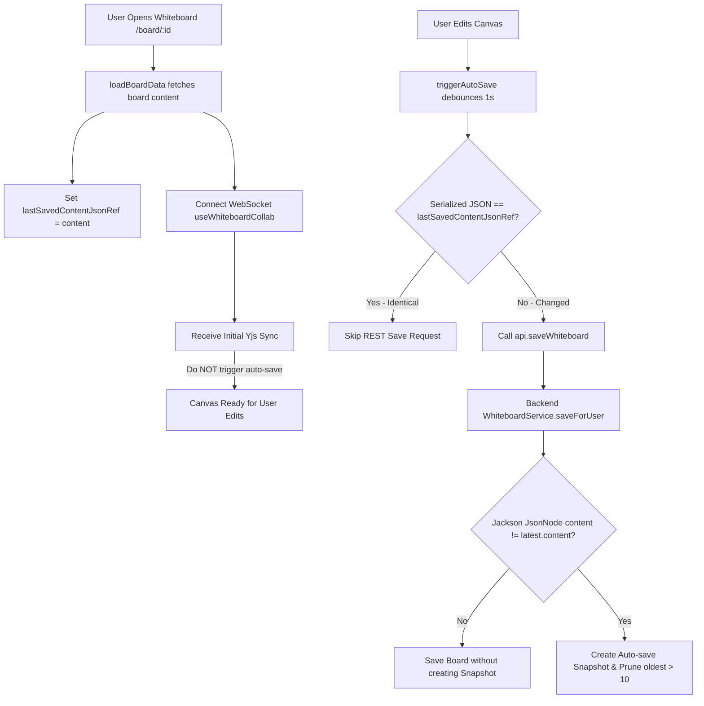

# Requirements

### Overview & Goals
Eliminate unwanted snapshot generation during whiteboard loading and fix the issue where snapshots at the end of the history list cannot be found (404):
1. **Prevent Snapshot Generation on Whiteboard Load & Unchanged Saves**: Ensure opening or loading a whiteboard never triggers auto-saves or generates new auto-save snapshots. Compare content structurally on the backend so saves with identical content do not create redundant snapshots or prune history.
2. **Prevent Remote Sync from Triggering REST Auto-Saves**: Guard collaboration sync (Yjs/WebSocket connection handshake and remote updates) so that connecting or receiving remote state does not trigger redundant REST save requests.
3. **Ensure History Snapshot List Integrity & Clean Up Missing Revisions**: Ensure `WhiteboardSnapshotRepository` prunes and flushes auto-snapshots cleanly in the database, and ensure `HistoryDrawer.tsx` maintains an accurate list of existing snapshots, gracefully purging or filtering any deleted/pruned entries.

### Scope
- **In Scope:**
  - `WhiteboardService.kt`: Implement deep structural equality check using `ObjectMapper` / `JsonNode` comparison before generating auto-save snapshots, preventing duplicate auto-snapshots when content is unchanged.
  - `WhiteboardSnapshot.kt` / `WhiteboardSnapshotRepository`: Ensure auto-snapshot pruning (`pruneAutoSnapshots`) deletes and flushes consistently from the database.
  - `Whiteboard.tsx`: Ensure board loading and collaborative WebSocket connection / initial Yjs sync never invoke `triggerAutoSave()`; track last saved content JSON to skip no-op saves.
  - `yjs-dgm-binding.ts` & `useWhiteboardCollab.ts`: Decouple connection handshake / initial sync from local REST auto-save triggers.
  - `HistoryDrawer.tsx`: Ensure snapshot list queries retrieve accurate records and dynamically clean up stale entries if a snapshot returns 404.
  - Backend & Frontend test suites (`WhiteboardHistoryResourceTest.kt`, `WhiteboardServiceTest.kt`, `Whiteboard.test.tsx`, `HistoryDrawer.test.tsx`).
- **Out of Scope:**
  - Changes to database schema or entity table definitions.
  - Altering the maximum retained auto-snapshot threshold (default 10).

### User Stories
- **As a whiteboard user**, I want to open and view my whiteboard without the system silently creating a new auto-save snapshot or overwriting my version history.
- **As a whiteboard collaborator**, I want to browse the version history and be able to preview every listed snapshot without encountering missing/404 snapshots at the end of the list.
- **As a whiteboard editor**, I want saves to only generate new revision checkpoints when actual diagram changes have occurred.

### Functional Requirements
1. **No Auto-Save or Snapshot Creation on Board Load:**
   - Loading a board from `/board/:id` or `/board` must NOT trigger `api.saveWhiteboard`.
   - Joining a collaborative session and receiving initial Yjs synchronization data must NOT trigger `api.saveWhiteboard`.
2. **Structural Content Equality on Backend:**
   - In `WhiteboardService.saveForUser`, compare incoming `content` with `latest.content` structurally (via Jackson `JsonNode`).
   - If the content is structurally identical, update board metadata (if needed) but do NOT create a new `WhiteboardSnapshot` and do NOT prune existing snapshots.
3. **Reliable Snapshot Listing and 404 Pruning Cleanup:**
   - Backend snapshot pruning must execute cleanly so that `listSnapshots` only returns snapshots that physically exist in the database.
   - Frontend `HistoryDrawer` must automatically refresh or remove stale items if a requested snapshot is not found.

### Non-Functional Requirements
- **Performance & Efficiency:** Reduce unnecessary network traffic and database write load by eliminating redundant REST auto-saves on board load and remote sync.
- **Data Integrity:** Prevent accidental pruning of valid historical milestones caused by rapid duplicate snapshot creation.

# Technical Design

### Current Implementation & Root Cause Analysis
1. **Why a new snapshot is created on load:**
   - **Frontend:** When `Whiteboard.tsx` mounts and loads board data, `useWhiteboardCollab` connects to the WebSocket server. The server sends initial sync packets (`messageType === 0`), causing `useWhiteboardCollab` and `YjsDgmBinding` to trigger `handleRemoteUpdate` -> `triggerAutoSave()`. This fires `api.saveWhiteboard()` 1 second after page load.
   - **Backend:** `Doc` in `DgmModel.kt` is an open class without `equals()` / `hashCode()`. In `WhiteboardService.kt`, `latest.content != content` performs Kotlin reference equality (`!==`), which always evaluates to `true` for newly deserialized objects. As a result, even identical content generates a new `Auto-save vX` snapshot and triggers `pruneAutoSnapshots`.
2. **Why snapshots at the end cannot be found (404):**
   - Because every page load and save generated a new auto-save snapshot, `pruneAutoSnapshots` continuously deleted the oldest auto-snapshots from the database.
   - When the user opened the history drawer, any snapshot that was recently pruned or in-flight during auto-save returned 404 when clicking "Preview".

### Key Decisions
1. **Backend Structural Equality with Jackson `JsonNode`:**
   - Inject `ObjectMapper` into `WhiteboardService`.
   - Compare `objectMapper.valueToTree<JsonNode>(content)` with `objectMapper.valueToTree<JsonNode>(latest.content)`.
   - Only create a new `WhiteboardSnapshot` when `contentNode != latestNode`.
2. **Frontend Load & Remote Sync Guard:**
   - In `Whiteboard.tsx`, maintain `isInitialLoadRef` / `isLoadingBoard` guards so `triggerAutoSave` cannot be called during initial load or WebSocket connection sync.
   - Maintain `lastSavedContentJsonRef` storing the serialized JSON string of the last saved state. In `triggerAutoSave`, if the serialized doc matches `lastSavedContentJsonRef.current`, abort the save without sending an HTTP request.
   - Ensure `handleRemoteUpdate` only syncs local state (e.g. voting tick / custom data) and does not trigger REST `api.saveWhiteboard`.
3. **Clean Pruning & History Synchronization:**
   - Ensure `WhiteboardSnapshotRepository.pruneAutoSnapshots` flushes deletion to the persistence context.
   - In `HistoryDrawer.tsx`, if a snapshot preview or restore returns 404, immediately update local state and re-fetch `api.listSnapshots(boardId)` to ensure the list reflects database reality.

### Components
- **`WhiteboardService.kt`**:
  - Add `ObjectMapper` dependency.
  - Implement `isContentEqual(doc1: Doc?, doc2: Doc?): Boolean` using Jackson `JsonNode` comparison.
  - Only create auto-snapshots when content has genuinely changed.
- **`WhiteboardSnapshot.kt` (`WhiteboardSnapshotRepository`)**:
  - Ensure `pruneAutoSnapshots` properly deletes and flushes old auto-save entities.
- **`Whiteboard.tsx`**:
  - Add `lastSavedContentJsonRef` to avoid saving duplicate document states.
  - Prevent `handleRemoteUpdate` and initial load from invoking `triggerAutoSave()`.
- **`HistoryDrawer.tsx`**:
  - Filter out / auto-refresh missing snapshots if 404 is encountered.

### File Structure
- `src/main/kotlin/de/einfloh/floxboard/whiteboard/domain/WhiteboardService.kt` (Modified)
- `src/main/kotlin/de/einfloh/floxboard/whiteboard/domain/WhiteboardSnapshot.kt` (Modified)
- `src/main/webui/src/components/Whiteboard.tsx` (Modified)
- `src/main/webui/src/components/HistoryDrawer.tsx` (Modified)
- `src/test/kotlin/de/einfloh/floxboard/whiteboard/WhiteboardHistoryResourceTest.kt` (Modified)
- `src/main/webui/src/components/Whiteboard.test.tsx` (Modified)
- `src/main/webui/src/components/HistoryDrawer.test.tsx` (Modified)

### Architecture Diagram

### Risks & Mitigations
- **Risk:** Slight differences in JSON key ordering causing false positives in content comparison.
  - **Mitigation:** Jackson's `JsonNode.equals()` compares JSON objects as unordered key-value maps, ensuring deterministic comparison regardless of key serialization order.
- **Risk:** Auto-save suppressed when shapes are cleared.
  - **Mitigation:** Retain `isDeliberateClearRef` guard so intentional canvas clears are always saved.

# Testing

### Validation Approach
Verify the changes with automated backend and frontend tests:
1. Backend test in `WhiteboardHistoryResourceTest.kt` verifying that saving identical content does NOT create a new snapshot or prune existing snapshots.
2. Frontend unit tests in `Whiteboard.test.tsx` verifying that loading a whiteboard and receiving remote/initial collab sync does NOT call `api.saveWhiteboard`.
3. Frontend unit tests in `HistoryDrawer.test.tsx` verifying 404 recovery and snapshot list integrity.

### Key Scenarios
- **Scenario 1: Board Load Does Not Auto-Save**
  - Mount `Whiteboard` component with an existing board.
  - Fast-forward timers by 5000ms.
  - Assert `api.saveWhiteboard` is never called.
- **Scenario 2: Identical Save Does Not Create Snapshot**
  - Save a whiteboard with `content A`.
  - Save the same whiteboard again with identical `content A` and new board name.
  - Query `/api/v1/whiteboards/{id}/history` and verify snapshot count remains 1.
- **Scenario 3: 404 Snapshot List Recovery**
  - Open history drawer.
  - Trigger preview on a snapshot that returns 404.
  - Verify error message is shown and `api.listSnapshots` is re-fetched.

# Delivery Steps

### ✓ Step 1: Fix backend snapshot deduplication and pruning synchronization
Prevent backend from creating duplicate auto-snapshots when saving identical content and ensure clean pruning in the database.

- Inject `ObjectMapper` into `WhiteboardService.kt` and use Jackson `JsonNode` comparison (`objectMapper.valueToTree`) to check if `content` has changed compared to `latest.content`.
- Only create new `WhiteboardSnapshot` and trigger `pruneAutoSnapshots` when content has actually changed structurally.
- Ensure `WhiteboardSnapshotRepository.pruneAutoSnapshots` properly deletes and flushes old auto-snapshots.
- Add backend test cases in `WhiteboardHistoryResourceTest.kt` verifying that saving identical content does not create extra snapshots or prune history.

### ✓ Step 2: Prevent auto-save on whiteboard load and collaborative sync
Eliminate unwanted REST auto-saves during board initialization, WebSocket connection, and remote sync.

- In `Whiteboard.tsx`, store the serialized JSON string in `lastSavedContentJsonRef` upon loading board data.
- In `triggerAutoSave`, compare current serialized content with `lastSavedContentJsonRef.current` and skip `api.saveWhiteboard` if identical.
- Update `handleRemoteUpdate` and `YjsDgmBinding` so that remote sync packets and connection initialization do not trigger `triggerAutoSave()`.
- Add test cases in `Whiteboard.test.tsx` confirming `api.saveWhiteboard` is not called on initial load or collab sync.

### ✓ Step 3: Enhance snapshot list integrity and resilient 404 handling in HistoryDrawer
Ensure the snapshot drawer presents an accurate list of snapshots and recovers cleanly if any snapshot is deleted.

- Ensure `HistoryDrawer.tsx` fetches snapshots on drawer open and handles 404 responses cleanly with auto-refresh and user notifications.
- Update `HistoryDrawer.test.tsx` and `Whiteboard.test.tsx` to verify end-to-end version history workflows.