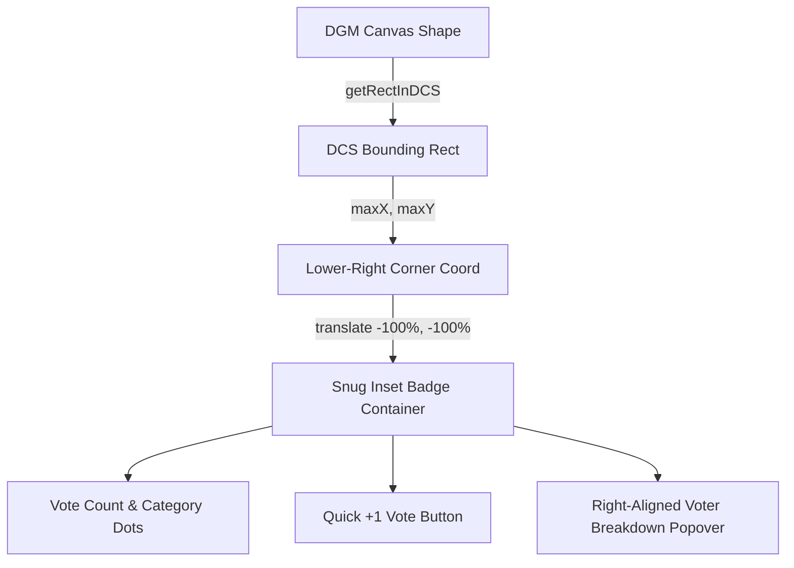

# Requirements

### Overview & Goals
The goal of this change is to eliminate visual detachment and spatial ambiguity by snugly anchoring the in-canvas vote badge directly inside the lower-right corner of referenced shapes:
1. **Snug Lower-Right Anchoring**: Fix the vote badge offset so the badge pill and quick `+1` action button are tucked neatly into the lower-right corner of the shape, rather than centering on the outer corner vertex (which caused half of the badge to float 40–50px outside into canvas whitespace).
2. **Clear Shape Association**: Maintain immediate, unobstructed visual association between sticky notes/diagram shapes and their vote tallies without overlapping adjacent canvas shapes.
3. **Seamless Overlay Interactions**: Keep the category picker dropdown and hover breakdown popovers cleanly aligned to the right edge of the tucked badge.

### Scope
- **In Scope**:
  - `ShapeVoteBadge.tsx`: Update container positioning and CSS transform (`transform: translate(-100%, -100%)` with a clean inner offset/margin) so the badge sits directly inside the lower-right corner of the shape's DCS bounding box.
  - `ShapeVoteBadge.test.tsx`: Update unit test assertions for the container positioning and transform styles.
  - `features/whiteboard-collaboration.md`: Document snug lower-right corner anchoring for `ShapeVoteBadge`.
- **Out of Scope**:
  - Context menu layout and modal configurations (already implemented).
  - CRDT schema or backend WebSocket protocols.

### User Stories
- **As a workshop collaborator**, I want vote badges to sit cleanly inside the bottom-right corner of sticky notes and shapes so that votes clearly belong to the intended shape rather than looking detached or floating into neighboring elements.
- **As a board facilitator**, I want vote indicators and the "+1" action button closely hugged against the bottom-right corner of shapes without obstructing main card text or straying into empty canvas.

### Functional Requirements
- **Snug Lower-Right Inset Positioning**:
  - The badge container is anchored at the shape's lower-right DCS coordinates `(maxX, maxY)`.
  - The container uses `transform: translate(-100%, -100%)` (with optional slight inset spacing) so that the entire badge pill and `+1` button remain tucked within the shape's lower-right quadrant instead of hanging outside.
- **Interactive State Retention**:
  - Hovering reveals the voter breakdown popover anchored cleanly to the right edge.
  - Clicking "+1" opens category selection or casts vote directly if 1 category exists.
  - Locked and quota-exhausted states continue to display and function accurately.

# Technical Design

### Current Implementation
- `ShapeVoteBadge.tsx` (`ShapeVoteItem`):
  - Calculates `screenPos = { x: maxX, y: maxY }`.
  - Applies `transform: 'translate(-50%, -50%)'` on the container style:
    ```tsx
    style={{
      position: 'absolute',
      left: `${screenPos.x}px`,
      top: `${screenPos.y}px`,
      transform: 'translate(-50%, -50%)',
    }}
    ```
  - Because `translate(-50%, -50%)` centers the ~90px-wide container directly on the corner vertex `(maxX, maxY)`, 50% of the badge width (+45px) and 50% of height (+12px) protrude outside the shape into canvas space, making the votes look detached from the shape.

### Key Decisions
- **Inside-Corner Alignment (`translate(-100%, -100%)`)**: Change the CSS transform to `translate(-100%, -100%)` (with a small inner padding/inset like `-4px` or `-6px`, e.g. `transform: 'translate(calc(-100% - 6px), calc(-100% - 6px))'` or `left: screenPos.x - 6, top: screenPos.y - 6` with `translate(-100%, -100%)`). This places the entire badge inside the lower-right corner of the shape, creating an intuitive, snug card-badge appearance.
- **Right-Aligned Popover Anchor**: Keep the voter breakdown popover and category picker dropdown aligned to `right: 0` so they open cleanly relative to the shape's lower-right corner.

### Proposed Changes
1. **`ShapeVoteBadge.tsx`**:
   - Update the container style in `ShapeVoteItem`:
     ```tsx
     style={{
       position: 'absolute',
       left: `${screenPos.x - 6}px`,
       top: `${screenPos.y - 6}px`,
       transform: 'translate(-100%, -100%)',
     }}
     ```
   - Ensure hover interactions, category picker, and breakdown popover remain aligned cleanly and don't drift.
2. **`ShapeVoteBadge.test.tsx`**:
   - Update unit test assertions to verify `translate(-100%, -100%)` and inner-offset coordinates for bottom-right placement.
3. **`features/whiteboard-collaboration.md`**:
   - Update feature documentation noting the snug inside-corner lower-right badge placement.

### Architecture Diagram


### Components
- **`ShapeVoteBadge` & `ShapeVoteItem`**: Container CSS transform and coordinate inset adjustment.
- **`Whiteboard`**: Renders `ShapeVoteBadge` overlay (no interface changes needed).

# Testing

### Validation Approach
Verify through automated unit testing that:
1. Shape vote badge container is anchored snugly in the lower-right corner using `translate(-100%, -100%)` and correct DCS coordinates.
2. Quick vote button and vote tally badge are rendered inside the shape's lower-right area.
3. Category picker and breakdown popover open correctly from the snug anchor position.
4. All Vitest tests pass cleanly with 0 regressions.

### Key Scenarios
- **Snug Lower-Right Positioning**:
  - Mock a shape with `getRectInDCS` returning `[[100, 100], [200, 200]]`.
  - Verify that the container coordinates and transform position the badge tucked inside the lower-right corner.
- **Hover & Popover Behavior**:
  - Verify hover reveals voter breakdown popover.
  - Verify clicking quick "+1" button allows category selection and casts vote.

### Test Changes
- **`src/main/webui/src/components/ShapeVoteBadge.test.tsx`**:
  - Update coordinate and transform assertions to match the snug lower-right positioning.

# Delivery Steps

### ✓ Step 1: Snugly Anchor Shape Vote Badge Inside Shape Lower-Right Corner in ShapeVoteBadge.tsx
Vote badges and quick "+1" buttons are positioned snugly inside the lower-right corner of shapes to eliminate visual detachment and overlap.

- Update `ShapeVoteItem` container styling in `ShapeVoteBadge.tsx` from `translate(-50%, -50%)` to `translate(-100%, -100%)` with an inner offset relative to `(maxX, maxY)`.
- Verify category picker dropdown and hover breakdown popover align seamlessly with the updated lower-right anchor.

### ✓ Step 2: Update Automated Unit Tests, TypeScript Build Types, and Feature Documentation
Unit tests, TypeScript type checks, and feature documentation validate and describe the snug lower-right vote badge positioning and clean build pipeline.

- Update `ShapeVoteBadge.test.tsx` assertions to verify the inside-corner positioning and `translate(-100%, -100%)` transform.
- Fix TypeScript type definitions in `ShapeVoteBadge.tsx`, `Whiteboard.tsx`, and `Whiteboard.test.tsx` so `npm run build` (`tsc && vite build`) passes cleanly without errors.
- Update `features/whiteboard-collaboration.md` to document the snug lower-right placement.
- Run `npm test` and `npm run build` across the frontend to verify 100% clean test and build execution.