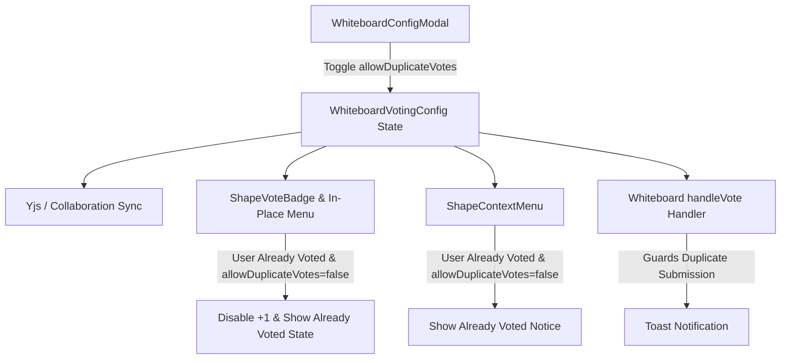

# Requirements

### Overview & Goals
In whiteboard dot-voting sessions, facilitators often want control over whether participants can cast multiple votes on the same shape (e.g., allocating 3 of their 5 total votes to one key idea) or must restrict their votes to at most one vote per shape (forcing distributed voting across multiple distinct ideas).

The goal is to add an **"Allow Duplicate Votes"** toggle in the whiteboard configuration modal (under the **Voting & Facilitation** settings tab) and enforce this restriction across all voting entry points (the in-place shape vote badge, the quick `+1` button, the right-click shape context menu, and the canvas voting handler).

---

### Scope
- **In Scope:**
  - Adding `allowDuplicateVotes?: boolean` to `WhiteboardVotingConfig` in `src/main/webui/src/types/voting.ts` (defaulting to `true` for backwards compatibility).
  - Adding a toggle switch with clear descriptive labels in `WhiteboardConfigModal.tsx` under the Voting & Facilitation tab.
  - Enforcing duplicate vote checks in `ShapeVoteBadge.tsx` (disabling "+1" button and category selection with clear messaging when the user has already voted on the shape).
  - Enforcing duplicate vote checks in `ShapeContextMenu.tsx` (disabling dot-voting category options on shapes where the user has an active vote when duplicate votes are disabled).
  - Enforcing duplicate vote checks and displaying toast feedback in `Whiteboard.tsx` (`handleVote`).
  - Adding and updating comprehensive unit tests in `WhiteboardConfigModal.test.tsx`, `ShapeVoteBadge.test.tsx`, `ShapeContextMenu.test.tsx`, and `Whiteboard.test.tsx`.
- **Out of Scope:**
  - Altering backend persistence schema (the backend stores `votingConfig` dynamically inside `customData` map).
  - Modifying voting session timer or global export formats.

---

### User Stories
- **As a whiteboard facilitator / board owner**, I want to toggle whether duplicate votes are allowed in the board's voting settings so that I can configure voting rules to match our workshop format (e.g., concentrated vs distributed dot-voting).
- **As a workshop participant**, when duplicate votes are disallowed, I want the shape voting menu and context menu to clearly indicate that I have already voted on that shape so that I understand why additional votes cannot be cast.
- **As a workshop participant**, when duplicate votes are disallowed, I want to be able to remove my vote on a shape and cast a vote on another shape (or in a different category) freely.

---

### Functional Requirements
1. **Voting Config Model & Defaults**:
   - `WhiteboardVotingConfig` includes an optional boolean property `allowDuplicateVotes?: boolean`.
   - `DEFAULT_VOTING_CONFIG` sets `allowDuplicateVotes: true` (or defaults to `true` when `undefined`).
2. **Configuration Modal Toggle**:
   - In `WhiteboardConfigModal.tsx` under the **Voting & Facilitation** tab, render an interactive toggle switch for **"Allow Duplicate Votes"** (visible/editable when user has manage permissions).
   - Display a clear title and descriptive subtext explaining the current mode (e.g., "Participants can cast multiple votes on the same shape" when enabled, and "Participants can cast at most one vote per shape" when disabled).
   - Use accessible attributes (`role="switch"`, `aria-checked`, `aria-label="Toggle Allow Duplicate Votes"`).
   - Persist changes through `onUpdateVotingConfig`.
3. **In-Place Shape Vote Badge & Popover Enforcement**:
   - In `ShapeVoteBadge.tsx` (`ShapeVoteItem`):
     - Check if `votingConfig.allowDuplicateVotes === false` and the current user already has at least one vote on the target shape (`votes.some(v => v.userId === currentUserId)`).
     - If duplicate votes are disallowed and the user has already voted:
       - Disable the compact `+1` button with a title tooltip: `"You have already voted on this shape"`.
       - Inside the expanded in-place menu (`vote-breakdown-popover`), render a disabled notice: `"You have already voted on this shape"` instead of actionable category selection buttons.
       - Prevent invoking `onVote` when clicked.
4. **Context Menu Enforcement**:
   - In `ShapeContextMenu.tsx`:
     - When `votingConfig?.allowDuplicateVotes === false` and the current user already has a vote on the selected shape, render an informative notice `"You have already voted on this shape"` and prevent casting additional votes.
     - Keep the `"Remove My Vote"` option available so the user can retract their vote.
5. **Canvas Handler Enforcement & Feedback**:
   - In `Whiteboard.tsx` (`handleVote`):
     - Guard against duplicate voting if `votingConfig.allowDuplicateVotes === false` and `shape.customData.votes` already contains a vote from `currentUserId`.
     - Display a toast notification: `"Duplicate votes on the same shape are not allowed."`.
     - Allow removing existing votes via `handleRemoveVote` without restriction.

---

### Non-Functional Requirements
- **Consistency**: Real-time synchronization of voting config across all connected participants via Yjs collaboration binding.
- **Accessibility & UX**: Clear visual cues, disabled states, and tooltips indicating why voting actions are disabled.

# Technical Design

### Current Implementation
- `src/main/webui/src/types/voting.ts`: Defines `WhiteboardVotingConfig` (`enabled`, `isLocked`, `maxVotesPerUser`, `categories`).
- `src/main/webui/src/components/WhiteboardConfigModal.tsx`: Renders voting settings (Lock toggle, Max votes per user input, Categories CRUD, Reset all votes).
- `src/main/webui/src/components/ShapeVoteBadge.tsx`: Renders in-place badge & popup menu on shapes with votes; currently only checks quota (`userVotesUsed >= maxVotesPerUser`) and `isLocked`.
- `src/main/webui/src/components/ShapeContextMenu.tsx`: Renders right-click dot-voting options; checks quota and lock state.
- `src/main/webui/src/components/Whiteboard.tsx`: Manages `votingConfig` state and implements `handleVote` and `handleRemoveVote`.

---

### Key Decisions
1. **Property Name & Default Value**:
   - *Decision*: Add `allowDuplicateVotes?: boolean` to `WhiteboardVotingConfig`, defaulting to `true` when omitted/undefined.
   - *Rationale*: Maintains backwards compatibility with existing whiteboards while providing an intuitive boolean flag for workshop facilitation.
2. **Multiple Vote Detection by `userId`**:
   - *Decision*: Check if `shape.customData.votes` contains any entry where `vote.userId === currentUserId`.
   - *Rationale*: A user can vote once per shape regardless of category when `allowDuplicateVotes` is false.
3. **Comprehensive Multi-Surface UI Handling**:
   - *Decision*: Disable and provide clear messaging across all entry points: `ShapeVoteBadge`, `ShapeContextMenu`, and `Whiteboard.tsx` handler guard.
   - *Rationale*: Ensures consistency whether voting from the in-place shape overlay, context menu, or keyboard/programmatic triggers.

---

### Architecture Diagram


---

### Proposed Changes

#### 1. `src/main/webui/src/types/voting.ts`
- Add `allowDuplicateVotes?: boolean` to `WhiteboardVotingConfig`.
- Set `allowDuplicateVotes: true` in `DEFAULT_VOTING_CONFIG`.

#### 2. `src/main/webui/src/components/WhiteboardConfigModal.tsx`
- Add state handler `handleToggleAllowDuplicateVotes` in `WhiteboardConfigModal`.
- Under the Voting tab (below Per-User Vote Allocation Limit or Session Status), render a dedicated settings block:
  - Header: **"Allow Duplicate Votes"** with icon (e.g. `Copy` or `Layers` or `ThumbsUp`).
  - Subtitle: Dynamic text explaining if multiple votes per shape are permitted or restricted.
  - Switch button with `role="switch"`, `aria-checked={localVotingConfig.allowDuplicateVotes ?? true}`, `aria-label="Toggle Allow Duplicate Votes"`.

#### 3. `src/main/webui/src/components/ShapeVoteBadge.tsx`
- In `ShapeVoteItem`:
  - Calculate `const hasUserVotedOnShape = votes.some((v) => v.userId === currentUserId);`.
  - Calculate `const isDuplicateDisallowed = votingConfig.allowDuplicateVotes === false && hasUserVotedOnShape;`.
  - Disable "+1" button if `isDuplicateDisallowed` with title `"You have already voted on this shape"`.
  - In the expanded in-place menu category voting section:
    - If `isDuplicateDisallowed`: Render `<div className="px-2 py-1.5 text-slate-400 text-[11px] italic bg-slate-50 rounded-lg border border-slate-100 text-center">You have already voted on this shape</div>`.
  - In `handleCategorySelect`: Guard against `isDuplicateDisallowed`.

#### 4. `src/main/webui/src/components/ShapeContextMenu.tsx`
- Calculate `const isDuplicateDisallowed = votingConfig?.allowDuplicateVotes === false && userVotesOnShape.length > 0;`.
- When `isDuplicateDisallowed`:
  - Show message `"You have already voted on this shape"` instead of category buttons.
  - Prevent calling `onVote`.

#### 5. `src/main/webui/src/components/Whiteboard.tsx`
- In `handleVote`:
  - If `votingConfig.allowDuplicateVotes === false`:
    - Check if `existingVotes.some(v => v.userId === currentUserId)`.
    - If already voted, call `setToastMessage("Duplicate votes on the same shape are not allowed.")` and return.

---

### Components & File Structure
```
src/main/webui/src/
├── types/
│   └── voting.ts                     # Added allowDuplicateVotes to WhiteboardVotingConfig
└── components/
    ├── WhiteboardConfigModal.tsx     # Added Allow Duplicate Votes toggle switch UI
    ├── WhiteboardConfigModal.test.tsx# Unit tests for duplicate votes toggle
    ├── ShapeVoteBadge.tsx            # Enforced duplicate vote restrictions on in-place badge
    ├── ShapeVoteBadge.test.tsx       # Unit tests for ShapeVoteBadge duplicate vote behavior
    ├── ShapeContextMenu.tsx          # Enforced duplicate vote restrictions in context menu
    ├── ShapeContextMenu.test.tsx    # Unit tests for context menu duplicate vote behavior
    ├── Whiteboard.tsx                # Guard in handleVote and toast messaging
    └── Whiteboard.test.tsx           # Integration tests for Whiteboard voting handling
```

# Testing

### Validation Approach
Automated testing via Vitest test suite (`npm --prefix src/main/webui test -- --run`).

---

### Key Scenarios
1. **Toggle Duplicate Votes in Modal**:
   - Render `WhiteboardConfigModal` on the Voting tab.
   - Click the "Toggle Allow Duplicate Votes" switch.
   - Verify `onUpdateVotingConfig` is called with `allowDuplicateVotes: false` (and toggling again sends `allowDuplicateVotes: true`).
2. **In-Place Shape Vote Badge Behavior with Duplicate Votes Disallowed**:
   - Render `ShapeVoteBadge` with `allowDuplicateVotes: false` where `currentUserId` already has a vote on the shape.
   - Verify `+1` button is disabled with title `"You have already voted on this shape"`.
   - Open in-place menu; verify `"You have already voted on this shape"` notice is displayed and clicking categories does not trigger `onVote`.
3. **In-Place Shape Vote Badge Behavior with Duplicate Votes Allowed**:
   - Render `ShapeVoteBadge` with `allowDuplicateVotes: true` where `currentUserId` already has a vote.
   - Verify `+1` button is active and user can cast additional votes.
4. **Context Menu Duplicate Vote Behavior**:
   - Render `ShapeContextMenu` with `allowDuplicateVotes: false` on a shape the user has voted on.
   - Verify `"You have already voted on this shape"` is shown and category buttons are disabled/hidden.
   - Verify `"Remove My Vote"` remains active.
5. **Whiteboard Voting Handler Guard**:
   - Invoke `handleVote` on a shape with an existing user vote when `allowDuplicateVotes: false`.
   - Verify vote is not added and toast notification appears.

---

# Delivery Steps

### ✓ Step 1: Update voting config type and add Allow Duplicate Votes toggle in WhiteboardConfigModal
Add `allowDuplicateVotes?: boolean` to `WhiteboardVotingConfig` in `src/main/webui/src/types/voting.ts` (defaulting to `true` in `DEFAULT_VOTING_CONFIG`).
In `src/main/webui/src/components/WhiteboardConfigModal.tsx`, add an interactive toggle switch for "Allow Duplicate Votes" with descriptive mode text and accessible attributes (`role="switch"`, `aria-checked`, `aria-label="Toggle Allow Duplicate Votes"`).

### ✓ Step 2: Enforce duplicate vote restrictions in ShapeVoteBadge, ShapeContextMenu, and Whiteboard
Enforce the `allowDuplicateVotes === false` restriction across all voting entry points:
- In `ShapeVoteBadge.tsx`: Disable `+1` button and render `"You have already voted on this shape"` notice when user has already voted on the shape.
- In `ShapeContextMenu.tsx`: Hide/disable category options and display `"You have already voted on this shape"` notice when user has an active vote, keeping `"Remove My Vote"` active.
- In `Whiteboard.tsx`: Guard `handleVote` against duplicate votes when disallowed and show a toast notification.

### ✓ Step 3: Update and expand unit tests across voting components
Update and expand unit test suites in `WhiteboardConfigModal.test.tsx`, `ShapeVoteBadge.test.tsx`, `ShapeContextMenu.test.tsx`, and `Whiteboard.test.tsx` to verify duplicate votes toggle interactions, UI messaging, and enforcement rules. Verify with Vitest.