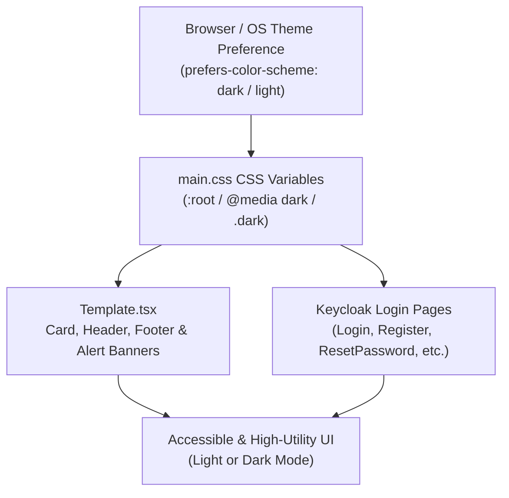

# Requirements

### Overview & Goals
The primary objective of this change is to maximize overall user well-being, visual ergonomics, and aesthetic continuity by introducing complete dark mode support for all Keycloak authentication pages. When users transition between the floxBoard application and Keycloak login, registration, or password reset screens in low-light environments, sudden bright white screens cause visual fatigue, discomfort, and reduced productivity. Implementing a seamless, high-contrast dark theme optimizes user comfort, reduces eye strain, and delivers a cohesive authentication experience.

### Scope
- **In Scope**:
  - Global styling and CSS custom properties in `floxboard-theme/src/main.css`.
  - The core template layout in `floxboard-theme/src/keycloak-theme/login/Template.tsx`.
  - All Keycloak page components under `floxboard-theme/src/keycloak-theme/login/pages/`:
    - `Login.tsx` (Sign in)
    - `Register.tsx` (User registration)
    - `LoginResetPassword.tsx` (Password recovery)
    - `LoginUpdatePassword.tsx` (Password update)
    - `LoginUpdateProfile.tsx` (Profile update)
    - `LoginVerifyEmail.tsx` (Email verification instruction page)
    - `UpdateEmail.tsx` (Email update)
    - `Info.tsx` (Information and status notices)
    - `Error.tsx` (Error messages and back to application redirects)
  - Automatic theme detection via `prefers-color-scheme: dark` media queries and explicit class support (`.dark`).
- **Out of Scope**:
  - Keycloak email templates located in `floxboard-theme/src/keycloak-theme/email/**` (explicitly excluded to prevent email client rendering incompatibilities).
  - Main webui application changes (the webui already possesses dark mode support).

### User Stories
- **As a user** working in dark mode or low-light conditions, **I want** all Keycloak authentication screens to render in dark mode automatically so that I do not experience sudden glare or visual discomfort when signing in or recovering my account.
- **As a user** encountering errors or instructions during authentication, **I want** alert banners, form helper text, and validation messages to be clearly legible and distinct in dark mode so that I can resolve input errors quickly without confusion.
- **As a user** toggling password visibility in dark mode, **I want** the eye icons and input action buttons to be clearly visible so that I can verify my password with confidence and ease.

### Functional Requirements
- **System Theme Auto-Detection**: Authentication pages must automatically adapt to the user's operating system or browser theme preference (`prefers-color-scheme: dark`).
- **Explicit Class Support**: Support `.dark` on `html` or `:root` to ensure seamless integration if a theme attribute is passed or inherited.
- **Consistent Visual Hierarchy**:
  - Dark page background (`#020617` / slate-950) matching floxBoard's dark UI.
  - Surface card background (`#0f172a` / slate-900) with subtle border (`#1e293b` / slate-800) and elevated box shadow.
  - Primary text (`#f8fafc` / slate-50) and secondary text (`#94a3b8` / slate-400).
  - Form input backgrounds (`#020617` / slate-950) with border (`#334155` / slate-700) and clear blue focus ring.
  - Distinctive, accessible feedback banners (success: emerald, warning: amber, error: red, info: blue) tailored for dark backgrounds.
- **Form Controls & Interactive States**:
  - Hover and active states for primary and secondary buttons adjusted for dark mode.
  - Password visibility toggle icon SVG stroked in slate-400 (`#94a3b8`) for crisp contrast in dark mode.
  - Checkboxes and native controls styled consistently.

### Non-Functional Requirements
- **Accessibility & Contrast**: All text, form controls, borders, and status banners must achieve at least WCAG 2.1 AA contrast ratio (minimum 4.5:1 for normal text, 3:1 for large text and UI components) to maximize accessibility for all users.
- **Zero Runtime Overhead**: Implemented purely via CSS custom properties and standard React styling tokens without introducing heavy external dependencies or runtime bottlenecks.
- **Render Reliability**: Prevent flash of unstyled theme (FOUC) during page load.

# Technical Design

### Current Implementation
The Keycloak theme in `floxboard-theme` uses Keycloakify with React 19 and Vite. The current implementation features:
1. `floxboard-theme/src/main.css`: Declares light-mode CSS variables (`:root`) with hardcoded light values (`--bg-color: #f8fafc`, `--card-bg: #ffffff`, `--text-primary: #0f172a`, etc.) and hardcoded hex backgrounds on input fields (`background-color: #ffffff`), buttons, and password visibility toggles.
2. `floxboard-theme/src/keycloak-theme/login/Template.tsx`: Uses inline styles with hardcoded hex colors (`backgroundColor: "#f8fafc"`, `backgroundColor: "#ffffff"`, `color: "#0f172a"`, `border: "1px solid #e2e8f0"`, etc.) rather than semantic CSS custom properties.
3. `floxboard-theme/src/keycloak-theme/login/pages/Login.tsx`: Contains inline style attributes specifying hardcoded light colors (`#ffffff`, `#cbd5e1`, `#0f172a`, `#334155`, `#475569`, `#2563eb`).
4. Other pages (`Register.tsx`, `LoginResetPassword.tsx`, `LoginUpdatePassword.tsx`, `LoginUpdateProfile.tsx`, `LoginVerifyEmail.tsx`, `UpdateEmail.tsx`, `Info.tsx`, `Error.tsx`) rely on a mixture of CSS classes from `main.css` and occasional inline style overrides.

### Key Decisions
- **Semantic CSS Custom Properties**: Tokenize all theme colors as CSS variables on `:root` and provide dark overrides inside `@media (prefers-color-scheme: dark)` as well as `:root.dark, html.dark`. This approach yields maximal maintainability, allows instant switching with zero JavaScript overhead, and guarantees consistent styling across all current and future Keycloak pages.
- **Decouple Inline Hardcoded Styles**: Refactor hardcoded inline color styles in `Template.tsx` and `Login.tsx` to reference the CSS custom properties (e.g. `var(--bg-color)`, `var(--card-bg)`, `var(--text-primary)`). This eliminates style duplication and ensures that dark mode applies uniformly across the entire DOM tree.
- **Palette Alignment with floxBoard WebUI**: Align the dark mode palette with the slate color system used in `src/main/webui/src/index.css` (background `#020617`, card `#0f172a`, border `#1e293b`, text `#f8fafc` and `#94a3b8`), maximizing visual coherence when navigating between floxBoard and Keycloak.
- **Preserve Email Templates Unchanged**: Restrict modifications strictly to login/page templates, leaving `floxboard-theme/src/keycloak-theme/email/**` untouched to avoid email client rendering issues.

### Proposed Changes

#### 1. `floxboard-theme/src/main.css`
- Expand the `:root` variables:
  ```css
  :root {
    --font-family: -apple-system, BlinkMacSystemFont, "Segoe UI", Roboto, Helvetica, Arial, sans-serif;
    --primary: #2563eb;
    --primary-hover: #1d4ed8;
    --primary-disabled: #93c5fd;
    --bg-color: #f8fafc;
    --card-bg: #ffffff;
    --card-border: #e2e8f0;
    --card-shadow: 0 10px 15px -3px rgba(0, 0, 0, 0.05), 0 4px 6px -4px rgba(0, 0, 0, 0.05);
    --text-primary: #0f172a;
    --text-secondary: #475569;
    --text-muted: #94a3b8;
    --border-color: #cbd5e1;
    --border-light: #e2e8f0;
    --input-bg: #ffffff;
    --button-default-bg: #ffffff;
    --button-default-hover-bg: #f8fafc;
    --button-default-hover-border: #94a3b8;
    --password-toggle-bg: #f8fafc;
    --password-toggle-hover-bg: #e2e8f0;
    --error-color: #dc2626;
    --error-bg: #fef2f2;
    --error-border: #fecaca;
    --error-text: #991b1b;
    --success-color: #059669;
    --success-bg: #ecfdf5;
    --success-border: #a7f3d0;
    --success-text: #065f46;
    --warning-color: #d97706;
    --warning-bg: #fffbeb;
    --warning-border: #fde68a;
    --warning-text: #92400e;
    --info-bg: #eff6ff;
    --info-border: #bfdbfe;
    --info-text: #1e40af;
    --terms-bg: #f8fafc;
    --terms-border: #e2e8f0;
    color-scheme: light;
  }
  ```
- Add dark mode media query and selector overrides:
  ```css
  @media (prefers-color-scheme: dark) {
    :root {
      --bg-color: #020617;
      --card-bg: #0f172a;
      --card-border: #1e293b;
      --card-shadow: 0 10px 15px -3px rgba(0, 0, 0, 0.4), 0 4px 6px -4px rgba(0, 0, 0, 0.3);
      --text-primary: #f8fafc;
      --text-secondary: #94a3b8;
      --text-muted: #64748b;
      --border-color: #334155;
      --border-light: #1e293b;
      --input-bg: #020617;
      --button-default-bg: #0f172a;
      --button-default-hover-bg: #1e293b;
      --button-default-hover-border: #475569;
      --password-toggle-bg: #1e293b;
      --password-toggle-hover-bg: #334155;
      --error-color: #ef4444;
      --error-bg: #450a0a;
      --error-border: #7f1d1d;
      --error-text: #fca5a5;
      --success-color: #10b981;
      --success-bg: #022c22;
      --success-border: #064e3b;
      --success-text: #6ee7b7;
      --warning-color: #f59e0b;
      --warning-bg: #451a03;
      --warning-border: #78350f;
      --warning-text: #fcd34d;
      --info-bg: #172554;
      --info-border: #1e3a8a;
      --info-text: #93c5fd;
      --terms-bg: #020617;
      --terms-border: #1e293b;
      color-scheme: dark;
    }
  }

  :root.dark,
  html.dark {
    --bg-color: #020617;
    --card-bg: #0f172a;
    --card-border: #1e293b;
    --card-shadow: 0 10px 15px -3px rgba(0, 0, 0, 0.4), 0 4px 6px -4px rgba(0, 0, 0, 0.3);
    --text-primary: #f8fafc;
    --text-secondary: #94a3b8;
    --text-muted: #64748b;
    --border-color: #334155;
    --border-light: #1e293b;
    --input-bg: #020617;
    --button-default-bg: #0f172a;
    --button-default-hover-bg: #1e293b;
    --button-default-hover-border: #475569;
    --password-toggle-bg: #1e293b;
    --password-toggle-hover-bg: #334155;
    --error-color: #ef4444;
    --error-bg: #450a0a;
    --error-border: #7f1d1d;
    --error-text: #fca5a5;
    --success-color: #10b981;
    --success-bg: #022c22;
    --success-border: #064e3b;
    --success-text: #6ee7b7;
    --warning-color: #f59e0b;
    --warning-bg: #451a03;
    --warning-border: #78350f;
    --warning-text: #fcd34d;
    --info-bg: #172554;
    --info-border: #1e3a8a;
    --info-text: #93c5fd;
    --terms-bg: #020617;
    --terms-border: #1e293b;
    color-scheme: dark;
  }
  ```
- Update `input`, `select`, `textarea`, `.kcInputClass`, `.pf-c-form-control` to use `background-color: var(--input-bg)` and `color: var(--text-primary)`.
- Update `.kcButtonDefaultClass`, `.btn-default` to use `background-color: var(--button-default-bg)`, `color: var(--text-secondary)`, and hover states with `var(--button-default-hover-bg)`.
- Update password visibility toggle button and provide SVG icon definitions with stroke `%2394a3b8` under dark mode.
- Update feedback messages, instructions, and terms box to use variables.

#### 2. `floxboard-theme/src/keycloak-theme/login/Template.tsx`
- Refactor the page wrapper styles from hardcoded `#f8fafc` to `var(--bg-color)`.
- Refactor card container to use `var(--card-bg)`, `1px solid var(--card-border)`, and `var(--card-shadow)`.
- Refactor brand title to `var(--text-primary)` and header subtitle to `var(--text-secondary)`.
- Refactor feedback banner inline style to use dynamic CSS variables:
  - Background: `var(--success-bg)`, `var(--warning-bg)`, `var(--error-bg)`, `var(--info-bg)`
  - Border: `var(--success-border)`, `var(--warning-border)`, `var(--error-border)`, `var(--info-border)`
  - Text: `var(--success-text)`, `var(--warning-text)`, `var(--error-text)`, `var(--info-text)`
- Refactor `infoNode` separator to `1px solid var(--border-light)` and text to `var(--text-secondary)`.
- Refactor footer text color to `var(--text-muted)`.

#### 3. `floxboard-theme/src/keycloak-theme/login/pages/Login.tsx`
- Replace hardcoded hex values (`#cbd5e1`, `#0f172a`, `#ffffff`, `#334155`, `#475569`, `#2563eb`) with CSS variables (`var(--border-color)`, `var(--text-primary)`, `var(--input-bg)`, `var(--text-secondary)`, `var(--primary)`), or replace with standard classes (`kcLabelClass`, `kcInputClass`).

#### 4. Remaining Login Pages
- `Register.tsx`, `LoginResetPassword.tsx`, `LoginUpdatePassword.tsx`, `LoginUpdateProfile.tsx`, `LoginVerifyEmail.tsx`, `UpdateEmail.tsx`, `Info.tsx`, `Error.tsx`: Verify all link elements, instruction paragraphs, form groups, and action buttons properly reference theme variables without remaining hardcoded light-only values.

### Data Models / Contracts

| Token Name | Light Mode Value | Dark Mode Value | Semantic Role |
| :--- | :--- | :--- | :--- |
| `--bg-color` | `#f8fafc` | `#020617` | Overall page background |
| `--card-bg` | `#ffffff` | `#0f172a` | Central auth card surface |
| `--card-border` | `#e2e8f0` | `#1e293b` | Card boundary border |
| `--card-shadow` | `0 10px 15px -3px rgba(0,0,0,0.05)` | `0 10px 15px -3px rgba(0,0,0,0.4)` | Card elevation shadow |
| `--text-primary` | `#0f172a` | `#f8fafc` | Main headings, brand text, input values |
| `--text-secondary`| `#475569` | `#94a3b8` | Subtitles, labels, secondary links |
| `--text-muted` | `#94a3b8` | `#64748b` | Footers, helper annotations |
| `--border-color` | `#cbd5e1` | `#334155` | Input borders, default buttons |
| `--border-light` | `#e2e8f0` | `#1e293b` | Dividers, card sections |
| `--input-bg` | `#ffffff` | `#020617` | Input field background |
| `--error-bg` / `--error-text` | `#fef2f2` / `#991b1b` | `#450a0a` / `#fca5a5` | Error alert banner |
| `--success-bg` / `--success-text` | `#ecfdf5` / `#065f46` | `#022c22` / `#6ee7b7` | Success alert banner |

### Components

- `floxboard-theme/src/main.css`: Theme stylesheets containing all CSS variables, element rules, and dark mode media queries/selectors.
- `floxboard-theme/src/keycloak-theme/login/Template.tsx`: Main page template component hosting brand header, card container, message banners, and footer.
- `floxboard-theme/src/keycloak-theme/login/pages/Login.tsx`: Primary login page adapted with theme tokens.
- `floxboard-theme/src/keycloak-theme/login/pages/Register.tsx`: User registration form page.
- `floxboard-theme/src/keycloak-theme/login/pages/LoginResetPassword.tsx`: Forgot password request page.
- `floxboard-theme/src/keycloak-theme/login/pages/LoginUpdatePassword.tsx`: Update password page with visibility toggle controls.
- `floxboard-theme/src/keycloak-theme/login/pages/LoginUpdateProfile.tsx`: User profile update page.
- `floxboard-theme/src/keycloak-theme/login/pages/LoginVerifyEmail.tsx`: Email verification notice page.
- `floxboard-theme/src/keycloak-theme/login/pages/UpdateEmail.tsx`: Email address update page.
- `floxboard-theme/src/keycloak-theme/login/pages/Info.tsx` & `Error.tsx`: General info and error notification pages.

### Architecture Diagram



### Risks & Mitigations
- **Browser Autofill Background Overrides**: WebKit and Chromium browsers apply user-agent autofill backgrounds (e.g. yellow or light blue) by default.
  - *Mitigation*: Add standard autofill styling rules in `main.css` (`input:-webkit-autofill { -webkit-box-shadow: 0 0 0 1000px var(--input-bg) inset; -webkit-text-fill-color: var(--text-primary); }`) to ensure autofilled credentials match the dark theme smoothly.
- **Form Error State Legibility**: Red border on dark slate must not be too low-contrast.
  - *Mitigation*: Use `#ef4444` for dark mode error borders and focus rings with appropriate contrast against `#020617`.

# Testing

### Validation Approach
To ensure maximal quality and defect-free execution, validation will involve:
1. TypeScript compilation and build verification using Keycloakify's build tools in `floxboard-theme`.
2. Inspecting all 9 page types across both light and dark color schemes (`prefers-color-scheme: light` and `prefers-color-scheme: dark`).
3. Contrast verification using standard WCAG 2.1 AA benchmarks for all text elements, input borders, icons, and status banners.

### Key Scenarios
- **Standard Sign-In Flow (`Login.tsx`)**:
  - Verify page background, card container, header text, input borders, input text, and submit button in dark mode.
  - Verify "Forgot password?" and "Sign up" links maintain high contrast and clarity.
  - Verify "Remember me" checkbox and label alignment and visibility.
- **Registration Flow (`Register.tsx`)**:
  - Verify dynamic form fields generated by `UserProfileFormFields` adopt dark input backgrounds and crisp label colors.
- **Password Reset & Update Flows (`LoginResetPassword.tsx`, `LoginUpdatePassword.tsx`)**:
  - Verify password input fields, password confirmation fields, and password visibility toggle buttons.
  - Verify eye show/hide SVG icons render with clear slate-400 stroke on dark backgrounds.
- **Notification & Feedback Messages (`Template.tsx`, `Info.tsx`, `Error.tsx`)**:
  - Verify success (green), warning (amber), error (red), and info (blue) message boxes render with appropriate dark tints, legible text, and defined borders.
  - Verify "Back to application" and "Proceed with action" primary buttons in `Error.tsx` and `Info.tsx`.

### Edge Cases
- **Browser Autofill**: Verify that autofilled username and password inputs do not revert to a bright white background.
- **Validation Errors**: Verify that input fields with `aria-invalid="true"` display clear red borders and error helper text in dark mode.
- **Disabled Controls**: Verify that disabled inputs and submitting buttons remain visibly inactive while maintaining sufficient readability.
- **Email Template Isolation**: Verify that `floxboard-theme/src/keycloak-theme/email/**` files remain unmodified and intact.

# Delivery Steps

### ✓ Step 1: Define Dark Mode Semantic CSS Custom Properties and Global Styles in main.css
All semantic CSS custom properties and dark mode overrides are defined in `main.css`.

- Extend `:root` in `floxboard-theme/src/main.css` with semantic variables for background colors, surface card colors, borders, text hierarchies, input fields, buttons, and alert states.
- Implement `@media (prefers-color-scheme: dark)` and `:root.dark, html.dark` rules defining dark mode palette tokens aligned with floxBoard (`#020617`, `#0f172a`, `#1e293b`, `#334155`, `#94a3b8`, `#f8fafc`).
- Update input backgrounds, borders, focus rings, disabled states, and placeholder styles to adapt smoothly to dark mode.
- Update password visibility toggle button and SVG icons (show/hide) for high contrast against dark surfaces.
- Ensure Keycloakify/PatternFly classes (`.pf-c-form-control`, `.kcInputClass`, `.kcLabelClass`, etc.) utilize the new theme tokens.

### ✓ Step 2: Refactor Template.tsx to Use Semantic Theme Variables and Dark Mode Styles
The shared `Template.tsx` wrapper dynamically renders light and dark mode styles without hardcoded colors.

- Replace hardcoded background, card, border, and text hex values in `floxboard-theme/src/keycloak-theme/login/Template.tsx` with CSS custom properties (`var(--bg-color)`, `var(--card-bg)`, `var(--card-border)`, `var(--card-shadow)`, `var(--text-primary)`, `var(--text-secondary)`, `var(--text-muted)`).
- Update the brand header, logo container, and footer separator to use dynamic color tokens.
- Refactor the feedback banner logic (success, warning, error, info) to apply semantic alert tokens with appropriate dark mode contrast.
- Ensure the document title and body classes propagate without layout shifts or unstyled flashes.

### ✓ Step 3: Adapt All Keycloak Login Pages and Form Controls for Dark Mode Compatibility
Every Keycloak login flow page properly renders inputs, labels, links, and action buttons in dark mode.

- Refactor `Login.tsx` to eliminate hardcoded inline color styles on input fields, labels, checkboxes, and buttons, switching to standard theme classes and variables.
- Update `Register.tsx` to verify `UserProfileFormFields` rendering and ensure signup helper links use `--primary` and theme-aware colors.
- Update `LoginResetPassword.tsx`, `LoginUpdatePassword.tsx`, and `LoginUpdateProfile.tsx` for consistent input group and button styling in dark mode.
- Update `LoginVerifyEmail.tsx`, `UpdateEmail.tsx`, `Info.tsx`, and `Error.tsx` to ensure instruction texts, action links, and redirect buttons adhere to theme tokens.
- Verify that email templates under `floxboard-theme/src/keycloak-theme/email/` remain untouched as requested.

### ✓ Step 4: Verify Build and Validate Dark Mode Rendering Across Authentication Flows
The Keycloak theme builds cleanly and dark mode rendering is verified across all authentication flows.

- Run `npm run build` and `npm run build-keycloak-theme` inside `floxboard-theme` to confirm TypeScript compilation and asset bundling succeed without errors.
- Verify that form validation error highlights (`aria-invalid="true"`) maintain accessible contrast in dark mode.
- Verify browser autofill background appearance and focus ring readability under both light and dark color schemes.