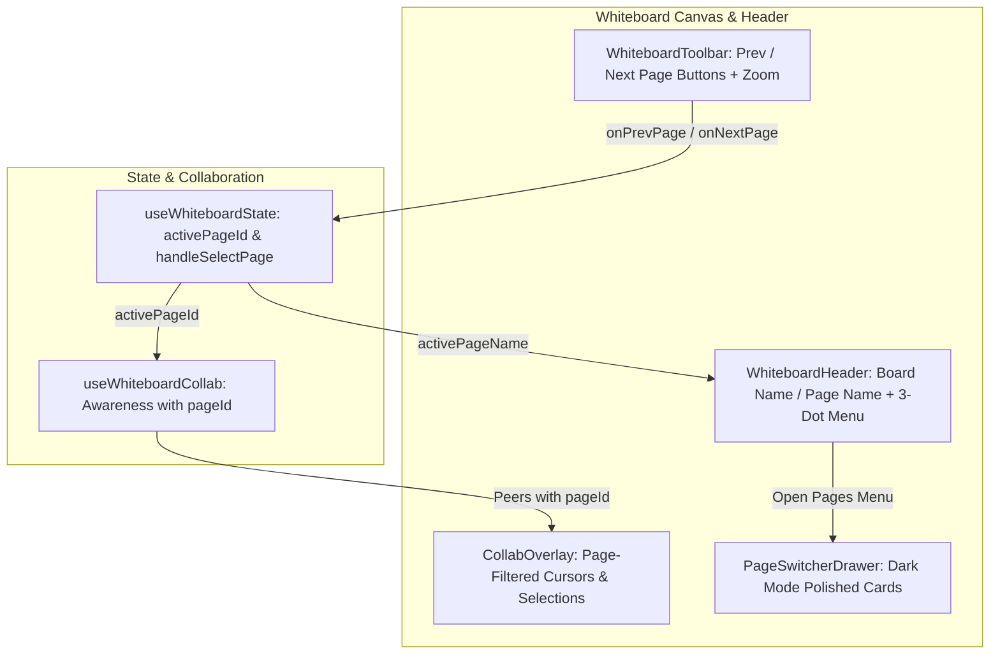

# Requirements

### Overview & Goals
The goal of this task is to enhance multi-page canvas interaction, collaboration, and UI polish across floxBoard:
1. **Per-Page Cursor & Selection Isolation:** Ensure remote user mouse cursors and shape selections are strictly isolated by active canvas page, preventing user A's cursor from appearing on user B's canvas when they are viewing different pages.
2. **Streamlined Page Navigation & Header Integration:** Replace the bottom-left `PageTabBar` dock with previous/next page navigation buttons placed directly beside the canvas zoom controls, display the active page name beside the board name in the header, and provide access to the `PageSwitcherDrawer` via the 3-dot action menu.
3. **Dark Mode UI Consistency:** Fix dark mode styling in the `PageSwitcherDrawer` so that the active/current page card, badges, text, and inputs render with proper dark theme colors instead of light theme backgrounds.

### Scope
- **In Scope:**
  - **Collaborative Cursor & Presence Isolation (`src/main/webui/src/lib/useWhiteboardCollab.ts` & `src/main/webui/src/components/CollabOverlay.tsx`):**
    - Track `pageId` in `PeerPresence` and broadcast local active page ID via Yjs awareness state.
    - Filter remote cursors and selection highlights in `CollabOverlay` so users only see collaborators who are currently on the same active page.
  - **Canvas Page Navigation via Toolbar (`src/main/webui/src/components/WhiteboardToolbar.tsx` & `src/main/webui/src/components/whiteboard/components/WhiteboardCanvas.tsx`):**
    - Remove the bottom-left `PageTabBar` dock from the canvas layout.
    - Add previous (`<`) and next (`>`) page buttons beside the zoom in/out controls in `WhiteboardToolbar` (supporting both edit and viewer modes), with appropriate disabled states at page boundaries.
  - **Header Page Name & 3-Dot Menu Access (`src/main/webui/src/components/WhiteboardHeader.tsx` & `src/main/webui/src/components/whiteboard/Whiteboard.tsx`):**
    - Display the current active page name beside the board name in the header title area (`{boardName} / {activePageName}`).
    - Add a "Pages" menu item to the 3-dot dropdown menu in `WhiteboardHeader` that triggers `onOpenPageDrawer` to open `PageSwitcherDrawer`.
  - **Page Switcher Drawer Dark Theme Fixes (`src/main/webui/src/components/PageSwitcherDrawer.tsx`):**
    - Correct the active page card, badge, search input, and button styles in `PageSwitcherDrawer` to use consistent dark theme classes (`dark:bg-slate-800`, `dark:bg-blue-950/60`, `dark:border-blue-500`, etc.) when dark mode is enabled.
  - **Automated Unit & Integration Test Coverage:**
    - Verify cursor filtering by page in `CollabOverlay`.
    - Verify page switching buttons in `WhiteboardToolbar`.
    - Verify header page name rendering and 3-dot menu page drawer opening in `WhiteboardHeader`.
    - Verify dark mode classes and drawer actions in `PageSwitcherDrawer`.

- **Out of Scope:**
  - Altering backend Panache database models or REST APIs.
  - Full diagram starter blueprint templates (`TemplateGalleryModal`).

### User Stories
- **As a collaborator**, when I am working on Page 2 and my teammate is on Page 1, I don't want to see my teammate's cursor floating around in empty space on my canvas, so that I can focus on my own diagram without visual clutter.
- **As a whiteboard user**, I want quick previous/next page navigation buttons right next to the zoom controls at the bottom toolbar, and the current page name clearly displayed in the header, so that I can switch between pages cleanly while maximizing canvas workspace without a persistent bottom tab dock.
- **As a user**, I want to open the full page management drawer from the 3-dot action menu whenever I need to search, reorder, duplicate, or delete pages.
- **As a dark mode user**, I want the active page in the page drawer to match the dark color scheme cleanly instead of appearing with a bright light theme background.

### Functional Requirements
1. **Per-Page Remote Presence & Cursor Rendering:**
   - Awareness presence must include `pageId` in addition to `cursor` and `selection`.
   - `CollabOverlay` must only render remote cursors and selection boxes for peers whose `pageId` matches the local user's `activePageId`.
   - When switching pages, local awareness must immediately broadcast the new `pageId` and clear outdated cursor/selection states.
2. **Toolbar Page Navigation Buttons:**
   - `WhiteboardToolbar` must render previous (`ChevronLeft`) and next (`ChevronRight`) page navigation buttons adjacent to the zoom controls (`ZoomIn`, `ZoomOut`).
   - Clicking previous navigates to the preceding page; clicking next navigates to the following page.
   - Previous button is disabled if on the first page; next button is disabled if on the last page.
   - Available in both standard and viewer toolbar layouts.
3. **Header Page Display & 3-Dot Drawer Entry:**
   - `WhiteboardHeader` title section displays the current page name adjacent to the board name (e.g. `[Board Name] / [Page 1]`).
   - The 3-dot Action Menu (`MoreVertical`) includes a "Pages" entry (with `Layers` or `FileText` icon) that triggers opening `PageSwitcherDrawer`.
4. **Dark Mode Theme Polish in Page Drawer:**
   - Active page card in `PageSwitcherDrawer` uses dark-friendly background and border (`dark:bg-blue-950/60`, `dark:border-blue-500`).
   - Inactive page cards, index badges, shape metrics, rename input, and action icons render cleanly in both light and dark themes.

### Non-Functional Requirements
- **Performance:** Instant page switching and zero-latency cursor filtering without extra re-renders.
- **Visual Clarity:** Uncluttered canvas bottom by removing the fixed tab bar, keeping toolbar compact and responsive.

# Technical Design

### Current Implementation & Root Cause Analysis
1. **Unfiltered Cursor Rendering Across Pages:**
   - In `CollabOverlay.tsx`, `peers.map((peer) => ...)` renders remote cursors and selection rectangles using DCS coordinates without checking whether `peer` is on the same active page as the local editor.
   - In `useWhiteboardCollab.ts`, `PeerPresence` does not record or broadcast `pageId` in awareness states.
2. **Bottom Canvas Dock vs. Streamlined Toolbar Controls:**
   - Currently, `WhiteboardCanvas.tsx` mounts `PageTabBar` as a fixed bottom dock.
   - Navigation between pages requires interacting with tab pills rather than compact toolbar navigation controls beside zoom buttons.
   - The board header displays `boardName` but does not display `activePageName`.
3. **Dark Theme Inconsistencies in `PageSwitcherDrawer`:**
   - `PageSwitcherDrawer.tsx` uses `bg-blue-50/50 dark:bg-blue-950/20` and `dark:bg-slate-850` (which is not a standard Tailwind utility class in Tailwind v4), causing the active card to appear with a light background wash in dark mode.

### Key Decisions
1. **Awareness `pageId` Tracking & Overlay Filtering:**
   - Extend `PeerPresence` and `updatePresence` in `useWhiteboardCollab.ts` to include `pageId: string`.
   - Pass `activePageId` to `CollabOverlay.tsx`. Filter peer cursors and selections: only render if `!peer.pageId || !activePageId || peer.pageId === activePageId`.
   - In `useWhiteboardState.ts` and `Whiteboard.tsx`, pass `state.activePageId` to presence updates whenever the page changes or pointers move.
2. **Toolbar-Integrated Page Navigation & Header Page Name:**
   - Remove `<PageTabBar />` from `WhiteboardCanvas.tsx`.
   - In `WhiteboardToolbar.tsx`, add Previous (`ChevronLeft`) and Next (`ChevronRight`) page navigation buttons next to the zoom buttons.
   - In `WhiteboardHeader.tsx`, display `activePageName` next to `boardName` with a divider.
   - In `WhiteboardHeader.tsx`'s 3-dot menu, add an option "Pages" (with `Layers` / `FileText` icon) wired to `onOpenPageDrawer`.
3. **Standardized Tailwind v4 Dark Mode Classes for `PageSwitcherDrawer`:**
   - Refactor active card styling to `isActive ? 'border-blue-500 dark:border-blue-500 bg-blue-50/80 dark:bg-blue-950/60 shadow-sm' : 'border-slate-200 dark:border-slate-800 hover:border-slate-300 dark:hover:border-slate-700 bg-white dark:bg-slate-800/80'`.
   - Refactor active pill badge to `bg-blue-100 dark:bg-blue-900/60 text-blue-700 dark:text-blue-300 border border-blue-200 dark:border-blue-800`.
   - Refactor index badge to `bg-slate-100 dark:bg-slate-800 text-slate-500 dark:text-slate-400`.

### Data Models & Contracts
```typescript
export interface PeerPresence {
  clientId: number;
  user: CollabUser;
  pageId?: string; // Active page ID
  cursor: [number, number] | null; // GCS coordinates
  selection: string[]; // Selected shape IDs
  lastUpdated: number;
}

export interface WhiteboardToolbarProps {
  // Existing toolbar props...
  pages?: DgmPageMetadata[];
  activePageId?: string;
  onSelectPage?: (pageId: string) => void;
  onPrevPage?: () => void;
  onNextPage?: () => void;
}

export interface WhiteboardHeaderProps {
  // Existing header props...
  activePageName?: string;
  onOpenPageDrawer?: () => void;
}
```

### Components & File Modifications
- `src/main/webui/src/lib/useWhiteboardCollab.ts`: Add `pageId` to `PeerPresence` and `updatePresence`.
- `src/main/webui/src/components/CollabOverlay.tsx`: Add `activePageId` prop and filter cursors/selections by matching page ID.
- `src/main/webui/src/components/WhiteboardToolbar.tsx`: Add previous/next page buttons beside zoom buttons in viewer and edit mode.
- `src/main/webui/src/components/WhiteboardHeader.tsx`: Add `activePageName` beside `boardName`, and add "Pages" item in 3-dot menu.
- `src/main/webui/src/components/whiteboard/components/WhiteboardCanvas.tsx`: Remove `PageTabBar` dock, wire page navigation props to `WhiteboardToolbar`, pass `activePageId` to `CollabOverlay`.
- `src/main/webui/src/components/whiteboard/Whiteboard.tsx`: Pass `activePageName`, `onOpenPageDrawer`, and page navigation handlers to `WhiteboardHeader` and `WhiteboardCanvas`.
- `src/main/webui/src/components/PageSwitcherDrawer.tsx`: Fix dark mode theme styling for active and inactive page cards, badges, and controls.

### Architecture Diagram


### Components & File Modifications
- `src/main/webui/src/lib/useWhiteboardCollab.ts` (Modified): Include `pageId` in `PeerPresence` and `updatePresence`.
- `src/main/webui/src/components/CollabOverlay.tsx` (Modified): Filter remote cursors and selection bounding boxes by matching `pageId`.
- `src/main/webui/src/components/WhiteboardToolbar.tsx` (Modified): Add previous/next page navigation buttons beside zoom buttons.
- `src/main/webui/src/components/WhiteboardHeader.tsx` (Modified): Display active page name beside board name; add "Pages" item in 3-dot menu.
- `src/main/webui/src/components/whiteboard/components/WhiteboardCanvas.tsx` (Modified): Remove `PageTabBar`, pass page navigation props to `WhiteboardToolbar`, pass `activePageId` to `CollabOverlay`.
- `src/main/webui/src/components/whiteboard/Whiteboard.tsx` (Modified): Wire `activePageName`, `onOpenPageDrawer`, and page navigation handlers to header and canvas.
- `src/main/webui/src/components/PageSwitcherDrawer.tsx` (Modified): Apply consistent dark mode styles across active/inactive cards and controls.

### Risks & Mitigations
- **Risk:** Collaborators on older clients without `pageId` in presence might have their cursors hidden or cause errors.
  - *Mitigation:* Allow fallback to render if either `peer.pageId` or `activePageId` is undefined, but enforce exact matching when both are present.
- **Risk:** Toolbar overflow on narrow viewports when adding page navigation buttons.
  - *Mitigation:* Keep the buttons compact (icon-only `ChevronLeft` / `ChevronRight` with tooltips) aligned cleanly with zoom controls.

# Testing

### Validation Approach
Automated testing via Vitest and React Testing Library verifying:
1. `CollabOverlay` cursor and selection rendering only for peers on the same `pageId`.
2. `WhiteboardToolbar` previous/next page navigation buttons, click handlers, and disabled states at boundaries.
3. `WhiteboardHeader` displaying active page name beside board name and opening page drawer from 3-dot menu.
4. `PageSwitcherDrawer` dark mode classes and page management operations.
5. End-to-end multi-page workflow in `Whiteboard.test.tsx`.

### Key Scenarios & Edge Cases
1. **Per-Page Cursor & Selection Isolation:**
   - Peer A on `page_1` and Peer B on `page_2`: Peer B does not see Peer A's cursor or shape selections.
   - Peer A switches to `page_2`: Peer B now immediately sees Peer A's cursor and selection.
2. **Toolbar Page Navigation:**
   - With `[Page 1, Page 2, Page 3]`, active on `Page 1`: Previous button is disabled, Next button switches to `Page 2`.
   - On `Page 2`: Previous button switches to `Page 1`, Next button switches to `Page 3`.
   - On `Page 3`: Next button is disabled.
3. **Header Page Display & 3-Dot Drawer Action:**
   - Active page `Architecture`: Header shows `Architecture Board / Architecture`.
   - 3-Dot Action Menu: Clicking "Pages" invokes `onOpenPageDrawer` to open `PageSwitcherDrawer`.
4. **Dark Mode Theme Consistency:**
   - `PageSwitcherDrawer` active page card renders with `dark:bg-blue-950/60` and `dark:border-blue-500` instead of light background.

### Test Changes
- `src/main/webui/src/components/CollabOverlay.test.tsx`: Unit tests verifying page-based filtering for remote cursors and selections.
- `src/main/webui/src/components/WhiteboardToolbar.test.tsx`: Unit tests verifying previous/next page buttons and disabled states.
- `src/main/webui/src/components/WhiteboardHeader.test.tsx`: Unit tests verifying active page name rendering and 3-dot menu "Pages" entry.
- `src/main/webui/src/components/PageSwitcherDrawer.test.tsx`: Unit tests verifying dark theme rendering and drawer interactions.
- `src/main/webui/src/components/Whiteboard.test.tsx`: Integration tests verifying toolbar page navigation, header integration, and drawer toggling.

# Delivery Plan

### ✓ Step 1: Collaborative Cursor & Selection Page Isolation
Extend `PeerPresence` in `src/main/webui/src/lib/useWhiteboardCollab.ts` to include `pageId?: string`. In `updatePresence`, broadcast `pageId`. In `src/main/webui/src/components/CollabOverlay.tsx`, accept `activePageId` and filter remote cursors and shape selections so peers on other pages are not rendered. Pass `activePageId` in `WhiteboardCanvas.tsx`, `useWhiteboardState.ts`, and `Whiteboard.tsx` during pointer movement and page changes.

### ✓ Step 2: Streamlined Toolbar Page Navigation & Header Integration
Remove the bottom-left `PageTabBar` dock from `src/main/webui/src/components/whiteboard/components/WhiteboardCanvas.tsx`. In `src/main/webui/src/components/WhiteboardToolbar.tsx`, add previous (`ChevronLeft`) and next (`ChevronRight`) page navigation buttons adjacent to the zoom buttons for both viewer and edit modes with disabled states at page boundaries. In `src/main/webui/src/components/WhiteboardHeader.tsx`, display `activePageName` next to `boardName`, and add a "Pages" item with `Layers` icon in the 3-dot action menu wired to `onOpenPageDrawer`. Wire navigation handlers and `activePageName` in `Whiteboard.tsx`.

### ✓ Step 3: PageSwitcherDrawer Dark Theme Styling Fixes
Refactor `src/main/webui/src/components/PageSwitcherDrawer.tsx` to fix dark mode styling: update active page card styling (`dark:bg-blue-950/60`, `dark:border-blue-500`), inactive card styling (`dark:bg-slate-800/80`, `dark:border-slate-800`), index badges, active pill badge, search input, and delete modal for consistent dark mode display.

### ✓ Step 4: Automated Testing & Verification
Add and update tests in `CollabOverlay.test.tsx`, `WhiteboardToolbar.test.tsx`, `WhiteboardHeader.test.tsx`, `PageSwitcherDrawer.test.tsx`, and `Whiteboard.test.tsx` verifying cursor filtering across pages, toolbar previous/next buttons, header page name rendering, 3-dot menu drawer opening, and drawer dark theme styling. Run full test suite and project build.