# Requirements

### Overview & Goals
Ensure that dot-votes on shapes (`shape.customData.votes`) and voting session configuration (`doc.customData.votingConfig`) are properly included in the serialized DGM document payloads sent to the backend REST API (`POST /api/v1/whiteboards`), persisted in PostgreSQL JSONB, and restored when opening boards.

### Root Cause Analysis
- The `@dgmjs/core` library's `saveToJSON()` / `toJSON()` implementation only serializes predefined schema properties and strips custom object properties (such as `shape.customData`).
- When `Whiteboard.tsx` invokes `editorRef.current.saveToJSON()`, the resulting JSON document lacks `shape.customData.votes` for all shapes, resulting in empty vote payloads being sent to the backend.
- Similarly, `@dgmjs/core`'s `fromJSON()` ignores `customData`, meaning loaded boards drop in-memory shape votes unless explicitly re-attached.

### Scope
- **In Scope:**
  - Implementing serialization helper functions (`serializeDocWithCustomData`) that enrich DGM JSON trees with shape-level `customData.votes` and doc-level `customData.votingConfig`.
  - Implementing deserialization helper functions (`restoreDocCustomData`) that re-hydrate in-memory shape `customData` from loaded JSON.
  - Updating `Whiteboard.tsx` auto-save, manual save, rename, and `loadBoardData` lifecycles to use these serialization/deserialization routines.
  - Updating `yjs-dgm-binding.ts` to preserve `shape.customData` across Yjs CRDT synchronization and remote loads.
  - Adding automated frontend and backend regression tests verifying full vote persistence.
- **Out of Scope:**
  - Creating separate relational tables for individual votes (votes remain within the DGM document tree in PostgreSQL JSONB).
  - Modifying external node_modules directly.

### User Stories
- As a workshop participant, I want my votes on shapes to be sent to the backend and saved so that they persist across page refreshes and browser sessions.
- As a facilitator, I want voting session settings (limits, categories, lock state) to be sent and persisted alongside the whiteboard.
- As a collaborator, I want votes cast in real time by other users to be synchronized via Yjs and persisted to the database.

### Functional Requirements
- **Shape Vote Serialization:** When serializing the whiteboard canvas for auto-save (`triggerAutoSave`) or manual save (`handleSaveBoard`), each shape in `content.children` must include its `customData.votes` array.
- **Board Configuration Serialization:** The root document payload must include `doc.customData.votingConfig`.
- **Restoration on Board Load:** When fetching a board via `loadBoardData(id)`, `shape.customData` must be attached to the in-memory editor shape instances in `editor.store.idIndex` so `ShapeVoteBadge` and context menus immediately render votes.
- **Real-time Sync Preservation:** `yjs-dgm-binding.ts` must maintain `shape.customData` in `yShapes` and restore it onto editor shape instances on remote doc updates.

# Technical Design

### Current Implementation
- `Whiteboard.tsx`: Manages active whiteboard state, `handleVote`, `handleRemoveVote`, and `triggerAutoSave()`. Currently calls `editorRef.current.saveToJSON()`, which strips `shape.customData`.
- `shapeUtils.ts`: Houses geometry, text proportionality, and export helpers for DGM editor shapes.
- `yjs-dgm-binding.ts`: Maps DGM editor state to Yjs CRDT structures (`yShapes`, `yOrder`, `yMeta`).
- `DgmModel.kt`: Backend domain model with `Obj.customData: MutableMap<String, Any>?` mapped to PostgreSQL JSONB.

### Key Decisions
- **Custom Serialization & Hydration Layer:**
  - *Decision:* Create dedicated utility helpers (`serializeDocWithCustomData`, `restoreDocCustomData`) in `shapeUtils.ts` rather than monkey-patching `@dgmjs/core` prototype methods.
  - *Rationale:* Clean, testable, and robust against library upgrades; traverses the DGM shape hierarchy and merges in-memory `store.idIndex[shape.id].customData` with the standard DGM JSON export.
- **Single Source of Truth for Custom Data:**
  - *Decision:* Store `votes` on `shape.customData.votes` and `votingConfig` on `doc.customData.votingConfig`.
  - *Rationale:* Matches existing frontend badge renderers and backend Kotlin `Obj.customData` Jackson mappings.

### Architecture Diagram

```mermaid
graph LR
    User[User Casts / Modifies Vote] --> Store[Editor In-Memory Store: shape.customData]
    Store --> Serialize[serializeDocWithCustomData]
    Serialize --> AutoSave[Debounced Auto-Save Pipeline]
    AutoSave --> API[REST API: POST /api/v1/whiteboards]
    API --> Backend[WhiteboardService & PostgreSQL JSONB]
    Backend --> Load[GET /api/v1/whiteboards/:id]
    Load --> Restore[restoreDocCustomData]
    Restore --> EditorUI[Render ShapeVoteBadge & Badges]
```

### Components & Changes
- `shapeUtils.ts`:
  - Add `serializeDocWithCustomData(editor: Editor, rootCustomData?: Record<string, any>)`: extracts `editor.saveToJSON()` and injects `shape.customData` from `(editor.store as any).idIndex` for all shapes (including nested page children).
  - Add `restoreDocCustomData(editor: Editor, content: any)`: iterates `content.children` and assigns `shape.customData` to `(editor.store as any).idIndex[shape.id]`, and `doc.customData` to root doc.
- `Whiteboard.tsx`:
  - Replace raw `editor.saveToJSON()` in `triggerAutoSave()`, `handleSaveBoard()`, `handleRenameBoard()`, and `handleExportJSON()` with `serializeDocWithCustomData(editorRef.current, { votingConfig })`.
  - Call `restoreDocCustomData(editorRef.current, board.content)` inside `loadBoardData()` after `editor.loadFromJSON(board.content)`.
- `yjs-dgm-binding.ts`:
  - In `syncEditorToYjs()`: ensure `child.customData` from editor store is attached before writing to `this.yShapes`.
  - In `applyRemoteToEditor()`: invoke `restoreDocCustomData` after `this.editor.loadFromJSON(docToLoad)` to restore in-memory shape `customData`.

### File Structure
- `src/main/webui/src/lib/shapeUtils.ts`
- `src/main/webui/src/components/Whiteboard.tsx`
- `src/main/webui/src/lib/yjs-dgm-binding.ts`
- `src/main/webui/src/components/Whiteboard.test.tsx`
- `src/main/webui/src/lib/yjs-dgm-binding.test.ts`
- `src/main/kotlin/de/einfloh/floxboard/whiteboard/domain/dgm/DgmModel.kt`
- `src/test/kotlin/de/einfloh/floxboard/whiteboard/WhiteboardResourceTest.kt`

# Testing

### Validation Approach
Validate serialization, persistence, and roundtrip re-hydration through unit and integration tests.

### Key Scenarios
1. **Vote Serialization in Auto-Save:**
   - Add votes to shape in editor.
   - Trigger auto-save.
   - Verify `api.saveWhiteboard` is invoked with `content` containing `children[0].children[0].customData.votes`.
2. **Vote Re-hydration on Board Load:**
   - Mock backend returning board with `content.children[0].children[0].customData.votes`.
   - Render `Whiteboard` component.
   - Verify in-memory shape in `editor.store.idIndex` has `customData.votes` and `ShapeVoteBadge` renders vote badge.
3. **Collaborative Yjs Vote Sync:**
   - Sync shape with `customData.votes` across two Yjs binding clients.
   - Verify remote client editor has `shape.customData.votes` populated after remote transaction.
4. **Backend PostgreSQL Roundtrip:**
   - Execute `WhiteboardResourceTest` verifying saving and fetching boards with shape votes and voting config preserves full payload.

### Test Changes
- `Whiteboard.test.tsx`:
  - Add test verifying `serializeDocWithCustomData` retains `shape.customData.votes` and sends it via `api.saveWhiteboard`.
  - Add test verifying `loadBoardData` restores `shape.customData` to editor shapes.
- `yjs-dgm-binding.test.ts`:
  - Add test verifying `customData` is synced to `yShapes` and restored into remote editor shapes.

# Delivery Steps

### ✓ Step 1: Implement DGM customData serialization and restoration utilities
Create helper utilities in `shapeUtils.ts` to preserve shape and document customData across DGM JSON export and import.

- Implement `serializeDocWithCustomData(editor, rootCustomData)` to extract DGM JSON and recursively enrich each shape with `customData` from `editor.store.idIndex`.
- Implement `restoreDocCustomData(editor, content)` to re-hydrate `shape.customData` onto in-memory DGM shape instances and doc root following `editor.loadFromJSON`.
- Add unit tests for `serializeDocWithCustomData` and `restoreDocCustomData` in `src/main/webui/src/lib/shapeUtils.test.ts`.

### ✓ Step 2: Connect Whiteboard save and load lifecycles to customData helpers
Update `Whiteboard.tsx` auto-save, manual save, rename, export, and load methods to send and restore votes.

- Update `triggerAutoSave`, `handleSaveBoard`, `handleRenameBoard`, and `handleExportJSON` in `Whiteboard.tsx` to use `serializeDocWithCustomData`.
- Update `loadBoardData` in `Whiteboard.tsx` to call `restoreDocCustomData` after loading JSON into the editor.
- Update `Whiteboard.test.tsx` with tests ensuring vote payloads are included in `api.saveWhiteboard` and restored on mount.

### ✓ Step 3: Update collaborative Yjs binding and validate end-to-end persistence
Ensure Yjs multiplayer synchronization preserves `customData` and verify the full backend and frontend persistence pipeline.

- Update `syncEditorToYjs` and `applyRemoteToEditor` in `yjs-dgm-binding.ts` to preserve and restore `shape.customData`.
- Update `yjs-dgm-binding.test.ts` to verify remote shape updates keep `customData.votes`.
- Run full backend (`./gradlew test`) and frontend (`npm test`) suites to ensure flawless roundtrip persistence.