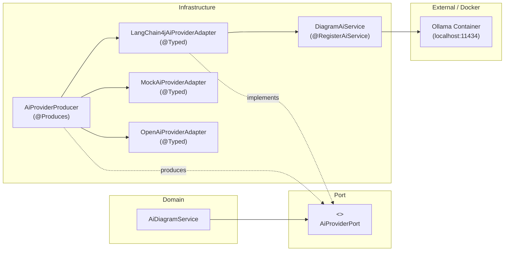

# Requirements

### Overview & Goals
Extend FloxBoard's AI diagram generation infrastructure by introducing a new AI provider powered by **Quarkus LangChain4j**:
- Integrate `quarkus-langchain4j-ollama` (or Quarkus LangChain4j OpenAI-compatible extension) into the backend build.
- Implement `LangChain4jAiProviderAdapter` implementing `AiProviderPort` using LangChain4j declarative AI services (`@RegisterAiService`).
- Add an AI model service (e.g. `ollama`) to `docker-compose.yaml` to support local model execution.
- Update `application.yaml` so the backend defaults to the LangChain4j provider (`floxboard.ai.provider: ${AI_PROVIDER:langchain4j}`) connected to the containerized model service instead of the mock adapter.

### Scope
#### In Scope
- Adding `io.quarkiverse.langchain4j:quarkus-langchain4j-ollama` dependency in `build.gradle.kts`.
- Creating `DiagramAiService` (`@RegisterAiService`) and `LangChain4jAiProviderAdapter` in `de.einfloh.floxboard.ai.infrastructure`.
- Registering `LangChain4jAiProviderAdapter` with `@Typed(LangChain4jAiProviderAdapter::class)`.
- Updating `AiProviderProducer` to resolve `langchain4j` / `ollama` as the active `AiProviderPort`.
- Adding the `ollama` container definition and volume to `docker-compose.yaml`.
- Updating `application.yaml` with default `quarkus.langchain4j.ollama` configurations and setting `floxboard.ai.provider` default to `langchain4j`.
- Ensuring test profiles continue to run reliably (using mock provider for automated unit/integration tests that run without a live Ollama daemon).
- Adding unit tests for `LangChain4jAiProviderAdapter` and updating `AiProviderProducerTest`.

#### Out of Scope
- Modifying canvas rendering or diagram layout algorithms in `DiagramLayoutEngine`.
- Modifying frontend AI prompt dialogs or credit calculation formulas.

### Functional Requirements
- **LangChain4j AI Provider**: `LangChain4jAiProviderAdapter` converts user diagram prompts into structured `AiDiagramGraph` instances using LangChain4j declarative AI service prompts.
- **Provider Selection**: When `floxboard.ai.provider` is set to `langchain4j` (or `ollama`), `AiProviderProducer` provides `LangChain4jAiProviderAdapter` to `AiDiagramService`.
- **Docker Compose AI Model**: `docker-compose.yaml` includes an `ollama` service listening on port 11434 with persistent storage for downloaded models.
- **Configuration Defaults**: `application.yaml` specifies `floxboard.ai.provider: ${AI_PROVIDER:langchain4j}` and configures `quarkus.langchain4j.ollama.base-url` (defaulting to `http://localhost:11434`).
- **Graceful Error Handling**: If the local AI model service is unreachable or returns invalid format, `LangChain4jAiProviderAdapter` throws an explicit runtime exception without crashing bean initialization.

# Technical Design

### Current Implementation
- `AiDiagramService` consumes `AiProviderPort` to obtain `AiDiagramGraph` from natural language prompts.
- `AiProviderProducer` inspects `floxboard.ai.provider` (previously defaulting to `mock`) and produces either `MockAiProviderAdapter` or `OpenAiProviderAdapter`.
- `docker-compose.yaml` currently defines `postgres`, `keycloak`, and `mailpit` services.

### Key Decisions
- **Declarative AI Service with Quarkus LangChain4j**: Use `@RegisterAiService` (`DiagramAiService`) with `@SystemMessage` containing the JSON schema specification for `AiDiagramGraph`. LangChain4j handles JSON structured output binding and error handling.
- **Ollama in Docker Compose**: Use the official `ollama/ollama:latest` image in `docker-compose.yaml` mapped to port `11434` with an `ollama_data` volume. This enables running local LLMs (e.g., `llama3.2`, `mistral`, `qwen2.5-coder`) without requiring external API keys.
- **CDI Bean Disambiguation**: Annotate `LangChain4jAiProviderAdapter` with `@Typed(LangChain4jAiProviderAdapter::class)` so that only `AiProviderProducer` exposes the `AiProviderPort` bean type.
- **Test Isolation**: In `%test` profile configuration (`src/test/resources/application.yaml` or test property overrides), ensure tests default to `floxboard.ai.provider: mock` so CI and automated Gradle test suites pass without needing a running Ollama container.

### Proposed Changes

#### 1. `build.gradle.kts`
- Add `implementation("io.quarkiverse.langchain4j:quarkus-langchain4j-ollama:0.26.0")` (or matching version for Quarkus 3.38.x).

#### 2. `DiagramAiService.kt` & `LangChain4jAiProviderAdapter.kt`
- Create `src/main/kotlin/de/einfloh/floxboard/ai/infrastructure/DiagramAiService.kt`:
  ```kotlin
  @RegisterAiService
  interface DiagramAiService {
      @SystemMessage("""
          You are an expert software and system diagram generator.
          Analyze the user prompt and generate a structured diagram graph in strictly valid JSON conforming to this schema:
          {
            "title": "Diagram Title",
            "nodes": [
              { "id": "node-1", "label": "Node Label", "shapeType": "Rectangle", "fillColor": "#ffffff", "strokeColor": "#334155", "containerId": "container-1" }
            ],
            "edges": [
              { "id": "edge-1", "fromNodeId": "node-1", "toNodeId": "node-2", "label": "Relationship", "lineType": "straight", "arrowHead": "arrow" }
            ],
            "containers": [
              { "id": "container-1", "label": "Container Title", "nodeIds": ["node-1"] }
            ]
          }
          Return ONLY the raw JSON object, without markdown code blocks.
      """)
      @UserMessage("Category: {category}\nLayout: {layoutDirection}\nPrompt: {prompt}")
      fun generateGraph(
          @V("prompt") prompt: String,
          @V("category") category: String,
          @V("layoutDirection") layoutDirection: String
      ): String
  }
  ```
- Create `src/main/kotlin/de/einfloh/floxboard/ai/infrastructure/LangChain4jAiProviderAdapter.kt`:
  ```kotlin
  @ApplicationScoped
  @Typed(LangChain4jAiProviderAdapter::class)
  class LangChain4jAiProviderAdapter(
      private val diagramAiService: DiagramAiService,
      private val objectMapper: ObjectMapper
  ) : AiProviderPort {
      override fun generateGraph(prompt: String, category: String?, layoutDirection: String?): AiDiagramGraph {
          val json = diagramAiService.generateGraph(
              prompt = prompt,
              category = category ?: "GENERAL",
              layoutDirection = layoutDirection ?: "HORIZONTAL"
          )
          return objectMapper.readValue(json, AiDiagramGraph::class.java)
      }
  }
  ```

#### 3. `AiProviderProducer.kt`
- Inject `LangChain4jAiProviderAdapter`.
- Update provider matching logic:
  ```kotlin
  return when (provider.lowercase().trim()) {
      "langchain4j", "ollama" -> langChain4jAdapter
      "openai" -> openAiAdapter
      "mock" -> mockAdapter
      else -> throw IllegalArgumentException("Unsupported AI provider configured: '$provider'. Supported providers are 'langchain4j', 'ollama', 'openai', and 'mock'.")
  }
  ```

#### 4. `docker-compose.yaml`
- Add `ollama` service:
  ```yaml
  ollama:
    image: ollama/ollama:latest
    container_name: floxboard-ollama
    restart: unless-stopped
    ports:
      - "${OLLAMA_PORT:-11434}:11434"
    volumes:
      - ollama_data:/root/.ollama
  ```
- Add `ollama_data:` under `volumes:`.

#### 5. `application.yaml`
- Configure Quarkus LangChain4j and default provider:
  ```yaml
  quarkus:
    langchain4j:
      ollama:
        base-url: ${OLLAMA_BASE_URL:http://localhost:11434}
        chat-model:
          model-id: ${OLLAMA_MODEL:llama3.2}
          temperature: 0.2
          timeout: 60s
  floxboard:
    ai:
      provider: ${AI_PROVIDER:langchain4j}
  ```

### Components
- `DiagramAiService`: Declarative LangChain4j AI service defining prompt contracts.
- `LangChain4jAiProviderAdapter`: Infrastructure adapter implementing `AiProviderPort`.
- `AiProviderProducer`: CDI producer resolving `AiProviderPort` based on `floxboard.ai.provider`.
- `Ollama`: Containerized LLM runtime in Docker Compose.

### File Structure
- `build.gradle.kts` (Modified)
- `docker-compose.yaml` (Modified)
- `src/main/resources/application.yaml` (Modified)
- `src/main/kotlin/de/einfloh/floxboard/ai/infrastructure/DiagramAiService.kt` (Added)
- `src/main/kotlin/de/einfloh/floxboard/ai/infrastructure/LangChain4jAiProviderAdapter.kt` (Added)
- `src/main/kotlin/de/einfloh/floxboard/ai/infrastructure/AiProviderProducer.kt` (Modified)
- `src/test/kotlin/de/einfloh/floxboard/ai/infrastructure/AiProviderProducerTest.kt` (Modified)

### Architecture Diagram


# Testing

### Validation Approach
Verify that `LangChain4jAiProviderAdapter` correctly interfaces with LangChain4j, that `AiProviderProducer` resolves the LangChain4j provider when configured, and that automated tests run smoothly in test mode.

### Key Scenarios
1. **Producer Resolution for LangChain4j/Ollama**: `AiProviderProducer` successfully returns `LangChain4jAiProviderAdapter` when `floxboard.ai.provider` is set to `langchain4j` or `ollama`.
2. **JSON Parsing & Error Handling**: `LangChain4jAiProviderAdapter` parses valid JSON graphs and throws appropriate exceptions on invalid responses or connection failures.
3. **Automated Test Isolation**: Automated test suites in `%test` profile run against `MockAiProviderAdapter` or mock beans so unit/integration tests do not require a running external Ollama service.
4. **Docker Compose Configuration**: `docker-compose config` validates syntax for the new `ollama` container and volume.

# Delivery Steps

### ✓ Step 1: Add LangChain4j dependency and configure Ollama in docker-compose.yaml
Add Quarkus LangChain4j extension to project dependencies and configure the Ollama container service.

- Add `io.quarkiverse.langchain4j:quarkus-langchain4j-ollama` to `build.gradle.kts`.
- Add `ollama` service to `docker-compose.yaml` with port `11434:11434` and `ollama_data` volume.
- Update `src/main/resources/application.yaml` with `quarkus.langchain4j.ollama` configuration settings (`base-url`, `model-id`, `timeout`, `temperature`).

### ✓ Step 2: Implement DiagramAiService and LangChain4jAiProviderAdapter
Create the declarative AI service and infrastructure adapter implementing `AiProviderPort`.

- Create `DiagramAiService.kt` with `@RegisterAiService`, `@SystemMessage` specifying the diagram schema, and `@UserMessage`.
- Create `LangChain4jAiProviderAdapter.kt` annotated with `@ApplicationScoped` and `@Typed(LangChain4jAiProviderAdapter::class)` implementing `AiProviderPort`.
- Parse the generated JSON response into `AiDiagramGraph` with error handling.

### ✓ Step 3: Update AiProviderProducer and test configuration
Wire the new adapter into the CDI producer, configure backend defaults, and validate tests.

- Update `AiProviderProducer.kt` to inject `LangChain4jAiProviderAdapter` and resolve `langchain4j` and `ollama` provider options.
- Update `src/main/resources/application.yaml` to set `floxboard.ai.provider: ${AI_PROVIDER:langchain4j}`.
- Update `AiProviderProducerTest.kt` to test `langchain4j` and `ollama` provider resolution.
- Run test suite with `./gradlew test` to ensure all tests pass cleanly.