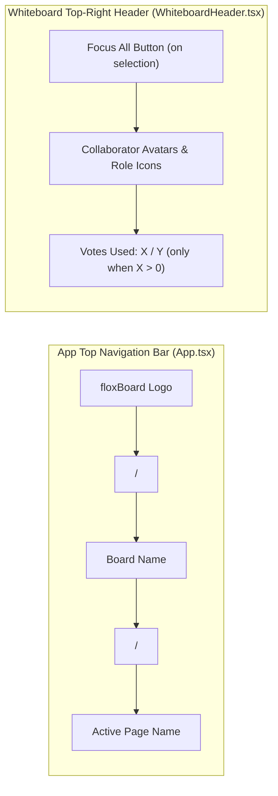

# Requirements

### Overview & Goals
The objective of this task is to refine the whiteboard navigation layout, header controls, and status indicators:
1. **Remove Canvas Name & Page Bubble:** Completely remove the floating board name and page name bubble from the whiteboard header/canvas.
2. **Display Page Name in Upper-Left App Header:** Show the current active page name beside the floxBoard logo and whiteboard name in the top-left navigation bar (`floxBoard / {boardName} / {activePageName}`).
3. **Reposition "Focus All" Button:** Render the `Focus All` selection button to the left side of the collaborator avatars bubble in the upper-right corner.
4. **Conditional Used Votes Display:** Only display the used votes counter indicator below the user avatars when the number of used votes is strictly greater than 0 (`userVotesUsed > 0`).

### Scope
- **In Scope:**
  - `src/main/webui/src/App.tsx`:
    - Extend `WhiteboardPage` state with `activePageName`.
    - Display ` / {activePageName}` beside the floxBoard logo and active whiteboard name in the upper-left navigation bar.
    - Pass `onPageChange={setActivePageName}` to `Whiteboard`.
  - `src/main/webui/src/components/whiteboard/types.ts` & `src/main/webui/src/components/whiteboard/Whiteboard.tsx`:
    - Add `onPageChange?: (name: string | null) => void` prop.
    - Notify parent component whenever `state.activePageName` changes.
  - `src/main/webui/src/components/WhiteboardHeader.tsx`:
    - Remove the board name and page name bubble from the top-right header area.
    - Reorder top-right controls so `Focus All` renders to the left of the collaborator avatars container.
    - Update voting indicator visibility condition so it renders only when `votingConfig?.enabled !== false && votingConfig && userVotesUsed > 0`.
  - `src/main/webui/src/components/WhiteboardHeader.test.tsx` & `src/main/webui/src/components/Whiteboard.test.tsx`:
    - Update test suites for the removed bubble, left-aligned "Focus All" placement, page name propagation, and vote counter threshold (`> 0`).
- **Out of Scope:**
  - Canvas drawing tools, shape rendering, and backend collaboration WebSocket logic.
  - Page switcher drawer internals beyond reporting the active page name.

### User Stories
- **As a whiteboard user**, I want to see the active page name alongside the floxBoard logo and whiteboard name in the top-left app bar, keeping the whiteboard canvas completely uncluttered.
- **As a presenter/collaborator**, I want the `Focus All` button to appear on the left side of the collaborator avatars so it is clearly distinct and immediately reachable when shapes are selected.
- **As a participant in a voting session**, I only want to see the vote counter when I have actually cast votes (`> 0`), avoiding visual clutter when I haven't voted yet.

### Functional Requirements
1. **Upper-Left Page Name Placement:**
   - In `App.tsx`, display `floxBoard / {boardName}` and append ` / {activePageName}` whenever an active page name exists.
   - Propagate active page updates from `Whiteboard` via `onPageChange`.
2. **Removal of Canvas Name/Page Bubble:**
   - Remove the title/page bubble from `WhiteboardHeader.tsx`.
3. **"Focus All" Position:**
   - In `WhiteboardHeader.tsx`, render the `Focus All` button preceding (on the left side of) the collaborator avatars container.
4. **Conditional Vote Counter Visibility:**
   - Render `data-testid="voting-quota-indicator"` only if `votingConfig?.enabled !== false && votingConfig && userVotesUsed > 0`.
   - When `userVotesUsed === 0` or undefined, do not render the vote counter badge.

# Technical Design

### Current Implementation
- `App.tsx` renders the top bar with the floxBoard logo, `/`, and `{activeBoardName || 'Unsaved Whiteboard'}`. It passes `onBoardChange={setActiveBoardName}` to `<Whiteboard />`.
- `WhiteboardHeader.tsx` renders top-left action buttons and top-right elements consisting of:
  - Title/page bubble (`{boardName} / {activePageName}`)
  - Collaborator avatars container
  - `Focus All` button (currently on the right of the avatars)
  - Voting quota badge below the avatars (currently shown even when `userVotesUsed === 0`).

### Key Decisions
1. **Page Name State Flow:** Expose `onPageChange?: (name: string | null) => void` on `WhiteboardProps` in `types.ts` and sync it via `useEffect` in `Whiteboard.tsx` listening to `state.activePageName`. This keeps `App.tsx` informed of page switches cleanly without tight coupling.
2. **Header Reordering:** Place the `Focus All` button before the collaborator avatars container inside the flex container (`flex items-center gap-2.5`).
3. **Vote Counter Condition:** Change voting indicator condition from checking only `votingConfig` to `votingConfig?.enabled !== false && votingConfig && userVotesUsed > 0`.

### Proposed Changes
1. **`src/main/webui/src/App.tsx`:**
   - Add `activePageName` state hook in `WhiteboardPage`.
   - Render ` / {activePageName}` beside `activeBoardName` with `data-testid="app-active-page-name"`.
   - Pass `onPageChange={setActivePageName}` to `<Whiteboard />`.
2. **`src/main/webui/src/components/whiteboard/types.ts` & `Whiteboard.tsx`:**
   - Add `onPageChange?: (name: string | null) => void` to `WhiteboardProps`.
   - Synchronize `state.activePageName` to `onPageChange` on mount and page switch.
3. **`src/main/webui/src/components/WhiteboardHeader.tsx`:**
   - Remove the board title and active page name pill from the top-right header container.
   - Render the `Focus All` button before the collaborator avatars pill.
   - Update voting badge condition to `userVotesUsed > 0`.

### Architecture Diagram

### Components & File Structure
- `src/main/webui/src/App.tsx`: App-level header with logo, board name, and page name.
- `src/main/webui/src/components/whiteboard/types.ts`: Extended props interface with `onPageChange`.
- `src/main/webui/src/components/whiteboard/Whiteboard.tsx`: Page change notification to parent component.
- `src/main/webui/src/components/WhiteboardHeader.tsx`: Header layout cleanup, button reordering, and vote badge condition.
- `src/main/webui/src/components/WhiteboardHeader.test.tsx`: Unit tests for header components and vote threshold.
- `src/main/webui/src/components/Whiteboard.test.tsx`: Integration tests for whiteboard rendering and header behavior.

# Testing

### Validation Approach
Automated testing via Vitest and React Testing Library:
1. Verify the active page name renders beside the floxBoard logo and whiteboard name in the top app navigation bar (`App.tsx`).
2. Verify that no board name or page name bubble is rendered inside `WhiteboardHeader.tsx`.
3. Verify that the `Focus All` button is rendered before/to the left of the collaborator avatars container when shapes are selected.
4. Verify that the voting quota badge is not displayed when `userVotesUsed === 0`, and is displayed when `userVotesUsed > 0`.

### Key Scenarios & Edge Cases
- **Scenario 1 - App Header Page Name:**
  - Board name "Sprint 42", Page name "Wireframes" -> App bar displays `floxBoard / Sprint 42 / Wireframes`.
  - When no active page name is set -> App bar displays `floxBoard / Sprint 42`.
- **Scenario 2 - Whiteboard Canvas Header:**
  - `WhiteboardHeader` contains only the collaborator avatars (and `Focus All` if shapes selected), with no title bubble.
- **Scenario 3 - "Focus All" Placement:**
  - When `selectedShapeCount > 0` and `canEdit` is true -> `Focus All` is positioned to the left of the user avatar pill.
- **Scenario 4 - Vote Counter Threshold:**
  - `votingConfig.enabled = true`, `userVotesUsed = 0` -> No voting quota badge rendered.
  - `votingConfig.enabled = true`, `userVotesUsed = 2` -> Voting quota badge rendered with "Votes: 2/5 used".

### Test Changes
- `src/main/webui/src/components/WhiteboardHeader.test.tsx`:
  - Assert title bubble is removed.
  - Assert `Focus All` button order relative to user avatars.
  - Assert voting badge is hidden when `userVotesUsed === 0` and shown when `userVotesUsed > 0`.
- `src/main/webui/src/components/Whiteboard.test.tsx`:
  - Verify page name emission via `onPageChange`.

# Delivery Steps

### ✓ Step 1: Display Page Name in the Upper Left App Header and Remove Canvas Name Bubble
The page name is displayed beside the floxBoard logo and board name in the upper left corner, and the title bubble on the canvas is removed.

- In `src/main/webui/src/components/whiteboard/types.ts` and `Whiteboard.tsx`, add `onPageChange?: (name: string | null) => void` and notify changes of `state.activePageName`.
- In `src/main/webui/src/App.tsx`, maintain `activePageName` state and display ` / {activePageName}` beside the floxBoard logo and board name.
- In `src/main/webui/src/components/WhiteboardHeader.tsx`, remove the board name and page name container bubble.

### ✓ Step 2: Reposition "Focus All" Button to the Left Side of the User Bubble
The "Focus All" button is displayed on the left side of the user avatars container in the upper right header area.

- In `src/main/webui/src/components/WhiteboardHeader.tsx`, place the `Focus All` action button before the active collaborator avatars container in the top-right flex layout.
- Maintain selection count checks (`selectedShapeCount > 0 && canEdit`), styling, and tooltip attributes.

### ✓ Step 3: Conditionally Render Used Votes Counter Only When Votes > 0 and Update Test Suites
The used votes badge is displayed only when used votes is greater than zero, and all test suites are updated.

- In `src/main/webui/src/components/WhiteboardHeader.tsx`, update the voting indicator condition to require `userVotesUsed > 0`.
- Update and add test cases in `WhiteboardHeader.test.tsx` and `Whiteboard.test.tsx` verifying page name display, "Focus All" ordering, and vote count display behavior.