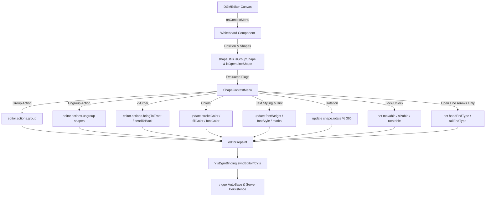

# Requirements

### Overview & Goals
Provide an intuitive, responsive shape context menu and control set on the floxBoard collaborative canvas. Users can right-click any shape, group, or multi-selection to change visual styling, text formatting (with Markdown hints), rotation, layer ordering (z-order), locking constraints, group/ungroup state, and arrowheads on lines.
This includes resolving two key issues:
1. **Missing Ungrouping Option & Action**: Ensure groups (both live `@dgmjs/core` `Group` class instances and serialized group objects) are reliably detected so the "Ungroup" action appears in the context menu and cleanly dissolves groups back into individual editable shapes across clients.
2. **Restricting Line Arrows to Open Lines**: Restrict arrowhead controls (Start/End arrows) strictly to open lines and connectors, ensuring they are never displayed or applied on closed polygon shapes (e.g. triangles, diamonds/rhombuses, closed polylines).

### Scope
- **In Scope:**
  - Context menu trigger on right-clicking canvas shapes, group shapes, and multi-selections.
  - Robust Group detection supporting live DGM.js `Group` class instances (`instanceof Group`, `shape.constructor?.name === 'Group'`), serialized objects (`_type === 'Group'`, `name === 'Group'`), and composite objects containing child arrays.
  - Group and Ungroup actions: Grouping 2+ selected shapes (`editor.actions.group()`) and Ungrouping single or multiple selected group shapes (`editor.actions.ungroup()`) with proper Yjs collaborative state propagation and autosave.
  - Precise line detection distinguishing open lines / connectors from closed polygon shapes (triangles, diamonds, polygons).
  - Restricting line arrow controls (Start/End arrows) to only open lines and connectors, excluding closed shapes.
  - Z-Order controls: Move to Foreground (`bringToFront`) and Move to Background (`sendToBack`).
  - Color picker featuring the 7 predefined color presets (`WHITEBOARD_COLORS`), correctly applying fill colors to closed polygon lines (triangles, diamonds) while preserving stroke-only styling for open lines.
  - Text styling controls: Add and remove text styles (Bold, Italic, Clear Formatting) for shapes and text elements, with an explicit UI hint that Markdown syntax is supported.
  - Shape rotation controls: Rotate clockwise / counter-clockwise (e.g. 90° increments) or reset rotation.
  - Lock / Unlock toggle to prevent or restore moving, resizing, and rotation.
  - Independent arrow configuration for Start (Tail) and End (Head) of open Line shapes.
  - Multi-user Yjs synchronization and persistence of all shape mutations and group hierarchy alterations.
- **Out of Scope:**
  - Custom hex color input outside the 7 preset colors.
  - Modifying server-side database schema (JSON content payload natively supports these properties).
  - Viewer/read-only mode editing permissions.

### User Stories
- **As a whiteboard user**, I want to right-click a group of shapes and see the "Ungroup" action in the context menu so that I can separate grouped items back into individual editable shapes.
- **As a whiteboard user**, I want to right-click a multi-selection of shapes to group them together so that they move, scale, rotate, and lock as a unified unit.
- **As a diagram creator**, I want line arrow controls to appear only on open lines and connectors so that I don't see invalid arrow options on closed shapes like triangles and diamonds.
- **As a whiteboard user**, I want to right-click a shape so that I can quickly access common actions without navigating away from the canvas.
- **As a whiteboard user**, I want to format text (bold, italic, clear formatting) on shapes and see a hint about supported Markdown syntax so that I can quickly style my notes and diagrams.
- **As a whiteboard user**, I want to rotate shapes and groups (e.g. 90° steps) so that elements can be oriented appropriately on the canvas.
- **As a whiteboard user**, I want to move shapes into the foreground or background so that overlapping elements render in the desired hierarchy.
- **As a whiteboard user**, I want to pick from the 7 color presets in the context menu so that I can re-color shapes on the fly.
- **As a whiteboard user**, I want to lock shapes in place so that they are not accidentally moved or resized while drawing around them.
- **As a diagram creator**, I want to configure arrows on either end of an open line individually so that I can create directional connectors and arrows.

### Functional Requirements
- **Group / Ungroup Action Availability & Resolution:**
  - When 2 or more shapes are selected (`shapes.length >= 2`), display the "Group Shapes" option (`editor.actions.group()`).
  - When a `Group` shape (or selection containing one or more `Group` shapes) is selected or right-clicked, display the "Ungroup" option (`editor.actions.ungroup(shapes)`).
  - Detection of `Group` shapes (`isGroupShape`) must evaluate live DGM.js `Group` class instances (`instanceof Group`, `shape.constructor?.name === 'Group'`), serialized objects (`_type === 'Group'`, `name === 'Group'`), and composite objects containing child arrays.
  - When right-clicking a child element belonging to a group, ensure the context menu targets the parent group or allows ungrouping.
  - Triggering "Ungroup" dissolves the selected group(s), restores children as individual page-level shapes, repaints the canvas, and synchronizes via Yjs and autosave.
- **Line Arrows & Open Line vs Closed Shape Restriction:**
  - When an open `Line` or `Connector` shape is selected, display toggleable options for Start Arrow (Tail) and End Arrow (Head) (`flat` vs `arrow` / `solid-arrow`).
  - When a closed polygon shape (such as a Triangle, Rhombus/Diamond, or any connected closed line where start and end points meet / `isClosed()` is true) is selected, the Line Arrows section must **NOT** be displayed in the context menu.
  - Helper functions (`isOpenLineShape`, `setLineArrows`) must verify that a shape is an open line (not closed) before presenting arrow controls or applying arrowhead mutations.
- **Context Menu Activation & Dismissal:**
  - Right-clicking on an unselected shape automatically selects it and opens the context menu at the cursor position.
  - Right-clicking on an already selected shape (or multi-selection) opens the context menu for all selected shapes.
  - Right-clicking on empty canvas or pressing `Escape` / clicking outside dismisses the menu.
  - Read-only viewers cannot open or interact with the context menu.
- **Text Styling & Markdown Hint:**
  - When a shape with text or a text node is selected, show text styling action buttons (Bold, Italic, Clear Styling).
  - Toggle Bold: updates `fontWeight` (`700` vs `400`) and/or applies/removes `strong` marks in the TipTap text structure.
  - Toggle Italic: updates `fontStyle` (`'italic'` vs `'normal'`) and/or applies/removes `em` marks in the TipTap text structure.
  - Clear Styling: resets font weight to normal, font style to normal, and strips rich text marks.
  - Display an informative hint/tooltip in the context menu (*"Markdown supported: \*\*bold\*\*, \*italic\*, \`code\`, # heading"*).
- **Rotation Controls:**
  - Provide a "Rotate" menu item / submenu (e.g., "Rotate 90° Clockwise", "Rotate 90° Counter-Clockwise", "Reset Rotation (0°)").
  - Updates shape's `rotate` property in degrees (e.g. `(shape.rotate + 90) % 360`), maintaining geometry and center coordinates.
  - Applies to single shapes, multi-selections, and shape groups.
- **Z-Order Ordering:**
  - "Bring to Foreground": elevates the selected shape(s) to the top of the layer stack (`editor.actions.bringToFront()`).
  - "Send to Background": lowers the selected shape(s) to the bottom of the layer stack (`editor.actions.sendToBack()`).
- **Color Selection:**
  - Displays the 7 preset colors: Black (`#000000`), Red (`#d0021b`), Blue (`#007bff`), Green (`#28a745`), Yellow (`#ffc107`), Purple (`#6f42c1`), and Gray (`#6c757d`).
  - Updates stroke, fill, and font colors accordingly on selection or group members.
  - Closed polygon shapes (triangles, diamonds) receive fill color updates, while open lines receive stroke and font color updates.
- **Lock / Unlock:**
  - If selected shape(s) or group is unlocked, show "Lock" action. When locked, set `movable = 'none'`, `sizable = 'none'`, `rotatable = false`, and `isLocked = true`.
  - If selected shape(s) or group is locked, show "Unlock" action. When unlocked, restore `movable = 'free'`, `sizable = 'free'`, `rotatable = true`, and `isLocked = false`.

### Non-Functional Requirements
- Seamless real-time collaboration via Yjs without desynchronizing z-order, rotation, styling, or grouping/ungrouping structures across connected peers.
- Smooth context menu animations, dark-theme styling consistent with the existing Tailwind/Slate UI.
- Context menu positioning clamped within viewport boundaries to prevent screen overflow.

# Technical Design

### Current Implementation
- Whiteboard canvas is powered by `@dgmjs/core` and `@dgmjs/react` inside `src/main/webui/src/components/Whiteboard.tsx`.
- State synchronization uses `YjsDgmBinding` (`src/main/webui/src/lib/yjs-dgm-binding.ts`) which stores shapes in a Yjs `Y.Map('shapes')` and document metadata in `Y.Map('meta')`.
- Palette colors are defined in `src/main/webui/src/components/WhiteboardToolbar.tsx` as `WHITEBOARD_COLORS`.
- In floxBoard, Triangles and Rhombuses (diamonds) are created as closed `Line` instances:
  - `Triangle`: `editor.factory.createLine([[x+50, y], [x+100, y+100], [x, y+100], [x+50, y]], true)`
  - `Rhombus`: `editor.factory.createLine([[x+50, y], [x+100, y+50], [x+50, y+100], [x, y+50], [x+50, y]], true)`
- `@dgmjs/core` provides `isClosed()` method on `Path`/`Line` and a closed path has matching start and end points (`distance(path[0], path[last]) < 1`).
- `@dgmjs/core` natively provides built-in capabilities:
  - Z-Order: `editor.actions.bringToFront()`, `editor.actions.sendToBack()`
  - Grouping & Ungrouping: `editor.actions.group()`, `editor.actions.ungroup(shapes?)`
  - Group Shape Class: `Group` extending `Box`
  - Rotation: `shape.rotate` property (in degrees), `rotateTransform()` canvas rendering, and `rotatable: boolean`
  - Constraints & Locking: `shape.movable` (`Movable.NONE` vs `Movable.FREE`), `shape.sizable` (`Sizable.NONE` vs `Sizable.FREE`), `shape.rotatable`
  - Text & Markdown: TipTap rich text schema with markdown input rules, `shape.fontWeight`, `shape.fontStyle`, `shape.fontSize`, `shape.fontColor`, `textUtils`
  - Line Endings: `shape.headEndType` and `shape.tailEndType` (`LineEndType.FLAT`, `LineEndType.ARROW`, `LineEndType.SOLID_ARROW`)

### Key Decisions
- **Decision 1: Closed vs Open Line Discrimination for Arrow Controls**:
  - Implement `isOpenLineShape(shape: any): boolean` (and `isClosedShape(shape: any): boolean`) in `shapeUtils.ts`.
  - Check if the shape is a line/connector (`_type === 'Line'`, `name === 'Line'`, `_type === 'Connector'`, `headEndType in shape`, etc.) AND verify that it is NOT closed (`!shape.isClosed?.()` and not a closed polygon where start point equals end point, e.g. `path[0]` == `path[path.length - 1]`).
  - *Rationale*: DGM represents triangles, diamonds, and polygons as closed `Line` objects. Differentiating open lines from closed loop shapes ensures arrowhead UI and mutations are exclusively applied to actual directional lines/connectors.
- **Decision 2: Robust Group Detection for Live & Serialized Shapes**:
  - Implement `isGroupShape(shape: any): boolean` in `shapeUtils.ts` checking `shape instanceof Group`, `shape.constructor?.name === 'Group'`, `shape._type === 'Group'`, `shape.name === 'Group'`, and `Array.isArray(shape.children) && shape.children.length > 0 && shape._type !== 'Page'`.
  - *Rationale*: DGM creates live class instances of `Group` without `_type` attached until JSON serialization, so checking `instanceof` and constructor name ensures the Ungroup button reliably appears on canvas right-click.
- **Decision 3: React-based Floating Context Menu**:
  - Implement `ShapeContextMenu` as an absolute-positioned React overlay rendered inside the canvas container with `hasLine` driven by `isOpenLineShape` and `hasGroup` driven by `isGroupShape`.
  - Pass target shapes directly to `editor.actions.ungroup(shapes)` in `Whiteboard.tsx` to ensure exact group resolution.
  - *Rationale*: Fits smoothly with existing overlays, handles both selection-based and direct right-click actions, and maintains consistent UI state.
- **Decision 4: Fill Color Handling for Closed Lines (Triangles & Diamonds)**:
  - In `applyColorToShapes`, distinguish open lines from closed polygon lines: apply `fillColor` to closed lines (triangles, diamonds) and standard shapes (boxes, ovals), while omitting fill on open lines.
  - *Rationale*: Triangles and diamonds need interior fill when recolored from palette presets, whereas connectors and linear strokes should only have stroke color modified.
- **Decision 5: Native DGM.js Rotation Property**:
  - Rotate shapes by updating `shape.rotate = (shape.rotate + angle) % 360` (or `editor.actions.update()`), invoking `shape.update(editor.canvas)` and `editor.repaint()`.
  - *Rationale*: Leverages DGM's native canvas transformation matrix, bounding rect recalculation, and handle orientation without custom math reimplementation.
- **Decision 6: Dual-Layer Text Styling (Shape Font Properties + TipTap Marks)**:
  - Toggle `shape.fontWeight` (700 vs 400) and `shape.fontStyle` ('italic' vs 'normal') for global shape typography, and manipulate TipTap marks on inner text nodes for granular formatting.
  - *Rationale*: Works uniformly across plain string text and rich TipTap text docs in DGM while remaining fully compatible with TipTap's native Markdown parser.
- **Decision 7: Locking Mechanism via DGM Constraints**:
  - Use `movable: Movable.NONE` ('none') and `sizable: Sizable.NONE` ('none') along with `rotatable: false` and a boolean `isLocked: boolean` flag on the shape object.
  - *Rationale*: Directly leverages `@dgmjs/core`'s internal manipulator rules to disable dragging/resizing handles while still permitting selection and right-click context menu unlock actions.
- **Decision 8: Grouping, Ungrouping & Z-Order Sync via Yjs Binding**:
  - Ensure `yjs-dgm-binding.ts` serializes `Group` shapes and respects the ordered array of shapes in `rawDoc` and `children`, so remote peers mirror z-order shifts, rotations, grouping, and ungrouping seamlessly.

### Architecture Diagram

### Proposed Changes & File Structure
- **Component & Utility Files:**
  - `src/main/webui/src/lib/shapeUtils.ts`:
    - Add exported `isOpenLineShape(shape: any): boolean` returning `true` only for open lines and connectors, returning `false` for closed lines (triangles, rhombuses/diamonds, closed polygons where start point equals end point or `isClosed()` returns true).
    - Update `setLineArrows` to only apply arrow types to open line shapes (`isOpenLineShape(shape)`).
    - Update `applyColorToShapes` so closed line shapes (triangles, diamonds) receive `fillColor`, while open lines only receive `strokeColor`.
    - Add exported `isGroupShape(shape: any): boolean` supporting `Group` instances, constructor names, `_type`, `name`, and child collections.
  - `src/main/webui/src/components/ShapeContextMenu.tsx`:
    - Use `isOpenLineShape` to evaluate `hasLine` so the Line Arrows section is only shown for open lines/connectors and never for triangles or diamonds.
    - Use `isGroupShape` to evaluate `hasGroup` for displaying the "Ungroup" button.
  - `src/main/webui/src/components/Whiteboard.tsx`:
    - Ensure `handleUngroup` passes `contextMenu.shapes` to `editor.actions.ungroup(shapes)`.
  - `src/main/webui/src/lib/yjs-dgm-binding.ts`:
    - Ensure group creation and ungrouping removals synchronize properly across clients.

### Risks & Mitigations
- **Risk**: Triangle and Rhombus shapes created via `createLine` share the same `Line` class in DGM as normal lines.
  - *Mitigation*: Inspect `isClosed()` and path geometry (`path[0]` == `path[length - 1]` with length >= 3) to strictly isolate closed polygons from open lines.
- **Risk**: Deserialized JSON shapes might not have the live `isClosed()` prototype method.
  - *Mitigation*: Check both `shape.isClosed?.()` and point array inspection (`shape.path[0]` vs `shape.path[shape.path.length - 1]`) to handle both live instances and raw JSON objects.

# Testing

### Validation Approach
Automated testing via Vitest and `@testing-library/react` will validate open vs closed line discrimination, line arrow controls visibility, group shape detection, ungroup execution, text styling, rotation, state toggles, and collaborative synchronization.

### Key Scenarios
- **Line Arrows & Closed Shape Discrimination**:
  - `isOpenLineShape` returns `true` for standard open 2-point lines and multi-segment open connectors.
  - `isOpenLineShape` returns `false` for Triangles, Rhombuses / Diamonds, closed polygons, boxes, ovals, and groups.
  - Context menu hides the Line Arrows section when right-clicking a Triangle, Diamond/Rhombus, Rectangle, Oval, or Group.
  - Context menu displays the Line Arrows section when right-clicking an open Line or Connector.
  - `setLineArrows` only modifies `headEndType`/`tailEndType` on open lines, ignoring closed polygon shapes.
- **Group & Ungroup Detection and Execution**:
  - `isGroupShape` returns `true` for `Group` instances, `{ _type: 'Group' }`, `{ constructor: { name: 'Group' } }`, and custom objects with children.
  - Context menu renders "Ungroup" button when a `Group` instance or multiple groups are selected.
  - Triggering "Ungroup" calls `editor.actions.ungroup` and updates canvas state.
  - Context menu renders "Group Shapes" when 2 or more shapes are selected.
- **Color Presets on Closed Lines vs Open Lines**:
  - Applying color presets to a Triangle or Rhombus updates both `strokeColor` and `fillColor`.
  - Applying color presets to an open Line updates `strokeColor` without applying fill.
- **Context Menu Interaction**:
  - Context menu renders when right-clicking single shape, multiple selected shapes, group shapes, and line shapes.
  - Context menu contains all required options: Bring to Front, Send to Back, 7 color swatches, Text Styling with Markdown hint, Rotation controls, Lock/Unlock, Group/Ungroup (conditional), and Arrowhead controls (for open lines only).
- **Text Styling & Markdown Hint**:
  - Toggling bold sets `fontWeight: 700` (or back to `400`).
  - Toggling italic sets `fontStyle: 'italic'` (or back to `'normal'`).
  - Clearing styling removes custom weight, style, and marks.
  - Context menu displays the Markdown formatting hint.
- **Rotation Controls**:
  - Rotating clockwise advances `rotate` angle by +90° (e.g. 0° -> 90° -> 180° -> 270° -> 0°).
  - Reset rotation resets `rotate` to 0°.
  - Group rotation propagates angle to group or rotates collective bounds.
- **Z-Order Ordering**:
  - Verifying `bringToFront` moves shape to the end of the page children array.
  - Verifying `sendToBack` moves shape to the beginning of the page children array.
- **Locking & Unlocking**:
  - Locking sets `movable: 'none'`, `sizable: 'none'`, `rotatable: false`, `isLocked: true`.
  - Unlocking restores `movable: 'free'`, `sizable: 'free'`, `rotatable: true`, `isLocked: false`.
  - Group locking applies constraints to group and its nested shapes.

### Test Changes
- Update `src/main/webui/src/lib/shape-context-actions.test.ts` to add tests for `isOpenLineShape`, `isGroupShape`, verifying that triangles and rhombuses return `false` for open line and do not receive line arrows.
- Update `src/main/webui/src/components/ShapeContextMenu.test.tsx` verifying that line arrows are not rendered when right-clicking triangles or diamonds, but are rendered for open lines.
- Execute full test suite (`npm test`) to guarantee zero regressions.

# Delivery Steps

### ✓ Step 1: Implement robust group detection, open line discrimination, and update context menu controls
Live and serialized shape groups enable the Ungroup action, and arrow controls are restricted strictly to open lines.

- Implement `isGroupShape(shape: any): boolean` in `src/main/webui/src/lib/shapeUtils.ts` supporting live `@dgmjs/core` `Group` class instances (`instanceof Group`, `constructor.name === 'Group'`), serialized objects (`_type === 'Group'`, `name === 'Group'`), and composite objects with children.
- Implement `isOpenLineShape(shape: any): boolean` in `src/main/webui/src/lib/shapeUtils.ts` checking that the shape is a line/connector and not a closed polygon (evaluating `!shape.isClosed?.()` and checking that start and end endpoints do not coincide).
- Update `setLineArrows` and `applyColorToShapes` in `src/main/webui/src/lib/shapeUtils.ts` to use `isOpenLineShape`, ensuring arrow mutations only affect open lines while closed lines (triangles, diamonds) properly receive fill colors.
- Update `src/main/webui/src/components/ShapeContextMenu.tsx` to use `isGroupShape` for `hasGroup` (ensuring the "Ungroup" button appears on live groups) and `isOpenLineShape` for `hasLine` (ensuring line arrow controls are omitted for triangles and diamonds).

### ✓ Step 2: Update Whiteboard action wiring, collaborative synchronization, and add comprehensive test coverage
Context menu actions (including ungrouping, grouping, layer ordering, colors, rotation, locking, and arrows) are wired and verified with unit and component test suites.

- Update `handleUngroup` and right-click target resolution in `src/main/webui/src/components/Whiteboard.tsx` so `editor.actions.ungroup(shapes)` reliably dissolves selected groups, triggers canvas repainting, updates Yjs collaborative state, and runs auto-save.
- Add unit tests in `src/main/webui/src/lib/shape-context-actions.test.ts` verifying `isGroupShape`, `isOpenLineShape`, and `setLineArrows` behavior for live `Group` instances, open lines, triangles, rhombuses, and locked groups.
- Add component tests in `src/main/webui/src/components/ShapeContextMenu.test.tsx` verifying that the "Ungroup" button is rendered when a live `Group` is selected, and that line arrow controls are hidden for closed polygon shapes (triangles, diamonds) and visible for open lines.
- Run `npm test` and `./gradlew.bat test` to verify all test suites pass without regression.