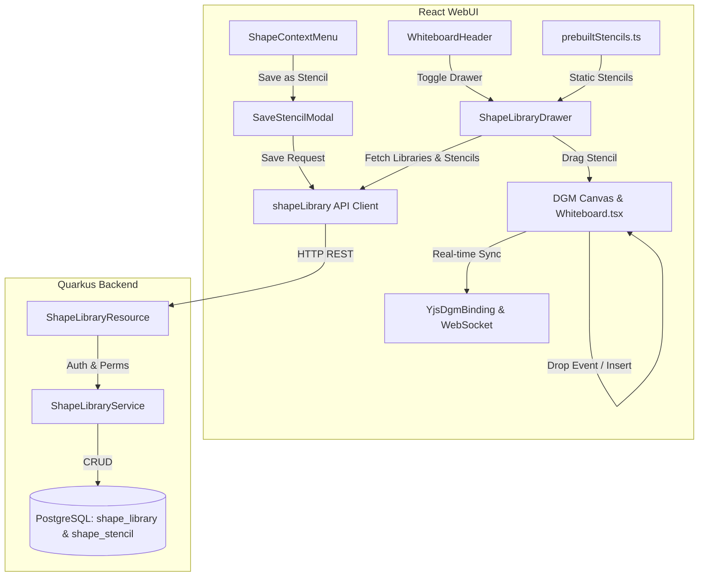

# Requirements

### Overview & Goals
The goal of this feature is to implement **Shape Libraries & Custom Stencils** as specified in `features/whiteboard-advanced-features.md` and `features.md`.
This capability equips floxBoard with pre-built technical and team diagramming stencils (Cloud Architecture, UML, UI Wireframing, BPMN/Flowcharts, and Agile Sprint Teams), category taxonomy with enum-based multi-category assignment (`StencilCategory`), board-level stencil collection enablement in Whiteboard Settings, custom user and organization-scoped shape libraries with granular permission controls (`READ`, `CONTRIBUTE`, `ADMIN`), an interactive slide-over `ShapeLibraryDrawer` with keyword search and drag-and-drop canvas insertion, and the ability to save canvas selections directly into reusable stencils.

### Scope
- **In Scope:**
  - Database schema migrations and JPA Panache entities (`ShapeLibrary`, `ShapeStencil`, `ShapeLibraryMemberPermission`) supporting personal and organization-shared stencil libraries with a `categories` list column.
  - `StencilCategory` enum definition (Backend & Frontend) defining a standardized taxonomy (`CLOUD_ARCHITECTURE`, `SOFTWARE_DESIGN_UML`, `UI_WIREFRAMING`, `FLOWCHART_BPMN`, `AGILE_SPRINT`, `GENERAL`).
  - `ShapeLibraryService` and `ShapeLibraryResource` REST endpoints (`/api/v1/shape-libraries/*`) guarded by authentication and role-based permissions (`READ`, `CONTRIBUTE`, `ADMIN`).
  - Pre-built stencil collections bundled for immediate diagramming:
    - *Agile & Sprint Teams:* User Story Cards, Story Points / Planning Poker estimation badges, Sprint Retrospective columns (What Went Well, To Improve, Action Items, Mad/Sad/Glad, Sailboat anchors), Kanban / Backlog columns with WIP limit markers, Sprint Goals, and Blocker flags.
    - *Cloud Architecture:* AWS, Azure, GCP, Kubernetes service blocks and boundary containers.
    - *Software Design & UML:* Class diagrams, sequence flows, ER schemas, and state machines.
    - *UI Wireframing:* Mobile/desktop wireframe components, buttons, dialogs, form inputs, navigation patterns.
    - *Flowcharts & BPMN:* Decision gates, terminal points, process nodes, data repositories.
  - Board-level stencil collection restriction settings in `WhiteboardConfigModal.tsx` (under Canvas & View / Shape Libraries configuration), allowing board owners/admins to select which stencil collections are allowed on the active board.
  - Interactive `ShapeLibraryDrawer.tsx` respecting board-level collection restrictions, supporting category filtering via `StencilCategory` enums, keyword search, stencil preview rendering, and drag-and-drop placement onto canvas coordinates.
  - `SaveStencilModal.tsx` and context menu integration in `ShapeContextMenu.tsx` to save selected shapes or grouped frames as custom stencils with category tags.
  - Live DGM canvas insertion and collaborative synchronization via Yjs binding in `Whiteboard.tsx`.
  - Updating `features/whiteboard-advanced-features.md` and `features.md` to mark Shape Libraries as `[IMPLEMENTED]`.
  - Comprehensive unit and integration test coverage across backend and frontend.

- **Out of Scope:**
  - Multi-page canvas architecture (`Doc.pages`) — tracked under a separate advanced whiteboard roadmap item.
  - Full board blueprints / diagram starter templates (`TemplateGalleryModal`) — tracked under Diagram Templates.

### User Stories
- **As an agile team facilitator or scrum master**, I want to drag and drop pre-built Agile & Sprint stencils (story cards, retrospective boards, planning poker chips, sprint goals) onto the canvas so that our sprint ceremonies run smoothly and interactively.
- **As a software architect or developer**, I want to drag and drop pre-built Cloud and UML stencils directly onto the canvas so that I can rapidly design system architectures and database schemas.
- **As a product manager or UI designer**, I want to access pre-built wireframe stencils (buttons, inputs, dialogs) so that I can quickly prototype UI layouts during brainstorming sessions.
- **As a whiteboard owner or facilitator**, I want to configure which stencil collections are allowed on a specific board via Whiteboard Settings so that team members stay focused on domain-relevant stencils without clutter.
- **As a whiteboard collaborator**, I want to select a group of shapes on my canvas and save them as a custom stencil into my personal or team library with assigned categories so that I can reuse visual design patterns across multiple boards.
- **As an organization admin or team lead**, I want to manage organization-shared stencil libraries with `READ`, `CONTRIBUTE`, and `ADMIN` permissions and category classifications so that our team maintains standardized diagramming assets.

### Functional Requirements
1. **Pre-Built Technical & Agile Stencil Collections:**
   - Bundled built-in stencil collections assigned one or more `StencilCategory` enum values:
     - Agile & Sprint Teams (User Story cards, Story Points, Retrospective columns, Kanban stages, Sprint Goal banners, Team Mood meters).
     - Cloud Architecture (AWS, Azure, GCP, Kubernetes icons/blocks).
     - Software Design & UML (Class boxes with attributes/methods, sequence lifelines/messages, ER tables, state nodes).
     - UI Wireframing (Buttons, text fields, cards, modals, navigation bars, mobile screen shells).
     - Flowcharts & BPMN (Process boxes, decision diamonds, start/end terminals, document/database nodes).
   - Instant search filtering across stencil names, descriptions, and category tags.

2. **Collection Categories Taxonomy (`StencilCategory`):**
   - Collections define a `categories: StencilCategory[]` list field.
   - Standard enum values: `CLOUD_ARCHITECTURE`, `SOFTWARE_DESIGN_UML`, `UI_WIREFRAMING`, `FLOWCHART_BPMN`, `AGILE_SPRINT`, `GENERAL`.
   - Category filtering in `ShapeLibraryDrawer` allows quick filtering by enum values.

3. **Board-Level Stencil Collection Configuration in Settings:**
   - `WhiteboardConfigModal.tsx` provides a multi-select collection manager allowing board editors/owners to specify `allowedCollectionIds` (or all by default).
   - Saved in whiteboard configuration / DGM document custom data, propagating in real-time to all collaborators on the board.
   - `ShapeLibraryDrawer.tsx` filters available libraries/collections to only show those permitted for the current whiteboard.

4. **Custom User & Organization Libraries:**
   - Users can create personal custom libraries or organization-wide libraries with multi-category classification.
   - Permission controls on organization libraries:
     - `READ`: Collaborators can browse and insert stencils onto canvas.
     - `CONTRIBUTE`: Collaborators can add new stencils to the library.
     - `ADMIN`: Owners/admins can rename, reconfigure permissions, delete stencils, or delete the library.

5. **Drag-and-Drop Stencil Palette (`ShapeLibraryDrawer`):**
   - Collapsible drawer toggled from whiteboard top header / navigation bar.
   - Category navigation tabs / pills matching `StencilCategory` enum values.
   - Filtered view honoring the board's allowed stencil collections.
   - Live search input filtering stencils in real-time.
   - Stencil cards displaying SVG/canvas thumbnail previews, title, and shape count.
   - Drag-and-drop support: dragging a stencil from the palette and dropping it onto the whiteboard canvas inserts the stencil at the exact dropped global canvas coordinates (GCS).
   - Click-to-insert fallback: clicking a stencil inserts it at the current viewport center.

6. **Save Canvas Selection as Stencil:**
   - Selected shape context menu includes \"Save as Stencil\" action.
   - `SaveStencilModal` prompts for stencil name, category tag, target library (personal or organization), and description.
   - Serializes selected DGM shapes (normalizing relative bounding coordinates) and saves the stencil definition.

7. **Documentation Status:**
   - Update `features/whiteboard-advanced-features.md` and `features.md` marking Shape Libraries & Custom Stencils as `[IMPLEMENTED]`.

### Non-Functional Requirements
- **Performance:** Fast stencil search with client-side indexing and optimized JSONB shape payload retrieval; responsive drag-and-drop rendering without canvas frame drops.
- **Security:** Strict authorization enforcing that personal libraries are private to the creator and organization libraries adhere to member permission levels (`READ`, `CONTRIBUTE`, `ADMIN`).
- **Reliability & Consistency:** Atomic transaction on stencil deletion; cascading cleanup when an organization or user is deleted; collaborative real-time sync of inserted stencil shapes and board collection settings across active WebSocket peers.

# Technical Design

### Current Implementation
- **Whiteboard Architecture:**
  - Backend `Whiteboard.kt` stores diagram content as a JSONB `Doc` structure.
  - Frontend `Whiteboard.tsx` manages the DGM `Editor` instance, `YjsDgmBinding` for real-time collaboration, and toolbar/context menu triggers.
  - `shapeUtils.ts` provides manipulation utilities (positioning, centering, proportions, color, styling, exports).
- **User & Organization Models:**
  - `UserResource.kt` and `OrganizationResource.kt` provide user profiles and organization membership roles.
  - Feature gating and entitlements are supported via `@RequireFeature` and `<FeatureGate>`.

### Key Decisions
1. **Stencil Serialization & Relative Coordinate Normalization:**
   - When saving selected shapes as a stencil, normalize shape positions relative to the selection's top-left origin `(minX, minY)`.
   - When inserting a stencil onto canvas (via drag-and-drop or click), generate fresh unique UUIDs for all shapes/connectors and offset positions by the target insertion coordinate `(dropX, dropY)`. This avoids ID collisions and places stencils cleanly without disrupting existing canvas elements.
2. **Hybrid Storage & Pre-Built Collections:**
   - Pre-built stencil collections (Agile & Sprint, Cloud Architecture, UML, Wireframes, Flowcharts) are defined in `prebuiltStencils.ts` with explicit `categories: StencilCategory[]`.
   - Custom personal and organization libraries are persisted in PostgreSQL via `shape_library` (with a JSONB `categories` array column) and `shape_stencil` tables with REST APIs.
3. **Category Taxonomy via Enums:**
   - Collections declare a list of categories using the `StencilCategory` enum: `CLOUD_ARCHITECTURE`, `SOFTWARE_DESIGN_UML`, `UI_WIREFRAMING`, `FLOWCHART_BPMN`, `AGILE_SPRINT`, `GENERAL`.
4. **Board-Level Stencil Collection Enablement:**
   - Board configuration supports `allowedStencilCollections?: string[]` stored in canvas config / document custom metadata.
   - In `WhiteboardConfigModal.tsx`, a dedicated settings section allows users to toggle which collections (pre-built or custom) are available in the board's `ShapeLibraryDrawer`.
   - When `allowedStencilCollections` is unset or empty, all collections are available by default; when populated, only enabled collections are rendered in the drawer.
5. **Drag-and-Drop Coordinate Translation:**
   - Use HTML5 Drag and Drop API with a custom data payload (`application/x-floxboard-stencil`).
   - Canvas drop listener calculates canvas screen offset and transforms client coordinates `(clientX, clientY)` into DGM Global Coordinate Space `(GCS)` using `editor.canvas.scale` and `editor.canvas.origin`.

### Data Models / Contracts

#### Stencil Category Enum
```kotlin
enum class StencilCategory {
    CLOUD_ARCHITECTURE,
    SOFTWARE_DESIGN_UML,
    UI_WIREFRAMING,
    FLOWCHART_BPMN,
    AGILE_SPRINT,
    GENERAL
}
```

```typescript
export enum StencilCategory {
  CLOUD_ARCHITECTURE = 'CLOUD_ARCHITECTURE',
  SOFTWARE_DESIGN_UML = 'SOFTWARE_DESIGN_UML',
  UI_WIREFRAMING = 'UI_WIREFRAMING',
  FLOWCHART_BPMN = 'FLOWCHART_BPMN',
  AGILE_SPRINT = 'AGILE_SPRINT',
  GENERAL = 'GENERAL',
}

export interface StencilCollection {
  id: string;
  name: string;
  description?: string;
  categories: StencilCategory[];
  isPrebuilt?: boolean;
  stencils: StencilItem[];
}
```

#### Backend Entities

##### `ShapeLibrary.kt`
```kotlin
@Entity
@Table(name = "shape_library")
class ShapeLibrary : PanacheEntityBase {
    @Id
    @GeneratedValue(strategy = GenerationType.UUID)
    var id: UUID? = null

    @Column(nullable = false)
    lateinit var name: String

    @Column
    var description: String? = null

    @Column(name = "user_id", nullable = false)
    lateinit var userId: UUID

    @Column(name = "organization_id")
    var organizationId: String? = null

    @Column(columnDefinition = "jsonb", nullable = false)
    var categories: String = "[\"GENERAL\"]"

    @Enumerated(EnumType.STRING)
    @Column(name = "default_role", nullable = false)
    var defaultRole: StencilPermission = StencilPermission.READ

    @CreationTimestamp
    @Column(name = "created_at", nullable = false, updatable = false)
    var createdAt: Instant = Instant.now()

    @UpdateTimestamp
    @Column(name = "updated_at")
    var updatedAt: Instant? = null
}

enum class StencilPermission {
    READ,
    CONTRIBUTE,
    ADMIN
}
```

##### `ShapeStencil.kt`
```kotlin
@Entity
@Table(name = "shape_stencil")
class ShapeStencil : PanacheEntityBase {
    @Id
    @GeneratedValue(strategy = GenerationType.UUID)
    var id: UUID? = null

    @Column(name = "library_id", nullable = false)
    lateinit var libraryId: UUID

    @Column(nullable = false)
    lateinit var name: String

    @Column
    var category: String = "GENERAL"

    @Column
    var description: String? = null

    @Column(columnDefinition = "jsonb", nullable = false)
    lateinit var shapesJson: String

    @Column(name = "thumbnail_svg", columnDefinition = "text")
    var thumbnailSvg: String? = null

    @Column(name = "created_by", nullable = false)
    lateinit var createdBy: UUID

    @CreationTimestamp
    @Column(name = "created_at", nullable = false, updatable = false)
    var createdAt: Instant = Instant.now()
}
```

#### REST API Endpoints (`/api/v1/shape-libraries`)
- `GET /api/v1/shape-libraries` - Lists personal and organization libraries available to the authenticated user.
- `GET /api/v1/shape-libraries/{id}` - Retrieves library details and associated stencils.
- `POST /api/v1/shape-libraries` - Creates a new custom personal or organization library.
- `PUT /api/v1/shape-libraries/{id}` - Updates library name, description, and sharing settings (Requires `ADMIN`).
- `DELETE /api/v1/shape-libraries/{id}` - Deletes a custom library and its stencils (Requires `ADMIN` or Owner).
- `POST /api/v1/shape-libraries/{id}/stencils` - Adds a new stencil to the library (Requires `CONTRIBUTE` or `ADMIN`).
- `DELETE /api/v1/shape-libraries/{id}/stencils/{stencilId}` - Deletes a stencil (Requires `CONTRIBUTE` if creator, or `ADMIN`).

### Architecture Diagram


### Components & File Structure

#### New Files:
- **Backend:**
  - `src/main/resources/db/changelog/008-create-shape-library-tables.xml`
  - `src/main/kotlin/de/einfloh/floxboard/whiteboard/domain/ShapeLibrary.kt`
  - `src/main/kotlin/de/einfloh/floxboard/whiteboard/domain/ShapeStencil.kt`
  - `src/main/kotlin/de/einfloh/floxboard/whiteboard/domain/ShapeLibraryService.kt`
  - `src/main/kotlin/de/einfloh/floxboard/whiteboard/api/ShapeLibraryResource.kt`
  - `src/main/kotlin/de/einfloh/floxboard/whiteboard/api/dto/ShapeLibraryDtos.kt`
  - `src/test/kotlin/de/einfloh/floxboard/whiteboard/ShapeLibraryResourceTest.kt`
- **Frontend:**
  - `src/main/webui/src/types/shapeLibrary.ts`
  - `src/main/webui/src/lib/prebuiltStencils.ts`
  - `src/main/webui/src/lib/api/shapeLibrary.ts`
  - `src/main/webui/src/components/ShapeLibraryDrawer.tsx`
  - `src/main/webui/src/components/ShapeLibraryDrawer.test.tsx`
  - `src/main/webui/src/components/SaveStencilModal.tsx`
  - `src/main/webui/src/components/SaveStencilModal.test.tsx`

#### Modified Files:
- `src/main/resources/db/changeLog.xml` (register changelog `008`)
- `src/main/webui/src/lib/shapeUtils.ts` (stencil instantiation and coordinate offset utilities)
- `src/main/webui/src/components/WhiteboardConfigModal.tsx` (add stencil collection selection configuration to Whiteboard Settings)
- `src/main/webui/src/components/ShapeContextMenu.tsx` (add "Save as Stencil" option)
- `src/main/webui/src/components/WhiteboardHeader.tsx` (add shape library toggle button)
- `src/main/webui/src/components/Whiteboard.tsx` (handle drawer state, allowed collections filtering, drag-and-drop drop zone on canvas, stencil placement, and Yjs broadcast)
- `features/whiteboard-advanced-features.md` (mark feature as `[IMPLEMENTED]`)
- `features.md` (mark shape libraries as `[IMPLEMENTED]`)

### Risks & Mitigations
- **ID Collisions on Canvas Drop:** Inserting a stencil containing pre-existing shape IDs could conflict with canvas elements. *Mitigation:* `instantiateStencilShapes` recursively re-maps all shape and connector IDs to fresh random UUIDs and updates internal connector references.
- **Canvas Zoom / Pan Coordinate Mismatch:** Dropping a stencil when canvas is zoomed or panned could misplace items. *Mitigation:* Accurately convert screen client coordinates to GCS using `(clientX - rect.left) / scale - origin[0]` and `(clientY - rect.top) / scale - origin[1]`.
- **Large Stencil Payloads:** Stencils with dozens of complex shapes could impact database performance. *Mitigation:* Stencils store JSONB structured shapes and lightweight thumbnail SVG previews.

# Testing

### Validation Approach
Automated testing combines Quarkus integration tests for backend security, permissions, and REST endpoints with Jest/React Testing Library tests for frontend stencil searching, drag-and-drop placement, and modal workflows.

### Key Scenarios
1. **Pre-Built Stencils Browsing & Insertion:**
   - Verify that built-in categories (Cloud Architecture, Software Design & UML, UI Wireframing, Flowcharts & BPMN) render in `ShapeLibraryDrawer`.
   - Verify search input filters stencils by keyword across all categories.
   - Verify clicking or dragging a stencil onto canvas adds all shapes at target coordinates with freshly generated IDs.
2. **Custom Stencil Creation:**
   - Select multiple shapes on the canvas, open context menu, and click "Save as Stencil".
   - Submit `SaveStencilModal` to create a new stencil in a personal or organization library.
   - Verify the custom stencil appears in the drawer and can be placed onto the canvas.
3. **Organization Library Sharing & Permissions:**
   - Verify organization members with `READ` can browse and place stencils.
   - Verify organization members with `CONTRIBUTE` can add new stencils.
   - Verify non-admins cannot delete or modify organization library configurations.
4. **Real-Time Collaborative Synchronization:**
   - Verify that placing a stencil on canvas syncs all newly added shapes to peer WebSocket clients via `YjsDgmBinding`.

### Edge Cases
- **Empty Library / No Search Results:** Verify proper empty-state UI when search query matches no stencils.
- **Complex Grouped Shapes / Connectors:** Verify stencils with connected nodes and frames preserve relative offsets and connector bindings when instantiated.
- **Drag Cancellation:** Dragging outside canvas boundaries or canceling drag does not mutate canvas state.
- **Unauthorized Operations:** Unauthenticated or forbidden API requests return proper HTTP 401/403 responses.

### Test Changes
- **Backend Tests:**
  - `src/test/kotlin/de/einfloh/floxboard/whiteboard/ShapeLibraryResourceTest.kt`: Integration tests covering library CRUD, stencil creation, organization permission checks (`READ`, `CONTRIBUTE`, `ADMIN`), and deletion cascades.
- **Frontend Tests:**
  - `src/main/webui/src/components/ShapeLibraryDrawer.test.tsx`: Tests for drawer toggle, category filtering, search input, and drop/click insertion events.
  - `src/main/webui/src/components/SaveStencilModal.test.tsx`: Tests for modal form validation, library selection, and stencil submission.
  - `src/main/webui/src/components/ShapeContextMenu.test.tsx`: Verify "Save as Stencil" button presence and click handling.
  - `src/main/webui/src/components/Whiteboard.test.tsx`: Verify shape library drawer integration and canvas drop handling.

# Delivery Steps

### ✓ Step 1: Implement backend shape library schema, domain entities, service, and REST API
The backend data layer and REST APIs support personal and organization-scoped shape libraries with granular access controls.

- Create Liquibase migration `008-create-shape-library-tables.xml` and register it in `changeLog.xml` defining `shape_library`, `shape_stencil`, and `shape_library_member_permission` tables with foreign keys and indexes.
- Implement Panache entities `ShapeLibrary` and `ShapeStencil` in `de.einfloh.floxboard.whiteboard.domain` with JSONB shape payloads and permission enums (`READ`, `CONTRIBUTE`, `ADMIN`).
- Implement `ShapeLibraryService` providing library CRUD, stencil management, and organization permission validation.
- Implement `ShapeLibraryResource` exposing `/api/v1/shape-libraries` REST endpoints for library listing, creation, updates, deletion, and stencil manipulation.

### ✓ Step 2: Define pre-built technical and agile stencil datasets, category enums, and frontend API client
The frontend has access to pre-built stencil collections (including Agile & Sprint Teams), category taxonomy enums, and client bindings for custom backend libraries.

- Create TypeScript types and `StencilCategory` enum in `src/main/webui/src/types/shapeLibrary.ts` for libraries, stencils, categories, and permission levels.
- Define rich built-in stencil collections in `src/main/webui/src/lib/prebuiltStencils.ts` with explicit `categories: StencilCategory[]`, covering:
  - Agile & Sprint Teams (Story cards, Retrospectives, Planning poker, Kanban, Sprint Goals, Team mood).
  - Cloud Architecture (AWS, Azure, GCP, K8s).
  - Software Design & UML (Class, Sequence, ER, State).
  - UI Wireframing (Forms, Dialogs, Nav).
  - Flowcharts & BPMN.
- Implement API client functions in `src/main/webui/src/lib/api/shapeLibrary.ts` for fetching, creating, editing, and deleting libraries and stencils.

### ✓ Step 3: Build ShapeLibraryDrawer, Board Collection Settings, SaveStencilModal, and Canvas Drag-and-Drop Integration
Users can configure allowed collections in board settings, browse permitted stencils in the drawer, drag and drop them directly onto canvas coordinates, and save canvas selections as reusable stencils.

- Add allowed stencil collections configuration to `WhiteboardConfigModal.tsx` and whiteboard state so facilitators can toggle available stencil collections per board.
- Implement `ShapeLibraryDrawer.tsx` with category tabs (`StencilCategory`), search filtering by keyword/tag, stencil preview cards, board collection restriction filtering, and drag-and-drop / click-to-insert triggers.
- Implement `SaveStencilModal.tsx` allowing users to save selected shapes or frames into personal or organization libraries with category tags.
- Update `ShapeContextMenu.tsx` with a "Save as Stencil" action when one or more canvas elements are selected.
- Add shape library toggle button to `WhiteboardHeader.tsx` and wire drag-and-drop coordinate translation and shape insertion into `Whiteboard.tsx` with instant DGM/Yjs collaborative synchronization.

### ✓ Step 4: Add test suites and update specification documentation
Backend and frontend test suites verify stencil creation, sharing, and placement, and feature specifications reflect implemented status.

- Write backend integration tests in `ShapeLibraryResourceTest.kt` verifying library CRUD, organization permission gating (`READ`, `CONTRIBUTE`, `ADMIN`), and cascade deletion.
- Write frontend unit tests in `ShapeLibraryDrawer.test.tsx`, `SaveStencilModal.test.tsx`, and update `ShapeContextMenu.test.tsx` and `Whiteboard.test.tsx`.
- Update `features/whiteboard-advanced-features.md` and `features.md` to change `Shape Libraries & Custom Stencils` from `[PLANNED]` to `[IMPLEMENTED]`.