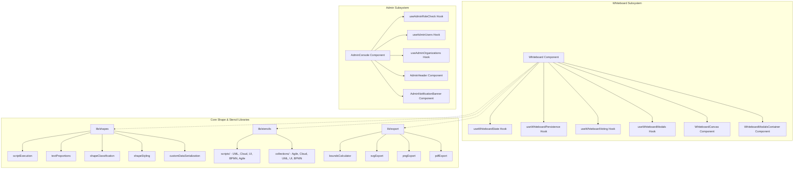

# Requirements

### Overview & Goals
The FloxBoard frontend currently contains several large monolithic files exceeding thousands of lines of code (`prebuiltStencils.ts` ~1875 lines, `Whiteboard.tsx` ~2724 lines, `exportUtils.ts` ~897 lines, `shapeUtils.ts` ~1545 lines, and `AdminConsole.tsx` ~500 lines). These monolithic files mix business logic, state management, rendering routines, DOM manipulation, and data definitions, making maintenance, code reviews, and testing challenging.

The goal of this refactoring plan is to:
1. Decompose these 5 files into well-structured, modular directories grouped by domain responsibility.
2. Extract reusable custom React hooks for stateful logic (role checking, user administration, organization administration, whiteboard canvas state, persistence, voting, modal management).
3. Extract reusable pure utility functions into focused single-responsibility modules.
4. Maintain **100% backward compatibility** through facade re-exports at original file paths so no existing imports or consumers break.
5. Retain all test suites and verify that all 400+ frontend unit/integration tests continue passing cleanly.

### Scope

#### In Scope
- **`prebuiltStencils.ts`**: Split into `src/lib/stencils/` with separate directories for `scripts/` (UML, Cloud, UI, BPMN, Agile) and `collections/` (Agile, Cloud, UML, UI Wireframing, BPMN).
- **`exportUtils.ts`**: Split into `src/lib/export/` covering `boundsCalculator.ts`, `colorUtils.ts`, `downloadUtils.ts`, `shapeExtractors.ts`, `svgExport.ts`, `pngExport.ts`, and `pdfExport.ts`.
- **`shapeUtils.ts`**: Split into `src/lib/shapes/` covering `scriptExecution.ts`, `textProportions.ts`, `shapeClassification.ts`, `shapeStyling.ts`, `imageUtils.ts`, and `customDataSerialization.ts`.
- **`AdminConsole.tsx`**: Modularize into `src/components/admin/` with custom hooks (`useAdminRoleCheck.ts`, `useAdminUsers.ts`, `useAdminOrganizations.ts`) and UI components (`AdminHeader.tsx`, `AdminAccessDenied.tsx`, `AdminNotificationBanner.tsx`).
- **`Whiteboard.tsx`**: Modularize into `src/components/whiteboard/` with custom hooks (`useWhiteboardState.ts`, `useWhiteboardPersistence.ts`, `useWhiteboardVoting.ts`, `useWhiteboardModals.ts`) and subcomponents (`WhiteboardCanvas.tsx`, `WhiteboardModalsContainer.tsx`, `WhiteboardRestoreConfirmDialog.tsx`).
- **Backward Compatibility Facades**: Re-export modules at their original import paths (`prebuiltStencils.ts`, `exportUtils.ts`, `shapeUtils.ts`, `AdminConsole.tsx`, `Whiteboard.tsx`).
- **Build & Test Verification**: Verify TypeScript type checking (`tsc`) and Vitest test runner (`vitest run`).

#### Out of Scope
- Modifying backend API endpoints or DTO structures.
- Changing UX or visual behavior of existing UI components.
- Modifying external libraries or DGM core dependencies.

### User Stories
- **As a Developer**, I want frontend logic modularized into focused files so that I can easily navigate, maintain, and extend individual features without navigating 2000+ line monoliths.
- **As a Developer**, I want clean backward-compatible facade exports so that existing imports across the codebase continue to work without breakage.
- **As a Quality Engineer**, I want all existing tests to pass without regression while having modular units that can be tested in isolation.

# Technical Design

### Current Implementation
The current codebase has:
- `src/main/webui/src/lib/prebuiltStencils.ts` (~1875 lines): Contains all Canvas2D drawing scripts (`DRAW_SCRIPTS`) and the 5 prebuilt stencil collections in a single file.
- `src/main/webui/src/lib/exportUtils.ts` (~897 lines): Contains bounding box calculations, color resolution, text/image extraction, SVG serialization, PNG rasterization, and PDF document generation.
- `src/main/webui/src/lib/shapeUtils.ts` (~1545 lines): Contains script execution, proportional text calculations, shape queries, rotation/lock/styling actions, custom data serialization, and stencil instantiation.
- `src/main/webui/src/components/AdminConsole.tsx` (~500 lines): Houses role verification, header navigation, tab switching, and state management for user management and organization management.
- `src/main/webui/src/components/Whiteboard.tsx` (~2724 lines): Houses canvas mounting, tool state, color palettes, undo/redo, autosave, snapshot restore, Yjs collaboration, voting sessions, and 10+ modal/drawer controllers.

### Key Decisions
1. **Directory-Based Modularization with Facade Re-exports**:
   - Split modules into subdirectories under `src/lib/` and `src/components/`.
   - Keep the original file names (`prebuiltStencils.ts`, `exportUtils.ts`, `shapeUtils.ts`, etc.) as root re-export facades (`export * from './...'`) to guarantee zero breaking changes for existing consumers.
2. **Hook-Based State Separation for Complex Components**:
   - Extract stateful logic and async API workflows into custom React hooks (`useAdminUsers`, `useAdminOrganizations`, `useWhiteboardState`, `useWhiteboardPersistence`, etc.).
   - Keep top-level components declarative and focused on composition.
3. **Pure Utility Decomposition**:
   - Separate pure rendering scripts, math/bounding calculations, and serialization logic into standalone, tree-shakeable TypeScript modules.

### Proposed Architecture & File Structure

```
src/main/webui/src/
├── lib/
│   ├── prebuiltStencils.ts                  # Backward-compatibility facade
│   ├── stencils/                            # Modularized stencils
│   │   ├── index.ts
│   │   ├── scripts/
│   │   │   ├── agileScripts.ts
│   │   │   ├── bpmnScripts.ts
│   │   │   ├── cloudScripts.ts
│   │   │   ├── uiScripts.ts
│   │   │   ├── umlScripts.ts
│   │   │   └── index.ts                     # DRAW_SCRIPTS aggregate
│   │   └── collections/
│   │       ├── agileCollection.ts
│   │       ├── cloudCollection.ts
│   │       ├── flowchartCollection.ts
│   │       ├── uiCollection.ts
│   │       ├── umlCollection.ts
│   │       └── index.ts                     # PREBUILT_STENCIL_COLLECTIONS aggregate
│   │
│   ├── exportUtils.ts                       # Backward-compatibility facade
│   ├── export/                              # Modularized export utilities
│   │   ├── index.ts
│   │   ├── types.ts                         # ExportBounds
│   │   ├── colorUtils.ts                    # resolveDgmColor
│   │   ├── downloadUtils.ts                 # downloadBlob, sanitizeFilename
│   │   ├── shapeExtractors.ts               # extractShapeTextLines, extractImageDataUrl
│   │   ├── boundsCalculator.ts              # calculateShapesBoundingBox
│   │   ├── svgExport.ts                     # serializeDgmToSvg, exportWhiteboardToSVG
│   │   ├── pngExport.ts                     # exportWhiteboardToPNG
│   │   └── pdfExport.ts                     # generatePdfDocument, exportWhiteboardToPDF
│   │
│   ├── shapeUtils.ts                        # Backward-compatibility facade
│   └── shapes/                              # Modularized shape utilities
│       ├── index.ts
│       ├── scriptExecution.ts               # scaleFontString, executeShapeScript, setupScriptedShapeRendering
│       ├── textProportions.ts               # ensureCenteredTextDoc, updateShapeTextProportions, ensureAllShapesCentered, centerOnContent
│       ├── shapeClassification.ts           # isGroupShape, isOpenLineShape, isShapeLocked, toggleShapeLock
│       ├── shapeStyling.ts                  # rotateShapes, applyColorToShapes, applyTextStyling, setLineArrows, line routing
│       ├── imageUtils.ts                    # calculateImageDimensions, createImageShape
│       └── customDataSerialization.ts       # serializeDocWithCustomData, restoreDocCustomData, serializeShapesToStencil, instantiateStencilShapes
│
└── components/
    ├── AdminConsole.tsx                     # Re-export / orchestrator
    ├── admin/
    │   ├── AdminConsole.tsx                 # Composed AdminConsole component
    │   ├── AdminHeader.tsx                  # Navigation header
    │   ├── AdminAccessDenied.tsx            # Access denied view
    │   ├── AdminNotificationBanner.tsx      # Success/error feedback banner
    │   ├── hooks/
    │   │   ├── useAdminRoleCheck.ts         # Role check & verification loading
    │   │   ├── useAdminUsers.ts             # User loading, search, license assign/revoke
    │   │   └── useAdminOrganizations.ts     # Org CRUD, member promotion/removal, pools, seat allocation
    │   ├── UsersTab.tsx                     # Existing subcomponent
    │   ├── AssignLicenseModal.tsx           # Existing subcomponent
    │   ├── OrganizationsTab.tsx             # Existing subcomponent
    │   ├── CreateOrganizationModal.tsx      # Existing subcomponent
    │   └── OrganizationDetailDrawer.tsx     # Existing subcomponent
    │
    ├── Whiteboard.tsx                       # Re-export / orchestrator
    └── whiteboard/
        ├── Whiteboard.tsx                   # Composed Whiteboard container
        ├── constants.ts                     # Canvas colors & theme constants
        ├── types.ts                         # Whiteboard component types
        ├── hooks/
        │   ├── useWhiteboardState.ts        # Tool, active colors, grid, snap, zoom
        │   ├── useWhiteboardPersistence.ts  # Load board, autosave, snapshot restore
        │   ├── useWhiteboardVoting.ts       # Voting sessions, casting/clearing votes
        │   └── useWhiteboardModals.ts       # Drawer & modal open states, URL search params
        └── components/
            ├── WhiteboardCanvas.tsx         # DGMEditor canvas, drag & drop, paste/keyboard shortcuts
            ├── WhiteboardModalsContainer.tsx# Renders all drawers and modal dialogs
            └── WhiteboardRestoreConfirmDialog.tsx # Snapshot restore confirmation modal
```

### Architecture Diagram



# Testing

### Validation Approach
The refactoring preserves all existing public APIs, interfaces, functions, and component contracts. Validation will ensure:
1. All TypeScript compilation and type assertions pass (`tsc`).
2. All 400 existing tests across the 35 Vitest test files pass with 0 regressions.
3. Backward compatibility facades allow seamless imports from both the original files and the new modular locations.

### Key Scenarios
1. **Prebuilt Stencils Validation**:
   - `prebuiltStencils.test.ts` passes, verifying that all stencil collections and `DRAW_SCRIPTS` are correctly populated and functional.
   - Instantiating shapes from every stencil category produces the expected shape metadata and dimensions.
2. **Export Utilities Validation**:
   - `exportUtils.test.ts` passes, verifying bounding box calculations, SVG document serialization, PNG canvas drawing, and PDF 1.4 binary generation.
3. **Shape Utilities Validation**:
   - `shapeUtils.test.ts`, `shape-context-actions.test.ts`, `shape-proportions.test.ts`, and `image-upload.test.ts` all pass.
   - Verifies custom data serialization, scripted shape execution, text centering, shape rotation, and lock toggles.
4. **Admin Console Validation**:
   - `AdminConsole.test.tsx` passes, verifying access control checks, user search, license modal operations, organization tab navigation, and org creation.
5. **Whiteboard Canvas Validation**:
   - `Whiteboard.test.tsx` passes, verifying canvas initialization, shape addition, toolbar tools, persistence triggers, customizer drawers, and snapshot restorations.

### Edge Cases Checked
- Non-admin users visiting the Admin Console see the `Access Denied` view.
- Empty search queries or error responses in user/organization queries display proper error messages.
- Stencils with custom scripts serialize and deserialize without loss of properties or script bodies.
- Exporting empty canvases or canvases with groups and text shapes correctly handles fallback bounds and text styling.

# Delivery Steps

### ✓ Step 1: Modularize prebuilt stencils into domain-specific collections and drawing scripts
Prebuilt stencil scripts and collections are organized into dedicated modular domains under `src/lib/stencils/` with backward-compatible re-exports.

- Create `src/main/webui/src/lib/stencils/scripts/` containing separate script definitions (`umlScripts.ts`, `cloudScripts.ts`, `uiScripts.ts`, `bpmnScripts.ts`, `agileScripts.ts`, `index.ts`).
- Create `src/main/webui/src/lib/stencils/collections/` containing domain collections (`agileCollection.ts`, `cloudCollection.ts`, `umlCollection.ts`, `uiCollection.ts`, `flowchartCollection.ts`, `index.ts`).
- Create `src/main/webui/src/lib/stencils/index.ts` exporting `DRAW_SCRIPTS`, `PREBUILT_STENCIL_COLLECTIONS`, `getPrebuiltCollections`, and `getAllPrebuiltStencils`.
- Update `src/main/webui/src/lib/prebuiltStencils.ts` to re-export from `src/lib/stencils` to preserve backward compatibility.
- Ensure all tests in `prebuiltStencils.test.ts` pass without regressions.

### ✓ Step 2: Decompose export utilities into dedicated format and bounding modules
Canvas export utilities are broken down into focused single-responsibility modules under `src/lib/export/`.

- Create `src/main/webui/src/lib/export/types.ts` defining `ExportBounds`.
- Create `src/main/webui/src/lib/export/downloadUtils.ts` (`downloadBlob`, `sanitizeFilename`) and `colorUtils.ts` (`resolveDgmColor`).
- Create `src/main/webui/src/lib/export/shapeExtractors.ts` (`extractShapeTextLines`, `extractImageDataUrl`) and `boundsCalculator.ts` (`calculateShapesBoundingBox`).
- Create `src/main/webui/src/lib/export/svgExport.ts`, `pngExport.ts`, and `pdfExport.ts` for format-specific export pipelines.
- Create `src/main/webui/src/lib/export/index.ts` aggregating all export utilities.
- Update `src/main/webui/src/lib/exportUtils.ts` as a facade re-exporting from `./export` and verify `exportUtils.test.ts`.

### ✓ Step 3: Split shape utilities into focused functional modules
Shape operations, text proportions, script execution, and serialization are separated into modular units under `src/lib/shapes/`.

- Create `src/main/webui/src/lib/shapes/scriptExecution.ts` for Canvas2D script execution, font scaling, and custom shape setup.
- Create `src/main/webui/src/lib/shapes/textProportions.ts` for TipTap text alignment, proportional sizing, and centering.
- Create `src/main/webui/src/lib/shapes/shapeClassification.ts` (`isGroupShape`, `isOpenLineShape`, `isShapeLocked`, `toggleShapeLock`).
- Create `src/main/webui/src/lib/shapes/shapeStyling.ts` (`rotateShapes`, `applyColorToShapes`, `applyTextStyling`, `setLineArrows`, line routing).
- Create `src/main/webui/src/lib/shapes/imageUtils.ts` (`calculateImageDimensions`, `createImageShape`).
- Create `src/main/webui/src/lib/shapes/customDataSerialization.ts` (`serializeDocWithCustomData`, `restoreDocCustomData`, `serializeShapesToStencil`, `instantiateStencilShapes`).
- Create `src/main/webui/src/lib/shapes/index.ts` and update `src/main/webui/src/lib/shapeUtils.ts` to re-export all modules and export utilities.
- Verify existing tests (`shapeUtils.test.ts`, `shape-context-actions.test.ts`, `shape-proportions.test.ts`, `image-upload.test.ts`).

### ✓ Step 4: Refactor AdminConsole into custom hooks and subcomponents
AdminConsole is refactored into reusable subcomponents and custom hooks under `src/components/admin/`.

- Create `src/main/webui/src/components/admin/hooks/useAdminRoleCheck.ts` for role verification and authentication state.
- Create `src/main/webui/src/components/admin/hooks/useAdminUsers.ts` for user search, license assignment, and license revocation.
- Create `src/main/webui/src/components/admin/hooks/useAdminOrganizations.ts` for org CRUD, member administration, and corporate seat allocations.
- Create `src/main/webui/src/components/admin/AdminHeader.tsx`, `AdminAccessDenied.tsx`, and `AdminNotificationBanner.tsx`.
- Refactor `src/main/webui/src/components/AdminConsole.tsx` into a clean orchestrator utilizing these hooks and components.
- Run and verify `AdminConsole.test.tsx` to ensure all administrative workflows and modal interactions remain functional.

### ✓ Step 5: Decompose Whiteboard component into modular hooks, canvas container, and dialogs
The 2700+ line Whiteboard component is decomposed into specialized hooks and presentation components under `src/components/whiteboard/`.

- Create `src/main/webui/src/components/whiteboard/constants.ts` and `types.ts` for whiteboard color themes and modal parameters.
- Create custom hooks under `src/main/webui/src/components/whiteboard/hooks/`: `useWhiteboardState.ts` (canvas & tool state), `useWhiteboardPersistence.ts` (board loading/saving & snapshot restores), `useWhiteboardVoting.ts` (voting sessions & limit enforcement), and `useWhiteboardModals.ts` (modal/drawer visibility and URL sync).
- Create `src/main/webui/src/components/whiteboard/components/WhiteboardCanvas.tsx` handling DGMEditor canvas, drag-and-drop stencils, and keyboard/clipboard shortcuts.
- Create `src/main/webui/src/components/whiteboard/components/WhiteboardModalsContainer.tsx` and `WhiteboardRestoreConfirmDialog.tsx`.
- Refactor `src/main/webui/src/components/Whiteboard.tsx` to assemble these hooks and modular subcomponents cleanly.
- Run the full test suite (`npm --prefix src/main/webui test`) to confirm zero regressions across all 400+ tests.