# Requirements

### Overview & Goals
The objective of this enhancement is to elevate the utility, visual richness, and creative diversity of FloxBoard's AI Text-to-Diagram integration (`ai:text_to_diagram`) by deeply integrating it with FloxBoard's new **Custom Shape Library & Stencil System** (`ShapeLibrary`, `ShapeStencil`, and scripted Canvas2D stencils).

Currently, the AI generation pipeline defaults to conservative hyperparameters (temperature `0.2`) and restricts nodes to only basic rectangular and elliptical boxes. Meanwhile, FloxBoard has introduced a rich stencil and shape library ecosystem spanning Cloud Architecture, Software UML, Agile Sprint boards, Flowchart BPMN, and scripted custom shapes (`Custom` DGM objects with parametric `properties` and `script` rendering). By tuning LLM sampling parameters, expanding the semantic graph schema to support both geometric primitives and domain-specific scripted stencils, and upgrading the spatial layout engine to synthesize custom shapes and rich visual styles, FloxBoard will produce stunning, domain-accurate diagrams that seamlessly interoperate with the custom shape library.

### Scope
- **In Scope:**
  - **Hyperparameter & Sampling Tuning:** Externalizing and optimizing temperature (e.g., 0.65–0.70) and nucleus sampling (top-p 0.95) across OpenAI and LangChain4j/Ollama adapters with optional category-based tuning.
  - **Custom Shape Library & Stencil Schema Integration:** Extending `AiNode`, `AiEdge`, and `AiDiagramGraph` models in `AiDiagramModels.kt` to represent both geometric shapes (`Diamond`, `Cylinder`, `Cloud`, `StickyNote`, `Capsule`) and domain-specific scripted stencils (`Custom` shapes with `properties`, `script`, and `stencilCategory` aligned with `StencilCategory` and `DRAW_SCRIPTS`).
  - **Prompt Engineering & Stencil Guidance:** Overhauling system and user prompts in `DiagramAiService.kt` and `OpenAiProviderAdapter.kt` with explicit schema guidelines for structured stencils (e.g. UML class boxes with attribute/method lists, Agile user story cards with estimation badges, and BPMN gateways).
  - **Layout Engine Scripted Stencil & Multi-Shape Synthesis:** Upgrading `DiagramLayoutEngine.kt` to map semantic node types to native DGM elements (`Box`, `Ellipse`, `Path`, `Frame`, `Text`, `Connector`) as well as `Custom` scripted shapes with parametric property bags and appropriate dimensions.
  - **Frontend Theme & Stencil Category Presets:** Aligning `AiDiagramModal.tsx` presets with the Shape Library categories (`Cloud Architecture`, `Software UML`, `Agile Sprint`, `Flowchart BPMN`, `UI Wireframing`) and enabling users to save AI-synthesized node clusters directly into their custom Shape Library.
  - **Mock & Test Harness Updates:** Updating `MockAiProviderAdapter.kt` and test suites to validate multi-shape and scripted stencil generation.
- **Out of Scope:**
  - Raster or generative image diffusion models (the system remains focused on structured vector DGM shapes and Canvas2D scripted stencils).
  - Voice-to-diagram transcription.

### User Stories
- **As a Software Architect**, I want the AI to generate structured UML class stencils with compartmentalized attributes and methods so that class diagrams are rendered with professional notation rather than flat text boxes.
- **As a Scrum Master / Agile Coach**, I want prompt requests for sprint retrospectives or user story backlogs to generate parametric User Story cards and estimation poker badges compatible with our Agile stencil collection.
- **As a Cloud Engineer**, I want architecture prompts to generate database cylinders, message queues, and cloud boundary frames with semantic coloring, and easily save generated subsystems into my team's Shape Library as reusable stencils.
- **As a Business Analyst**, I want flowchart prompts to generate decision diamonds and BPMN gateway stencils with branching conditional connectors so that process workflows have clear decision points.
- **As a FloxBoard Administrator**, I want AI creativity parameters and shape presets to be configurable in `application.yaml` so I can balance creative variety and structural reliability.

### Functional Requirements
1. **Configurable Sampling & Creativity Parameters:**
   - Expose `floxboard.ai.temperature` (default `0.65`) and `floxboard.ai.top-p` (default `0.95`) in `application.yaml`.
   - Support adaptive temperature offsets based on diagram category (e.g., 0.70 for Mind Maps & Agile ideation, 0.40 for strict Sequence Flows, 0.65 for Cloud Architecture).
2. **Expanded Shape & Stencil Vocabulary:**
   - Support native geometric shape types:
     - `Rectangle` / `Card`: Standard services, apps, microservices.
     - `Capsule` / `Pill`: Micro-components, tags, endpoints.
     - `Ellipse` / `Circle`: Start/End states, actors, users.
     - `Diamond` / `Rhombus`: Decision gateways, conditional branching.
     - `Cylinder` / `Database`: Relational databases, key-value stores, data lakes.
     - `Cloud` / `Queue`: Message brokers (Kafka, RabbitMQ), external third-party APIs.
     - `StickyNote`: Brainstorming cards, annotations, callouts.
     - `Container` / `Frame`: VPC boundaries, Kubernetes namespaces, trust zones.
   - Support parametric scripted stencils (`Custom` DGM shapes):
     - `UmlClass`: Scripted class box with className, stereotype, attributes list, and methods list.
     - `AgileStoryCard`: Scripted story card with code, title, persona, goal, value, and estimation points.
     - `DatabaseNode`: Scripted 3D database cylinder with title, engine/subtitle, and status badge.
     - `BpmnGateway`: Scripted decision gateway with icon and conditional indicators.
3. **Advanced Visual Styling & Connector Dynamics:**
   - Support `fillStyle`: `solid`, `hachure`, `zigzag`, `dots`, `transparent`.
   - Support `roughness`: 0.0 (crisp CAD style) to 1.5 (hand-drawn sketchy aesthetic).
   - Support connector `headEndType` and `tailEndType`: `arrow`, `solid-arrow`, `diamond`, `crowfoot-many`, `circle`.
   - Support connector `strokePattern`: solid, dashed (for async/event-driven links), dotted (for optional dependencies).
4. **Intelligent Spatial Layout Adaptation:**
   - Dynamic node sizing tailored to shape/stencil geometry (e.g., UML class boxes size based on attribute/method counts; Story Cards size to standard 280x180 card dimensions; Diamonds allocate 1.3x text width).
   - Container frames compute dynamic padding and header clearance around enclosed child nodes and stencils.
5. **Shape Library Interoperability:**
   - Integration with `ShapeLibrary` and `ShapeStencil` entities, allowing AI diagrams to leverage prebuilt stencil drawing scripts and enabling one-click saving of AI-generated node clusters to custom shape libraries via `ShapeContextMenu`.

### Non-Functional Requirements
- **Output Reliability:** Strict schema validation ensuring that even with creative stencils and property bags, the JSON response conforms to expected models without runtime parse errors.
- **Performance:** End-to-end diagram generation latency remains under 3 seconds; spatial layout calculation executes in < 30ms.
- **Extensibility:** Easily extendable to new scripted stencils in `DRAW_SCRIPTS` without modifying core layout topology algorithms.

# Technical Design

### Current Implementation
- **Configuration (`application.yaml`):** LangChain4j Ollama model temperature is commented out (`# temperature: 0.2`), and `OpenAiProviderAdapter.kt` hardcodes `"temperature" to 0.2`.
- **Domain Models (`AiDiagramModels.kt`):** `AiNode.shapeType` defaults to `"Rectangle"` with no support for custom properties, drawing scripts, or stencil metadata.
- **System Prompts (`DiagramAiService.kt`, `OpenAiProviderAdapter.kt`):** System prompt restricts schema options to `"shapeType": "Rectangle" | "Ellipse"` with no awareness of the shape library, UML structures, or agile stencils.
- **Layout Engine (`DiagramLayoutEngine.kt`):** Only branches on `if (isEllipse) Ellipse() else Rectangle()`. Does not instantiate `Custom` scripted DGM objects or specialized geometric paths.
- **Custom Shape Library (`ShapeLibrary.kt`, `ShapeStencil.kt`, `prebuiltStencils.ts`):** FloxBoard has rich prebuilt stencils in `DRAW_SCRIPTS` (UML class box, database cylinder, agile story card, BPMN gateway) and custom stencil persistence in PostgreSQL/JSONB, but the AI generation pipeline does not utilize them.

### Key Decisions
1. **Configurable Tiered Temperature Strategy:**
   - *Decision:* Externalize baseline temperature in `application.yaml` (`floxboard.ai.temperature: 0.65`) and apply dynamic category offsets.
   - *Rationale:* Maximizes creative richness and layout diversity without sacrificing structural JSON compliance.
2. **Hybrid Geometric & Scripted Stencil Synthesis:**
   - *Decision:* Support both first-class geometric DGM primitives (`Box`, `Ellipse`, `Path`, `Frame`) and scripted stencil objects (`Custom` DGM objects with `properties` and `script` referencing `DRAW_SCRIPTS`) in `DiagramLayoutEngine.kt`.
   - *Rationale:* Allows standard diagrams to remain lightweight vector shapes while enabling rich domain-specific diagrams (UML class models, Agile cards, Cloud architectures) to render with full stencil fidelity.
3. **Domain Stencil Schema Guidance in System Prompts:**
   - *Decision:* Include category-specific prompt schemas that guide the AI to emit structured properties (e.g., `properties: { className: "...", attributes: [...], methods: [...] }`) when generating UML, Agile, or Database diagrams.
   - *Rationale:* Guarantees high visual and semantic accuracy for technical diagrams with zero manual formatting needed from the user.
4. **Adaptive Dimensional Sizing per Shape & Stencil:**
   - *Decision:* Compute specialized node bounding boxes based on shape geometry and stencil content (e.g., UML Class boxes sized by attribute/method count; story cards fixed to standard proportions).
   - *Rationale:* Prevents visual overflow and maintains clean diagram hierarchy.

### Proposed Changes

#### 1. Configuration (`src/main/resources/application.yaml`)
- Expose `floxboard.ai.temperature: ${AI_TEMPERATURE:0.65}` and `floxboard.ai.top-p: ${AI_TOP_P:0.95}`.
- Configure `quarkus.langchain4j.ollama.chat-model.temperature: ${AI_TEMPERATURE:0.65}`.

#### 2. Domain & Schema Models (`src/main/kotlin/de/einfloh/floxboard/ai/domain/AiDiagramModels.kt`)
- Extend `AiNode` to support custom shapes, stencils, and properties:
  ```kotlin
  data class AiNode(
      val id: String,
      val label: String,
      val shapeType: String = "Rectangle", // Rectangle, Capsule, Ellipse, Diamond, Cylinder, Cloud, Queue, StickyNote, UmlClass, AgileStoryCard, Custom
      val stencilCategory: String? = null, // CLOUD_ARCHITECTURE, SOFTWARE_DESIGN_UML, AGILE_SPRINT, FLOWCHART_BPMN, GENERAL
      val properties: Map<String, Any>? = null, // e.g. { "className": "User", "attributes": ["- id: UUID"], "methods": ["+ save(): void"] }
      val script: String? = null, // Canvas2D script or script identifier reference
      val customData: Map<String, Any>? = null,
      val strokeColor: String? = null,
      val fillColor: String? = null,
      val fillStyle: String? = null, // solid, hachure, zigzag, dots, transparent
      val fontColor: String? = null,
      val fontSize: Double? = null,
      val roughness: Double? = null,
      val shadow: Boolean? = null,
      val containerId: String? = null,
      val width: Double? = null,
      val height: Double? = null
  )
  ```
- Extend `AiEdge`:
  ```kotlin
  data class AiEdge(
      val id: String,
      val fromNodeId: String,
      val toNodeId: String,
      val label: String? = null,
      val lineType: String = "straight", // straight, curve, step
      val arrowHead: String = "arrow", // arrow, solid-arrow, diamond, crowfoot, circle, none
      val strokeColor: String? = null,
      val strokePattern: String? = null // solid, dashed, dotted
  )
  ```

#### 3. AI Providers & System Prompts (`DiagramAiService.kt`, `OpenAiProviderAdapter.kt`, `MockAiProviderAdapter.kt`)
- Update system prompt schema with rich shape types, stencil properties, stroke patterns, and fill styles.
- Add domain-specific prompt instructions for UML class modeling (attributes/methods), Agile user story cards (persona/goal/value/points), and Cloud architecture (VPC containers, queues, databases).
- Inject configurable `temperature` and `top_p` in `OpenAiProviderAdapter.kt`.

#### 4. Layout Engine (`DiagramLayoutEngine.kt`)
- Implement shape instantiation logic:
  - `Diamond`: Generated as diamond Path or Box with 45-degree anchor geometry.
  - `Cylinder` / `Database`: Scripted database cylinder or Box with top/bottom curve borders.
  - `UmlClass`: `Custom` DGM shape with `DRAW_SCRIPTS.umlClassBox` and dynamic height based on attributes/methods.
  - `AgileStoryCard`: `Custom` DGM shape with `DRAW_SCRIPTS.agileStoryCard` and story property bindings.
  - `StickyNote`: Box with warm yellow fills (`#fef08a`), left-aligned text, and subtle roughness.
  - `Capsule`: Box with full corner rounding (`corners = [24.0, 24.0, 24.0, 24.0]`).
  - `Frame`: Subgraphs and container boundaries with dynamic margins and title headers.
- Route connectors with appropriate `lineType`, `headEndType`, and dashed `strokePattern`.

#### 5. Frontend Enhancements (`src/main/webui/src/components/AiDiagramModal.tsx`, `lib/api/ai.ts`)
- Add visual theme and stencil category selection aligned with `StencilCategory` (e.g., Modern, Sketch, UML Design, Agile Backlog).
- Pass stencil category parameters to backend generation API.
- Support saving AI-generated shape groups directly into user/team Shape Libraries.

### Architecture Diagram

```mermaid
graph LR
    User[User Prompt & Stencil Category] --> Modal[AiDiagramModal]
    Modal --> REST[AiDiagramResource]
    REST --> Service[AiDiagramService]
    Service --> Provider[AiProviderPort: OpenAI / Ollama]
    Provider --> LLM[LLM with Stencil Schema & Tuned Temp]
    LLM --> Graph[Rich AiDiagramGraph: Shapes, Stencils, Edges]
    Graph --> Engine[DiagramLayoutEngine]
    Engine --> DGM[DGM Doc: Boxes, Diamonds, Custom Scripted Shapes, Frames]
    DGM --> Canvas[Whiteboard Canvas & Shape Library Stencil Sync]
```


# Testing

### Validation Approach
Verification will be performed using automated unit, integration, and contract tests across both backend and frontend layers, covering geometric shapes, scripted stencils, and shape library interoperability.

### Key Scenarios
1. **Diverse Geometric Shape Rendering:**
   - Generate architecture diagrams with services, databases, queues, and container frames.
   - Assert that returned `Doc` contains diverse shapes (`Rectangle`, `Cylinder`, `Capsule`, `Frame`, `Connector`).
2. **Scripted Stencil Synthesis (UML & Agile):**
   - Generate a UML class diagram prompt (e.g. "E-commerce domain model with User, Order, Payment").
   - Assert that nodes are generated with `type: "Custom"`, `script` reference, and populated `properties` (className, attributes, methods).
   - Generate an Agile sprint backlog prompt and assert that `AgileStoryCard` stencils are produced with estimation points.
3. **Decision Flowchart Synthesis:**
   - Generate a flowchart prompt with conditional branching and assert decision diamonds with labeled connectors.
4. **Sampling Parameter Verification:**
   - Verify that changing `floxboard.ai.temperature` alters LLM invocation payloads as expected while maintaining 100% JSON compliance.
5. **Shape Library Interoperability:**
   - Verify that AI-generated shapes can be selected and saved as stencils into personal and organizational Shape Libraries via `ShapeContextMenu`.

### Test Changes
- **`AiDiagramResourceTest.kt`**: Add test cases verifying generation of diverse shapes and scripted stencils (UML class, Story card, Cylinder, Diamond).
- **`DiagramLayoutEngineTest.kt`**: Add unit tests for shape dimensioning, custom scripted shape instantiation, container bounding calculations, and connector patterns.
- **`MockAiProviderAdapterTest.kt`**: Verify mock graph synthesis reflects all new shape types, categories, and scripted stencil properties.
- **`AiDiagramModal.test.tsx`**: Add UI tests verifying stencil category selection, theme controls, and preset prompt execution.

# Delivery Steps

### ✓ Step 1: Configure Model Hyperparameters and Sampling Tuning
Externalize and tune model hyperparameters to maximize creative utility while preserving structural JSON reliability.

- Expose `floxboard.ai.temperature` (defaulting to 0.65) and `floxboard.ai.top-p` (defaulting to 0.95) in `application.yaml`.
- Update `OpenAiProviderAdapter.kt` to inject configurable temperature and top-p rather than hardcoding 0.2.
- Configure `quarkus.langchain4j.ollama.chat-model.temperature: ${AI_TEMPERATURE:0.65}` in `application.yaml` for local Ollama instances.
- Add category-specific temperature adjustments (e.g., 0.7 for Mind Maps/Brainstorming vs 0.4 for strict Sequence Flows).

### ✓ Step 2: Expand Semantic Graph Schema and Stencil-Aware System Prompts
Broaden the semantic schema and prompt instructions to elicit rich geometric shapes, domain-specific scripted stencils, and visual metadata.

- Update `AiDiagramModels.kt` to expand `AiNode` with shape types (`Diamond`, `Cylinder`, `Cloud`, `StickyNote`, `Queue`, `Capsule`, `UmlClass`, `AgileStoryCard`, `Custom`), `properties` map, `script`, and `stencilCategory`.
- Update `AiEdge` to support diverse relationship styles (`lineType`: straight/curve/step, `headEndType`: arrow/diamond/solid-arrow/crowfoot, `strokePattern`: solid/dashed/dotted).
- Revise system prompts in `DiagramAiService.kt` and `OpenAiProviderAdapter.kt` with explicit instructions for shape diversity, UML class structures (attributes/methods), Agile story cards, container clustering, and semantic coloring.
- Enhance `MockAiProviderAdapter.kt` to generate mock graphs utilizing the expanded shape types and scripted stencils.

### ✓ Step 3: Enhance Layout Engine for Multi-Shape and Scripted Stencil Synthesis
Upgrade DiagramLayoutEngine to translate semantic node types and stencils into rich DGM whiteboard shapes, Custom scripted objects, and styled connectors.

- Implement mapping in `DiagramLayoutEngine.kt` for `Diamond` (rhombus path / rotatable box), `Cylinder` (database styling), `StickyNote` (warm pastel cards), `Capsule` (pill-rounded boxes), `UmlClass` (Custom scripted box with attributes/methods), and `AgileStoryCard` (Custom scripted card).
- Support custom shape dimensions and aspect ratios matching each shape and stencil type's spatial semantics (e.g. dynamic height for UML classes).
- Apply fill styles (`solid`, `hachure`, `dots`), roughness, shadow, and dashed connector stroke patterns to DGM objects.
- Refine container frame calculation to handle nested boundaries, title headers, and multi-cluster padding.

### ✓ Step 4: Integrate Shape Library Presets and Stencil Controls in Frontend
Expose shape library stencil categories and creative theme controls in the UI for user-driven diagram customization.

- Update `AiDiagramModal.tsx` to include stencil category selectors aligned with `StencilCategory` (e.g., "Cloud Architecture", "Software UML", "Agile Sprint", "Flowchart BPMN") and visual style toggles (e.g., "Clean Modern", "Hand-drawn Sketch", "Vibrant Tech").
- Update `lib/api/ai.ts` and `AiDiagramRequest` to pass selected stencil category and visual styles to the backend pipeline.
- Add preset prompts showcasing custom stencils (e.g. UML Domain Models, Agile Backlog Boards, Cloud VPC Architecture).
- Ensure generated AI diagram subgraphs can be saved directly as stencils into user/organization Shape Libraries via `ShapeContextMenu`.

### ✓ Step 5: Automated Testing and Stencil E2E Validation
Verify end-to-end diagram synthesis, scripted stencil rendering, quota metering calculations, and shape library compatibility.

- Update backend integration tests in `AiDiagramResourceTest.kt` to validate serialization and layout of new shape types, scripted stencils, and connector patterns.
- Add frontend rendering tests in `AiDiagramModal.test.tsx` for stencil category workflows and custom theme parameters.
- Verify that dynamic complexity metering correctly accounts for diverse shape and connector weights without ledger anomalies.