# Requirements

### Overview & Goals
The objective of this enhancement is to elevate the utility, visual richness, and creative diversity of FloxBoard's AI Text-to-Diagram integration (`ai:text_to_diagram`). 

Currently, the AI generation pipeline defaults to conservative hyperparameters (temperature `0.2`) and restricts nodes to only two basic shapes (`Rectangle` and `Ellipse`) with basic straight/curved connectors. By systematically tuning LLM sampling parameters, expanding the semantic graph schema to support domain-specific shapes (such as decision diamonds, database cylinders, cloud boundaries, message queues, sticky notes, and container frames), and upgrading the spatial layout engine to render rich visual styles (e.g., fill patterns, hand-drawn roughness, dashed connectors, and semantic color palettes), FloxBoard will deliver substantially higher practical value and cognitive clarity for architects, product managers, and agile teams.

### Scope
- **In Scope:**
  - **Hyperparameter & Sampling Tuning:** Externalizing and optimizing temperature (e.g., 0.65–0.70) and nucleus sampling (top-p 0.95) across OpenAI and LangChain4j/Ollama adapters with optional category-based tuning.
  - **Semantic Graph Schema Expansion:** Extending `AiNode`, `AiEdge`, and `AiContainer` models in `AiDiagramModels.kt` to represent decision diamonds, database cylinders, cloud services, message queues, sticky notes, capsules, custom fill styles (`solid`, `hachure`, `dots`), roughness, and connector head types (`diamond`, `solid-arrow`, `crowfoot`).
  - **Prompt Engineering & Guidance:** Overhauling system and user prompts in `DiagramAiService.kt` and `OpenAiProviderAdapter.kt` to guide the model toward multi-tier decomposition, contextual visual grouping, and semantic color schemes.
  - **Layout Engine Shape Synthesis:** Upgrading `DiagramLayoutEngine.kt` to map semantic node types to corresponding DGM elements (`Box`, `Ellipse`, `Frame`, `Path`, `Text`, `Connector`) with shape-specific dimensions and anchor calculations.
  - **UI Creative Controls:** Adding visual style presets and theme selections in `AiDiagramModal.tsx`.
  - **Mock & Test Harness Updates:** Updating `MockAiProviderAdapter.kt` and test suites to validate new shape generation without external API dependencies.
- **Out of Scope:**
  - Raster or generative image diffusion models (the system remains focused on structured, high-performance vector DGM shapes).
  - Voice-to-diagram transcription.

### User Stories
- **As a System Architect**, I want the AI to generate distinct shapes for databases (cylinders), queues (topics/pipes), cloud boundaries (frames), and services (styled cards) so that the generated diagram is instantly readable without manual restyling.
- **As a Business Analyst / Scrum Master**, I want flowchart prompts to generate decision diamonds with branching conditional connectors so that process workflows have clear decision points.
- **As a Product Designer**, I want to generate mind maps and brainstorm boards with pastel sticky notes, badges, and organic layout groupings to maximize ideation utility.
- **As a FloxBoard Administrator**, I want AI temperature and model parameters to be configurable in `application.yaml` so I can fine-tune the balance between structural determinism and creative variety for our deployment.

### Functional Requirements
1. **Configurable Sampling & Creativity Parameters:**
   - Expose `floxboard.ai.temperature` (default `0.65`) and `floxboard.ai.top-p` (default `0.95`) in `application.yaml`.
   - Support adaptive temperature offsets based on diagram category (e.g., 0.70 for Mind Maps, 0.40 for Sequence Flows, 0.65 for Architecture).
2. **Expanded Shape & Node Vocabulary:**
   - Support new semantic shape types:
     - `Rectangle` / `Card`: Services, microservices, frontend apps, workers.
     - `Capsule` / `Pill`: Micro-components, tags, endpoints.
     - `Ellipse` / `Circle`: Start/End states, actors, users, external entities.
     - `Diamond` / `Rhombus`: Decision gateways, conditional branching, filters.
     - `Cylinder` / `Database`: Relational databases, key-value stores, data lakes, caches.
     - `Cloud` / `Queue`: Message brokers (Kafka, RabbitMQ), external third-party APIs.
     - `StickyNote`: Brainstorming cards, annotations, explanatory callouts.
     - `Container` / `Frame`: VPC boundaries, Kubernetes namespaces, trust zones.
3. **Advanced Visual Styling & Connector Dynamics:**
   - Support `fillStyle`: `solid`, `hachure`, `zigzag`, `dots`, `transparent`.
   - Support `roughness`: 0.0 (crisp CAD style) to 1.5 (hand-drawn sketchy aesthetic).
   - Support connector `headEndType` and `tailEndType`: `arrow`, `solid-arrow`, `diamond`, `crowfoot-many`, `circle`.
   - Support connector `strokePattern`: solid, dashed (for async/event-driven links), dotted (for optional dependencies).
4. **Intelligent Spatial Layout Adaptation:**
   - Layout engine dynamically adjusts node bounding boxes according to shape geometry (e.g., diamond bounding width vs text length; cylinder aspect ratios).
   - Container bounding boxes compute dynamic padding and header clearance around enclosed child nodes.

### Non-Functional Requirements
- **Output Reliability:** JSON validation must strictly enforce diagram integrity, preventing malformed payload crashes while allowing maximum internal node creativity.
- **Performance:** End-to-end diagram generation latency remains under 3 seconds; spatial layout calculation executes in < 30ms.
- **Cost Efficiency:** Token usage is optimized through concise JSON schema descriptors, maximizing utility per consumed credit.


# Technical Design

### Current Implementation
- **Configuration (`application.yaml`):** LangChain4j Ollama model temperature is commented out (`# temperature: 0.2`), and `OpenAiProviderAdapter.kt` hardcodes `"temperature" to 0.2`.
- **Domain Models (`AiDiagramModels.kt`):** `AiNode.shapeType` defaults to `"Rectangle"` with a comment hinting at `Rectangle, Ellipse, Box`.
- **System Prompts (`DiagramAiService.kt`, `OpenAiProviderAdapter.kt`):** The system prompt restricts schema options to `"shapeType": "Rectangle" | "Ellipse"` and provides minimal instructions regarding architectural layering, color coding, or grouping.
- **Layout Engine (`DiagramLayoutEngine.kt`):** Only branches on `if (isEllipse) Ellipse() else Rectangle()`. All nodes receive standard rectangular or elliptical bounding boxes with uniform border radius and basic connectors.

### Key Decisions
1. **Configurable Tiered Temperature Strategy:**
   - *Decision:* Externalize baseline temperature in `application.yaml` (`floxboard.ai.temperature: 0.65`) and apply dynamic category offsets (e.g., higher for brainstorming/mind maps, moderate for architecture, lower for sequence flows).
   - *Rationale:* Maximizes creative richness and layout diversity without sacrificing structural JSON compliance.
2. **First-Class Geometric Shape Mapping in DGM Engine:**
   - *Decision:* Map expanded shape types (`Diamond`, `Cylinder`, `StickyNote`, `Capsule`, `Cloud`) to native DGM vector primitives (`Box`, `Ellipse`, `Path`, `Frame`, `Text`) with customized corner radii, border styles, and aspect ratios in `DiagramLayoutEngine.kt`.
   - *Rationale:* Delivers immediate visual distinction across diagram elements while preserving native whiteboard interactivity, dragging, and connector anchoring.
3. **Semantic Color & Style Palette Prompt Guidance:**
   - *Decision:* Provide domain-aware color guidelines in system prompts (e.g., emerald for data stores, amber for queues/events, sky blue for clients, slate for infrastructure) alongside fill styles (`solid`, `hachure`, `dots`) and line patterns (`dashed` for async).
   - *Rationale:* Reduces user effort to restyle diagrams, providing production-ready visual appeal out of the box.
4. **Adaptive Dimensional Sizing per Shape:**
   - *Decision:* Compute specialized node bounding boxes based on shape geometry (e.g., Diamond shapes require 1.3x width multiplier for enclosed text clearance).
   - *Rationale:* Prevents text truncation and ensures aesthetically balanced diagrams.

### Proposed Changes

#### 1. Configuration (`src/main/resources/application.yaml`)
- Expose `floxboard.ai.temperature: ${AI_TEMPERATURE:0.65}` and `floxboard.ai.top-p: ${AI_TOP_P:0.95}`.
- Update LangChain4j Ollama configuration to use `quarkus.langchain4j.ollama.chat-model.temperature: ${AI_TEMPERATURE:0.65}`.

#### 2. Domain & Schema Models (`src/main/kotlin/de/einfloh/floxboard/ai/domain/AiDiagramModels.kt`)
- Extend `AiNode`:
  ```kotlin
  data class AiNode(
      val id: String,
      val label: String,
      val shapeType: String = "Rectangle", // Rectangle, Capsule, Ellipse, Diamond, Cylinder, Cloud, Queue, StickyNote, TextLabel
      val strokeColor: String? = null,
      val fillColor: String? = null,
      val fillStyle: String? = null, // solid, hachure, zigzag, dots, transparent
      val fontColor: String? = null,
      val fontSize: Double? = null,
      val roughness: Double? = null,
      val shadow: Boolean? = null,
      val containerId: String? = null,
      val width: Double? = null,
      val height: Double? = null
  )
  ```
- Extend `AiEdge`:
  ```kotlin
  data class AiEdge(
      val id: String,
      val fromNodeId: String,
      val toNodeId: String,
      val label: String? = null,
      val lineType: String = "straight", // straight, curve, step
      val arrowHead: String = "arrow", // arrow, solid-arrow, diamond, crowfoot, circle, none
      val strokeColor: String? = null,
      val strokePattern: String? = null // solid, dashed, dotted
  )
  ```

#### 3. AI Providers & System Prompts (`DiagramAiService.kt`, `OpenAiProviderAdapter.kt`, `MockAiProviderAdapter.kt`)
- Update system prompt schema with rich shape types, stroke patterns, and fill styles.
- Add instructions encouraging multi-tier structuring (client, gateway, services, databases, queues), container clustering, and semantic coloring.
- Inject configurable `temperature` and `top_p` in `OpenAiProviderAdapter.kt`.

#### 4. Layout Engine (`DiagramLayoutEngine.kt`)
- Implement shape instantiation logic:
  - `Diamond`: Generated as diamond Path or Box with 45-degree anchor geometry.
  - `Cylinder`: Box with distinct top/bottom curved borders or custom database representation.
  - `StickyNote`: Box with warm yellow/pastel fills (`#fef08a`), left-aligned text, and subtle roughness.
  - `Capsule`: Box with full corner rounding (`corners = [24.0, 24.0, 24.0, 24.0]`).
  - `Frame`: Subgraphs and container boundaries with dynamic margins and title headers.
- Route connectors with appropriate `lineType`, `headEndType`, and dashed `strokePattern`.

#### 5. Frontend Enhancements (`src/main/webui/src/components/AiDiagramModal.tsx`, `lib/api/ai.ts`)
- Add visual theme/style selection (e.g. Modern, Sketch, Vibrant).
- Pass theme parameters to backend generation API.

### Architecture Diagram

```mermaid
graph LR
    User[User Prompt & Theme] --> Modal[AiDiagramModal / InlineBar]
    Modal --> REST[AiDiagramResource]
    REST --> Service[AiDiagramService]
    Service --> Provider[AiProviderPort: OpenAI / Ollama]
    Provider --> LLM[LLM with Configured Temperature & Shape Schema]
    LLM --> Graph[Rich AiDiagramGraph: Shapes, Containers, Edges]
    Graph --> Engine[DiagramLayoutEngine]
    Engine --> DGM[DGM Doc: Rectangles, Diamonds, Cylinders, Frames, Connectors]
    DGM --> Canvas[Whiteboard Canvas & Yjs Sync]
```



# Testing

### Validation Approach
Verification of the creative tuning and expanded shape generation will be performed using automated unit, integration, and contract tests across both backend and frontend layers.

### Key Scenarios
1. **Diverse Shape Rendering:**
   - Generate an architecture prompt with services, databases, message queues, and VPC containers.
   - Assert that the returned `Doc` contains a variety of shape types (`Rectangle`, `Cylinder`/`Box`, `Capsule`, `Frame`, `Connector`) rather than uniform rectangles.
2. **Decision Flowchart Synthesis:**
   - Generate a flowchart prompt with conditional questions (e.g. "User login with MFA check").
   - Assert that decision nodes are mapped to diamond shapes with labeled branching connectors.
3. **Temperature & Parameter Configuration:**
   - Verify that changing `floxboard.ai.temperature` in configuration alters LLM invocation payloads as expected.
   - Test with temperatures up to 0.75 to ensure JSON parsing reliability remains at 100% via schema constraints.
4. **Styling and Stroke Attributes:**
   - Verify that `fillStyle` (e.g., `hachure`), `roughness`, and dashed `strokePattern` are properly populated in the DGM output elements.
5. **Dynamic Quota Metering Consistency:**
   - Verify that credit deduction formula accurately accounts for the generated shape and connector count according to the established metering policy.

### Test Changes
- **`AiDiagramResourceTest.kt`**: Add test cases verifying generation of diverse shapes (Cylinders, Diamonds, Capsules, Frames) and validation of JSON schema responses.
- **`DiagramLayoutEngineTest.kt`**: Add unit tests for shape dimensioning, container bounding calculations, and connector stroke pattern assignments.
- **`MockAiProviderAdapterTest.kt`**: Verify mock graph synthesis reflects all new shape types and categories.
- **`AiDiagramModal.test.tsx`**: Add UI tests verifying theme selection and preset prompt execution.


# Delivery Steps

###   Step 1: Configure Model Hyperparameters and Sampling Tuning
Externalize and tune model hyperparameters to maximize creative utility while preserving structural JSON reliability.

- Expose `floxboard.ai.temperature` (defaulting to 0.65) and `floxboard.ai.top-p` (defaulting to 0.95) in `application.yaml`.
- Update `OpenAiProviderAdapter.kt` to inject configurable temperature and top-p rather than hardcoding 0.2.
- Configure `quarkus.langchain4j.ollama.chat-model.temperature: ${AI_TEMPERATURE:0.65}` in `application.yaml` for local Ollama instances.
- Add category-specific temperature adjustments (e.g., 0.7 for Mind Maps/Brainstorming vs 0.4 for strict Sequence Flows).

###   Step 2: Expand Semantic Graph Schema and AI System Prompts
Broaden the semantic schema and prompt instructions to elicit rich, multi-type shape structures and domain-appropriate visual metadata.

- Update `AiDiagramModels.kt` to expand `AiNode.shapeType` with `Diamond`, `Cylinder`, `Cloud`, `StickyNote`, `Queue`, `Capsule`, and `TextLabel`, along with new visual properties (`fillStyle`, `roughness`, `strokePattern`, `shadow`, `opacity`, `icon`).
- Update `AiEdge` to support diverse relationship styles (`lineType`: straight/curve/step, `headEndType`: arrow/diamond/solid-arrow/crowfoot, `strokePattern`: solid/dashed/dotted).
- Revise system prompts in `DiagramAiService.kt` and `OpenAiProviderAdapter.kt` with explicit instructions for shape diversity, multi-tier decomposition, semantic color palettes, and container grouping.
- Enhance `MockAiProviderAdapter.kt` to generate mock graphs utilizing the expanded shape types and styling attributes.

###   Step 3: Enhance Layout Engine for Multi-Shape Generation and Styling
Upgrade DiagramLayoutEngine to translate semantic node types into rich DGM whiteboard shapes and styled connectors.

- Implement mapping in `DiagramLayoutEngine.kt` for `Diamond` (rhombus path / rotatable box), `Cylinder` (database styling / rounded corners), `StickyNote` (warm pastel cards), `Capsule` (pill-rounded boxes), `Cloud`, and `TextLabel`.
- Support custom shape dimensions and aspect ratios matching each shape type's spatial semantics.
- Apply fill styles (`solid`, `hachure`, `dots`), roughness (sketchy vs geometric), shadow, and dashed connector stroke patterns to DGM objects.
- Refine container frame calculation to handle nested boundaries, title headers, and multi-cluster padding.

###   Step 4: Integrate Creative Themes and Visual Presets in Frontend
Expose creative style presets and theme controls in the UI for user-driven diagram customization.

- Update `AiDiagramModal.tsx` to include theme/creativity toggles (e.g., "Clean Modern", "Hand-drawn Sketch", "Vibrant Tech").
- Update `lib/api/ai.ts` and `AiDiagramRequest` to pass selected visual styles and themes to the backend pipeline.
- Add preset prompts showcasing new shape varieties (e.g. Cloud Architecture with VPCs, Queues & Databases; Flowcharts with Decision Diamonds).

###   Step 5: Automated Testing and End-to-End Validation
Verify end-to-end diagram synthesis, quota metering calculations, and visual rendering across all shape types.

- Update backend integration tests in `AiDiagramResourceTest.kt` to validate serialization and layout of new shape types and connector patterns.
- Add frontend rendering tests in `AiDiagramModal.test.tsx` for preset category workflows and custom theme parameters.
- Verify that dynamic complexity metering correctly accounts for diverse shape and connector weights without ledger anomalies.