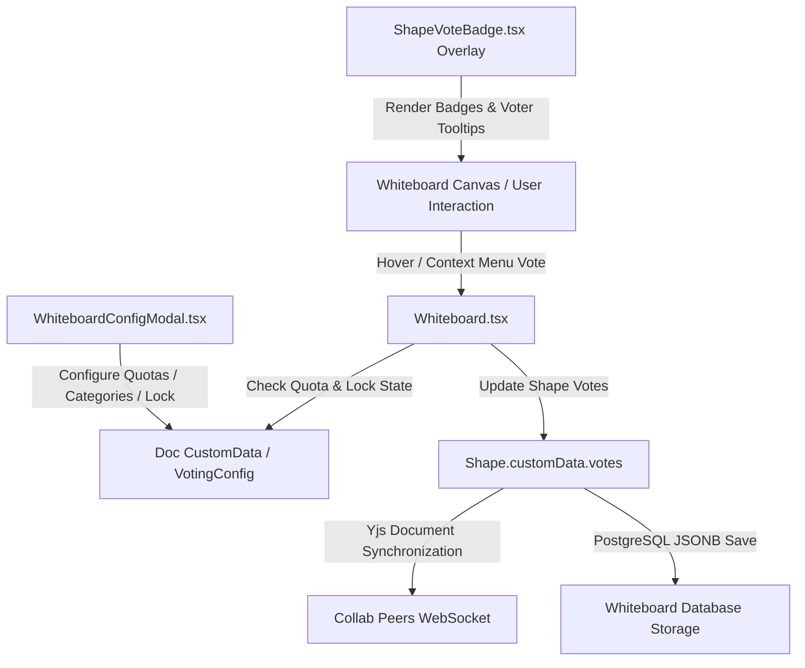

# Requirements

### Overview & Goals
Enable efficient, collaborative decision-making and workshop prioritization on floxBoard through **Shape Voting (Dot-Voting)**.

To maximize team decision-making velocity, streamline workshop retrospectives, and eliminate friction during backlog prioritization:
1. **Interactive In-Canvas Voting:** Instant dot-voting on sticky notes, frames, text cards, and shapes with dynamic count badges, category color tags, and voter breakdown popovers.
2. **Settings Menu Configuration:** Facilitators can configure per-user vote allocation limits, lock/unlock voting sessions, and define custom voting categories with descriptive comments clarifying what each category entails (e.g., "High Impact", "Feasibility", "Quick Win").
3. **Context Menu & Quick Actions:** Seamless voting directly from the shape context menu and on-hover "+1" canvas buttons.
4. **CRDT & Database Persistence:** All vote allocations, category definitions, and facilitation settings persist in the database via the board document model (`customData`) and synchronize in real-time across active room participants without polling overhead.
5. **Documentation Harmonization:** Update `features/whiteboard-collaboration.md` to transition Shape Voting from `[PLANNED]` to `[IMPLEMENTED]`.

---

### Scope
- **In Scope:**
  - Data structures for shape votes (`ShapeVote`) and board voting configuration (`WhiteboardVotingConfig`, `VotingCategory`).
  - Backend Jackson serialization support for `customData` in `DgmModel.kt` (`Doc`, `Shape`, `Obj`) to ensure seamless database persistence.
  - Whiteboard settings menu (`WhiteboardConfigModal.tsx`) voting configuration tab:
    - Voting session status toggle (active / locked).
    - Vote limit configuration per user (default 5, range 1–20).
    - Category definitions CRUD (title, color, explanatory comment).
    - Facilitator session reset action ("Reset All Votes").
  - In-canvas vote badge component (`ShapeVoteBadge.tsx`):
    - Top-right bounding box anchoring with category dot-vote indicators.
    - Hover popover showing breakdown of voters, categories, and timestamps.
    - Category-based vote casting and removal.
  - Quick voting triggers:
    - Shape context menu (`ShapeContextMenu.tsx`) vote / remove vote actions.
    - On-hover "+1" quick vote action on canvas shapes.
  - Header quota indicator in `WhiteboardHeader.tsx` displaying user's vote quota utilization (e.g., `Votes: 2/5 used`).
  - Documentation updates in `features/whiteboard-collaboration.md`.

- **Out of Scope:**
  - Step-by-Step Presentation Mode (tracked under a separate roadmap item).
  - Live Collaborative Emoji Reactions (tracked under a separate roadmap item).
  - Standalone dedicated export of vote tallies to CSV/Excel (handled via existing canvas SVG/PDF exports).

---

### User Stories
- **As a workshop facilitator / scrum master**, I want to configure per-user vote quotas, define structured voting categories with clear descriptions, and lock or reset voting sessions from the whiteboard settings menu, so that team prioritization exercises run smoothly and with optimal clarity.
- **As a workshop participant**, I want to quickly cast dot-votes on sticky notes and diagram items using on-hover buttons or the context menu, so that I can express my evaluation with minimal cognitive effort.
- **As a team member**, I want to see real-time vote totals and hover over shape badges to see who voted and in which categories, so that our team gains immediate visibility into consensus.

---

### Functional Requirements
1. **Whiteboard Settings Voting Configuration Tab:**
   - Accessible within `WhiteboardConfigModal.tsx` as a new tab ("Voting & Facilitation").
   - **Session Status:** Toggle switch between Active (voting open) and Locked (voting closed/read-only).
   - **Per-User Quota:** Numeric input/stepper for max votes per participant (default: 5, min: 1, max: 20).
   - **Voting Categories:**
     - List of configured categories with badge preview, title, color, and explanatory comment describing the criteria.
     - Default categories seeded: e.g., "Priority" ("Highest business value / urgent focus"), "Feasibility" ("Low implementation complexity / quick turnaround").
     - Add, edit, and delete category functionality.
   - **Facilitator Reset:** "Reset All Votes" button that clears all votes across all shapes on the board with confirmation.
   - Restrict configuration edits and tally reset to board `OWNER` and `ADMIN` roles (regular editors/viewers see read-only view).

2. **In-Canvas Dot-Voting Badges (`ShapeVoteBadge.tsx`):**
   - Rendered on shapes that have one or more votes cast (or on hover/selection).
   - Positioned cleanly at the top-right corner of the shape's bounding box.
   - Displays total vote count with category-colored dot indicators.
   - Hovering displays an interactive breakdown popover:
     - List of voters (avatar, username, category voted, timestamp).
     - Category breakdown summary.
     - Option for the current user to remove their vote directly from the popover.

3. **Voting Triggers & Interaction:**
   - **On-Hover "+1" Button:** Displays a compact vote trigger on hover over selectable shapes; clicking opens a category selector (or casts a default category vote if only one category exists).
   - **Context Menu Action:** `ShapeContextMenu.tsx` includes "Vote" and "Remove Vote" options with category submenus.
   - **Quota Enforcement:** If user has reached their maximum vote quota, prevent casting further votes and display an informative toast/tooltip.
   - **Lock Enforcement:** When the session is locked, disable vote casting/removal and show a locked session badge.

4. **Persistence & Synchronization:**
   - Voting configuration saved in board doc metadata (`doc.customData.votingConfig`).
   - Shape votes stored in shape metadata (`shape.customData.votes: ShapeVote[]`).
   - Updates propagate through Yjs CRDT binding without requiring manual page reload or polling.
   - Persisted to PostgreSQL JSONB when saving the whiteboard document.

---

### Non-Functional Requirements
- **Low Latency:** Instant local optimistic UI updates synced via Yjs in < 50ms across peers.
- **Data Integrity:** No vote duplication or lost updates during concurrent edits on the same shape.
- **Accessibility:** Keyboard accessibility and ARIA labels for vote badges, popovers, and modal inputs.
- **Resource Efficiency:** Avoid unnecessary re-renders of the canvas layer when vote tooltips or badges update.

# Technical Design

### Current Implementation
- **Data Schema (`DgmModel.kt`):**
  - Defines `Doc`, `Page`, `Shape`, `Box`, `Line`, etc.
  - Note: `customData` is used dynamically in frontend DGM models (`shape.customData`), but backend Jackson mappings in `DgmModel.kt` need explicit property declarations or `@JsonAnySetter`/`@JsonAnyGetter` to ensure `customData` is faithfully preserved across database serialization/deserialization cycles.
- **Settings Modal (`WhiteboardConfigModal.tsx`):**
  - Contains `general`, `canvas`, `collaboration`, and `danger` tabs.
  - Missing the "Voting & Facilitation" tab.
- **Canvas Interaction & Sync (`Whiteboard.tsx`, `useWhiteboardCollab.ts`, `yjs-dgm-binding.ts`):**
  - `Whiteboard.tsx` manages DGM Editor instance, rendering `CollabOverlay`, `ShapeContextMenu`, `WhiteboardHeader`, and modal dialogs.
  - Changes to shapes are synchronized in real-time via Yjs maps and arrays.

---

### Key Decisions
1. **Metadata Location for Voting Config & Votes:**
   - **Decision:** Store the board-level voting configuration under `doc.customData.votingConfig` and shape-level votes under `shape.customData.votes`.
   - **Rationale:** Aligns with standard DGM.js extensible document metadata conventions, enables zero-extra-network-call CRDT synchronization across connected peers, and persists naturally into the `whiteboard.content` JSONB database column.

2. **Categorized Dot-Voting Model:**
   - **Decision:** Structure votes as objects: `{ id: string; userId: string; userName: string; userAvatar?: string; categoryId: string; timestamp: string }`.
   - **Rationale:** Enables multi-dimensional prioritization (e.g. assessing both Value and Effort simultaneously) while maintaining full traceability and fine-grained quota accounting.

3. **In-Canvas Overlay vs Canvas Shape Rendering:**
   - **Decision:** Implement `ShapeVoteBadge` as a React overlay layer positioned over shapes using viewport coordinates calculated from DGM editor APIs.
   - **Rationale:** Provides rich interactive DOM components (hover popovers, category badges, animations) without polluting the vector export geometry or complicating shape serialization.

---

### Data Models / Contracts

#### TypeScript Models (`src/main/webui/src/lib/types/voting.ts` / `whiteboard.ts`)
```typescript
export interface VotingCategory {
  id: string;
  name: string;
  color: string;
  comment: string; // Explanatory description of category criteria
}

export interface WhiteboardVotingConfig {
  enabled: boolean;
  isLocked: boolean;
  maxVotesPerUser: number;
  categories: VotingCategory[];
}

export interface ShapeVote {
  id: string;
  userId: string;
  userName: string;
  userAvatar?: string;
  categoryId: string;
  createdAt: string;
}

export const DEFAULT_VOTING_CONFIG: WhiteboardVotingConfig = {
  enabled: true,
  isLocked: false,
  maxVotesPerUser: 5,
  categories: [
    {
      id: 'cat-priority',
      name: 'High Priority',
      color: '#ef4444',
      comment: 'Urgent focus and maximum strategic impact',
    },
    {
      id: 'cat-feasibility',
      name: 'High Feasibility',
      color: '#10b981',
      comment: 'Straightforward to execute with low technical risk',
    },
    {
      id: 'cat-innovation',
      name: 'Innovative',
      color: '#8b5cf6',
      comment: 'Creative solution or novel product capability',
    },
  ],
};
```

#### Kotlin Backend Custom Data Support (`DgmModel.kt`)
```kotlin
open class Obj {
    var id: String? = null
    var type: String = "Obj"
    var parent: String? = null
    var children: MutableList<Obj> = mutableListOf()
    var customData: MutableMap<String, Any>? = null
}

open class Shape : Obj() {
    // ... existing fields ...
    // customData inherited from Obj and serialized transparently
}
```

---

### Components

1. **`WhiteboardConfigModal.tsx`:**
   - Adds `'voting'` to tab types: `'general' | 'canvas' | 'collaboration' | 'voting' | 'danger'`.
   - Provides session status toggle, vote allocation input, category CRUD list with color picker and comment field, and "Reset All Votes" action.
2. **`ShapeVoteBadge.tsx` (New Component):**
   - Calculates bounding box of shapes using `editor.getShape(shapeId)` and camera viewport transform.
   - Renders category-coded badges, vote tally, voter popovers, and quick-add/remove controls.
3. **`ShapeContextMenu.tsx`:**
   - Adds voting section with category list for single or multi-selected shapes.
4. **`WhiteboardHeader.tsx`:**
   - Displays user's active vote quota pill (e.g., `Votes: 3/5 used` with category breakdown tooltip).

---

### File Structure
- `src/main/kotlin/de/einfloh/floxboard/whiteboard/domain/dgm/DgmModel.kt` (Updated with `customData`)
- `src/main/webui/src/components/WhiteboardConfigModal.tsx` (Updated with Voting tab & category config)
- `src/main/webui/src/components/ShapeVoteBadge.tsx` (New component for in-canvas badge overlays)
- `src/main/webui/src/components/ShapeContextMenu.tsx` (Updated with vote actions & category picker)
- `src/main/webui/src/components/WhiteboardHeader.tsx` (Updated with vote quota indicator)
- `src/main/webui/src/components/Whiteboard.tsx` (Updated to wire voting handlers and overlay badges)
- `src/main/webui/src/lib/types/voting.ts` (New voting type definitions)
- `features/whiteboard-collaboration.md` (Updated from `PLANNED` to `IMPLEMENTED`)

---

### Architecture Diagram


---

### Risks & Mitigations
- **Risk:** Concurrent vote casting exceeding user quota during rapid clicks.
  - **Mitigation:** Validate quota in optimistic handler and prune any concurrent excess votes during Yjs change aggregation.
- **Risk:** Canvas pan/zoom desynchronizing DOM overlay badge positions.
  - **Mitigation:** Subscribe to DGM editor viewport/camera change events (`editor.on('camera', ...)`) to update badge screen coordinates smoothly via `requestAnimationFrame`.

# Testing

### Validation Approach
Verify all voting configuration workflows, persistence guarantees, and interactive canvas voting features through a combination of automated unit tests, component tests, and serialization tests.

---

### Key Scenarios
1. **Voting Configuration Management:**
   - Open Whiteboard Settings -> "Voting & Facilitation" tab.
   - Change user vote limit from 5 to 8, toggle session lock to active, and add a new category "Cost Efficiency" with comment "Lowest resource expenditure".
   - Save and verify that reloading the board preserves the new limit, lock status, and category list from the database.
2. **Interactive In-Canvas Dot-Voting:**
   - Select a sticky note and click the "+1" vote action / context menu "Vote".
   - Select a category; verify the vote badge updates to show count 1 with corresponding category color.
   - Verify that casting a vote decrements remaining quota shown in the header.
3. **Voter Popover & Breakdown:**
   - Hover over the shape vote badge; verify popover renders participant name, avatar, category tag, and timestamp.
   - Click remove vote button from popover; verify total count decrements and quota is refunded.
4. **Quota Limit & Lock Enforcement:**
   - Cast votes up to the quota limit (e.g. 5/5); verify subsequent vote triggers are disabled and show a quota limit warning.
   - Set session status to Locked in settings; verify all vote triggers on canvas are disabled for participants.
5. **Facilitator Reset:**
   - Cast multiple votes across different shapes.
   - Facilitator clicks "Reset All Votes" in settings; verify all shapes have their votes cleared across all connected clients.

---

### Edge Cases
- Deleting a category that currently has active votes cast on shapes (retain existing votes with fallback display or clean migration).
- Voting on grouped shapes vs individual child elements.
- Viewport zooming/panning rapidly while vote badges and popovers are open.
- Read-only viewers attempting to open context menu or trigger votes.

---

### Test Changes
- `src/main/webui/src/components/WhiteboardConfigModal.test.tsx`:
  - Add tests for Voting tab navigation, quota adjustment, category addition/deletion/editing, and facilitator reset.
- `src/main/webui/src/components/ShapeVoteBadge.test.tsx` (New):
  - Test badge rendering, category dot display, popover breakdown rendering, and vote removal interaction.
- `src/test/kotlin/de/einfloh/floxboard/whiteboard/WhiteboardResourceTest.kt`:
  - Test JSON serialization and persistence of `customData` containing voting configuration and shape votes in whiteboard documents.

# Delivery Steps

### ✓ Step 1: Enhance Document Data Models and Persistence for Voting Metadata
Ensure backend and frontend models support custom voting metadata and facilitation configuration without data loss.

- Extend `DgmModel.kt` (`Obj`, `Doc`, `Shape`) with Jackson annotations and `customData: MutableMap<String, Any>?` to guarantee vote allocations and configuration survive JSON serialization.
- Define TypeScript data types for `WhiteboardVotingConfig`, `VotingCategory`, and `ShapeVote` in the frontend API/types layer.
- Add backend unit tests in `WhiteboardResourceTest.kt` verifying that documents containing shape voting custom data and voting configuration persist and deserialize accurately without field dropping.

### ✓ Step 2: Implement Whiteboard Settings Voting & Category Configuration Menu
Introduce a dedicated Voting & Facilitation configuration tab in the whiteboard settings modal.

- Update `WhiteboardConfigModal.tsx` to add a "Voting & Facilitation" tab accessible to users, with management controls restricted to owners and facilitators.
- Add configuration inputs for per-user vote limit quota (e.g. 1–20, default 5) and session voting status (active / locked).
- Implement voting category management allowing users to create, edit, color-code, and delete categories with required titles and explanatory comments/descriptions (e.g., "Feasibility", "Impact", "Urgency").
- Add facilitator session controls including "Reset All Votes" with a confirmation dialog.
- Wire configuration updates to persist to board document `customData.votingConfig` and sync across participants via Yjs.
- Update `WhiteboardConfigModal.test.tsx` to test category creation, vote limit modification, and session toggles.

### ✓ Step 3: Build In-Canvas Dot-Voting Badges and Context Menu Triggers
Build the interactive on-canvas voting UI and integrate quick-voting triggers.

- Create `ShapeVoteBadge.tsx` displaying category-coded dot-vote badges anchored to shape bounding boxes on the canvas.
- Implement hover tooltip / popover on vote badges displaying breakdown by voter avatar, name, category, and timestamp.
- Add "+1" quick vote button on shape hover and integrate "Vote" / "Remove Vote" actions with category selection submenu into `ShapeContextMenu.tsx`.
- Connect voting actions in `Whiteboard.tsx` to validate remaining per-user quotas and session lock state before applying updates to `shape.customData.votes`.
- Add active quota badge indicator in `WhiteboardHeader.tsx` (e.g., "Votes: 3/5 used") to keep participants informed of remaining allocation.
- Add unit and component tests verifying vote casting, category allocation, quota exhaustion, and lock enforcement.

### ✓ Step 4: Update Collaboration Feature Documentation & Finalize Tests
Harmonize feature documentation to record the completed voting capabilities.

- Update `features/whiteboard-collaboration.md` to transition `Votes on Shapes (Shape Voting)` from `[PLANNED]` to `[IMPLEMENTED]`.
- Update the Implementation Notice and component architecture mapping for `ShapeVoteBadge.tsx` and the Whiteboard Settings Voting Menu.
- Ensure end-to-end test verification across voting configuration persistence, multi-user vote sync, and quota constraints.