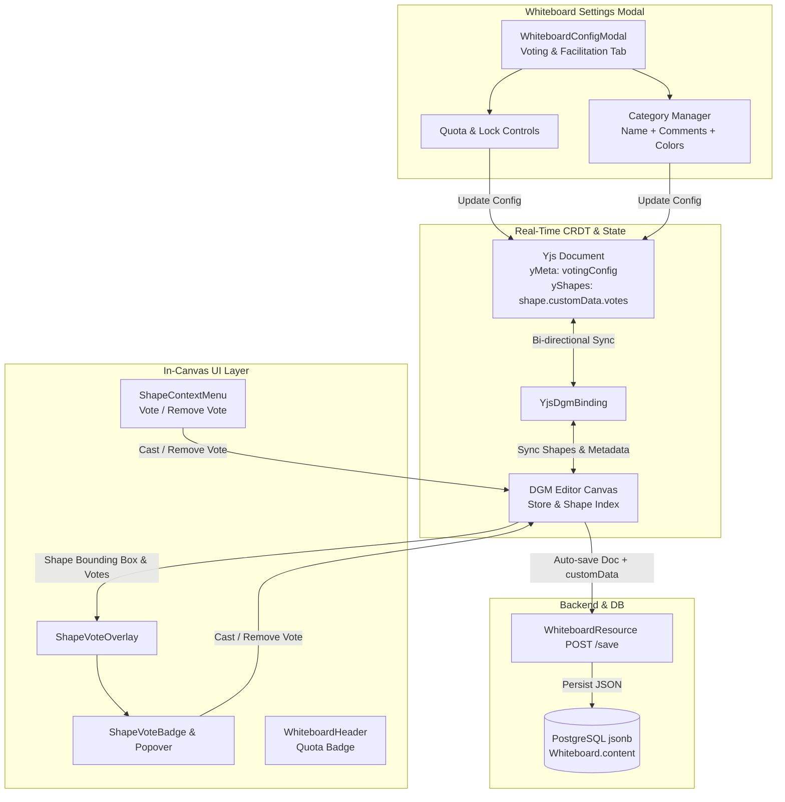

# Requirements

### Overview & Goals
Enable high-utility collaborative decision-making and workshop prioritization on floxBoard through **Shape Voting (Dot-Voting)**.

To maximize team productivity and streamline retrospective and planning workflows, this feature provides:
1. **Interactive In-Canvas Voting:** Instant dot-voting on sticky notes, frames, text elements, and shapes with dynamic count badges, category indicators, and voter breakdown popovers.
2. **Context Menu & Quick Actions:** Seamless voting directly from the shape context menu and on-hover "+1" canvas buttons.
3. **Whiteboard Settings Menu Configuration:** Facilitators can configure vote limits per user, lock/unlock voting sessions, and define custom voting categories with descriptive comments explaining each category's intent.
4. **Database & CRDT Persistence:** All vote allocations, category definitions, and facilitation settings persist in the database via the board document model and synchronize in real-time across all active room participants without polling.
5. **Documentation Harmonization:** Update `features/whiteboard-collaboration.md` to reflect the transition of Shape Voting from `PLANNED` to `IMPLEMENTED`.

---

### Scope
- **In Scope:**
  - Data structures for shape votes (`ShapeVote`) and board voting configuration (`WhiteboardVotingConfig`, `VotingCategory`).
  - Backend Jackson serialization support for `customData` in `DgmModel.kt` (`Doc`, `Shape`, `Obj`) to ensure seamless database persistence.
  - Whiteboard settings menu (`WhiteboardConfigModal.tsx`) voting configuration tab:
    - Voting session status toggle (active / locked).
    - Vote limit configuration per user (default 5, configurable).
    - Category management: add, edit, delete categories with title, color tag, and short descriptive comment explaining what each category entails.
    - One-click vote tally reset for facilitators.
  - In-canvas vote overlay (`ShapeVoteOverlay.tsx` & `ShapeVoteBadge.tsx`):
    - Positioned at the top-right of shapes using DCS coordinate mapping.
    - Visual vote count badge with category indicators.
    - Voter breakdown popover on hover showing collaborator avatars, category names, and timestamps.
    - Quick "+1" vote action and remove vote action.
  - Shape context menu (`ShapeContextMenu.tsx`):
    - "Vote" and "Remove Vote" actions with category selection.
  - Whiteboard header (`WhiteboardHeader.tsx`) vote quota badge showing remaining votes (e.g., `3/5 votes used`).
  - Real-time CRDT sync via Yjs (`yjs-dgm-binding.ts` & `useWhiteboardCollab.ts`).
  - Documentation update in `features/whiteboard-collaboration.md`.
  - Comprehensive unit and integration test suites.

- **Out of Scope:**
  - Step-by-step presentation mode (remains PLANNED).
  - Live collaborative reactions / emoji bursts (remains PLANNED).
  - Anonymous / secret ballot voting (all votes are transparent and collaborative).

---

### User Stories
- **As a Workshop Facilitator**, I want to define voting limits and distinct voting categories with explanatory comments in the whiteboard settings menu so that participants understand the criteria for evaluating ideas and cannot exceed their allocated votes.
- **As a Collaborator**, I want to click a "+1" button or use the context menu on any shape to cast my vote in a specific category so that my feedback is counted instantly without disrupting the flow of the session.
- **As a Participant**, I want to hover over a shape's vote badge to see who voted for it, in which category, and when, so that our team has complete visibility into consensus and priorities.
- **As a Facilitator**, I want to lock voting or reset vote counts when a round concludes, with all changes saved to the database, so that our session artifacts remain consistent and durable.

---

### Functional Requirements
1. **Voting Configuration in Settings Menu:**
   - Accessible via the Whiteboard Settings dialog under a dedicated **Voting & Facilitation** tab.
   - **Session Status:** Toggle switch to open or lock voting across the board.
   - **Vote Allocation:** Number field / presets (1 to 20 votes, default: 5) defining maximum total votes allowed per user.
   - **Category Definitions:** CRUD interface for voting categories:
     - Category name (e.g., *Feasibility*, *Business Impact*, *Quick Win*).
     - Short comment / description explaining what the category entails (e.g., *"Effort required is low and can be delivered in sprint 1"*).
     - Color swatch / accent tag for visual badge distinction.
   - **Reset Tally:** Facilitator button to clear all cast votes across the whiteboard with confirmation.
   - **Persistence:** Changes to voting settings immediately update board metadata, synchronize across Yjs peers, and persist in the database via `api.saveWhiteboard`.

2. **In-Canvas Vote Badges & Hover Breakdown:**
   - Shapes with votes display a floating `ShapeVoteBadge` at their top-right boundary.
   - Hovering over any selectable shape displays an intuitive "+1" quick vote trigger when voting is enabled and the user has remaining votes.
   - Hovering over a vote badge displays a popover list showing:
     - Total count and breakdown by category.
     - User avatars, usernames, category tags, and relative timestamps.
     - A "Remove my vote" button for votes cast by the current user.

3. **Shape Context Menu Voting Action:**
   - Right-clicking or opening context menu on a shape includes a *Vote* action (with category submenu if multiple categories exist) and a *Remove Vote* action.
   - Context menu reflects disabled state when voting is locked or user has reached the vote quota.

4. **Vote Quota & Real-Time Presence:**
   - Canvas header displays a compact quota indicator (e.g., `Votes: 2 / 5 used`).
   - Adding or removing votes immediately updates the local count and broadcasts the change via Yjs so all connected participants see badges update instantly without page reloads.

---

### Non-Functional Requirements
- **Performance & Responsiveness:** In-canvas badge rendering and DCS coordinate transformations must achieve 60fps during zooming and panning.
- **Data Integrity & Convergence:** Concurrent votes by multiple users must converge reliably using Yjs CRDTs without race conditions or dropped votes.
- **Accessibility & Clarity:** High-contrast badges and clear tooltip text ensuring ease of use during fast-paced workshops.

# Technical Design

### Current Implementation
- **Whiteboard Backend:**
  - `Whiteboard.kt` stores diagram state in `content: Doc?` as PostgreSQL `jsonb`.
  - `DgmModel.kt` provides Jackson models (`Doc`, `Page`, `Box`, `Shape`, `Line`, etc.), but `customData` is not yet explicitly declared on `Obj`/`Shape`, risking property omission during JSON serialization.
- **Whiteboard Frontend:**
  - `Whiteboard.tsx` manages DGM canvas initialization, tools, context menus, and auto-save via `api.saveWhiteboard`.
  - `WhiteboardConfigModal.tsx` contains settings tabs for *General*, *Canvas & View*, *Collaboration*, and *Danger Zone*, but lacks a dedicated *Voting* tab.
  - `CollabOverlay.tsx` computes DCS bounding boxes (`shape.getRectInDCS`) for selection boxes and cursors.
  - `yjs-dgm-binding.ts` serializes DGM JSON documents to `yDoc.getMap('shapes')` and `yDoc.getMap('meta')`.

---

### Key Decisions
1. **CRDT Shape Metadata vs. Separate API Table:**
   - *Decision:* Store votes directly in `shape.customData.votes` and board voting configuration in `doc.customData.votingSettings` / Yjs `meta`.
   - *Rationale:* Maximizes real-time performance and ensures zero latency during workshops. Yjs propagates vote transactions instantly, while standard board auto-save persists the complete document (including votes and settings) into PostgreSQL `whiteboard.content`.
2. **Settings Menu Integration for Voting & Categories:**
   - *Decision:* Add a dedicated **Voting & Facilitation** tab to `WhiteboardConfigModal.tsx`.
   - *Rationale:* Consolidates all administrative and board-level configurations (voting lock, user quotas, category definitions with comments) into the primary settings interface, fulfilling user requirements while maintaining a clean, cohesive UX.
3. **Category Definitions with Commentary:**
   - *Decision:* Each category contains `id`, `name`, `description` (short comment on what it entails), and `color`.
   - *Rationale:* Allows participants to understand evaluation criteria (e.g. *Impact: High strategic return*, *Effort: Low complexity*) before casting votes, eliminating ambiguity.

---

### Data Models / Contracts

#### TypeScript (`src/main/webui/src/types/voting.ts`):
```typescript
export interface VotingCategory {
  id: string;
  name: string;
  description: string; // Short comment on what each category entails
  color: string;
}

export interface WhiteboardVotingConfig {
  enabled: boolean;
  maxVotesPerUser: number;
  categories: VotingCategory[];
}

export interface ShapeVote {
  id: string;
  userId: string;
  userName: string;
  userColor?: string;
  categoryId?: string;
  timestamp: number;
}

export const DEFAULT_VOTING_CATEGORIES: VotingCategory[] = [
  { id: 'priority', name: 'High Priority', description: 'Critical item requiring immediate focus', color: '#ef4444' },
  { id: 'impact', name: 'High Impact', description: 'Delivers high value to end users or business', color: '#3b82f6' },
  { id: 'quick-win', name: 'Quick Win', description: 'Low effort with immediate positive results', color: '#10b981' },
];

export const DEFAULT_VOTING_CONFIG: WhiteboardVotingConfig = {
  enabled: true,
  maxVotesPerUser: 5,
  categories: DEFAULT_VOTING_CATEGORIES,
};
```

#### Kotlin (`src/main/kotlin/.../DgmModel.kt`):
```kotlin
@JsonIgnoreProperties(ignoreUnknown = true)
@JsonInclude(JsonInclude.Include.NON_NULL)
open class Obj {
    var id: String? = null
    var type: String = "Obj"
    var parent: String? = null
    var children: MutableList<Obj> = mutableListOf()
    var customData: MutableMap<String, Any?>? = null
}
```

---

### Architecture & Data Flow Diagram



---

### Components
- **`WhiteboardConfigModal.tsx`** *(Modified)*: Adds **Voting & Facilitation** tab with controls for session lock, vote allocation limit, voting category management (with short comments/descriptions), and one-click vote tally reset.
- **`ShapeVoteBadge.tsx`** *(New)*: Component rendering the top-right count badge, category color pips, hover breakdown popover with collaborator info and timestamps, and "+1" quick vote action.
- **`ShapeVoteOverlay.tsx`** *(New)*: Absolute canvas overlay subscribing to `editor.onRepaint`, iterating over canvas shapes, computing DCS positions, and rendering `ShapeVoteBadge` components.
- **`ShapeContextMenu.tsx`** *(Modified)*: Adds *Vote* (with category picker) and *Remove Vote* actions.
- **`WhiteboardHeader.tsx`** *(Modified)*: Displays total votes cast vs. quota (e.g., `Votes: 2/5`) and facilitation status.
- **`Whiteboard.tsx`** *(Modified)*: Orchestrates voting configuration state, connects context menu vote handlers, mounts `ShapeVoteOverlay`, and handles persistence.
- **`shapeUtils.ts`** *(Modified)*: Implements helper functions: `castShapeVote`, `removeShapeVote`, `resetAllShapeVotes`, `getShapeVotes`, and `calculateUserVoteCount`.
- **`DgmModel.kt`** *(Modified)*: Adds `customData` field to Jackson document and shape models.
- **`features/whiteboard-collaboration.md`** *(Modified)*: Updates Shape Voting roadmap item status to `IMPLEMENTED`.

---

### File Structure
- `src/main/kotlin/de/einfloh/floxboard/whiteboard/domain/dgm/DgmModel.kt` *(Modified)*
- `src/main/webui/src/types/voting.ts` *(New)*
- `src/main/webui/src/lib/shapeUtils.ts` *(Modified)*
- `src/main/webui/src/lib/yjs-dgm-binding.ts` *(Modified)*
- `src/main/webui/src/components/ShapeVoteBadge.tsx` *(New)*
- `src/main/webui/src/components/ShapeVoteOverlay.tsx` *(New)*
- `src/main/webui/src/components/ShapeContextMenu.tsx` *(Modified)*
- `src/main/webui/src/components/WhiteboardConfigModal.tsx` *(Modified)*
- `src/main/webui/src/components/WhiteboardHeader.tsx` *(Modified)*
- `src/main/webui/src/components/Whiteboard.tsx` *(Modified)*
- `features/whiteboard-collaboration.md` *(Modified)*
- `src/main/webui/src/components/WhiteboardConfigModal.test.tsx` *(Modified)*
- `src/main/webui/src/components/ShapeVoteBadge.test.tsx` *(New)*
- `src/main/webui/src/components/ShapeContextMenu.test.tsx` *(Modified)*
- `src/main/webui/src/components/Whiteboard.test.tsx` *(Modified)*

# Testing

### Validation Approach
Automated validation using Vitest unit and integration tests across web components and backend unit tests for document model serialization.

---

### Key Scenarios
1. **Voting Configuration Management in Settings Modal:**
   - Verify opening the *Voting & Facilitation* tab in `WhiteboardConfigModal`.
   - Verify updating max votes per user (e.g., from 5 to 3) triggers configuration change callback.
   - Verify creating a new category with a title and comment description (e.g., *"Feasibility: Can be built within 1 week"*).
   - Verify editing and deleting categories.
   - Verify toggling voting lock disables voting interactions on the canvas.
   - Verify clicking *Reset All Votes* clears votes across all shapes.
2. **In-Canvas Voting Badge & Interaction:**
   - Verify casting a vote via the "+1" hover button adds a vote object with user ID, name, category, and timestamp.
   - Verify vote count badge renders with correct number and category styling.
   - Verify hovering over the badge opens the breakdown popover showing collaborator names and timestamps.
   - Verify user cannot cast more votes than `maxVotesPerUser`.
3. **Context Menu Actions:**
   - Verify *Vote* option appears in `ShapeContextMenu` and displays category options.
   - Verify *Remove Vote* removes the user's vote from the selected shape.
4. **Database Persistence & CRDT Convergence:**
   - Verify `DgmModel.kt` serializes and deserializes `customData` without losing vote or setting structures.
   - Verify board save payload includes updated `customData` and reloads correctly on refresh.
5. **Documentation Status Update:**
   - Verify `features/whiteboard-collaboration.md` lists Shape Voting as `IMPLEMENTED`.

---

### Edge Cases
- **Quota Exceeded:** Attempting to vote when limit is reached displays an informative toast/warning.
- **Locked Session:** Voting triggers are disabled when facilitation lock is active.
- **Concurrent Votes on Same Shape:** Yjs maps merge multi-user votes cleanly without collision.
- **Shape Deletion:** Deleting a shape automatically recalculates the user's active vote tally.
- **Empty Categories:** Fallback gracefully to default general category if no custom categories are defined.

# Delivery Steps

### * Step 1: Data Models, Backend Persistence & CRDT Synchronization
Establish data contracts and backend JSON persistence support for custom shape metadata, voting tallies, and board-level voting configurations.

- Update `DgmModel.kt` (`Obj`, `Shape`, `Doc`) to include `customData` map support ensuring custom metadata (votes and voting configurations) is preserved during Jackson serialization and deserialization in the PostgreSQL `jsonb` column.
- Define TypeScript interfaces in `src/main/webui/src/types/voting.ts` for `ShapeVote`, `VotingCategory`, and `WhiteboardVotingConfig` (covering category IDs, names, comment/description fields, max votes per user, and session lock state).
- Implement utility helpers in `src/main/webui/src/lib/shapeUtils.ts` for adding/removing votes on shapes, computing user vote tallies across the canvas, resetting votes, and validating vote limits.
- Ensure `yjs-dgm-binding.ts` preserves `customData` on shape objects and document metadata during local and remote CRDT synchronization.

###   Step 2: Whiteboard Settings Menu Voting Configuration & Persistence
Implement voting and workshop facilitation controls inside the whiteboard configuration modal with full database persistence.

- Add a dedicated **Voting & Facilitation** tab to `WhiteboardConfigModal.tsx` accessible to collaborators and facilitators.
- Implement voting session controls: toggle voting session lock/enablement, configure max vote allocation per user (e.g., 1–20 dot-votes), and a one-click vote tally reset button with confirmation.
- Implement the Voting Categories manager allowing facilitators to define, edit, and remove categories with custom names, color indicators, and short explanatory comments detailing what each category entails.
- Connect voting configuration updates to the board auto-save pipeline and REST save endpoint (`api.saveWhiteboard`) so all changes persist reliably in the database and synchronize immediately via Yjs.
- Add comprehensive Vitest test coverage in `WhiteboardConfigModal.test.tsx` verifying category creation, configuration adjustments, and modal interactions.

###   Step 3: In-Canvas Vote Badges, Context Menu & Interactive Voting Actions
Build the dynamic in-canvas voting badge, hover popover, and context menu quick actions for dot-voting on canvas elements.

- Implement `ShapeVoteBadge.tsx` and `ShapeVoteOverlay.tsx` positioned dynamically at shape bounding boxes using DGM coordinate transformation APIs (`shape.getRectInDCS`).
- Display aggregate vote count badges on shapes with category-coded dot indicators, and render a detailed hover breakdown popover displaying voter avatars, category labels, and vote timestamps.
- Add quick interactive "+1" and vote removal actions directly on the canvas badge/shape hover, and integrate *Vote* / *Remove Vote* actions with category sub-selectors in `ShapeContextMenu.tsx`.
- Connect in-canvas voting triggers to the whiteboard state and user quota validation, preventing votes when limits are reached or when sessions are locked.
- Add a persistent user vote counter indicator (e.g., "Votes: 2/5") in `WhiteboardHeader.tsx` to provide immediate feedback on remaining vote quota.

###   Step 4: Testing, Verification & Documentation Update
Verify all voting features, validate CRDT synchronization and DB persistence with automated tests, and update documentation.

- Create unit and integration test suites in `ShapeVoteBadge.test.tsx`, `ShapeContextMenu.test.tsx`, `Whiteboard.test.tsx`, and `WhiteboardConfigModal.test.tsx` verifying dot-voting, category allocation, vote limit enforcement, reset workflows, and persistence.
- Update `features/whiteboard-collaboration.md` to change the status of `Votes on Shapes (Shape Voting)` and `ShapeVoteBadge.tsx` from `[PLANNED]` to `(Implemented)` / `Implemented`.
- Run frontend test suite (`npm --prefix src/main/webui test -- --run`) and backend tests (`./gradlew test`) to ensure zero regressions across the codebase.