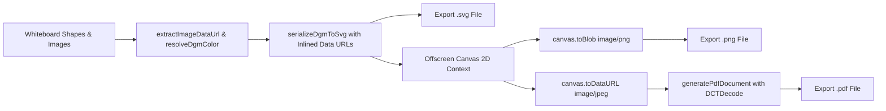

# Requirements

### Overview & Goals
Fix image inclusion across all diagram exports (SVG, PNG, and PDF) and resolve the black-page rendering issue in PDF export. Ensure that images on the whiteboard canvas are correctly inlined and rendered in vector SVGs and raster outputs, and that generated PDF documents contain valid image streams that render accurately across all PDF viewers.

### Scope
- **In Scope:**
  - Inline and embed whiteboard images (`Image` shapes) as portable base64 data URLs in SVG export (`serializeDgmToSvg` / `exportWhiteboardToSVG`) with `xlink:href` and `href` attributes, ensuring standalone SVGs and canvas rasterization display images properly without broken blob/relative URLs.
  - Fix PDF export (`exportWhiteboardToPDF` and `generatePdfDocument`) to use PDF-compliant image stream encoding (e.g., standard DCTDecode filter for JPEG data or compliant FlateDecode stream), resolving the black page issue in PDF viewers.
  - Ensure PNG export properly renders inlined images without canvas tainting or sandbox blocking.
  - Add unit tests in `exportUtils.test.ts` to verify image embedding in SVG serialization and valid PDF document generation.
- **Out of Scope:**
  - AI text-to-diagram generation and quota metering.
  - Server-side image rendering service (all exports remain efficient client-side operations).

### User Stories
- **As a User:** I want my exported SVG files to contain all embedded images and photos so that the SVG displays complete visuals when opened locally or in vector design tools.
- **As a User:** I want my exported PNG images to include all whiteboard images without missing elements or broken links.
- **As a Pro/Enterprise User:** I want my exported PDF documents to display the complete diagram clearly in full color rather than a solid black page.
- **As a Free Tier User:** I want to be prompted to upgrade when clicking PDF export while retaining unrestricted access to SVG, PNG, and JSON exports with working images.

### Functional Requirements
1. **Embedded Image Resolution & Inlining for SVG:**
   - Detect image source from `shape.imageData`, `shape._imageDOM`, `shape.src`, or `shape.url`.
   - If image source is a Blob URL (`blob:...`), relative URL, or HTMLImageElement in memory, convert/inline it to a base64 Data URL (`data:image/...;base64,...`) during export.
   - Serialize SVG `<image>` tags with both `href` and `xlink:href` attributes, preserving coordinates (`left`, `top`, `width`, `height`), opacity, and rotation.
2. **Valid PDF Stream Encoding & Rendering:**
   - Update `generatePdfDocument` and `exportWhiteboardToPDF` to encode the canvas raster stream using valid PDF 1.4 image stream specifications (using `/Filter /DCTDecode` with JPEG stream data or compliant `/Filter /FlateDecode` raw samples).
   - Ensure accurate PDF `/MediaBox`, `/Width`, `/Height`, and transformation matrix matching the diagram aspect ratio.
   - Verify that exported PDF files open cleanly in standard PDF viewers (Acrobat, Chrome, Firefox, Apple Preview) without rendering black pages or corrupted blocks.
3. **PNG Export Image Integration:**
   - Ensure offscreen canvas draws SVG with inlined data URLs, ensuring all images are rendered into the final PNG without security sandbox failures.

### Non-Functional Requirements
- **Portability:** Exported SVG and PDF files must be fully self-contained and render identically offline on external machines.
- **Visual Fidelity:** Colors, aspect ratios, and resolutions must match the on-screen whiteboard canvas.
- **Performance:** Instantaneous client-side execution with minimal memory footprint.

# Technical Design

### Current Implementation & Root Cause Analysis
1. **Root Cause of Missing Images in Exported Files:**
   - When images are inserted into the canvas, `shape.imageData` holds a session `blob:http://...` URL or relative `/api/whiteboards/...` asset URL, while the in-memory DOM element resides in `shape._imageDOM`.
   - In `serializeShapeToSvg`, the `<image>` tag references `href="${href}"`. When downloaded to disk as an SVG file, the browser cannot resolve local `blob:` or relative URLs, rendering the image as a blank box or broken link.
   - Furthermore, drawing an SVG containing external or blob image URLs to a canvas inside an `Image` object often fails to render nested sub-resources or taints the canvas context, causing images to be omitted from PNG and PDF exports.
2. **Root Cause of Black Page in PDF Export:**
   - In `generatePdfDocument`, object 4 specifies `/Filter /FlateDecode`, `/ColorSpace /DeviceRGB`, `/BitsPerComponent 8`, but passes raw base64-decoded PNG binary file data (which starts with PNG headers `\x89PNG` and contains chunked zlib streams with per-row filter bytes).
   - PDF viewers attempting to decode the raw PNG file as Flate-compressed DeviceRGB samples fail or interpret headers as pixel values, resulting in an entirely black page.

### Key Decisions
1. **Base64 Inlining for SVG Image Shapes:**
   - *Rationale:* Converting image sources (via `_imageDOM` canvas extraction or data URL conversion) into self-contained `data:image/...;base64,...` strings guarantees that SVGs display images everywhere (offline, in Adobe Illustrator, Inkscape, or Figma) and allows offscreen canvases to render SVGs synchronously without external resource fetching.
2. **Standard DCTDecode Filter for PDF Generation:**
   - *Rationale:* In PDF 1.4, `/Filter /DCTDecode` is the standard JPEG filter. By capturing the diagram canvas as JPEG (`canvas.toDataURL('image/jpeg', 0.95)`), the binary JPEG bytes map 1:1 into the PDF image XObject stream with `/Filter /DCTDecode`, eliminating all decoding incompatibilities and fixing the black page bug across all PDF readers.

### Proposed Changes

#### 1. Image Data URL Extraction Helper (`exportUtils.ts`)
Add `extractImageDataUrl(shape: any): string` to extract or convert image data to base64 data URLs:
- If `shape.imageData` is already a data URL, return it directly.
- If `shape._imageDOM` (loaded `HTMLImageElement`) is present, draw it to an offscreen canvas to obtain `toDataURL('image/png')`.
- Fall back to `shape.imageData` / `shape.src` / `shape.url`.

#### 2. Update SVG Image Serialization (`serializeShapeToSvg`)
- Use the extracted data URL.
- Output `<image href="${href}" xlink:href="${href}" x="${left}" y="${top}" width="${w}" height="${h}" preserveAspectRatio="none" opacity="${opacity}"${transformAttr} />`.

#### 3. Update PDF Generation (`generatePdfDocument` & `exportWhiteboardToPDF`)
- In `exportWhiteboardToPDF`, capture the diagram canvas as `image/jpeg` with white background.
- In `generatePdfDocument`, configure object 4 with `/Filter /DCTDecode` and embed the binary JPEG data.
- Set accurate `/Width` and `/Height` matching the canvas pixel dimensions.

#### 4. Update Unit Tests (`exportUtils.test.ts`)
- Add tests verifying that `Image` shapes with `_imageDOM` or `imageData` serialize to `<image href="data:..." xlink:href="data:..." />`.
- Add tests verifying that `generatePdfDocument` generates a valid PDF containing `/Filter /DCTDecode` and correct binary offsets.

### Architecture Diagram

### Affected Files
- `src/main/webui/src/lib/exportUtils.ts`
- `src/main/webui/src/lib/shapeUtils.ts`
- `src/main/webui/src/lib/exportUtils.test.ts`

# Testing

### Validation Approach
Verify that whiteboard exports properly embed images across SVG, PNG, and PDF formats, and ensure that PDF documents render diagram graphics cleanly without black screens.

### Key Scenarios
1. **Image Embedding in Vector SVG:**
   - Verify that exporting a whiteboard with image shapes embeds them as base64 data URLs (`data:image/...;base64,...`) with both `href` and `xlink:href` attributes.
   - Verify that opening the exported `.svg` file independently displays the image content accurately.
2. **PDF Document Generation & Decoding:**
   - Verify that `generatePdfDocument` encodes JPEG data with `/Filter /DCTDecode`, accurate `/Width`, `/Height`, and valid cross-reference offsets.
   - Verify that opening the exported `.pdf` renders in full color rather than a black screen.
3. **PNG Export with Embedded Images:**
   - Verify that PNG rasterization successfully captures canvas boards containing both standard vector shapes and image shapes.

### Test Changes
- Add unit tests in `src/main/webui/src/lib/exportUtils.test.ts` covering `extractImageDataUrl`, image shape SVG serialization, and PDF binary stream generation.